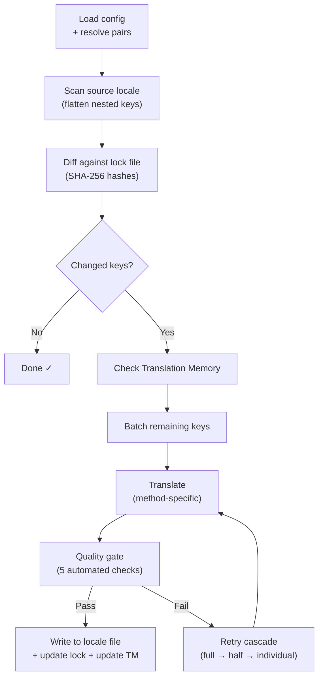

# Cómo funciona i18n-rosetta

i18n-rosetta traduce los archivos de configuración regional de su aplicación con un solo comando. Esto es lo que sucede internamente.

## El pipeline

Cuando ejecuta `npx i18n-rosetta sync`, rosetta ejecuta un pipeline de seis etapas:



**Decisiones clave de diseño:**

- **Detección de cambios mediante hashes SHA-256.** Rosetta rastrea cada valor de origen con un hash en `.i18n-rosetta.lock`. Cuando actualiza una cadena en inglés, solo esa clave se vuelve a traducir. Por esta razón, `sync` es rápido en ejecuciones repetidas: realiza un trabajo mínimo.

- **Almacenamiento en caché de Translation Memory.** Antes de realizar cualquier llamada a la API, rosetta verifica `.rosetta/tm.json` en busca de traducciones en caché (clasificadas por texto de origen + configuración regional + método). En una resincronización típica después de cambiar una clave, 142 claves provienen de la caché y 1 clave consulta la API.

- **Filtro de calidad antes de la escritura.** Cada traducción pasa por cinco comprobaciones automatizadas (vacío, eco del origen, bucle de alucinación, inflación de longitud, cumplimiento del sistema de escritura) antes de tocar sus archivos. Las fallas se registran, nunca se aceptan silenciosamente.

- **Cascada de reintentos en caso de falla.** Si un lote falla (error de análisis JSON, tiempo de espera de la API), rosetta vuelve a intentarlo con lotes progresivamente más pequeños: completo → mitad → individual. Esto aísla la clave problemática sin bloquear el resto.

## Métodos de traducción

Rosetta admite cuatro métodos de traducción, cada uno adecuado para diferentes escenarios:

| Método | Cómo funciona | Ideal para |
|--------|-------------|----------|
| **`llm`** | Prompt estructurado para cualquier modelo de OpenRouter | Idiomas con abundantes recursos |
| **`llm-coached`** | Mismo prompt + reglas gramaticales, diccionario y notas de estilo | Idiomas donde los LLM cometen errores predecibles |
| **`google-translate`** | Solicitud por lotes a la API de Google Cloud Translation | Idiomas de altos recursos con buen soporte de GT |
| **`api`** | HTTP POST a su propio endpoint | Pipelines personalizados, modelos controlados por la comunidad |

Los métodos se configuran por par de idiomas. Usted podría usar `google-translate` para francés, pero `llm-coached` para cree de las llanuras: cada par obtiene el método que mejor le funciona.

## Datos de instrucción

Para los pares `llm-coached`, los datos de instrucción brindan al LLM conocimiento lingüístico explícito: reglas gramaticales, terminología forzada y preferencias de estilo. Esto se inyecta en cada prompt como contexto estructurado.

```json title="coaching/crk.json"
{
  "grammar_rules": ["Animate nouns take different plural forms than inanimate nouns"],
  "dictionary": {"welcome": "ᑕᓂᓯ", "settings": "ᐃᑕᐢᑌᐘᐃᓇ"},
  "style_notes": "Use Standard Roman Orthography (SRO) unless explicitly configured otherwise."
}
```

Los datos de instrucción son el mecanismo principal para mejorar la calidad de la traducción sin realizar un ajuste fino (fine-tuning) de un modelo. Cambie las reglas → vuelva a ejecutar la sincronización → vea si ayuda. La iteración es instantánea.

## Plugins

Los plugins son recetas de traducción preempaquetadas para pares de idiomas específicos. Son manifiestos JSON (no código) que le indican a rosetta qué método usar, con qué configuraciones y qué calidad se ha evaluado.

```bash
i18n-rosetta plugin install ./crk-coached-v3/
i18n-rosetta sync   # uses the installed plugin for en→crk
```

Los plugins cierran la brecha entre la investigación y la producción: un método que obtiene una buena puntuación en el [MT Eval Arena](https://mtevalarena.org) puede empaquetarse como un plugin e implementarse aquí.

## El panorama general

i18n-rosetta es la mitad de un ecosistema de dos partes:

- **[MT Eval Arena](https://mtevalarena.org)**: donde los métodos de traducción se **desarrollan y prueban** con evaluaciones comparativas reproducibles.
- **i18n-rosetta**: donde los métodos probados se **implementan** para traducir contenido real.

El [Eval Harness Bridge](/docs/guides/bridge) conecta a ambos. Un método que demuestra su eficacia en el Arena se implementa aquí. Los comentarios de los hablantes desde producción mejoran la siguiente versión.

---

## Profundice más

- [Cómo funciona la sincronización](/docs/concepts/how-sync-works): recorrido detallado paso a paso por el pipeline.
- [Filtro de calidad](/docs/concepts/quality-gate): las cinco comprobaciones automatizadas.
- [Translation Memory](/docs/concepts/translation-memory): almacenamiento en caché y ahorro de costos.
- [Métodos de traducción](/docs/guides/translation-methods): comparación detallada de métodos.
- [Arquitectura](/docs/concepts/architecture): descripción general del diseño del sistema.