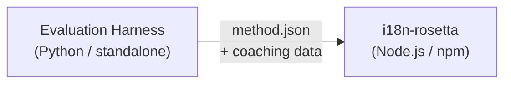

# Especificación del plugin de método

> **Versión**: 1.1  
> **Audiencia**: Desarrolladores de plugins  
> **Esquema canónico**: [`schemas/rosetta-plugin.schema.json`](https://github.com/gamedaysuits/i18n-rosetta/blob/main/schemas/rosetta-plugin.schema.json)

## Descripción general

i18n-rosetta utiliza un **sistema de métodos conectables** (pluggable). Cada par de idiomas puede usar un método de traducción diferente (LLM, guiado, convertidor de scripts, etc.). Los métodos se registran en `lib/translate.js` y se resuelven por par a través de `lib/pairs.js`.

El trabajo del eval harness (entorno de evaluación) es **desarrollar, probar y exportar** métodos de traducción. El trabajo de i18n-rosetta es **consumirlos y ejecutarlos**. El harness nunca se ejecuta dentro de rosetta.

### Flujo de datos



---

## Formato del plugin de método

Un plugin de método es un único archivo JSON (`method.json`) con archivos opcionales de datos de guía (coaching data).

### `method.json` — Requerido

```json
{
  "name": "french-formal-v1",
  "type": "llm-coached",
  "version": "1.0.0",
  "description": "Formally-tuned French with terminology enforcement and grammar coaching",
  "author": "Plugin Author",

  "config": {
    "model": "google/gemini-3.5-flash",
    "register": "formal",
    "batchSize": 30,
    "temperature": 0.2
  },

  "locales": ["fr"],

  "benchmarks": {
    "fr": {
      "date": "2026-05-11T00:00:00Z",
      "corpus_size": 500,
      "exact_match_rate": 0.42,
      "corpus_chrf": 72.3,
      "corpus_bleu": 45.1,
      "model": "google/gemini-3.5-flash",
      "harness_version": "1.0.0"
    }
  },

  "provenance": {
    "resources": [],
    "commercialReady": false,
    "flags": ["license-unclear"]
  },

  "coaching": {
    "dir": "coaching"
  }
}
```

### Referencia de campos

| Campo | Tipo | Requerido | Descripción |
|-------|------|----------|-------------|
| `name` | string | ✅ | Identificador único del método (kebab-case) |
| `type` | string | ✅ | Tipo de método de Rosetta: `llm`, `llm-coached`, `api`, `google-translate`, `deepl`, `microsoft-translator`, `libretranslate`, `openai`, `anthropic`, `gemini` |
| `version` | string | ✅ | Versión Semver (ej. `1.0.0`) |
| `locales` | string[] | ✅ | A qué códigos de configuración regional (locale) apunta este método (mínimo 1) |
| `description` | string | — | Descripción legible por humanos |
| `author` | string | — | Quién desarrolló/probó este método |
| `config.model` | string | — | Identificador del modelo de OpenRouter |
| `config.register` | string | — | Registro/tono del idioma de destino |
| `config.batchSize` | number | — | Claves por lote de API (1–200, predeterminado: 30) |
| `config.temperature` | number | — | Temperatura del LLM (0.0–2.0, predeterminado: 0.3) |
| `benchmarks` | object | — | Resultados del benchmark por configuración regional |
| `provenance` | object | — | Licencias y dependencias de recursos |
| `coaching.dir` | string | — | Ruta relativa al directorio de datos de guía (coaching data) |

### Objeto de benchmark (por configuración regional)

| Campo | Tipo | Requerido | Descripción |
|-------|------|----------|-------------|
| `date` | string | ✅ | Marca de tiempo ISO 8601 de la ejecución del benchmark |
| `corpus_size` | number | ✅ | Número de entradas evaluadas |
| `exact_match_rate` | number | ✅ | 0.0–1.0, proporción de coincidencias exactas |
| `corpus_chrf` | number | — | Puntuación chrF++ (0–100) |
| `corpus_bleu` | number | — | Puntuación BLEU (0–100) |
| `model` | string | ✅ | Modelo utilizado durante la evaluación |
| `harness_version` | string | ✅ | Versión del eval harness utilizada |

:::info ¿Qué métricas se muestran?
El comando `rosetta status` muestra **chrF++** y la **tasa de coincidencia exacta** del bloque de benchmark. `corpus_bleu` se acepta en el manifiesto, pero actualmente no se muestra ni se utiliza por ningún comando de rosetta. La [Tabla de clasificación de métodos](/leaderboard) rastrea chrF++, la coincidencia exacta y la tasa de aceptación de FST.
:::

---

### Objeto de procedencia (Provenance)

El bloque de procedencia comunica el estado de las licencias de los recursos incluidos en el plugin.

| Campo | Tipo | Predeterminado | Descripción |
|-------|------|---------|-------------|
| `resources` | object[] | `[]` | Lista de recursos incluidos con `name`, `license` y `type` |
| `commercialReady` | boolean | `false` | Si el plugin está autorizado para distribución comercial |
| `flags` | string[] | `["license-unclear"]` | Indicadores de estado legibles por máquina |

**Estado predeterminado** — los plugins exportados se envían con `commercialReady: false` y `flags: ["license-unclear"]`.

**Estado autorizado** — cuando se han verificado las licencias: establezca `commercialReady: true` y borre los indicadores.

---

## Formato de datos de guía (Coaching Data)

Si `type` es `llm-coached`, el plugin debe incluir archivos de datos de guía en el subdirectorio `coaching/`.

### `coaching/<locale>.json`

```json
{
  "grammar_rules": [
    "French adjectives agree in gender and number with the noun they modify",
    "Use 'vous' for formal contexts, 'tu' for informal"
  ],
  "dictionary": {
    "dashboard": "tableau de bord",
    "deployment": "déploiement",
    "settings": "paramètres"
  },
  "style_notes": "Prefer active voice. Avoid anglicisms where a native French term exists."
}
```

| Campo | Tipo | Requerido | Descripción |
|-------|------|----------|-------------|
| `grammar_rules` | string[] | — | Reglas inyectadas en cada prompt del LLM para esta configuración regional |
| `dictionary` | object | — | Mapa de término → traducción. Los términos coincidentes se inyectan como terminología requerida. |
| `style_notes` | string | — | Instrucciones de estilo de formato libre añadidas al final del prompt |

---

## Estructura de directorios

```
french-formal-v1/
  method.json                 # Method manifest with benchmarks
  coaching/
    fr.json                   # Coaching data for French
```

Para métodos con múltiples configuraciones regionales:

```
european-formal-v2/
  method.json                 # locales: ["fr", "de", "es", "it"]
  coaching/
    fr.json
    de.json
    es.json
    it.json
```

---

## Cómo consume Rosetta los plugins

### Instalación

```bash
i18n-rosetta plugin install ./french-formal-v1/
```

Se guarda en `.rosetta/methods/french-formal-v1/`.

### Configuración

```json title="i18n-rosetta.config.json"
{
  "pairs": {
    "en:fr": {
      "methodPlugin": "french-formal-v1"
    }
  }
}
```

:::info Semántica de fusión (Merge)
El plugin define *qué* método usar (`type`). La configuración del par ajusta *cómo* ejecutarlo (`model`, `register`, `batchSize`). Si el par establece `model`, este anula el valor predeterminado del plugin.
:::

### Tiempo de ejecución (Runtime)

1. Rosetta lee `method.json` desde `.rosetta/methods/french-formal-v1/`
2. El campo `type` del plugin establece el método de traducción (ej., `llm-coached`)
3. Carga los datos de guía desde el directorio `coaching/` del plugin
4. Utiliza el bloque `config` para llenar los vacíos en modelo/registro/temperatura
5. El bloque `benchmarks` se muestra en la salida de `rosetta status`
6. El bloque `provenance` es verificado por `rosetta provenance` en busca de indicadores de licencia

---

## Validación de esquema

Los manifiestos de los plugins se validan en el momento de la instalación contra [`schemas/rosetta-plugin.schema.json`](https://github.com/gamedaysuits/i18n-rosetta/blob/main/schemas/rosetta-plugin.schema.json).

Haga referencia al esquema en su `method.json` para el autocompletado del IDE:

```json
{
  "$schema": "./node_modules/i18n-rosetta/schemas/rosetta-plugin.schema.json",
  "name": "my-method-v1"
}
```

---

## Qué NO incluir

- ❌ Sin código Python ni dependencias del harness
- ❌ Sin datos de corpus sin procesar ni registros de ejecución
- ❌ Sin claves de API ni credenciales
- ❌ Sin configuración del harness
- ❌ Sin plantillas de prompts internas (estas residen en las implementaciones de métodos de rosetta)

El plugin es **solo de datos**: configuración, contenido de guía (coaching) y resultados de benchmark.

---

## Consulte también

- [Métodos de traducción](/docs/guides/translation-methods) — cómo funciona cada método integrado
- [Configuración](/docs/getting-started/configuration) — configuración por par y por idioma
- [Servir un método mediante API](/docs/guides/serving-a-method) — alojar métodos como servicios HTTP
- [Recetario: Pipeline controlado por FST](/docs/tutorials/fst-gated-pipeline) — cómo construir y empaquetar un pipeline
- [Evaluación de MT](/docs/eval/) — evaluación de métodos para su envío a la tabla de clasificación
- [Soporte para un idioma de bajos recursos](/docs/guides/low-resource-languages) — el caso de uso para los plugins de la comunidad