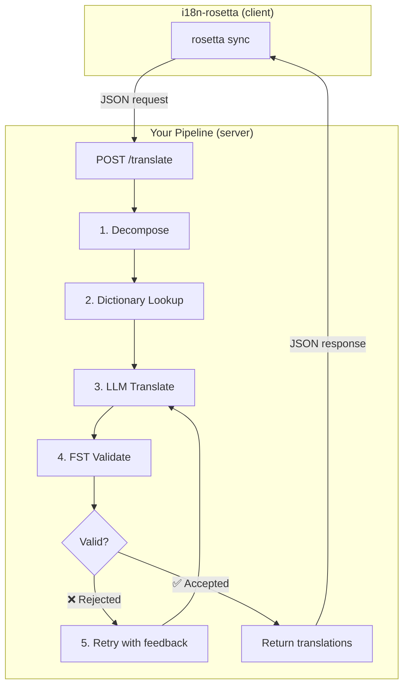
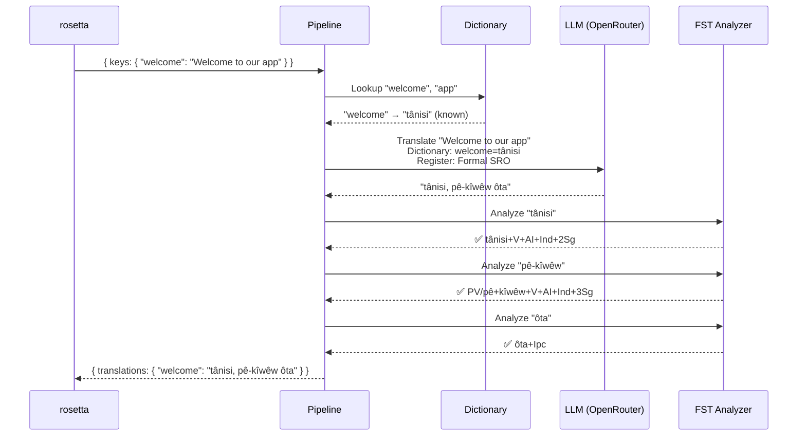
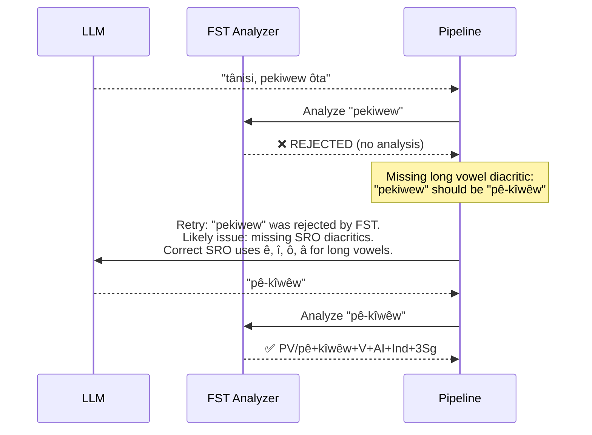
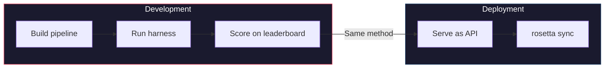

# Recetario: Pipeline de traducción controlado por FST

Construya un pipeline de traducción de múltiples etapas que descomponga el texto de origen, lo traduzca mediante LLM, valide los resultados con un transductor de estados finitos (FST) y sirva todo como un endpoint HTTP al que rosetta llama mediante el método `api`.

**Lo que construirá:** Una API de traducción para Plains Cree que detecta traducciones morfológicamente inválidas *antes* de que lleguen a sus archivos de configuración regional.

:::info Requisitos previos
- Un binario FST en ejecución (por ejemplo, del [analizador Plains Cree de ALTLab](https://github.com/UAlbertaALTLab/lang-crk))
- Node.js 20+ o Python 3.10+
- Una clave de API de OpenRouter para el paso del LLM
:::

---

## Arquitectura

El pipeline se ejecuta como un servicio HTTP independiente. A rosetta no le importa ni sabe qué sucede en su interior: envía claves y recibe traducciones.



### Por qué esta arquitectura

Cada etapa tiene un trabajo específico:

| Etapa | Qué hace | Por qué es importante |
|-------|-------------|---------------|
| **Descomponer** | Divide cadenas compuestas de la interfaz de usuario en segmentos traducibles | Los idiomas polisintéticos codifican oraciones completas en palabras individuales; el LLM necesita unidades más pequeñas |
| **Búsqueda en diccionario** | Consulta un diccionario bilingüe para encontrar traducciones conocidas | Fuerza el uso de la terminología correcta para términos conocidos en lugar de depender de las suposiciones del LLM |
| **Traducción con LLM** | Envía el segmento a un LLM con contexto de registro y gramática | Maneja frases nuevas y genera resultados fluidos |
| **Validación con FST** | Pasa el resultado por un analizador morfológico | Detecta formas de palabras inválidas: si el FST rechaza una palabra, no es válida en el idioma |
| **Reintentar** | Vuelve a enviar las palabras rechazadas con los comentarios de error del FST | Proporciona al LLM información específica sobre *por qué* la palabra era incorrecta |

---

## El flujo de datos

Esto es lo que le sucede a una sola clave (`"welcome": "Welcome to our app"`) a medida que fluye por el pipeline:



### Cuando el FST rechaza



---

## Implementación

### Paso 1: El esqueleto del servidor

El servidor implementa el [contrato del método de la API](/docs/guides/serving-a-method) de rosetta: un único endpoint `POST /translate`.

```javascript title="server.js"
import express from 'express';
import { translateBatch } from './pipeline.js';

const app = express();
app.use(express.json());

/**
 * rosetta API contract:
 *
 * Request:  { source_locale, target_locale, method, keys: { "key": "source" } }
 * Response: { translations: { "key": "translated" }, meta: { ... } }
 */
app.post('/translate', async (req, res) => {
  const { source_locale, target_locale, method, keys } = req.body;

  // Validate request
  if (!keys || typeof keys !== 'object') {
    return res.status(400).json({ error: { message: 'Missing keys object' } });
  }

  try {
    const startTime = Date.now();
    const { translations, stats } = await translateBatch(keys, {
      sourceLang: source_locale,
      targetLang: target_locale,
    });

    res.json({
      translations,
      meta: {
        model: 'custom-pipeline/fst-gated-v1',
        method: 'decompose-lookup-translate-validate',
        elapsed_ms: Date.now() - startTime,
        fst_acceptance_rate: stats.fstAccepted / stats.total,
        retries: stats.retries,
      },
    });
  } catch (err) {
    console.error('[ERR] Pipeline failed:', err.message);
    res.status(500).json({ error: { message: err.message } });
  }
});

// Health check for rosetta connectivity verification
app.get('/health', (req, res) => res.json({ status: 'ok' }));

app.listen(3001, () => {
  console.log('FST-gated pipeline running on http://localhost:3001');
});
```

### Paso 2: El pipeline

Cada etapa es una función. El pipeline las encadena.

```javascript title="pipeline.js"
import { lookupDictionary } from './dictionary.js';
import { callLLM } from './llm.js';
import { analyzeWithFST } from './fst.js';

const MAX_RETRIES = 3;

/**
 * Translate a batch of keys through the full pipeline.
 *
 * @param {object} keys - Map of key → source string
 * @param {object} options - { sourceLang, targetLang }
 * @returns {{ translations: object, stats: object }}
 */
export async function translateBatch(keys, options) {
  const translations = {};
  const stats = { total: 0, fstAccepted: 0, retries: 0, dictionaryHits: 0 };

  for (const [key, sourceText] of Object.entries(keys)) {
    stats.total++;
    translations[key] = await translateSingle(sourceText, options, stats);
  }

  return { translations, stats };
}

/**
 * Translate a single string through all pipeline stages.
 */
async function translateSingle(sourceText, options, stats) {

  // ── Stage 1: Decompose ──────────────────────────────────
  // Split compound strings into segments the LLM can handle.
  // For UI strings this is often a no-op, but for longer content
  // it prevents the LLM from losing context in long prompts.
  const segments = decompose(sourceText);

  // ── Stage 2: Dictionary Lookup ──────────────────────────
  // Check each segment against the bilingual dictionary.
  // Known terms are forced — the LLM won't override them.
  const knownTerms = {};
  for (const segment of segments) {
    const entry = lookupDictionary(segment.toLowerCase());
    if (entry) {
      knownTerms[segment] = entry;
      stats.dictionaryHits++;
    }
  }

  // ── Stage 3: LLM Translate ──────────────────────────────
  let translation = await callLLM(sourceText, {
    ...options,
    knownTerms,
    register: 'nêhiyawêwin (Plains Cree). Use SRO orthography. '
            + 'Professional register for educational contexts.',
  });

  // ── Stage 4: FST Validate ──────────────────────────────
  // Split the translation into words and check each one.
  let { accepted, rejected } = await validateWords(translation);

  // ── Stage 5: Retry Loop ─────────────────────────────────
  // If any words were rejected, retry with FST feedback.
  let attempt = 0;
  while (rejected.length > 0 && attempt < MAX_RETRIES) {
    attempt++;
    stats.retries++;

    const feedback = rejected
      .map(w => `"${w}" was rejected by the morphological analyzer`)
      .join('; ');

    translation = await callLLM(sourceText, {
      ...options,
      knownTerms,
      register: 'nêhiyawêwin (Plains Cree). Use SRO orthography.',
      feedback: `Previous attempt had invalid words. ${feedback}. `
              + 'Use correct SRO diacritics (ê, î, ô, â for long vowels). '
              + 'Ensure verb forms match expected conjugation patterns.',
    });

    ({ accepted, rejected } = await validateWords(translation));
  }

  if (rejected.length === 0) stats.fstAccepted++;

  return translation;
}

/**
 * Decompose source text into translatable segments.
 *
 * For simple key-value UI strings, this usually returns the
 * original string as a single segment. For longer content,
 * it splits on sentence boundaries.
 */
function decompose(text) {
  // Simple sentence-boundary split. Replace with your own
  // morphological decomposition for more complex needs.
  return text
    .split(/(?<=[.!?])\s+/)
    .filter(s => s.trim().length > 0);
}

/**
 * Validate each word in a translation against the FST.
 *
 * @returns {{ accepted: string[], rejected: string[] }}
 */
async function validateWords(translation) {
  // Split on whitespace and punctuation, keeping only words
  const words = translation
    .split(/[\s,;:.!?'"()[\]{}]+/)
    .filter(w => w.length > 0);

  const accepted = [];
  const rejected = [];

  for (const word of words) {
    const analyses = await analyzeWithFST(word);
    if (analyses.length > 0) {
      accepted.push(word);
    } else {
      rejected.push(word);
    }
  }

  return { accepted, rejected };
}
```

### Paso 3: El wrapper del FST

Envuelva su binario FST como una función asíncrona. Este ejemplo utiliza el analizador Plains Cree basado en HFST de ALTLab.

```javascript title="fst.js"
import { execFile } from 'node:child_process';
import { promisify } from 'node:util';

const execFileAsync = promisify(execFile);

// Path to your FST analyzer binary
const FST_PATH = process.env.FST_ANALYZER_PATH || './bin/crk-analyzer';

/**
 * Run a word through the FST morphological analyzer.
 *
 * Returns an array of analyses. Empty array = rejected.
 *
 * Example:
 *   analyzeWithFST("tânisi")
 *   → ["tânisi+V+AI+Ind+2Sg", "tânisi+V+AI+Cnj+2Sg"]
 *
 *   analyzeWithFST("pekiwew")
 *   → []  // rejected — missing diacritics
 *
 * @param {string} word - A single word in SRO orthography
 * @returns {string[]} Array of FST analyses (empty = rejected)
 */
export async function analyzeWithFST(word) {
  try {
    // HFST lookup: pipe the word to stdin, read analyses from stdout
    const { stdout } = await execFileAsync(
      FST_PATH,
      ['--quiet'],
      { input: word + '\n', timeout: 5000 }
    );

    // Parse HFST output: each line is "input\tanalysis\tweight"
    // Lines with "+?" indicate unrecognized forms
    return stdout
      .split('\n')
      .filter(line => line.includes('\t') && !line.includes('+?'))
      .map(line => line.split('\t')[1]);

  } catch (err) {
    // If the FST binary isn't available, log and reject
    console.error(`[WARN] FST analysis failed for "${word}": ${err.message}`);
    return [];
  }
}
```

### Paso 4: Módulos de diccionario y LLM

```javascript title="dictionary.js"
/**
 * Simple bilingual dictionary backed by a JSON file.
 *
 * In production, you'd load from the coaching data directory
 * or query itwêwina (https://itwewina.altlab.app/) via API.
 */
const DICTIONARY = {
  'hello': 'tânisi',
  'welcome': 'tânisi',
  'thank you': 'kinanâskomitin',
  'home': 'kīwēwin',
  'search': 'nānātawāpahtam',
  'settings': 'isi-nākatohkēwin',
  'help': 'nīsōhkamākēwin',
  'back': 'kīwē',
};

/**
 * @param {string} term - Lowercase English term
 * @returns {string|null} Cree translation or null
 */
export function lookupDictionary(term) {
  return DICTIONARY[term] || null;
}
```

```javascript title="llm.js"
/**
 * Call an LLM via OpenRouter for translation.
 */
const OPENROUTER_API = 'https://openrouter.ai/api/v1/chat/completions';

export async function callLLM(sourceText, options) {
  const { knownTerms = {}, register, feedback } = options;

  // Build the system prompt with register and known terms
  let systemPrompt = `You are translating English to Plains Cree.\n\n`;
  systemPrompt += `Register: ${register}\n\n`;

  if (Object.keys(knownTerms).length > 0) {
    systemPrompt += `Required terminology (use these exact translations):\n`;
    for (const [en, crk] of Object.entries(knownTerms)) {
      systemPrompt += `  "${en}" → "${crk}"\n`;
    }
    systemPrompt += '\n';
  }

  if (feedback) {
    systemPrompt += `IMPORTANT correction from previous attempt:\n${feedback}\n\n`;
  }

  systemPrompt += `Rules:\n`;
  systemPrompt += `- Use Standard Roman Orthography (SRO)\n`;
  systemPrompt += `- Use macron/circumflex for long vowels: ê, î, ô, â\n`;
  systemPrompt += `- Return ONLY the Cree translation, nothing else\n`;

  const response = await fetch(OPENROUTER_API, {
    method: 'POST',
    headers: {
      'Authorization': `Bearer ${process.env.OPENROUTER_API_KEY}`,
      'Content-Type': 'application/json',
    },
    body: JSON.stringify({
      model: 'google/gemini-2.5-pro',
      messages: [
        { role: 'system', content: systemPrompt },
        { role: 'user', content: sourceText },
      ],
      temperature: 0.2,
    }),
  });

  const json = await response.json();
  return json.choices[0].message.content.trim();
}
```

---

## Conexión a rosetta

### Configurar el par

Apunte su par de idiomas al servicio en ejecución:

```json title="i18n-rosetta.config.json"
{
  "version": 3,
  "inputLocale": "en",
  "pairs": {
    "en:crk": {
      "method": "api",
      "endpoint": "http://localhost:3001/translate"
    }
  },
  "languages": {
    "crk": {
      "name": "Plains Cree",
      "register": "SRO syllabics with grammatical precision."
    }
  }
}
```

### Establecer la clave de API

```bash
export ROSETTA_API_KEY="your-service-auth-token"
export OPENROUTER_API_KEY="sk-or-v1-..."  # for the LLM step inside the pipeline
```

### Ejecutarlo

```bash
# Start the pipeline
node server.js

# In another terminal, run rosetta
npx i18n-rosetta sync
```

rosetta envía (mediante POST) sus claves en inglés al pipeline. El pipeline descompone, busca, traduce, valida, reintenta y devuelve las traducciones al Cree. rosetta las escribe en `crk.json`.

---

## Evaluación de su pipeline

El mismo pipeline se puede evaluar con el [entorno de evaluación (eval harness)](/docs/eval/harness). El entorno utiliza el mismo patrón de entrada y salida de JSON (JSON-in/JSON-out):

```bash
# Clone the harness
git clone https://github.com/gamedaysuits/gds-mt-eval-harness.git
cd gds-mt-eval-harness

# Run against the EDTeKLA dataset
python eval/baseline_experiment.py \
  --dataset data/edtekla-dev-v1.json \
  --model google/gemini-2.5-pro \
  --fst-analyzer ./bin/crk-analyzer \
  --condition fst-gated-v1 \
  --submit
```

La bandera `--fst-analyzer` le indica al entorno que ejecute la validación FST en cada resultado, la misma validación que hace su pipeline. Esto le permite comparar la puntuación de su pipeline con la línea base.



**Pruébelo y luego úselo.** El método que evalúa en el entorno es el mismo método al que rosetta llama en producción.

---

## Empaquetado como plugin

Una vez que su pipeline tenga puntuaciones en la tabla de clasificación (leaderboard), empaquételo como un plugin de rosetta para que otros puedan usarlo:

```json title="crk-fst-gated-v1/method.json"
{
  "name": "crk-fst-gated-v1",
  "type": "api",
  "version": "1.0.0",
  "description": "FST-gated Plains Cree translation with morphological validation",
  "author": "Your Name",

  "config": {
    "endpoint": "https://your-server.example.com/translate"
  },

  "locales": ["crk"],

  "benchmarks": {
    "crk": {
      "date": "2026-06-01T00:00:00Z",
      "corpus_size": 124,
      "exact_match_rate": 0.12,
      "corpus_chrf": 48.7,
      "model": "google/gemini-2.5-pro",
      "harness_version": "2.0"
    }
  },

  "provenance": {
    "resources": [
      { "name": "ALTLab CRK Analyzer", "license": "LGPL-3.0", "type": "fst" },
      { "name": "Wolvengrey Dictionary", "license": "CC-BY-NC-SA-4.0", "type": "dictionary" }
    ],
    "commercialReady": false,
    "flags": ["nc-resource"]
  }
}
```

Instálelo:

```bash
i18n-rosetta plugin install ./crk-fst-gated-v1/
```

Ahora cualquier persona con acceso a su servidor puede usar el plugin:

```json title="i18n-rosetta.config.json"
{
  "pairs": {
    "en:crk": { "methodPlugin": "crk-fst-gated-v1" }
  }
}
```

---

## Extensión de este patrón

Este recetario demuestra una arquitectura de pipeline. Usted puede adaptarla para cualquier idioma o método:

| Variación | Qué cambia |
|-----------|-------------|
| **FST diferente** | Cambie la ruta del binario. Puede descargar FST precompilados (como los binarios `.hfstol` o `lttoolbox`) para más de 100 idiomas desde el [GitHub de GiellaLT](https://github.com/giellalt) o el [GitHub de Apertium](https://github.com/apertium). |
| **Sin FST disponible** | Elimine la etapa de ejecución del FST y use los [archivos de paradigma plano de UniMorph](https://huggingface.co/datasets/unimorph/universal_morphologies) de Hugging Face para realizar una validación de búsqueda en base de datos estática de las formas flexionadas. |
| **Múltiples LLMs** | Encadene modelos: un modelo rápido para el borrador inicial, un modelo de razonamiento para las correcciones. |
| **Humano en el ciclo (Human-in-the-loop)** | Agregue una etapa de cola que retenga las traducciones inciertas para la revisión de un experto antes de devolverlas. |
| **Modelo ajustado (Fine-tuned)** | Reemplace la llamada a OpenRouter con un modelo local (Ollama, vLLM, etc.). |
| **Idioma diferente** | Cambie el diccionario, el FST y el registro. La arquitectura se mantiene idéntica. |

El pipeline es un patrón. Las etapas son intercambiables. Construya lo que funcione para su idioma, pruébelo en la [tabla de clasificación](/leaderboard) y despliéguelo.

---

## Consulte también

- **[Servir un método a través de la API](/docs/guides/serving-a-method)**: la especificación del contrato de la API
- **[Especificación de plugins](/docs/reference/plugin-spec)**: el formato del manifiesto method.json
- **[Soporte para un idioma de bajos recursos](/docs/guides/low-resource-languages)**: el contexto más amplio y los principios OCAP
- **[Evaluación de MT](/docs/eval/)**: métodos buenos frente a malos, qué se descalifica
- **[Entorno de evaluación (Eval Harness)](/docs/eval/harness)**: cómo evaluar el rendimiento de su pipeline
- **[Tabla de clasificación de métodos](/leaderboard)**: envíe sus puntuaciones
- **[ALTLab](https://altlab.artsrn.ualberta.ca/)**: el Alberta Language Technology Lab (FST para Plains Cree)
- **[Métodos de traducción](/docs/guides/translation-methods)**: cómo funciona cada método integrado