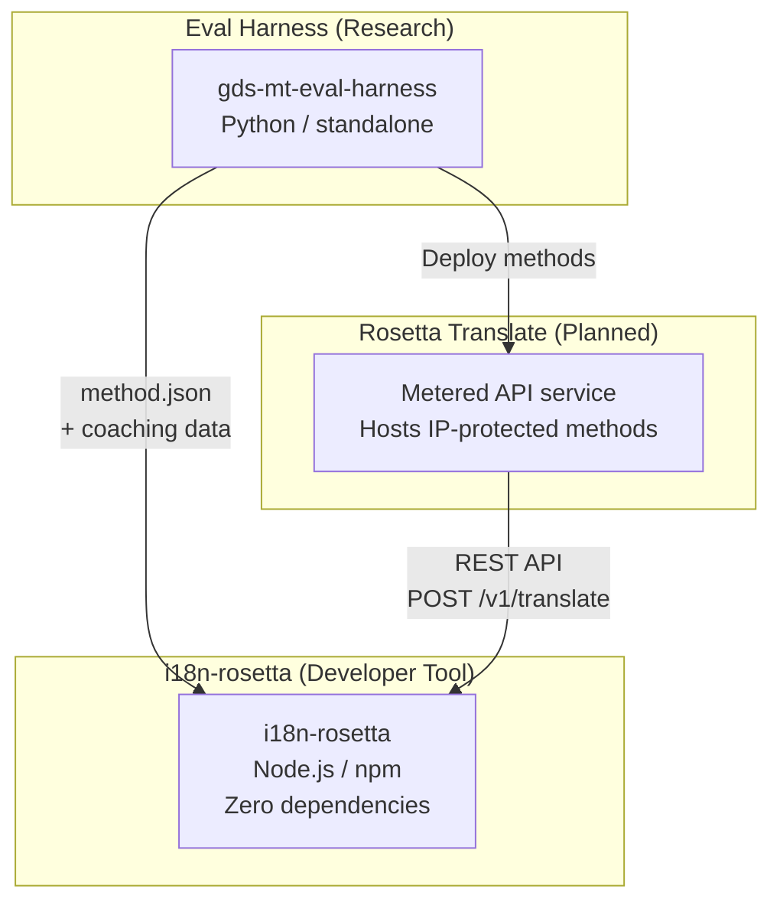
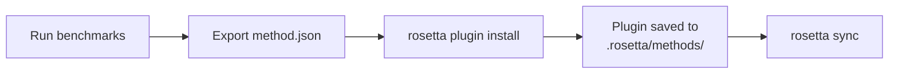
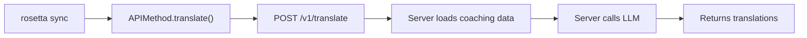

# Arkitektura

Ang Rosetta translation ecosystem ay tatlong magkakahiwalay na tool na nagtutulungan sa pamamagitan ng mga malinaw na tinukoy na kontrata. Wala sa mga ito ang nakadepende sa isa't isa sa build time. Nakikipag-ugnayan ang mga ito sa pamamagitan ng isang ibinahaging **method plugin format** at isang **REST API contract**.

## Ang Tatlong Bahagi



### i18n-rosetta (ang proyektong ito)

Ang open-source na developer tool. Nagsasalin ng mga locale file gamit ang mga pluggable na method. Walang mga dependency, opsyonal ang config, at gumagana agad.

**Mga built-in na method:**
- `llm` → OpenRouter / anumang LLM
- `llm-coached` → LLM + grammar/dictionary coaching
- `google-translate` → Google Cloud Translation API
- `api` → Manipis na pipe patungo sa anumang remote API

### Eval Harness (kasamang proyekto)

Isang research tool para sa pagbuo, pagsubok, at pag-benchmark ng mga translation method. Kapag umabot na sa katanggap-tanggap na kalidad ang isang method, nag-e-export ang harness ng isang **method plugin** — isang `method.json` manifest at mga opsyonal na coaching data file.

Hindi kailanman tumatakbo ang harness sa loob ng rosetta. Ito ay isang hiwalay na tool na gumagawa ng static na output (mga JSON file). Binabasa lang ng Rosetta ang mga file na iyon.

[→ Eval Harness sa GitHub](https://github.com/gamedaysuits/gds-mt-eval-harness)

### Rosetta Translate (pinaplano)

Isang metered API service na nagho-host ng mga proprietary translation method sa server-side — ang mga prompt, coaching data, at linguistic pipeline ay hindi kailanman umaalis sa server.

## Paano Sila Nagkakaugnay

### Eval Harness → i18n-rosetta (one-way na export)



**Kontrata**: [Plugin Specification](/docs/reference/plugin-spec)

### Rosetta Translate → i18n-rosetta (API sa runtime)



Ang `APIMethod` ng Rosetta ay isang **dumb pipe**. Nagpapadala ito ng mga key palabas at tumatanggap ng mga pagsasalin pabalik. Wala itong naglalaman na translation logic at wala ring proprietary content.

## Ano ang Alam ng Bawat Bahagi Tungkol sa Iba

| Tool | May alam ba sa rosetta? | May alam ba sa Rosetta Translate? | May alam ba sa harness? |
|------|---------------------|-------------------------------|---------------------|
| **i18n-rosetta** | *(ito ang rosetta)* | Oo — tinatawag ito ng `api` method | Wala — nagbabasa lang ng mga plugin export |
| **Rosetta Translate** | Oo — nagsisilbi sa mga request nito | *(ito ang Rosetta Translate)* | Wala — tumatanggap ng mga na-deploy na method |
| **Eval Harness** | Oo — nag-e-export ng plugin format | Wala — hiwalay na naka-deploy ang mga method | *(ito ang harness)* |

## Mga Sitwasyon ng User

### Sitwasyon 1: Libre, zero-config (karamihan sa mga user)

```bash
export OPENROUTER_API_KEY=sk-...
npx i18n-rosetta sync
```

Gumagamit ng built-in na `llm` method. Walang mga plugin, walang Rosetta Translate, walang harness.

### Sitwasyon 2: Google Translate baseline

```bash
export GOOGLE_TRANSLATE_API_KEY=AIza...
npx i18n-rosetta sync
```

Gumagamit ng built-in na `google-translate` method. Hindi kailangan ng mga plugin.

### Sitwasyon 3: Open plugin na may naka-bundle na coaching

```bash
rosetta plugin install ./french-formal-v1/
rosetta sync
```

May `type: "llm-coached"` ang plugin → gumagamit ang rosetta ng sariling OpenRouter key ng user. Lokal ang coaching data (walang server call).

### Sitwasyon 4: DIY coaching (walang plugin, walang harness)

```json title="i18n-rosetta.config.json"
{
  "pairs": {
    "en:fr": { "method": "llm-coached" }
  }
}
```

Pinapanatili ng user ang kanilang sariling mga panuntunan sa grammar at diksyunaryo sa `.rosetta/coaching/fr.json`.

## Mga Prinsipyo ng Disenyo

1. **Walang mga circular dependency.** One-way ang mga tulay.
2. **Ang Rosetta ay ang lightweight core.** Walang mga dependency, opsyonal ang config. Additive ang mga plugin at API.
3. **Architectural ang proteksyon ng IP.** Nananatili sa server-side ang mga proprietary technique. Walang ipinapadalang proprietary ang npm package.
4. **Ang plugin format ay ang kontrata.** Dumadaloy ang lahat sa pamamagitan ng `method.json`.
5. **May iisang trabaho ang bawat tool.** Harness → bumuo ng mga method. Rosetta Translate → mag-host ng mga method. Rosetta → magsalin ng mga file.