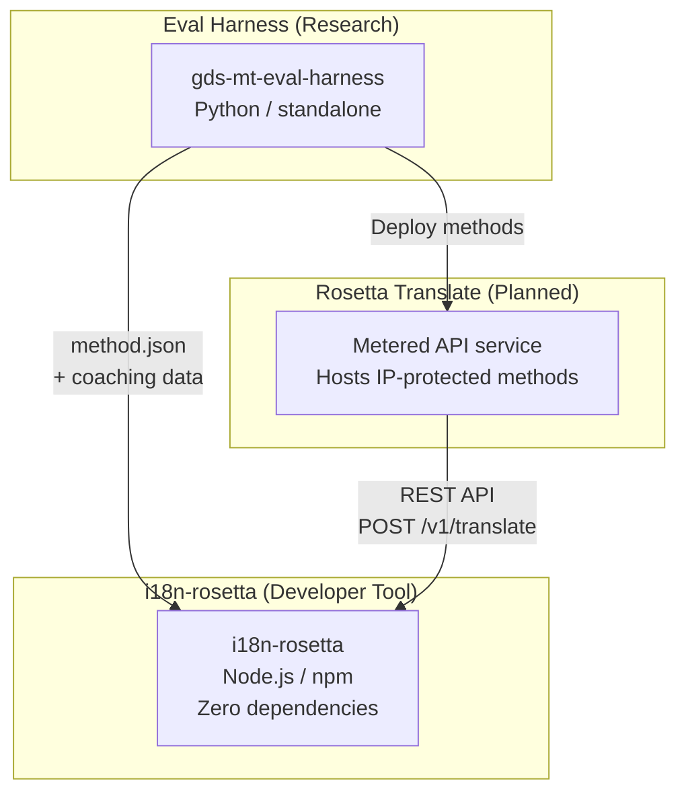
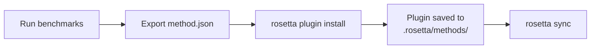
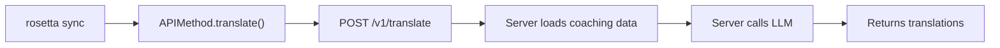
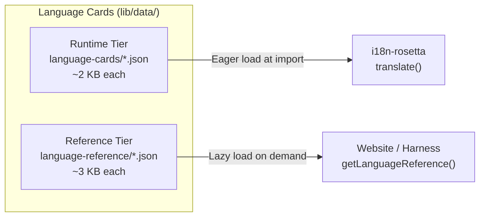

# Architecture

Ang Rosetta translation ecosystem ay tatlong independent tools na nagtutulungan through well-defined contracts. Wala sa kanila ang naka-depend sa isa't isa during build time. Nag-uusap sila through a shared **method plugin format** at isang **REST API contract**.

## Ang Tatlong Bahagi



### i18n-rosetta (ang project na ito)

Ang open-source developer tool. Nagta-translate ng locale files using pluggable methods. Zero dependencies, config-optional, at works out of the box.

**Mga built-in methods:**
- `llm` → OpenRouter / any LLM (200+ models)
- `llm-coached` → LLM + grammar/dictionary coaching
- `openai` → Direct OpenAI API (GPT-4o, GPT-4o-mini)
- `anthropic` → Direct Anthropic API (Claude Sonnet, Haiku, Opus)
- `gemini` → Direct Google Gemini API (Flash, Pro — may free tier na available)
- `google-translate` → Google Cloud Translation API v2
- `deepl` → DeepL API na may glossary support
- `microsoft-translator` → Azure Cognitive Services Translator
- `libretranslate` → Self-hosted LibreTranslate (AGPL, libre)
- `api` → Thin pipe papunta sa any remote REST endpoint

### Eval Harness (companion project)

Isang research tool para sa pag-develop, pag-test, at pag-benchmark ng translation methods. Kapag umabot na sa acceptable quality ang isang method, mag-e-export ang harness ng isang **method plugin** — isang `method.json` manifest at optional coaching data files.

Hindi nagra-run ang harness sa loob ng rosetta. Isa itong separate tool na nagpo-produce ng static output (JSON files). Binabasa lang ng rosetta ang mga files na ito.

[→ Eval Harness sa GitHub](https://github.com/gamedaysuits/gds-mt-eval-harness)

### Rosetta Translate (planned)

Isang metered API service na nagho-host ng proprietary translation methods server-side — ang mga prompts, coaching data, at linguistic pipelines ay hindi kailanman lumalabas ng server.

## Paano Sila Naka-connect

### Eval Harness → i18n-rosetta (one-way export)



**Contract**: [Plugin Specification](/docs/reference/plugin-spec)

### Rosetta Translate → i18n-rosetta (API at runtime)



Ang `APIMethod` ng Rosetta ay isang **dumb pipe**. Nagse-send ito ng keys palabas at nakaka-receive ng translations pabalik. Wala itong translation logic at zero proprietary content.

## Ano ang Alam ng Bawat Bahagi Tungkol sa Iba

| Tool | Alam ang tungkol sa rosetta? | Alam ang tungkol sa Rosetta Translate? | Alam ang tungkol sa harness? |
|------|---------------------|-------------------------------|---------------------|
| **i18n-rosetta** | *(ito ang rosetta)* | Oo — tinatawag ito ng `api` method | Hindi — nagbabasa lang ng plugin exports |
| **Rosetta Translate** | Oo — nagse-serve ng requests nito | *(ito ang Rosetta Translate)* | Hindi — nakaka-receive ng deployed methods |
| **Eval Harness** | Oo — nag-e-export ng plugin format | Hindi — hiwalay na naka-deploy ang methods | *(ito ang harness)* |

## User Scenarios

### Scenario 1: Libre, zero-config (karamihan ng users)

```bash
export OPENROUTER_API_KEY=sk-...
npx i18n-rosetta sync
```

Gumagamit ng built-in na `llm` method. Walang plugins, walang Rosetta Translate, walang harness.

### Scenario 2: Google Translate baseline

```bash
export GOOGLE_TRANSLATE_API_KEY=AIza...
npx i18n-rosetta sync
```

Gumagamit ng built-in na `google-translate` method. Hindi kailangan ng plugins.

### Scenario 3: Open plugin na may bundled coaching

```bash
rosetta plugin install ./french-formal-v1/
rosetta sync
```

May `type: "llm-coached"` ang plugin → ginagamit ng rosetta ang sariling OpenRouter key ng user. Local ang coaching data (walang server call).

### Scenario 4: DIY coaching (walang plugin, walang harness)

```json title="i18n-rosetta.config.json"
{
  "pairs": {
    "en:fr": { "method": "llm-coached" }
  }
}
```

Ang user ang nagme-maintain ng sarili nilang grammar rules at dictionary sa `.rosetta/coaching/fr.json`.

## Language Cards

Naka-configure ang bawat language sa rosetta through a **Language Card** — isang JSON file na naglalaman ng register presets, formality rules, method support flags, at typography conventions. Ang language cards ay ang per-language configuration na nagda-drive ng register-steered translation.



Naka-split ang cards sa dalawang tiers para sa performance at scale (nagta-target ng 700+ languages):

- **Runtime tier** (`language-cards/`): Loaded eagerly — ang mga fields na kailangan ng translation engine (registers, formality, method support, typography rules).
- **Reference tier** (`language-reference/`): Loaded lazily — developer documentation (linguistic challenges, language family, NLP resources).

Ang parehong tiers ay na-generate mula sa authoritative sources (IANA, CLDR, Glottolog) gamit ang `scripts/generate-language-card.mjs`, tapos human-curated para sa linguistic accuracy.

## Design Principles

1. **No circular dependencies.** One-way lang ang mga bridges.
2. **Rosetta is the lightweight core.** Zero dependencies, config-optional. Additive lang ang plugins at API.
3. **IP protection is architectural.** Nananatiling server-side ang proprietary techniques. Walang shini-ship na proprietary ang npm package.
4. **The plugin format is the contract.** Dumadaan ang lahat through `method.json`.
5. **Each tool has one job.** Harness → mag-develop ng methods. Rosetta Translate → mag-host ng methods. Rosetta → mag-translate ng files.

---

## Tingnan Din

- [Translation Methods](/docs/guides/translation-methods) — kung paano gumagana ang bawat built-in method
- [Plugin Specification](/docs/reference/plugin-spec) — ang method.json manifest format
- [Eval Harness](https://mtevalarena.org/docs/specifications/harness) — ang companion research tool
- [Serving a Method via API](/docs/guides/serving-a-method) — pag-host ng custom translation pipelines
- [Support a Low-Resource Language](https://mtevalarena.org/docs/community/low-resource-languages) — ang use case na nag-drive sa architecture na ito