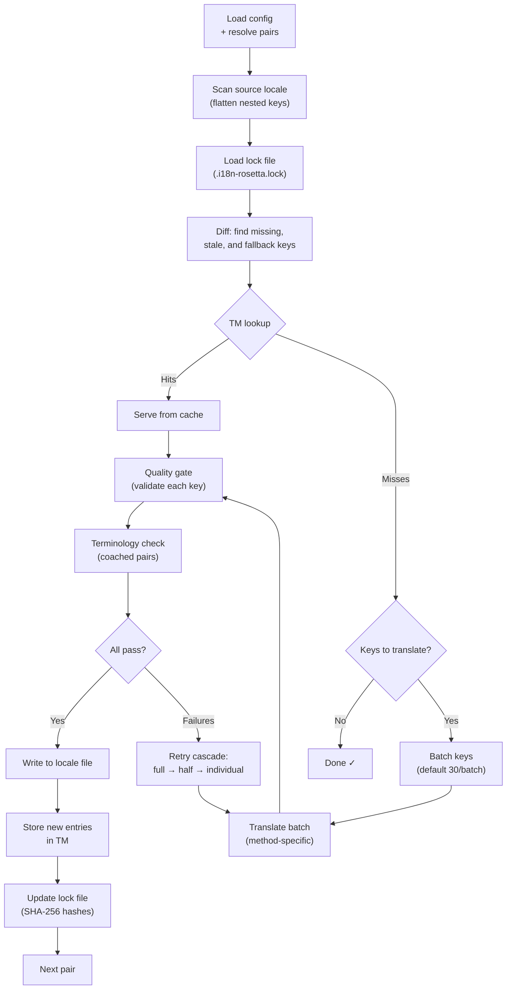

# Paano Gumagana ang Sync

Ang `sync` command ay ang core operation ng rosetta. Narito po ang nangyayari kapag ni-run ninyo ang `npx i18n-rosetta sync`.

## Overview ng Pipeline



## Step by Step

### 1. Config Resolution

Lino-load ng Rosetta ang `i18n-rosetta.config.json` (o nag-a-auto-detect ng settings). Nire-resolve nito ang:
- Source locale at target locales
- Ang pair graph (kung aling source→target combinations ang ipo-process)
- Per-pair method, model, at quality settings

### 2. Source Scanning

Lino-load ang source locale file at pina-flatten ito bilang isang key→value map:

```json
// Input (nested)
{ "hero": { "title": "Welcome", "subtitle": "Build" } }

// Flattened
{ "hero.title": "Welcome", "hero.subtitle": "Build" }
```

### 3. Change Detection

Binabasa ng Rosetta ang `.i18n-rosetta.lock`, na nag-i-store ng SHA-256 hashes ng mga na-translate na source values dati. Para sa bawat key, tinitingnan nito ang:

| Condition | Action |
|-----------|--------|
| Nawawala ang key sa target | **Translate** |
| Nagbago ang source hash simula noong huling sync | **Re-translate** (stale) |
| Nagsisimula ang target value sa `[EN]` | **Re-translate** (fallback placeholder) |
| Walang pagbabago sa source hash, nag-e-exist ang key | **Skip** |

Ito ang dahilan kung bakit tina-translate lang ng rosetta kung ano ang nagbago — hindi nito nire-re-translate ang buong file ninyo sa bawat sync.

### 4. Batching

Ginu-group ang mga keys sa mga batches (default: 30 keys/batch para sa LLM, 128 para sa Google Translate). Nire-reduce ng batching ang API round trips habang pinapanatiling manageable ang mga prompts.

### 4b. Translation Memory

Bago mag-batching, tinitingnan ng rosetta ang Translation Memory cache (`.rosetta/tm.json`). Ang mga keys na may source text + locale + method na nagma-match sa nakaraang translation ay ise-serve agad mula sa cache — no API call needed.

```
  [TM] 142 key(s) served from cache
  Translating 3 key(s) to French (llm)... [OK]
```

Ang TM ay ang pangunahing cost-saving mechanism. Ang pag-re-run ng sync pagkatapos ng isang key change ay ita-translate lang ang key na iyon, hindi ang buong file. Tingnan ang [Translation Memory](/docs/concepts/translation-memory) para sa mga detalye.

Para i-bypass ang cache sa isang single run: `i18n-rosetta sync --no-tm`

### 5. Translation

Ipinapadala ang bawat batch sa naka-configure na translation method:

- **`llm`**: Structured prompt sa OpenRouter na may register at gender guidance instructions
- **`llm-coached`**: Pareho, pero may naka-inject na grammar rules, dictionary, at style notes
- **`google-translate`**: Google Cloud Translation API v2 batch request
- **`api`**: HTTP POST sa isang remote endpoint

Ang system message (register, gender guidance, rules) ay identical sa lahat ng batches para sa isang given locale, na nag-e-enable ng **prompt caching** — kina-cache ng mga providers tulad ng Anthropic at Google ang mga inuulit na system messages, kaya nare-reduce ang token costs.

### 6. Quality Gate

Bawat translation ay bini-validate bago ito i-write sa disk. Limang checks ang nagra-run:

| Check | Ano ang nahuhuli nito | Example |
|-------|----------------|---------|
| **Empty/blank** | Walang ni-return ang model | `""` |
| **Source echo** | Ni-return ng model ang English input | `"Welcome"` para sa Japanese |
| **Hallucination loop** | Inuulit na trigrams | `"Qo' Qo' Qo' Qo'"` |
| **Length inflation** | Ang output ay 4×+ na mas mahaba kaysa sa source | 10-char source → 50-char output |
| **Script compliance** | Maling script para sa locale | Latin text para sa Arabic locale |

Ang mga failures ay nalo-log na may `[GATE]` prefix. Walang silent fallbacks.

Tingnan ang [Quality Gate](/docs/concepts/quality-gate) para sa mga detalye.

### 6b. Terminology Verification

Para sa mga coached pairs na may dictionary, tinitingnan ng rosetta kung ginamit ba talaga ng LLM ang required terminology pagkatapos ng translation. Ang mga violations ay nalo-log bilang `[TERM]` warnings:

```
[TERM] en→fr: 2 term violation(s)
  • "dashboard" → expected "tableau de bord" but got "panneau"
```

Mga warnings po ito, hindi blocking errors — isusulat pa rin ang translation.

### 7. Retry Cascade

Kapag may JSON parse failure o batch-level errors, magre-retry ang rosetta gamit ang progressively smaller batches:

```
Full batch (30 keys) → Failed
Half batch (15 keys) → Failed
Individual keys (1 each) → Isolates the problem key
```

Ang retry budget ay naka-cap sa `maxRetries` (default: 3) para maiwasan ang runaway token spend.

### 8. Write & Lock

Ang mga pumapasang translations ay isinusulat sa target locale file, habang pinapanatili ang original na nesting structure. Ina-update ang lock file gamit ang mga bagong SHA-256 hashes.

## Content Translation (Phase 2)

Para sa mga Docusaurus at Hugo projects, nagra-run ang `sync` ng second phase pagkatapos ng JSON key translation. Tina-translate ng phase na ito ang Markdown at MDX files (docs, blog posts, tutorials) gamit ang parehong methods at quality gate.

### Paano ito gumagana

1. Dini-discover ng Rosetta ang lahat ng source content files (`.md`, `.mdx`) sa pamamagitan ng pag-walk sa content/docs directory
2. Para sa bawat file × locale pair, tinitingnan nito ang isang hiwalay na content lock file (`.i18n-rosetta-content.lock`) para sa mga SHA-256 hash changes
3. Ang mga nagbago o nawawalang files ay kinokolekta sa isang flat work-item pool
4. Ang pool ay pino-process gamit ang **parallel concurrency** (default: 12 simultaneous API calls)

```
Phase 2: content (79 translations to process, 341 skipped, concurrency: 12)

    [1/79] (1%)  docs/concepts/security.md → ja [RE-TRANSLATE] (~3328s left)
    [2/79] (3%)  docs/concepts/security.md → th [RE-TRANSLATE] (~1821s left)
    ...
    [79/79] (100%) blog/v3-2-quality.md → de [OK]

  [OK] Created 79 content file(s), 341 unchanged
```

### Flat-pool parallelism

Hindi tulad ng Phase 1 (JSON keys, sequential per locale), pino-process ng Phase 2 ang lahat ng file×locale combinations bilang isang flat list. Ibig sabihin nito, ang iba't ibang files at iba't ibang locales ay sabay-sabay na tina-translate:

- Ang `docs/configuration.md → fr` at `docs/cli.md → ja` ay nagra-run nang sabay
- Ang isang 420-translation corpus ay nakukumpleto sa loob ng ~11 minuto sa concurrency 12
- Ang incremental manifest writes tuwing 10 completions ay pumipigil sa lost progress kung ma-kill ang process

I-control ang parallelism gamit ang `--concurrency` o ang `concurrency` config field:

```bash
# Faster (more parallel calls, higher API load)
npx i18n-rosetta sync --concurrency 20

# Slower (gentler on rate limits)
npx i18n-rosetta sync --concurrency 4
```

### Content protection

Habang nagta-translate, shini-shield ng rosetta ang mga non-translatable content:

- Ang **Code blocks** (fenced at indented) ay pinapalitan ng mga placeholders
- Ang mga **Frontmatter** fields na wala sa `translatableFields` list ay pini-preserve as-is
- Ang mga **Links**, image paths, at HTML tags ay protektado
- Ang mga **Shortcodes** at interpolation variables (hal., `{count}`, `{{.Params.title}}`) ay naka-shield

Pagkatapos ng translation, lahat ng placeholders ay nire-restore at bini-validate. Kung may nawawala o corrupt, ire-reject ang translation at ire-retry.

## Partial Success

Ang isang failed batch ay hindi nagba-block sa iba. Kung 9 sa 10 batches ang nag-succeed, isusulat ang 9 na iyon. Ang failed batch ay nalo-log, at pwede ninyong i-re-run ang `sync` para mag-retry.

## Dry Run

I-preview kung ano ang magbabago nang hindi nagsusulat ng anumang files:

```bash
npx i18n-rosetta sync --dry-run
```

## Force Re-translate

I-force ang specific keys na ma-re-translate kahit walang pagbabago:

```bash
npx i18n-rosetta sync --force-keys "hero.title,nav.about"
```

## Cost Estimation

Bago mag-translate, nagge-generate ang rosetta ng isang **pre-sync cost report** na nagpapakita ng estimated costs per pair. Awtomatiko itong nagra-run sa bawat `sync` — makikita ninyo ito bago pa man gumawa ng anumang API calls.

```
╔══════════════════════════════════════════════════════════╗
║  Cost Estimate                                          ║
╠════════════╦═══════╦════════════╦════════════════════════╣
║ Pair       ║ Keys  ║ Est. Cost  ║ Method                 ║
╠════════════╬═══════╬════════════╬════════════════════════╣
║ en → fr    ║   142 ║ $0.07      ║ google-translate       ║
║ en → ja    ║    38 ║   —        ║ llm (model-dependent)  ║
║ en → crk   ║    38 ║   —        ║ llm-coached            ║
╚════════════╩═══════╩════════════╩════════════════════════╝
```

### Ano ang Nae-estimate

Bawat translation method ay nagpo-provide ng sarili nitong cost estimate:

| Method | Cost Basis | Precision |
|--------|-----------|-----------|
| `google-translate` | Published rate ng Google ($20/million chars) | Accurate |
| `llm` | Nag-iiba depende sa OpenRouter model | Model-dependent — i-check ang [OpenRouter pricing](https://openrouter.ai/models) |
| `llm-coached` | Pareho sa `llm` plus coaching context tokens | Model-dependent |
| `api` | Server-determined | Unknown — hindi ma-estimate nang hindi kini-query ang endpoint |

Kapag hindi ma-determine ng isang method ang cost (LLM methods, remote APIs), nagre-report ang rosetta ng `—` sa halip na manghula. Gamitin ang `--dry` para makita ang cost estimates nang hindi pa talaga nagta-translate.

---

## Tingnan Din

- [CLI Reference — sync](/docs/reference/cli#sync) — command flags at options
- [Translation Memory](/docs/concepts/translation-memory) — caching at cost savings
- [Quality Gate](/docs/concepts/quality-gate) — paano bini-validate ang mga translations
- [Translation Methods](/docs/guides/translation-methods) — paano gumagana ang bawat method
- [Working with Professional Translators](/docs/guides/professional-translators) — XLIFF workflow
- [Configuration](/docs/getting-started/configuration) — config reference
- [CI/CD Guide](/docs/guides/ci-cd) — pag-automate ng syncs sa inyong pipeline