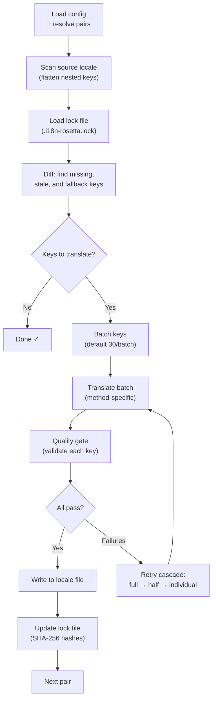

# Paano Gumagana ang Sync

Ang command na `sync` ay ang pangunahing operasyon ng rosetta. Narito ang nangyayari kapag pinatakbo mo ang `npx i18n-rosetta sync`.

## Pangkalahatang-ideya ng Pipeline



## Hakbang-hakbang

### 1. Resolusyon ng Config

Nilo-load ng Rosetta ang `i18n-rosetta.config.json` (o awtomatikong nade-detect ang mga setting). Nire-resolve nito ang:
- Source locale at mga target locale
- Ang pair graph (kung aling mga source→target na kombinasyon ang ipoproseso)
- Mga setting ng pamamaraan, modelo, at kalidad sa bawat pares (per-pair)

### 2. Pag-scan ng Source

Ang source locale file ay nilo-load at pina-flatten sa isang key→value map:

```json
// Input (nested)
{ "hero": { "title": "Welcome", "subtitle": "Build" } }

// Flattened
{ "hero.title": "Welcome", "hero.subtitle": "Build" }
```

### 3. Pagtukoy sa Pagbabago (Change Detection)

Binabasa ng Rosetta ang `.i18n-rosetta.lock`, na nag-iimbak ng mga SHA-256 hash ng mga naunang naisalin na source value. Para sa bawat key, sinusuri nito ang:

| Kondisyon | Aksyon |
|-----------|--------|
| Nawawala ang key sa target | **Isalin** |
| Nagbago ang source hash mula noong huling sync | **Muling isalin** (stale) |
| Nagsisimula ang target value sa `[EN]` | **Muling isalin** (fallback placeholder) |
| Hindi nagbago ang source hash, umiiral ang key | **Laktawan** |

Ito ang dahilan kung bakit isinasalin lamang ng rosetta kung ano ang nagbago — hindi nito muling isinasalin ang iyong buong file sa bawat sync.

### 4. Pag-batch (Batching)

Ang mga key ay pinapangkat sa mga batch (default: 30 key/batch para sa LLM, 128 para sa Google Translate). Binabawasan ng pag-batch ang mga API round trip habang pinapanatiling madaling pamahalaan ang mga prompt.

### 5. Pagsasalin

Ang bawat batch ay ipinapadala sa naka-configure na pamamaraan ng pagsasalin:

- **`llm`**: Structured prompt sa OpenRouter na may mga tagubilin sa register
- **`llm-coached`**: Pareho, ngunit may mga panuntunan sa grammar, diksyunaryo, at mga tala sa istilo (style notes) na isinama
- **`google-translate`**: Google Cloud Translation API v2 batch request
- **`api`**: HTTP POST sa isang remote endpoint

Ang system message (register, mga panuntunan) ay magkapareho sa lahat ng batch para sa isang partikular na locale, na nagbibigay-daan sa **prompt caching** — ang mga provider tulad ng Anthropic at Google ay nagka-cache ng mga inuulit na system message, na nagpapababa sa mga gastos sa token.

### 6. Quality Gate

Ang bawat pagsasalin ay bini-validate bago ito isulat sa disk. May limang pagsusuri na pinapatakbo:

| Pagsusuri | Ano ang nahuhuli nito | Halimbawa |
|-------|----------------|---------|
| **Walang laman/blangko** | Walang ibinalik ang modelo | `""` |
| **Source echo** | Ibinalik ng modelo ang English input | `"Welcome"` para sa Japanese |
| **Hallucination loop** | Mga inuulit na trigram | `"Qo' Qo' Qo' Qo'"` |
| **Length inflation** | Ang output ay 4×+ na mas mahaba kaysa sa source | 10-char source → 50-char output |
| **Script compliance** | Maling script para sa locale | Latin text para sa Arabic locale |

Ang mga pagkabigo ay nalo-log na may prefix na `[GATE]`. Walang mga silent fallback.

Tingnan ang [Quality Gate](/docs/concepts/quality-gate) para sa mga detalye.

### 7. Retry Cascade

Sa pagkabigo ng JSON parse o mga error sa antas ng batch, muling susubukan ng rosetta gamit ang mga unti-unting lumiliit na batch:

```
Full batch (30 keys) → Failed
Half batch (15 keys) → Failed
Individual keys (1 each) → Isolates the problem key
```

Ang retry budget ay nililimitahan ng `maxRetries` (default: 3) upang maiwasan ang labis na paggastos sa token.

### 8. Pagsulat at Pag-lock (Write & Lock)

Ang mga pumapasang pagsasalin ay isinusulat sa target locale file, na pinapanatili ang orihinal na nesting structure. Ang lock file ay ina-update gamit ang mga bagong SHA-256 hash.

## Bahagyang Tagumpay (Partial Success)

Ang isang nabigong batch ay hindi humaharang sa iba. Kung magtagumpay ang 9 sa 10 batch, isusulat ang 9 na iyon. Ang nabigong batch ay nalo-log, at maaari mong muling patakbuhin ang `sync` upang subukang muli.

## Dry Run

I-preview kung ano ang magbabago nang hindi nagsusulat ng anumang mga file:

```bash
npx i18n-rosetta sync --dry
```

## Puwersahang Muling Pagsasalin (Force Re-translate)

Puwersahin ang mga partikular na key na muling isalin kahit na hindi nagbago:

```bash
npx i18n-rosetta sync --force-keys "hero.title,nav.about"
```

## Pagtatantya ng Gastos (Cost Estimation)

Bago magsalin, ang rosetta ay bumubuo ng isang **pre-sync cost report** na nagpapakita ng mga tinantyang gastos bawat pares. Awtomatiko itong tumatakbo sa bawat `sync` — makikita mo ito bago gawin ang anumang mga API call.

```
╔══════════════════════════════════════════════════════════╗
║  Cost Estimate                                          ║
╠════════════╦═══════╦════════════╦════════════════════════╣
║ Pair       ║ Keys  ║ Est. Cost  ║ Method                 ║
╠════════════╬═══════╬════════════╬════════════════════════╣
║ en → fr    ║   142 ║ $0.07      ║ google-translate       ║
║ en → ja    ║    38 ║   —        ║ llm (model-dependent)  ║
║ en → crk   ║    38 ║   —        ║ llm-coached            ║
╚════════════╩═══════╩════════════╩════════════════════════╝
```

### Ano ang Natatantya

Ang bawat pamamaraan ng pagsasalin ay nagbibigay ng sarili nitong pagtatantya ng gastos:

| Pamamaraan | Batayan ng Gastos | Katumpakan |
|--------|-----------|-----------|
| `google-translate` | Nai-publish na rate ng Google ($20/milyong character) | Tumpak |
| `llm` | Nag-iiba ayon sa modelo ng OpenRouter | Nakadepende sa modelo — tingnan ang [pagpepresyo ng OpenRouter](https://openrouter.ai/models) |
| `llm-coached` | Pareho sa `llm` kasama ang mga coaching context token | Nakadepende sa modelo |
| `api` | Tinutukoy ng server | Hindi alam — hindi matatantya nang hindi nagku-query sa endpoint |

Kapag hindi matukoy ng isang pamamaraan ang gastos (mga pamamaraan ng LLM, mga remote API), nag-uulat ang rosetta ng `—` sa halip na manghula. Gamitin ang `--dry` upang makita ang mga pagtatantya ng gastos nang hindi aktwal na nagsasalin.