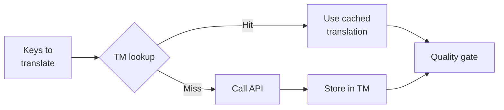

# Translation Memory

Ang Translation Memory (TM) ay ang built-in caching layer ng rosetta. Ini-store nito ang bawat translation na naka-key by source text + locale + method, kaya kapag nag-re-run ng `sync`, tatawagin lang nito ang API para sa mga keys na talagang nagbago.

## Bakit May TM

Kung walang TM, ire-re-translate ng bawat `sync` ang lahat ng modified key — kahit na na-translate mo na ang eksaktong parehong English text para sa parehong locale sa nakaraang run. Narito ang mga common scenarios kung saan nag-aaksaya ito ng pera:

| Scenario | Walang TM | May TM |
|----------|-----------|---------|
| Mag-re-run ng sync pagkatapos ng 1 key change (500 keys × 10 locales) | 5,000 API calls | 10 API calls |
| I-revert ang isang key sa nakaraang English value | Full API call | Instant cache hit |
| Lumabas ang parehong phrase sa 3 locale files | 3 × API calls | 1 API call + 2 cache hits |
| Dry-run → real sync | Full API calls sa pareho | Magka-cache ang first run, ire-reuse ng second |

Ang TM ay **enabled by default** at hindi na kailangan ng configuration. Awtomatikong naka-cache ang mga translations sa bawat `sync` at isine-serve sa mga susunod na runs.

## Paano Ito Gumagana

### Cache Key

Ang bawat TM entry ay naka-key gamit ang SHA-256 hash ng tatlong values:

```
SHA-256( sourceValue + '\x00' + locale + '\x00' + method )
```

| Component | Bakit ito nasa key |
|-----------|-------------------|
| `sourceValue` | Ibang English text → ibang translation |
| `locale` | Iba ang translation ng "Hello" sa French vs Japanese |
| `method` | Google Translate output ≠ GPT-4o output |

Ang null byte separator (`\x00`) ay pumipigil sa collision sa pagitan ng `"ab" + "c"` at `"a" + "bc"`.

### Habang Nag-sy-sync



1. Bago tawagin ang translation API, pinapa-partition ng rosetta ang mga keys sa **TM hits** at **TM misses**
2. Ang mga hits ay isine-serve agad mula sa cache — walang API call, walang latency, walang gastos
3. Ang mga misses ay dumadaan sa normal na translation pipeline
4. Ang mga bagong translations mula sa API ay ini-store sa TM para sa mga future runs
5. Lahat ng translations (cached + fresh) ay dumadaan sa quality gate

### Storage

Naka-store ang TM sa `.rosetta/tm.json` sa inyong project root. Gumagamit ang file ng compact JSON (walang pretty-printing) para mapanatiling manageable ang size. Ang bawat entry ay nag-i-store ng:

| Field | Description |
|-------|-------------|
| `t` | Ang translated text |
| `ts` | ISO-8601 timestamp kung kailan ito na-cache |
| `l` | Target locale code (para sa stats/filtering) |
| `m` | Translation method name (para sa stats/filtering) |

Sa 50 languages × 500 keys = 25,000 entries, ang file ay dapat nasa ~2-3 MB.

## Pag-manage ng Cache

### Tingnan ang Statistics

```bash
i18n-rosetta tm stats
```

Ipinapakita nito ang entry count, file size, at ang per-locale breakdown:

```
  Translation Memory — .rosetta/tm.json

  Entries:      2,847
  File size:    1.2 MB
  Created:      2026-05-20
  Last entry:   2026-05-24

  By locale:
    fr       482 entries  (llm: 380, llm-coached: 102)
    de       471 entries  (llm: 471)
    ja       465 entries  (llm: 465)
```

### I-clear ang Cache

```bash
# Clear everything (with confirmation prompt)
i18n-rosetta tm clear

# Clear without prompt (CI environments)
i18n-rosetta tm clear --yes

# Clear only one locale
i18n-rosetta tm clear --locale fr
```

### I-skip ang TM para sa Isang Run

```bash
# Force fresh API calls for all keys (useful when switching providers)
i18n-rosetta sync --no-tm
```

Hindi nito dine-delete ang cache — ini-ignore lang nito para sa run na ito at hindi nag-i-store ng mga bagong results.

## Kailan Hindi Nakakatulong ang TM

Hindi magpo-produce ng cache hit ang TM kapag:

- **Nagbago ang source text** — nagbabago ang hash, kaya isa itong miss
- **Nagbago ang method** — ang pag-switch mula `llm` papuntang `google-translate` ay nangangahulugang iba na ang cache keys
- **First run** — cold start, wala pang entries
- **`--no-tm` flag** — explicitly na bina-bypass ang cache

## Dapat Mo Bang I-commit ang `.rosetta/tm.json`?

**Kadalasan ay hindi po.** Ang TM ay isang local developer optimization. Awtomatiko itong napa-populate habang nag-sy-sync at nakakatulong lang kapag nag-re-run ng sync sa parehong machine. Gayunpaman, maaari niyo pong i-consider na i-commit ito kung:

- Nagse-share ang team niyo ng iisang CI runner na nag-sy-sync ng mga translations
- Gusto niyo ng reproducible builds nang walang API calls
- Nag-a-archive kayo ng mga translations para sa compliance

I-add ang `.rosetta/tm.json` sa `.gitignore` para sa typical usage.

---

## Tingnan Din

- [Paano Gumagana ang Sync](/docs/concepts/how-sync-works) — kung saan pumapasok ang TM sa pipeline
- [CLI Reference — tm](/docs/reference/cli#tm) — command reference
- [CLI Reference — sync --no-tm](/docs/reference/cli#sync) — pag-bypass sa TM