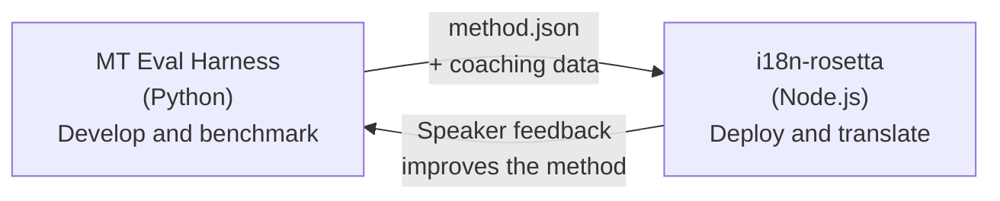

# Ang Eval Harness Bridge

Ang i18n-rosetta at ang MT Eval Harness ay dalawang magkahiwalay na tools na bumubuo sa isang ecosystem. Sa harness **napatutunayan** ang mga translation methods. Sa Rosetta naman **nade-deploy** ang mga proven methods. Nagko-connect sila gamit ang isang shared plugin format.



## Ang Flow: Research → Production

### 1. Mag-build ng method sa harness

Kahit anong Python class na nag-i-implement ng `async translate(entries, config) → [{id, predicted}]` ay pwedeng i-plug sa harness. Walang pakialam ang harness kung ano ang nangyayari sa loob — prompted LLM man 'yan, custom-trained model, deterministic rules, o kahit ano pa.

### 2. I-benchmark ito

Ini-score ng harness ang iyong method laban sa isang standardized corpus gamit ang mga reproducible metrics: chrF++, FST acceptance (para sa mga morphologically rich languages), morphological accuracy, at semantic scoring.

### 3. I-export bilang plugin

Kapag umabot na sa acceptable quality ang iyong method, i-package ito bilang isang rosetta plugin — isang `method.json` manifest na may optional na coaching data.

:::info Planned pa lang ang Export CLI
Sa ngayon, kailangan po ninyong i-create nang manual ang method.json manifest. I-o-automate ito ng `mt-eval export` command. Tingnan ang [Method Interface](https://mtevalarena.org/docs/specifications/methods) para sa buong plugin format.
:::

### 4. I-install sa rosetta

```bash
i18n-rosetta plugin install ./my-method-plugin/
```

### 5. Mag-translate ng real content

```bash
i18n-rosetta sync
```

Ang iyong benchmarked method ay nagpo-produce na ngayon ng mga real translations sa production.

## Ang Flow: Production → Research

Nire-review ng mga bilingual speakers ang mga na-deploy na translations. Ang kanilang feedback ay nag-i-identify ng mga systematic errors (maling tense patterns, missing vocabulary, unnatural phrasing). I-u-update ng researcher ang method sa harness, ire-re-benchmark, ire-re-export, at ire-redeploy. Natututo ang system mula sa paggamit nito.

## Ang Plugin Format

Ang `method.json` manifest ay ang contract sa pagitan ng dalawang tools:

```json
{
  "name": "crk-coached-v3",
  "type": "llm-coached",
  "version": "3.0.0",
  "description": "Coached LLM translation for Plains Cree",
  "locales": ["crk"],
  "config": {
    "model": "google/gemini-3.5-flash",
    "temperature": 0.3
  },
  "benchmarks": {
    "crk": {
      "composite_score": 0.67,
      "fst_acceptance": 0.82,
      "corpus_size": 150
    }
  }
}
```

Tingnan ang [Plugin Specification](/docs/reference/plugin-spec) para sa buong format.

## Mga Built na vs. Planned

| Component | Status |
|-----------|--------|
| TranslationProcess protocol | ✅ Built |
| Harness benchmark runner | ✅ Built |
| method.json plugin format | ✅ Built |
| `rosetta plugin install/remove/list` | ✅ Built |
| Coaching data loading | ✅ Built |
| `mt-eval export` CLI | 🔲 Planned |
| Community review interface | 🔲 Planned |
| Cryptographic test set evaluation | 🔲 Planned |

## Karagdagang Babasahin

- [Translation Methods](/docs/guides/translation-methods) — lahat ng available na methods at kung paano sila gumagana
- [Plugin Specification](/docs/reference/plugin-spec) — ang method.json format
- [Serving a Method via API](/docs/guides/serving-a-method) — pag-host ng method sa server-side
- [Data Sovereignty](https://mtevalarena.org/docs/sovereignty/data-sovereignty) — OCAP, CARE, at cryptographic protection
- [For MT Researchers](https://mtevalarena.org/docs/leaderboard/rules) — ang eval harness documentation