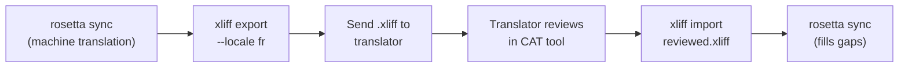

# Pag-work kasama ang mga Professional Translators

Nagge-generate po ang Rosetta ng mga machine translation, pero may mga projects na kailangan ng human review — tulad ng regulatory content, brand-sensitive copy, o high-stakes UI. Gamit ang XLIFF workflow, pwede ninyong i-export ang mga translations para sa professional review at i-import ulit ang mga ito nang seamless.

## Ano ang XLIFF?

Ang XLIFF (XML Localization Interchange File Format) ay ang industry-standard exchange format para sa mga translation tools. Supported po ito ng bawat professional CAT (Computer-Assisted Translation) tool:

- **memoQ** — mag-import ng XLIFF, mag-review in-context, i-export ang reviewed file
- **SDL Trados Studio** — may native XLIFF support
- **Phrase (Memsource)** — mag-upload ng XLIFF jobs para sa mga translator teams
- **Smartling** — may XLIFF ingestion pipeline
- **OmegaT** — free/open-source CAT tool na may XLIFF support

Nagge-generate ang Rosetta ng XLIFF 1.2 (ang universally supported version) imbes na 2.0+ para sa maximum tool compatibility.

## Ang Workflow



### Step 1: Mag-generate ng Machine Translations

I-run po muna ang `sync` para makakuha ng baseline machine translation:

```bash
i18n-rosetta sync
```

### Step 2: I-export ang XLIFF

I-export ang source + target pair bilang XLIFF:

```bash
i18n-rosetta xliff export --locale fr
```

Magsusulat ito ng `.rosetta/xliff/fr.xliff` na naglalaman ng:
- Bawat source key kasama ang English value nito
- Ang current machine translation (kung meron man) bilang `<target>`
- Mga keys na walang translations na naka-mark bilang `state="new"`

```xml
<trans-unit id="hero.title" xml:space="preserve">
  <source>Welcome to our platform</source>
  <target state="translated">Bienvenue sur notre plateforme</target>
</trans-unit>
```

### Step 3: I-send sa Translator

I-send po ang `.xliff` file sa inyong translator o i-upload ito sa inyong CAT platform. Makikita ng translator ang source at target side-by-side, at pwede nilang:

- I-edit ang mga machine translations
- Punan ang mga missing translations
- I-flag ang mga quality issues
- I-apply ang kanilang sariling translation memory at termbases

### Step 4: I-import ang Reviewed File

Kapag binalik na ng translator ang reviewed na `.xliff`, i-import po ito:

```bash
# Preview what will change
i18n-rosetta xliff import .rosetta/xliff/fr.xliff --dry

# Apply changes
i18n-rosetta xliff import .rosetta/xliff/fr.xliff
```

Output:
```
  ✓ Imported 142 translations for fr
    Updated:    23 (changed from existing)
    Added:      0 (new keys)
    Unchanged:  119
    Written to: locales/fr.json
```

### Step 5: Punan ang mga Gaps

Kung may mga bagong keys na na-add pagkatapos i-export ang XLIFF, i-run ang `sync` para i-translate ang mga ito:

```bash
i18n-rosetta sync
```

Ita-translate lang po ng Rosetta ang mga keys na missing pa rin — mapi-preserve ang mga reviewed translations mula sa XLIFF import.

## Mga Tips

### Mag-export ng Custom Paths

```bash
# Export to a specific directory
i18n-rosetta xliff export --locale ja --out ./for-review/

# Export with a specific filename
i18n-rosetta xliff export --locale de --out ./review/german.xliff
```

### Multiple Locales

I-export nang hiwalay ang bawat locale:

```bash
for locale in fr de ja ko; do
  i18n-rosetta xliff export --locale $locale
done
```

### Version Control

I-add po ang `.rosetta/xliff/` sa `.gitignore` — ang mga XLIFF files ay mga transient artifacts, hindi project source:

```gitignore
.rosetta/xliff/
```

### Kailan Dapat Gamitin ang XLIFF vs. `sync` Lang

| Scenario | Recommendation |
|----------|---------------|
| Internal app, 90%+ quality acceptable | `sync` lang — okay na ang machine translation |
| User-facing marketing copy | I-export ang XLIFF para sa human review |
| Legal/regulatory content | I-export ang XLIFF — kailangan ng human review |
| 50+ locales, tight deadline | `sync` muna, XLIFF export para sa top 5 locales lang |
| Gumagamit na ng CAT tool ang translator | XLIFF ang natural handoff format |

---

## Tingnan Din

- [CLI Reference — xliff](/docs/reference/cli#xliff) — command reference
- [Translation Memory](/docs/concepts/translation-memory) — pag-cache ng mga reviewed translations
- [Translation Methods](/docs/guides/translation-methods) — mga machine translation options