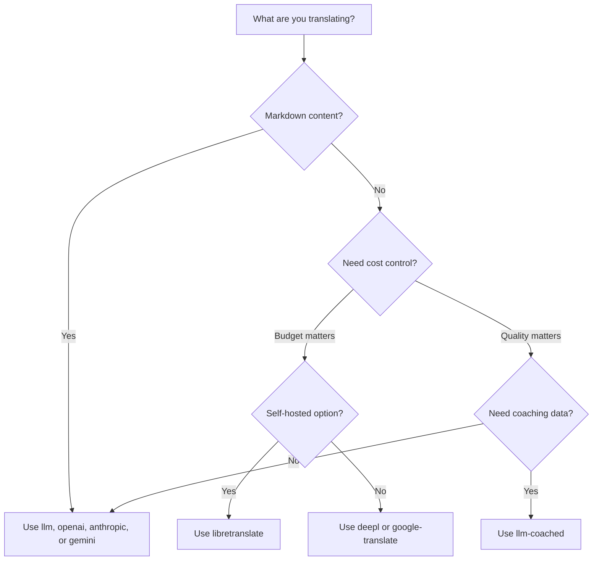

# Mga Translation Method

Sinusuportahan ng Rosetta ang sampung translation method. Pwedeng gumamit ng magkaibang method ang bawat language pair — hindi ka po naka-lock sa isang approach lang para sa buong project ninyo.

## Pagkukumpara ng mga Method

### Mga LLM Provider

Quality-focused, Markdown-aware, at coaching-compatible. Pinakamaganda para sa mga content-heavy na project.

| Method | Key | Ano ang Ginagawa Nito |
|--------|-----|-------------|
| `llm` (default) | `OPENROUTER_API_KEY` | LLM via OpenRouter — 200+ models, auto-routing |
| `llm-coached` | `OPENROUTER_API_KEY` | LLM + grammar rules, mga dictionary, style notes |
| `openai` | `OPENAI_API_KEY` | Direct OpenAI API (gpt-4o, gpt-4o-mini) |
| `anthropic` | `ANTHROPIC_API_KEY` | Direct Anthropic API (Claude Sonnet, Haiku, Opus) |
| `gemini` | `GEMINI_API_KEY` | Direct Google Gemini API (Flash, Pro) — free tier |

### Traditional MT

Naka-focus sa speed at cost. Pinakamaganda para sa high-volume na mga key-value pair.

| Method | Key | Ano ang Ginagawa Nito |
|--------|-----|-------------|
| `google-translate` | `GOOGLE_TRANSLATE_API_KEY` | Google Cloud Translation API v2 (130+ na language) |
| `deepl` | `DEEPL_API_KEY` | DeepL API na may glossary support (30+ na language) |
| `microsoft-translator` | `MICROSOFT_TRANSLATOR_API_KEY` | Azure Cognitive Services Translator (100+ na language) |
| `libretranslate` | *(self-hosted)* | Self-hosted LibreTranslate (AGPL, libre) |

### Infrastructure

| Method | Key | Ano ang Ginagawa Nito |
|--------|-----|-------------|
| `api` | *(per provider)* | Thin HTTP client para sa anumang REST translation endpoint |

## Decision Tree



---

## `llm` — LLM Translation (Default)

Nagta-translate gamit ang anumang LLM sa [OpenRouter](https://openrouter.ai). Ito po ang default method at ang pinaka-versatile.

**Paano ito gumagana:**
1. Nagba-batch ng mga key (default 80/batch) kasama ang register at context instructions
2. Ipinapadala sa OpenRouter bilang isang structured prompt
3. Pina-parse ang JSON response
4. Vina-validate ang bawat translation dumaan sa [quality gate](/docs/concepts/quality-gate)
5. Isinusulat ang mga pumapasang translation, nagre-retry o nire-reject ang mga nag-fail

**Kailan ito gagamitin:** Sa karamihan ng mga project. Lalo na sa mga content-heavy site na may Markdown, kung saan kailangang i-shield ang mga code block at shortcode.

**Configuration:**

```json
{
  "defaultMethod": "llm",
  "model": "google/gemini-3.5-flash"
}
```

## `llm-coached` — Coached LLM Translation

Pareho lang sa `llm`, pero may mga grammar rule, term dictionary, at style note na ini-inject sa bawat prompt.

**Paano ito gumagana:**
1. Nilo-load ang coaching data mula sa `.rosetta/coaching/<locale>.json` o sa `coaching/` directory ng isang plugin
2. Ini-inject ang mga grammar rule, dictionary term, at style note sa system prompt
3. Isinasama ang mga dictionary term na nagma-match sa source keys bilang required terminology
4. Magpapatuloy ang translation gaya ng sa `llm`, kung saan nagdadagdag ng precision ang coaching data

**Kailan ito gagamitin:** Para sa mga low-resource language, domain-specific terminology (legal, medical), formal register, o anumang case kung saan hindi sapat ang precision ng generic na LLM output.

**Format ng coaching data:**

```json title=".rosetta/coaching/fr.json"
{
  "grammar_rules": [
    "French adjectives agree in gender and number with the noun they modify",
    "Use 'vous' for formal contexts, 'tu' for informal"
  ],
  "dictionary": {
    "dashboard": "tableau de bord",
    "deployment": "déploiement",
    "settings": "paramètres"
  },
  "style_notes": "Prefer active voice. Avoid anglicisms where a native French term exists."
}
```

Tingnan din: [Low-Resource Languages Guide](https://mtevalarena.org/docs/community/low-resource-languages)

---

## `openai` — Direct OpenAI API

Direktang nagta-translate gamit ang OpenAI Chat Completions API. Walang OpenRouter middleman — sarili mong key, sarili mong account, at sarili mong usage dashboard.

**Mga Model:** `gpt-4o` (default), `gpt-4o-mini`

**Mga Feature:**
- ✅ Markdown-aware (content translation)
- ✅ Coaching support (mga grammar rule, dictionary override, style notes)
- ✅ JSON mode para sa structured na key-value output
- ✅ Exponential backoff na may retry

**Configuration:**

```json
{
  "pairs": {
    "en:fr": { "method": "openai", "model": "gpt-4o-mini" }
  }
}
```

```bash
export OPENAI_API_KEY=sk-proj-...
```

Kunin ang inyong key sa [platform.openai.com/api-keys](https://platform.openai.com/api-keys).

## `anthropic` — Direct Anthropic API

Direktang nagta-translate gamit ang Anthropic Messages API. Ginagamit ang `system` parameter para sa coaching data, na nag-e-enable sa prompt caching ng Anthropic.

**Mga Model:** `claude-sonnet-4-6` (default), `claude-haiku-4-5`, `claude-opus-4-7`

**Mga Feature:**
- ✅ Markdown-aware (content translation)
- ✅ Coaching support (mga grammar rule, dictionary override, style notes)
- ✅ System prompt caching (ina-amortize ang coaching cost sa mga batch)
- ✅ Exponential backoff na may retry

**Configuration:**

```json
{
  "pairs": {
    "en:ja": { "method": "anthropic", "model": "claude-haiku-4-5" }
  }
}
```

```bash
export ANTHROPIC_API_KEY=sk-ant-...
```

Kunin ang inyong key sa [console.anthropic.com](https://console.anthropic.com/settings/keys).

## `gemini` — Direct Google Gemini API

Direktang nagta-translate gamit ang Google Gemini `generateContent` API. **May available na free tier** — pinakamagandang zero-cost starting point.

**Mga Model:** `gemini-2.5-flash` (default), `gemini-2.5-pro`

**Mga Feature:**
- ✅ Markdown-aware (content translation)
- ✅ Coaching support (mga grammar rule, dictionary override, style notes)
- ✅ JSON response mode via `responseMimeType`
- ✅ Free tier (malaking daily quota)
- ✅ Exponential backoff na may retry

**Configuration:**

```json
{
  "pairs": {
    "en:ko": { "method": "gemini", "model": "gemini-2.5-pro" }
  }
}
```

```bash
export GEMINI_API_KEY=AI...
```

Kunin ang inyong key sa [aistudio.google.com/apikey](https://aistudio.google.com/apikey).

### Model Validation

Vina-validate ng mga direct LLM provider (`openai`, `anthropic`, `gemini`) ang inyong model string sa unang paggamit. Sinasalo nito ang tatlong category ng mga pagkakamali:

**Maling method format** — Paggamit ng OpenRouter-style na model path sa isang direct provider:

```
[WARN] OpenAI: model "google/gemini-3.5-flash" looks like an OpenRouter path.
       Direct providers use bare model names (e.g., "gpt-4o").
       To use OpenRouter models, set method to 'llm' instead.
```

**Maling provider** — Paggamit ng model mula sa ibang provider:

```
[WARN] Gemini: model "claude-sonnet-4-6" is an Anthropic model.
       This provider (gemini) cannot serve Anthropic models.
       Use --method anthropic or set "method": "anthropic" in config.
```

**Deprecated o misspelled na model** — Sa unang API call, kukunin ng rosetta ang live model list ng provider at iche-check ang inyong model laban dito:

```
[WARN] Gemini: model "gemini-1.5-flash" not found in available models.
       Similar models: gemini-2.0-flash, gemini-2.5-flash, gemini-2.5-pro
       The API call will proceed — the provider will give the final verdict.
```

:::note Mga warning po ito, hindi error
Naglo-log ng mga warning ang model validation pero hindi nito bino-block ang API call. Ang provider API ang nagbibigay ng final verdict — pwedeng mag-match sa ibang pattern ang isang future model name, at ayaw po nating mag-gate base sa heuristics.
:::

---

## `google-translate` — Google Cloud Translation API

Direct integration sa Google Cloud Translation API v2. Ginagamit ang REST API — walang SDK, walang service account. API key lang po.

**Kailan ito gagamitin:** Para sa high-volume na mga key-value string pair kung saan mas mahalaga ang speed at cost kaysa sa nuance. Sinusuportahan nito ang 130+ na language out of the box.

**Mga Limitasyon:**
- ⚠️ **Walang Markdown awareness.** Mako-corrupt nito ang mga code block, shortcode, at interpolation variable.
- Walang register/tone control
- Walang coaching o terminology enforcement

```bash
npx i18n-rosetta sync --method google-translate
```

:::tip Auto-detection
Kung `GOOGLE_TRANSLATE_API_KEY` lang ang naka-set (walang OpenRouter key), mag-o-auto-switch ang rosetta sa Google Translate. Hindi na kailangan ng config change.
:::

## `deepl` — DeepL API

Direct integration sa DeepL translation API. May support para sa mga glossary para sa consistent na terminology.

**Kailan ito gagamitin:** Sa mga European language kung saan magaling ang DeepL (German, French, Spanish, Dutch, Polish, atbp.). Ang glossary support ay nag-e-enforce ng consistent na terminology kahit walang coaching data.

**Mga Feature:**
- ✅ Automatic na free/pro endpoint detection (`:fx` suffix sa mga free key)
- ✅ Glossary creation at management
- ✅ Formality level control
- ⚠️ **Walang Markdown awareness** — mga key-value pair lang

**Configuration:**

```json
{
  "pairs": {
    "en:de": { "method": "deepl" }
  }
}
```

```bash
export DEEPL_API_KEY=your-key-here
```

Kunin ang inyong key sa [deepl.com/pro-api](https://www.deepl.com/pro-api).

## `microsoft-translator` — Azure Cognitive Services

Direct integration sa Microsoft Translator Text API v3.

**Kailan ito gagamitin:** Sa mga enterprise environment na may existing na Azure infrastructure. Sinusuportahan ang 100+ na language kasama ang marami na hindi sakop ng Google Translate.

**Mga Feature:**
- ✅ Hanggang 100 segment per request (high throughput)
- ✅ Optional na region parameter para sa latency optimization
- ⚠️ **Walang Markdown awareness** — mga key-value pair lang
- ⚠️ **Walang content translation** — mga key-value pair lang

**Configuration:**

```json
{
  "pairs": {
    "en:ar": { "method": "microsoft-translator" }
  }
}
```

```bash
export MICROSOFT_TRANSLATOR_API_KEY=your-key
export MICROSOFT_TRANSLATOR_REGION=global  # optional
```

Kunin ang inyong key mula sa [Azure Portal](https://portal.azure.com) → Cognitive Services → Translator.

## `libretranslate` — Self-Hosted Translation

Self-hosted na open-source translation gamit ang LibreTranslate. Tumatakbo locally o sa sarili ninyong infrastructure — zero API costs, full data sovereignty.

**Kailan ito gagamitin:** Sa mga project na nangangailangan ng offline translation, data privacy compliance (GDPR), o zero-cost operation. Lalo itong kapaki-pakinabang para sa mga CI pipeline na hindi dapat dumedepende sa mga external API.

**Mga Feature:**
- ✅ Self-hosted — walang external API calls
- ✅ Libre at open source (AGPL-3.0)
- ✅ May available na Docker deployment
- ⚠️ **Walang Markdown awareness** — mga key-value pair lang
- ⚠️ **Walang content translation** — mga key-value pair lang
- ⚠️ Nag-iiba-iba ang quality depende sa language pair

**Setup:**

```bash
# Run LibreTranslate locally with Docker
docker run -d -p 5000:5000 libretranslate/libretranslate

# Configure (optional — defaults to localhost:5000)
export LIBRETRANSLATE_API_URL=http://localhost:5000/translate
```

```json
{
  "pairs": {
    "en:es": { "method": "libretranslate" }
  }
}
```

---

## `api` — Remote Translation API

Isang thin HTTP client para sa mga community-hosted o IP-protected na translation endpoint. Nagpapadala ang Rosetta ng mga key at tumatanggap ng mga translation pabalik — wala itong kahit anong translation logic.

**Kailan ito gagamitin:** Kapag naka-host server-side ang mga translation method (hal., proprietary coaching data, mga fine-tuned model, mga FST pipeline na hindi pwedeng i-distribute).

```json
{
  "pairs": {
    "en:crk": {
      "method": "api",
      "endpoint": "https://api.example.com/v1/translate",
      "apiKey": "your-key"
    }
  }
}
```

:::note OCAP-Compatible na Community Translation
Ang `api` method ay ang tulay papunta sa **OCAP-compatible na community-hosted translation**. Pwedeng i-host ng mga indigenous at minority-language community ang sarili nilang mga translation endpoint — pinapanatili ang coaching data, mga fine-tuned model, at linguistic IP sa ilalim ng community control — habang kumokonekta ang Rosetta sa kanila bilang isang thin client.

Tingnan ang [Support a Low-Resource Language](https://mtevalarena.org/docs/community/low-resource-languages) para sa buong community-hosting walkthrough, at [Serving a Method via API](/docs/guides/serving-a-method) para sa mga endpoint requirement.
:::

---

## Per-Pair Configuration

Ang totoong power nito ay ang pag-mix ng mga method per language pair:

```json title="i18n-rosetta.config.json"
{
  "version": 3,
  "pairs": {
    "en:fr": { "method": "deepl" },
    "en:ja": { "method": "openai", "model": "gpt-4o" },
    "en:ko": { "method": "gemini" },
    "en:ar": { "method": "microsoft-translator" },
    "en:crk": { "methodPlugin": "crk-coached-v1" }
  }
}
```

Tinta-translate nito ang French via DeepL (glossary support), Japanese via OpenAI (quality), Korean via Gemini (free tier), Arabic via Microsoft Translator (coverage), at Plains Cree via isang coached plugin (specialized).

## Mga Plugin

Ang mga plugin ay mga pre-packaged na translation recipe para sa mga specific na language pair. Sila ay mga JSON manifest — hindi code — na nagsasabi sa rosetta kung aling method ang gagamitin, anong mga setting, at anong quality ang na-benchmark na.

:::tip Mula eval harness hanggang production sa isang command
Ang mga plugin na na-develop at na-prove na sa [eval harness](https://mtevalarena.org/docs/specifications/harness) ay pwedeng i-install nang direkta — ang method na vina-validate ninyo doon ay nade-deploy dito gamit ang isang `plugin install` command. Tingnan ang [MT Evaluation](https://mtevalarena.org/docs/leaderboard/rules) para sa buong evaluation workflow.
:::

```bash
i18n-rosetta plugin install ./french-formal-v1/
i18n-rosetta plugin list
i18n-rosetta plugin remove french-formal-v1
```

Tingnan ang [Plugin Specification](/docs/reference/plugin-spec) para sa buong manifest format.

---

## Pag-switch ng mga Provider

Lilipat sa ibang method? Mag-iiba ang model format at env var — heto po ang map:

### OpenRouter → Direct Provider

```diff title="i18n-rosetta.config.json"
 {
   "pairs": {
     "en:fr": {
-      "method": "llm",
-      "model": "openai/gpt-4o"
+      "method": "openai",
+      "model": "gpt-4o"
     }
   }
 }
```

```diff title="Environment variables"
- export OPENROUTER_API_KEY=sk-or-v1-...
+ export OPENAI_API_KEY=sk-proj-...
```

**Mga pangunahing pagkakaiba:**
- Gumagamit ang OpenRouter ng `provider/model` format (hal., `openai/gpt-4o`). Ang mga direct provider ay gumagamit ng mga bare model name (hal., `gpt-4o`).
- May sariling env var ang bawat direct provider (`OPENAI_API_KEY`, `ANTHROPIC_API_KEY`, `GEMINI_API_KEY`).
- Kung maling model format ang gagamitin ninyo, magbibigay ng warning ang rosetta — tingnan ang [Model Validation](#model-validation).

### Direct Provider → OpenRouter

```diff title="i18n-rosetta.config.json"
 {
   "pairs": {
     "en:ja": {
-      "method": "anthropic",
-      "model": "claude-sonnet-4-6"
+      "method": "llm",
+      "model": "anthropic/claude-sonnet-4-6"
     }
   }
 }
```

:::tip Kailan gagamitin ang OpenRouter vs Direct
**Gamitin ang OpenRouter** kapag gusto ninyong mag-switch sa iba't ibang model nang hindi nagpapalit ng mga env var, o kapag gusto ninyo ng access sa 200+ na model mula sa isang key lang. **Gamitin ang mga direct provider** kapag gusto ninyo ng mas simpleng billing, mas mababang latency (walang middleman), o access sa mga provider-specific na feature tulad ng prompt caching ng Anthropic.
:::

---

## Pagkukumpara ng Cost

Approximate cost per 1,000 translated keys (ina-assume na ~10 token per key, 80 key per batch):

| Method | Cost / 1K Keys | Speed | Quality | Pinakamaganda Para Sa |
|--------|----------------|-------|---------|----------|
| `gemini` (Flash) | **Libre** (sa loob ng tier) | Fast | Good | Getting started, mga personal project |
| `google-translate` | ~$0.02 | Fastest | Adequate | High-volume, mga European language |
| `deepl` | ~$0.02 | Fast | Good | Mga European language, terminology |
| `microsoft-translator` | ~$0.01 | Fast | Adequate | Mga Azure shop, malawak na language coverage |
| `libretranslate` | **Libre** (self-hosted) | Varies | Fair | Air-gapped, GDPR, mga CI pipeline |
| `gemini` (Pro) | ~$0.07 | Medium | Very good | Quality-sensitive, free quota |
| `openai` (GPT-4o-mini) | ~$0.01 | Fast | Good | Budget LLM |
| `openai` (GPT-4o) | ~$0.10 | Medium | Very good | Quality-sensitive |
| `anthropic` (Haiku) | ~$0.01 | Fast | Good | Budget LLM |
| `anthropic` (Sonnet) | ~$0.10 | Medium | Very good | Quality-sensitive |
| `anthropic` (Opus) | ~$0.50 | Slow | Excellent | Maximum quality |
| `llm` (OpenRouter) | Nag-iiba per model | Varies | Varies | Model comparison, experimentation |

:::note Mga estimate lang po ito
Nakadepende ang actual costs sa haba ng inyong source text, batch size, at mga pagbabago sa pricing ng provider. I-check ang current pricing page ng bawat provider para sa mga eksaktong rate.
:::

---

## Tingnan Din

- [Mga Supported Language](/docs/reference/supported-languages)
- [Coaching Data](/docs/concepts/coaching-data)
- [Suportahan ang isang Low-Resource Language](https://mtevalarena.org/docs/community/low-resource-languages)
- [Plugin Specification](/docs/reference/plugin-spec)
- [Pag-serve ng Method via API](/docs/guides/serving-a-method)
- [Quality Gate](/docs/concepts/quality-gate)
- [Architecture](/docs/concepts/architecture)
- [Troubleshooting](/docs/guides/troubleshooting) — mga model error, API issue