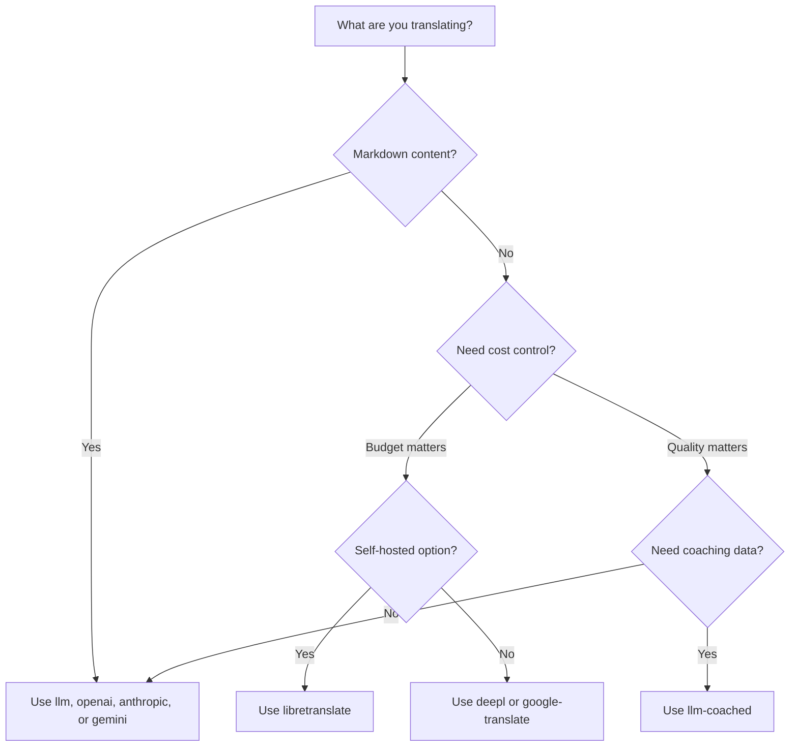

# Mga Translation Method

Sinusuportahan po ng Rosetta ang sampung translation methods. Pwedeng gumamit ng magkakaibang method ang bawat language pair — hindi po kayo locked-in sa iisang approach para sa buong project ninyo.

## Pagkukumpara ng mga Method

### Mga LLM Provider

Quality-focused, Markdown-aware, at coaching-compatible. Best po ito para sa mga content-heavy na projects.

| Method | Key | Ano ang Ginagawa Nito |
|--------|-----|-------------|
| `llm` (default) | `OPENROUTER_API_KEY` | LLM via OpenRouter — 200+ models, auto-routing |
| `llm-coached` | `OPENROUTER_API_KEY` | LLM + grammar rules, dictionaries, style notes |
| `openai` | `OPENAI_API_KEY` | Direct OpenAI API (gpt-4o, gpt-4o-mini) |
| `anthropic` | `ANTHROPIC_API_KEY` | Direct Anthropic API (Claude Sonnet, Haiku, Opus) |
| `gemini` | `GEMINI_API_KEY` | Direct Google Gemini API (Flash, Pro) — free tier |

### Traditional MT

Speed at cost-focused. Best po ito para sa high-volume na key-value pairs.

| Method | Key | Ano ang Ginagawa Nito |
|--------|-----|-------------|
| `google-translate` | `GOOGLE_TRANSLATE_API_KEY` | Google Cloud Translation API v2 (130+ languages) |
| `deepl` | `DEEPL_API_KEY` | DeepL API na may glossary support (30+ languages) |
| `microsoft-translator` | `MICROSOFT_TRANSLATOR_API_KEY` | Azure Cognitive Services Translator (100+ languages) |
| `libretranslate` | *(self-hosted)* | Self-hosted na LibreTranslate (AGPL, libre) |

### Infrastructure

| Method | Key | Ano ang Ginagawa Nito |
|--------|-----|-------------|
| `api` | *(per provider)* | Thin HTTP client para sa kahit anong REST translation endpoint |

## Decision Tree



---

## `llm` — LLM Translation (Default)

Nagta-translate via kahit anong LLM sa [OpenRouter](https://openrouter.ai). Ito po ang default method at ang pinaka-versatile.

**Paano ito gumagana:**
1. Nagba-batch ng mga keys (default ay 30/batch) kasama ang register at context instructions
2. Ipinapadala sa OpenRouter bilang isang structured prompt
3. Pina-parse ang JSON response
4. Vina-validate ang bawat translation gamit ang [quality gate](/docs/concepts/quality-gate)
5. Isinusulat ang mga pumasa na translations, nagre-retry o nire-reject ang mga nag-fail

**Kailan ito gagamitin:** Sa karamihan ng mga projects. Lalo na sa mga content-heavy sites na may Markdown, kung saan kailangang ma-shield ang mga code blocks at shortcodes.

**Configuration:**

```json
{
  "defaultMethod": "llm",
  "model": "google/gemini-3.5-flash"
}
```

## `llm-coached` — Coached LLM Translation

Kapareho po ng `llm`, pero may grammar rules, term dictionaries, at style notes na naka-inject sa bawat prompt.

**Paano ito gumagana:**
1. Naglo-load ng coaching data mula sa `.rosetta/coaching/<locale>.json` o sa `coaching/` directory ng isang plugin
2. Nag-i-inject ng grammar rules, dictionary terms, at style notes sa system prompt
3. Isinasama ang mga dictionary terms na nagma-match sa source keys bilang required terminology
4. Nagpapatuloy ang translation katulad ng sa `llm`, kung saan nagdadagdag ng precision ang coaching data

**Kailan ito gagamitin:** Para sa mga low-resource languages, domain-specific terminology (legal, medical), formal registers, o kahit anong case kung saan hindi sapat ang precision ng generic LLM output.

**Format ng coaching data:**

```json title=".rosetta/coaching/fr.json"
{
  "grammar_rules": [
    "French adjectives agree in gender and number with the noun they modify",
    "Use 'vous' for formal contexts, 'tu' for informal"
  ],
  "dictionary": {
    "dashboard": "tableau de bord",
    "deployment": "déploiement",
    "settings": "paramètres"
  },
  "style_notes": "Prefer active voice. Avoid anglicisms where a native French term exists."
}
```

Tingnan din po ang: [Low-Resource Languages Guide](https://mtevalarena.org/docs/community/low-resource-languages)

---

## `openai` — Direct OpenAI API

Nagta-translate nang direkta via OpenAI Chat Completions API. Walang OpenRouter na middleman — inyong key, inyong account, inyong usage dashboard po ang gagamitin.

**Mga Model:** `gpt-4o` (default), `gpt-4o-mini`

**Mga Feature:**
- ✅ Markdown-aware (content translation)
- ✅ Coaching support (grammar rules, dictionary overrides, style notes)
- ✅ JSON mode para sa structured key-value output
- ✅ Exponential backoff na may retry

**Configuration:**

```json
{
  "pairs": {
    "en:fr": { "method": "openai", "model": "gpt-4o-mini" }
  }
}
```

```bash
export OPENAI_API_KEY=sk-proj-...
```

Kunin po ang inyong key sa [platform.openai.com/api-keys](https://platform.openai.com/api-keys).

## `anthropic` — Direct Anthropic API

Nagta-translate nang direkta via Anthropic Messages API. Ginagamit ang `system` parameter para sa coaching data, kaya naka-enable ang prompt caching ng Anthropic.

**Mga Model:** `claude-sonnet-4-6` (default), `claude-haiku-4-5`, `claude-opus-4-7`

**Mga Feature:**
- ✅ Markdown-aware (content translation)
- ✅ Coaching support (grammar rules, dictionary overrides, style notes)
- ✅ System prompt caching (ina-amortize ang coaching cost across batches)
- ✅ Exponential backoff na may retry

**Configuration:**

```json
{
  "pairs": {
    "en:ja": { "method": "anthropic", "model": "claude-haiku-4-5" }
  }
}
```

```bash
export ANTHROPIC_API_KEY=sk-ant-...
```

Kunin po ang inyong key sa [console.anthropic.com](https://console.anthropic.com/settings/keys).

## `gemini` — Direct Google Gemini API

Nagta-translate nang direkta via Google Gemini `generateContent` API. **May free tier na available** — ang pinaka-best na zero-cost starting point.

**Mga Model:** `gemini-2.5-flash` (default), `gemini-2.5-pro`

**Mga Feature:**
- ✅ Markdown-aware (content translation)
- ✅ Coaching support (grammar rules, dictionary overrides, style notes)
- ✅ JSON response mode via `responseMimeType`
- ✅ Free tier (malaking daily quota)
- ✅ Exponential backoff na may retry

**Configuration:**

```json
{
  "pairs": {
    "en:ko": { "method": "gemini", "model": "gemini-2.5-pro" }
  }
}
```

```bash
export GEMINI_API_KEY=AI...
```

Kunin po ang inyong key sa [aistudio.google.com/apikey](https://aistudio.google.com/apikey).

### Model Validation

Vina-validate ng mga direct LLM providers (`openai`, `anthropic`, `gemini`) ang inyong model string sa unang paggamit. Naka-catch po nito ang tatlong categories ng pagkakamali:

**Maling method format** — Paggamit ng OpenRouter-style na model path sa isang direct provider:

```
[WARN] OpenAI: model "google/gemini-3.5-flash" looks like an OpenRouter path.
       Direct providers use bare model names (e.g., "gpt-4o").
       To use OpenRouter models, set method to 'llm' instead.
```

**Maling provider** — Paggamit ng model mula sa ibang provider:

```
[WARN] Gemini: model "claude-sonnet-4-6" is an Anthropic model.
       This provider (gemini) cannot serve Anthropic models.
       Use --method anthropic or set "method": "anthropic" in config.
```

**Deprecated o misspelled na model** — Sa unang API call, kukunin ng rosetta ang live model list ng provider at iche-check ang inyong model laban dito:

```
[WARN] Gemini: model "gemini-1.5-flash" not found in available models.
       Similar models: gemini-2.0-flash, gemini-2.5-flash, gemini-2.5-pro
       The API call will proceed — the provider will give the final verdict.
```

:::note Mga warning po ito, hindi errors
Nalo-log ng model validation ang mga warnings pero hindi nito bina-block ang API call. Ang provider API pa rin ang magbibigay ng final verdict — pwedeng mag-match ang isang future model name sa ibang pattern, at ayaw po nating mag-gate base sa heuristics.
:::

---

## `google-translate` — Google Cloud Translation API

Direct integration sa Google Cloud Translation API v2. Ginagamit ang REST API — walang SDK, walang service account. API key lang po.

**Kailan ito gagamitin:** Para sa high-volume na key-value string pairs kung saan mas mahalaga ang speed at cost kaysa sa nuance. Sinusuportahan nito ang 130+ languages out of the box.

**Mga Limitasyon:**
- ⚠️ **Walang Markdown awareness.** Mako-corrupt po nito ang mga code blocks, shortcodes, at interpolation variables.
- Walang register/tone control
- Walang coaching o terminology enforcement

```bash
npx i18n-rosetta sync --method google-translate
```

:::tip Auto-detection
Kung `GOOGLE_TRANSLATE_API_KEY` lang ang naka-set (walang OpenRouter key), mag-o-auto-switch po ang rosetta sa Google Translate. Walang kailangang baguhin sa config.
:::

## `deepl` — DeepL API

Direct integration sa DeepL translation API. Sinusuportahan nito ang mga glossaries para sa consistent na terminology.

**Kailan ito gagamitin:** Para sa mga European languages kung saan magaling ang DeepL (German, French, Spanish, Dutch, Polish, atbp.). Ang glossary support ay nag-e-enforce ng consistent terminology kahit walang coaching data.

**Mga Feature:**
- ✅ Automatic free/pro endpoint detection (`:fx` suffix sa mga free keys)
- ✅ Glossary creation at management
- ✅ Formality level control
- ⚠️ **Walang Markdown awareness** — key-value pairs lang

**Configuration:**

```json
{
  "pairs": {
    "en:de": { "method": "deepl" }
  }
}
```

```bash
export DEEPL_API_KEY=your-key-here
```

Kunin po ang inyong key sa [deepl.com/pro-api](https://www.deepl.com/pro-api).

## `microsoft-translator` — Azure Cognitive Services

Direct integration sa Microsoft Translator Text API v3.

**Kailan ito gagamitin:** Sa mga enterprise environments na may existing Azure infrastructure. Sinusuportahan nito ang 100+ languages kasama ang marami na hindi covered ng Google Translate.

**Mga Feature:**
- ✅ Hanggang 100 segments per request (high throughput)
- ✅ Optional na region parameter para sa latency optimization
- ⚠️ **Walang Markdown awareness** — key-value pairs lang
- ⚠️ **Walang content translation** — key-value pairs lang

**Configuration:**

```json
{
  "pairs": {
    "en:ar": { "method": "microsoft-translator" }
  }
}
```

```bash
export MICROSOFT_TRANSLATOR_API_KEY=your-key
export MICROSOFT_TRANSLATOR_REGION=global  # optional
```

Kunin po ang inyong key mula sa [Azure Portal](https://portal.azure.com) → Cognitive Services → Translator.

## `libretranslate` — Self-Hosted Translation

Self-hosted na open-source translation gamit ang LibreTranslate. Tumatakbo nang locally o sa inyong sariling infrastructure — zero API costs, at may full data sovereignty po kayo.

**Kailan ito gagamitin:** Para sa mga projects na kailangan ng offline translation, data privacy compliance (GDPR), o zero-cost operation. Lalo na pong kapaki-pakinabang ito para sa mga CI pipelines na hindi dapat dumedepende sa mga external APIs.

**Mga Feature:**
- ✅ Self-hosted — walang external API calls
- ✅ Libre at open source (AGPL-3.0)
- ✅ May Docker deployment na available
- ⚠️ **Walang Markdown awareness** — key-value pairs lang
- ⚠️ **Walang content translation** — key-value pairs lang
- ⚠️ Nag-iiba ang quality depende sa language pair

**Setup:**

```bash
# Run LibreTranslate locally with Docker
docker run -d -p 5000:5000 libretranslate/libretranslate

# Configure (optional — defaults to localhost:5000)
export LIBRETRANSLATE_API_URL=http://localhost:5000/translate
```

```json
{
  "pairs": {
    "en:es": { "method": "libretranslate" }
  }
}
```

---

## `api` — Remote Translation API

Isang thin HTTP client para sa mga community-hosted o IP-protected na translation endpoints. Nagpapadala po ang Rosetta ng mga keys at tumatanggap ng mga translations pabalik — wala itong kahit anong translation logic.

**Kailan ito gagamitin:** Kapag ang mga translation methods ay naka-host sa server-side (hal., proprietary coaching data, fine-tuned models, FST pipelines na hindi pwedeng i-distribute).

```json
{
  "pairs": {
    "en:crk": {
      "method": "api",
      "endpoint": "https://api.example.com/v1/translate",
      "apiKey": "your-key"
    }
  }
}
```

:::note OCAP-Compatible Community Translation
Ang `api` method po ang nagsisilbing tulay para sa **OCAP-compatible community-hosted translation**. Pwedeng i-host ng mga Indigenous at minority-language communities ang sarili nilang translation endpoints — para manatili ang coaching data, fine-tuned models, at linguistic IP sa ilalim ng community control — habang kumokonekta ang Rosetta sa kanila bilang isang thin client.

Tingnan po ang [Support a Low-Resource Language](https://mtevalarena.org/docs/community/low-resource-languages) para sa buong community-hosting walkthrough, at ang [Serving a Method via API](/docs/guides/serving-a-method) para sa mga endpoint requirements.
:::

---

## Per-Pair Configuration

Ang tunay na power po nito ay ang pag-mix ng mga methods per language pair:

```json title="i18n-rosetta.config.json"
{
  "version": 3,
  "pairs": {
    "en:fr": { "method": "deepl" },
    "en:ja": { "method": "openai", "model": "gpt-4o" },
    "en:ko": { "method": "gemini" },
    "en:ar": { "method": "microsoft-translator" },
    "en:crk": { "methodPlugin": "crk-coached-v1" }
  }
}
```

Nagta-translate po ito ng French via DeepL (glossary support), Japanese via OpenAI (quality), Korean via Gemini (free tier), Arabic via Microsoft Translator (coverage), at Plains Cree via isang coached plugin (specialized).

## Mga Plugin

Ang mga plugins ay mga pre-packaged na translation recipes para sa mga specific na language pairs. JSON manifests po ang mga ito — hindi code — na nagsasabi sa rosetta kung anong method ang gagamitin, anong settings, at anong quality ang na-benchmark na.

:::tip Mula eval harness hanggang production sa isang command
Ang mga plugins na na-develop at na-prove na sa [eval harness](https://mtevalarena.org/docs/specifications/harness) ay pwedeng i-install nang direkta — ang method na vina-validate ninyo doon ay madi-deploy dito gamit ang isang `plugin install` command. Tingnan po ang [MT Evaluation](https://mtevalarena.org/docs/leaderboard/rules) para sa buong evaluation workflow.
:::

```bash
i18n-rosetta plugin install ./french-formal-v1/
i18n-rosetta plugin list
i18n-rosetta plugin remove french-formal-v1
```

Tingnan po ang [Plugin Specification](/docs/reference/plugin-spec) para sa buong manifest format.

---

## Pag-switch ng mga Provider

Lilipat po ba sa ibang methods? Magbabago ang model format at env var — heto po ang map:

### OpenRouter → Direct Provider

```diff title="i18n-rosetta.config.json"
 {
   "pairs": {
     "en:fr": {
-      "method": "llm",
-      "model": "openai/gpt-4o"
+      "method": "openai",
+      "model": "gpt-4o"
     }
   }
 }
```

```diff title="Environment variables"
- export OPENROUTER_API_KEY=sk-or-v1-...
+ export OPENAI_API_KEY=sk-proj-...
```

**Mga pangunahing pagkakaiba:**
- Gumagamit ang OpenRouter ng `provider/model` format (hal., `openai/gpt-4o`). Gumagamit ang mga direct providers ng bare model names (hal., `gpt-4o`).
- Bawat direct provider ay may sariling env var (`OPENAI_API_KEY`, `ANTHROPIC_API_KEY`, `GEMINI_API_KEY`).
- Kung maling model format ang gagamitin ninyo, magwa-warn po ang rosetta sa inyo — tingnan ang [Model Validation](#model-validation).

### Direct Provider → OpenRouter

```diff title="i18n-rosetta.config.json"
 {
   "pairs": {
     "en:ja": {
-      "method": "anthropic",
-      "model": "claude-sonnet-4-6"
+      "method": "llm",
+      "model": "anthropic/claude-sonnet-4-6"
     }
   }
 }
```

:::tip Kailan gagamitin ang OpenRouter vs Direct
**Gamitin ang OpenRouter** kung gusto ninyong mag-switch ng mga models nang hindi nagpapalit ng env vars, o kung gusto ninyo ng access sa 200+ models gamit ang iisang key. **Gamitin ang mga direct providers** kung gusto ninyo ng mas simpleng billing, lower latency (walang middleman), o access sa mga provider-specific features tulad ng prompt caching ng Anthropic.
:::

---

## Pagkukumpara ng Cost

Approximate na cost per 1,000 translated keys (ina-assume na ~10 tokens per key, 30 keys per batch):

| Method | Cost / 1K Keys | Speed | Quality | Best Para Sa |
|--------|----------------|-------|---------|----------|
| `gemini` (Flash) | **Libre** (within tier) | Fast | Good | Getting started, personal projects |
| `google-translate` | ~$0.02 | Fastest | Adequate | High-volume, European languages |
| `deepl` | ~$0.02 | Fast | Good | European languages, terminology |
| `microsoft-translator` | ~$0.01 | Fast | Adequate | Azure shops, broad language coverage |
| `libretranslate` | **Libre** (self-hosted) | Varies | Fair | Air-gapped, GDPR, CI pipelines |
| `gemini` (Pro) | ~$0.07 | Medium | Very good | Quality-sensitive, free quota |
| `openai` (GPT-4o-mini) | ~$0.01 | Fast | Good | Budget LLM |
| `openai` (GPT-4o) | ~$0.10 | Medium | Very good | Quality-sensitive |
| `anthropic` (Haiku) | ~$0.01 | Fast | Good | Budget LLM |
| `anthropic` (Sonnet) | ~$0.10 | Medium | Very good | Quality-sensitive |
| `anthropic` (Opus) | ~$0.50 | Slow | Excellent | Maximum quality |
| `llm` (OpenRouter) | Varies by model | Varies | Varies | Model comparison, experimentation |

:::note Mga estimates po ito
Nakadepende ang actual costs sa haba ng inyong source text, batch size, at mga pagbabago sa pricing ng provider. I-check po ang current pricing page ng bawat provider para sa mga eksaktong rates.
:::

---

## Tingnan Din

- [Supported Languages](/docs/reference/supported-languages)
- [Coaching Data](/docs/concepts/coaching-data)
- [Support a Low-Resource Language](https://mtevalarena.org/docs/community/low-resource-languages)
- [Plugin Specification](/docs/reference/plugin-spec)
- [Serving a Method via API](/docs/guides/serving-a-method)
- [Quality Gate](/docs/concepts/quality-gate)
- [Architecture](/docs/concepts/architecture)
- [Troubleshooting](/docs/guides/troubleshooting) — model errors, API issues