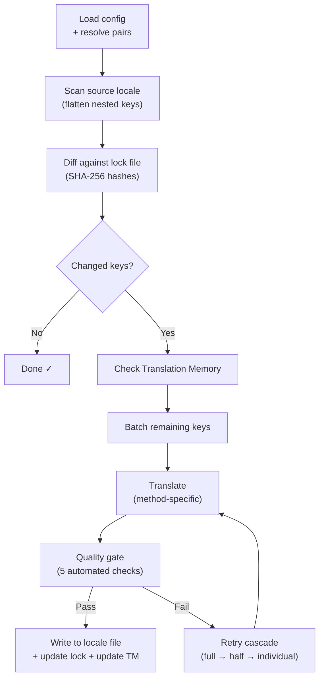

# Paano Gumagana ang i18n-rosetta

Tinatranslate ng i18n-rosetta ang locale files ng inyong app gamit ang isang command. Heto po ang nangyayari under the hood.

## Ang Pipeline

Kapag ni-run niyo po ang `npx i18n-rosetta sync`, nag-eexecute ang rosetta ng six-stage pipeline:



**Mga key design decisions:**

- **Change detection via SHA-256 hashes.** Tinu-track ng rosetta ang bawat source value gamit ang hash sa `.i18n-rosetta.lock`. Kapag nag-update kayo ng English string, yung key lang na iyon ang ire-translate. Ito po ang dahilan kung bakit mabilis ang `sync` sa mga repeat runs — minimal work lang ang ginagawa nito.

- **Translation Memory caching.** Bago gumawa ng anumang API call, chine-check ng rosetta ang `.rosetta/tm.json` para sa mga cached translations (naka-key by source text + locale + method). Sa isang typical na re-sync pagkatapos magpalit ng isang key, 142 keys ang manggagaling sa cache at 1 key lang ang maghi-hit sa API.

- **Quality gate before write.** Dumadaan ang bawat translation sa five automated checks (empty, source echo, hallucination loop, length inflation, script compliance) bago nito galawin ang inyong files. Nila-log ang mga failures, at hindi ito kailanman tahimik na ina-accept.

- **Retry cascade on failure.** Kung mag-fail ang isang batch (JSON parse error, API timeout), magre-retry ang rosetta gamit ang progressively smaller batches: full → half → individual. Nai-isolate nito ang problem key nang hindi bina-block ang iba.

## Mga Translation Methods

Sinu-support ng rosetta ang four translation methods, kung saan ang bawat isa ay suitable para sa iba't ibang scenarios:

| Method | Paano ito gumagana | Best for |
|--------|-------------|----------|
| **`llm`** | Structured prompt sa kahit anong OpenRouter model | Mga well-resourced languages |
| **`llm-coached`** | Same prompt + grammar rules, dictionary, at style notes | Mga languages kung saan gumagawa ng predictable errors ang mga LLMs |
| **`google-translate`** | Google Cloud Translation API batch request | Mga high-resource languages na may magandang GT support |
| **`api`** | HTTP POST sa inyong sariling endpoint | Mga custom pipelines, community-controlled models |

Naka-configure ang mga methods per language pair. Pwede niyo pong gamitin ang `google-translate` para sa French pero `llm-coached` para sa Plains Cree — nakukuha ng bawat pair ang method na pinaka-best na gumagana para dito.

## Coaching Data

Para sa mga `llm-coached` pairs, nagbibigay ang coaching data sa LLM ng explicit linguistic knowledge: grammar rules, forced terminology, at style preferences. Naka-inject po ito sa bawat prompt bilang structured context.

```json title="coaching/crk.json"
{
  "grammar_rules": ["Animate nouns take different plural forms than inanimate nouns"],
  "dictionary": {"welcome": "ᑕᓂᓯ", "settings": "ᐃᑕᐢᑌᐘᐃᓇ"},
  "style_notes": "Use Standard Roman Orthography (SRO) unless explicitly configured otherwise."
}
```

Ang coaching data ang primary mechanism para ma-improve ang translation quality nang hindi nagfa-fine-tune ng model. Palitan ang rules → i-re-run ang sync → tingnan kung nakatulong ito. Instant lang po ang iteration.

## Mga Plugins

Ang mga plugins ay mga pre-packaged translation recipes para sa mga specific language pairs. Sila ay mga JSON manifests — hindi code — na nagsasabi sa rosetta kung aling method ang gagamitin, anong settings, at anong quality ang na-benchmark.

```bash
i18n-rosetta plugin install ./crk-coached-v3/
i18n-rosetta sync   # uses the installed plugin for en→crk
```

Bini-bridge ng mga plugins ang gap sa pagitan ng research at production: ang isang method na nag-score nang maganda sa [MT Eval Arena](https://mtevalarena.org) ay pwedeng i-package bilang plugin at i-deploy dito.

## Ang Bigger Picture

Ang i18n-rosetta ay kalahati ng isang two-part ecosystem:

- **[MT Eval Arena](https://mtevalarena.org)** — kung saan ang mga translation methods ay **dine-develop at pinu-prove** gamit ang reproducible benchmarking
- **i18n-rosetta** — kung saan ang mga proven methods ay **dine-deploy** para mag-translate ng real content

Kino-connect ng [Eval Harness Bridge](/docs/guides/bridge) ang dalawa. Ang isang method na nag-prove ng sarili nito sa Arena ay idi-deploy dito. Ang speaker feedback mula sa production ay nag-iimprove sa next version.

---

## Dive Deeper

- [Paano Gumagana ang Sync](/docs/concepts/how-sync-works) — detailed step-by-step pipeline walkthrough
- [Quality Gate](/docs/concepts/quality-gate) — ang five automated checks
- [Translation Memory](/docs/concepts/translation-memory) — caching at cost savings
- [Mga Translation Methods](/docs/guides/translation-methods) — detailed method comparison
- [Architecture](/docs/concepts/architecture) — system design overview