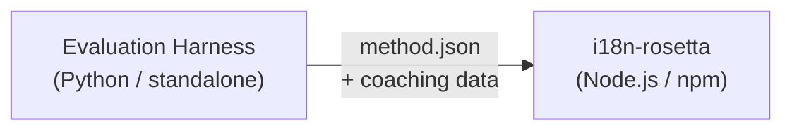

# Method Plugin Specification

> **Version**: 1.1  
> **Audience**: Mga plugin developer  
> **Canonical Schema**: [`schemas/rosetta-plugin.schema.json`](https://github.com/gamedaysuits/i18n-rosetta/blob/main/schemas/rosetta-plugin.schema.json)

## Overview

Gumagamit ang i18n-rosetta ng isang **pluggable method system**. Bawat language pair ay pwedeng gumamit ng iba't ibang translation method (LLM, coached, script-converter, atbp.). Naka-register ang mga method sa `lib/translate.js` at nire-resolve per-pair via `lib/pairs.js`.

Ang trabaho ng eval harness ay mag-**develop, mag-test, at mag-export** ng mga translation method. Ang trabaho naman po ng i18n-rosetta ay mag-**consume at mag-execute** ng mga ito. Hindi kailanman nagra-run ang harness sa loob ng rosetta.

### Data Flow



---

## Format ng Method Plugin

Ang method plugin ay isang solong JSON file (`method.json`) na may mga optional na coaching data file.

### `method.json` — Required

```json
{
  "name": "french-formal-v1",
  "type": "llm-coached",
  "version": "1.0.0",
  "description": "Formally-tuned French with terminology enforcement and grammar coaching",
  "author": "Plugin Author",

  "config": {
    "model": "google/gemini-3.5-flash",
    "register": "formal",
    "batchSize": 30,
    "temperature": 0.2
  },

  "locales": ["fr"],

  "benchmarks": {
    "fr": {
      "date": "2026-05-11T00:00:00Z",
      "corpus_size": 500,
      "exact_match_rate": 0.42,
      "corpus_chrf": 72.3,
      "corpus_bleu": 45.1,
      "model": "google/gemini-3.5-flash",
      "harness_version": "1.0.0"
    }
  },

  "provenance": {
    "resources": [],
    "commercialReady": false,
    "flags": ["license-unclear"]
  },

  "coaching": {
    "dir": "coaching"
  }
}
```

### Field Reference

| Field | Type | Required | Description |
|-------|------|----------|-------------|
| `name` | string | ✅ | Unique na method identifier (kebab-case) |
| `type` | string | ✅ | Rosetta method type: `llm`, `llm-coached`, `api`, `google-translate`, `deepl`, `microsoft-translator`, `libretranslate`, `openai`, `anthropic`, `gemini` |
| `version` | string | ✅ | Semver version (hal. `1.0.0`) |
| `locales` | string[] | ✅ | Kung aling mga locale code ang tina-target ng method na ito (minimum 1) |
| `description` | string | — | Human-readable na description |
| `author` | string | — | Kung sino ang nag-develop/nag-test ng method na ito |
| `config.model` | string | — | OpenRouter model identifier |
| `config.register` | string | — | Register/tone ng target language |
| `config.batchSize` | number | — | Keys per API batch (1–200, default: 30) |
| `config.temperature` | number | — | LLM temperature (0.0–2.0, default: 0.3) |
| `benchmarks` | object | — | Per-locale na benchmark results |
| `provenance` | object | — | Licensing at resource dependencies |
| `coaching.dir` | string | — | Relative path papunta sa coaching data directory |

### Benchmark Object (per locale)

| Field | Type | Required | Description |
|-------|------|----------|-------------|
| `date` | string | ✅ | ISO 8601 timestamp ng benchmark run |
| `corpus_size` | number | ✅ | Bilang ng mga in-evaluate na entry |
| `exact_match_rate` | number | ✅ | 0.0–1.0, proportion ng exact matches |
| `corpus_chrf` | number | — | chrF++ score (0–100) |
| `corpus_bleu` | number | — | BLEU score (0–100) |
| `model` | string | ✅ | Model na ginamit during eval |
| `harness_version` | string | ✅ | Version ng evaluation harness na ginamit |

:::info Aling mga metric ang idi-display?
Idi-display ng `rosetta status` command ang **chrF++** at **exact match rate** mula sa benchmark block. Tinatanggap ang `corpus_bleu` sa manifest pero hindi po ito kasalukuyang naka-display o ginagamit ng kahit anong rosetta command. Tina-track ng [Method Leaderboard](/leaderboard) ang chrF++, exact match, at FST acceptance rate.
:::

---

### Provenance Object

Kino-communicate ng provenance block ang licensing status ng mga bundled resource ng plugin.

| Field | Type | Default | Description |
|-------|------|---------|-------------|
| `resources` | object[] | `[]` | Listahan ng mga bundled resource na may `name`, `license`, at `type` |
| `commercialReady` | boolean | `false` | Kung cleared ba ang plugin para sa commercial distribution |
| `flags` | string[] | `["license-unclear"]` | Machine-readable na status flags |

**Default state** — ang mga exported plugin ay nagshi-ship nang may `commercialReady: false` at `flags: ["license-unclear"]`.

**Cleared state** — kapag na-verify na ang licensing: i-set ang `commercialReady: true` at i-clear ang mga flag.

---

## Format ng Coaching Data

Kung ang `type` ay `llm-coached`, dapat isama ng plugin ang mga coaching data file sa `coaching/` subdirectory.

### `coaching/<locale>.json`

```json
{
  "grammar_rules": [
    "French adjectives agree in gender and number with the noun they modify",
    "Use 'vous' for formal contexts, 'tu' for informal"
  ],
  "dictionary": {
    "dashboard": "tableau de bord",
    "deployment": "déploiement",
    "settings": "paramètres"
  },
  "style_notes": "Prefer active voice. Avoid anglicisms where a native French term exists."
}
```

| Field | Type | Required | Description |
|-------|------|----------|-------------|
| `grammar_rules` | string[] | — | Mga rule na ini-inject sa bawat LLM prompt para sa locale na ito |
| `dictionary` | object | — | Term → translation map. Ang mga nag-match na term ay ini-inject bilang required terminology. |
| `style_notes` | string | — | Mga freeform style instruction na naka-append sa prompt |

---

## Directory Structure

```
french-formal-v1/
  method.json                 # Method manifest with benchmarks
  coaching/
    fr.json                   # Coaching data for French
```

Para sa mga multi-locale method:

```
european-formal-v2/
  method.json                 # locales: ["fr", "de", "es", "it"]
  coaching/
    fr.json
    de.json
    es.json
    it.json
```

---

## Paano Kino-consume ng Rosetta ang mga Plugin

### Installation

```bash
i18n-rosetta plugin install ./french-formal-v1/
```

Nase-save sa `.rosetta/methods/french-formal-v1/`.

### Configuration

```json title="i18n-rosetta.config.json"
{
  "pairs": {
    "en:fr": {
      "methodPlugin": "french-formal-v1"
    }
  }
}
```

:::info Merge semantics
Ang plugin ang nagde-define kung *anong* method ang gagamitin (`type`). Ang pair config naman ang nagtu-tune kung *paano* ito ira-run (`model`, `register`, `batchSize`). Kung magse-set ang pair ng `model`, ino-override nito ang default ng plugin.
:::

### Runtime

1. Binabasa ng Rosetta ang `method.json` mula sa `.rosetta/methods/french-formal-v1/`
2. Ang `type` field ng plugin ang nagse-set ng translation method (hal., `llm-coached`)
3. Nilo-load nito ang coaching data mula sa `coaching/` directory ng plugin
4. Ginagamit ang `config` block para punan ang mga gap sa model/register/temperature
5. Naka-display ang `benchmarks` block sa `rosetta status` output
6. Tsine-check ng `rosetta provenance` ang `provenance` block para sa mga licensing flag

---

## Schema Validation

Bina-validate ang mga plugin manifest during install time laban sa [`schemas/rosetta-plugin.schema.json`](https://github.com/gamedaysuits/i18n-rosetta/blob/main/schemas/rosetta-plugin.schema.json).

I-reference ang schema sa inyong `method.json` para sa IDE autocompletion:

```json
{
  "$schema": "./node_modules/i18n-rosetta/schemas/rosetta-plugin.schema.json",
  "name": "my-method-v1"
}
```

---

## Mga HINDI Dapat Isama

- ❌ Walang Python code o harness dependencies
- ❌ Walang raw corpus data o run logs
- ❌ Walang mga API key o credentials
- ❌ Walang harness configuration
- ❌ Walang internal prompt templates (nasa method implementations po ng rosetta ang mga iyon)

Ang plugin ay **data only** lamang: configuration, coaching content, at benchmark results.

---

## Tingnan Din

- [Translation Methods](/docs/guides/translation-methods) — kung paano gumagana ang bawat built-in method
- [Configuration](/docs/getting-started/configuration) — per-pair at per-language config
- [Serving a Method via API](/docs/guides/serving-a-method) — pag-host ng mga method bilang HTTP services
- [Cookbook: FST-Gated Pipeline](/docs/tutorials/fst-gated-pipeline) — pag-build at pag-package ng pipeline
- [MT Evaluation](/docs/eval/) — pag-benchmark ng mga method para sa leaderboard submission
- [Support a Low-Resource Language](/docs/guides/low-resource-languages) — ang use case para sa mga community plugin