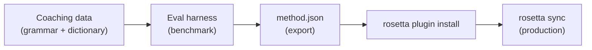

# Tutorial: Bumuo ng Translation Plugin

Bumuo ng custom translation method from scratch, i-benchmark ito, at i-deploy bilang isang rosetta plugin. Ito ang kumpletong workflow para sa pag-add ng bagong language pair na hindi sinusuportahan ng anumang off-the-shelf API.

**Ang bubuuin ninyo:** Isang coached translation plugin para sa formal French na may enforced terminology, grammar rules, at benchmark scores.

**Oras:** 30–45 minutes

**Mga Prerequisites:**
- Naka-install ang i18n-rosetta (`npm install --save-dev i18n-rosetta`)
- Isang OpenRouter API key (`OPENROUTER_API_KEY`)
- Python 3.10+ (para sa eval harness)

---

## Step 1: Tukuyin ang Problema

Nagt-translate po kayo ng isang SaaS dashboard sa French. Ang default na `llm` method ay nagbibigay ng tama pero inconsistent na mga translation:

- Minsan ang "dashboard" ay nagiging "tableau de bord," minsan naman ay "panneau de contrôle"
- Nag-iiba-iba ang tone sa pagitan ng `tu` at `vous` forms
- Ang mga technical terms ay na-a-anglicize nang inconsistent

Kailangan ninyo po ng **terminology enforcement** at **register control** na hindi naibibigay ng generic LLM prompt.

## Step 2: Gumawa ng Coaching Data

Gumawa po ng coaching file na mag-e-encode ng inyong mga linguistic requirements:

```bash
mkdir -p .rosetta/coaching
```

```json title=".rosetta/coaching/fr.json"
{
  "grammar_rules": [
    "Always use the 'vous' form for formal register",
    "French adjectives agree in gender and number with their noun",
    "Use the present tense for UI instructions, not the imperative",
    "Preserve sentence-final punctuation style from the source"
  ],
  "dictionary": {
    "dashboard": "tableau de bord",
    "deployment": "déploiement",
    "settings": "paramètres",
    "environment variable": "variable d'environnement",
    "webhook": "webhook",
    "API key": "clé API",
    "sign in": "se connecter",
    "sign out": "se déconnecter",
    "repository": "dépôt",
    "pull request": "demande de tirage"
  },
  "style_notes": "Formal technical French. Prefer native French terms over anglicisms where established equivalents exist. Keep UI labels concise — 3 words maximum where possible."
}
```

**Ano ang ginagawa ng bawat field:**
- **`grammar_rules`** — Ini-inject sa LLM system prompt bilang mga explicit constraints
- **`dictionary`** — Imina-match sa mga source keys; kapag lumabas ang isang dictionary term, ini-inject ito bilang "required terminology" sa prompt
- **`style_notes`** — Ina-append sa system prompt bilang general style guidance

## Step 3: I-configure ang Pair

Sabihin sa rosetta na gamitin ang `llm-coached` para sa French:

```json title="i18n-rosetta.config.json"
{
  "version": 3,
  "inputLocale": "en",
  "localesDir": "./locales",
  "pairs": {
    "en:fr": {
      "method": "llm-coached",
      "model": "google/gemini-3.5-flash"
    }
  },
  "languages": {
    "fr": {
      "register": "Formal technical French (vous-form)",
      "name": "French"
    }
  }
}
```

## Step 4: I-test Ito

```bash
npx i18n-rosetta sync --dry
```

I-review ang dry-run output. I-check kung:
- ✅ Consistent na ginagamit ang mga dictionary terms ("tableau de bord," hindi "panneau de contrôle")
- ✅ Ginagamit ang `vous` form sa buong translation
- ✅ Nagma-match ang mga technical terms sa inyong dictionary

Pagkatapos ay i-run ang totoong sync:

```bash
npx i18n-rosetta sync
```

## Step 5: I-benchmark gamit ang Eval Harness (Optional)

Kung gusto ninyo po ng quality scores — at siguradong gusto ninyo, dahil ang mga plugins ay nagshi-ship kasama ang benchmark data — gamitin ang companion eval harness.

### I-install ang Harness

```bash
git clone https://github.com/gamedaysuits/gds-mt-eval-harness.git
cd gds-mt-eval-harness
pip install -r requirements.txt
```

### Gumawa ng Reference Corpus

Gumawa ng file na may mga source strings at known-good translations:

```json title="corpus/french-formal.json"
[
  {
    "source": "Dashboard",
    "reference": "Tableau de bord"
  },
  {
    "source": "Sign in to your account",
    "reference": "Connectez-vous à votre compte"
  },
  {
    "source": "Your deployment is ready",
    "reference": "Votre déploiement est prêt"
  },
  {
    "source": "Environment variables",
    "reference": "Variables d'environnement"
  }
]
```

### I-run ang Benchmark

```bash
python harness.py eval \
  --corpus corpus/french-formal.json \
  --source en \
  --target fr \
  --method llm-coached \
  --model google/gemini-3.5-flash
```

Ang output ng harness ay:
- **chrF++** — Character-level F-score (0–100). Ang score na above 70 ay strong.
- **BLEU** — N-gram overlap (0–100). Ang score na above 40 ay solid para sa coached translation.
- **Exact match rate** — Proportion ng mga translations na nagma-match nang eksakto sa reference.

### I-export ang Plugin

Kapag satisfied na po kayo sa mga scores:

```bash
python harness.py export \
  --name french-formal-v1 \
  --output ./french-formal-v1/
```

Gagawa ito ng:

```
french-formal-v1/
├── method.json          # Manifest with config + benchmarks
└── coaching/
    └── fr.json          # Your coaching data
```

## Step 6: I-install ang Plugin sa Rosetta

```bash
npx i18n-rosetta plugin install ./french-formal-v1/
```

Iko-copy nito ang plugin sa `.rosetta/methods/french-formal-v1/`.

I-update ang inyong config para magamit ito:

```json title="i18n-rosetta.config.json"
{
  "pairs": {
    "en:fr": {
      "methodPlugin": "french-formal-v1"
    }
  }
}
```

## Step 7: I-verify

```bash
# Check plugin is installed and shows benchmark scores
npx i18n-rosetta status

# Run a sync with the plugin
npx i18n-rosetta sync

# Audit licensing status
npx i18n-rosetta provenance
```

Ipapakita sa `status` output ang:

```
en → fr
  Method:    french-formal-v1 (llm-coached)
  Model:     google/gemini-3.5-flash
  Quality:   high
  chrF++:    74.2
  BLEU:      46.8
  Exact:     42%
```

## Ano ang Inyong Nabuo



Meron na po kayong:
1. **Coaching data** — Mga grammar rules at terminology na nag-e-enforce ng consistency
2. **Benchmark scores** — Quantified quality na kasamang nagshi-ship sa plugin
3. **Isang portable plugin** — `method.json` + coaching data, na installable sa kahit anong machine
4. **Production deployment** — Integrated sa inyong sync pipeline

## Next Steps

- **[Plugin Specification](/docs/reference/plugin-spec)** — Full manifest format reference
- **[Translation Methods](/docs/guides/translation-methods)** — I-compare ang lahat ng apat na methods
- **[Low-Resource Languages](https://mtevalarena.org/docs/community/low-resource-languages)** — I-apply ang pattern na ito sa mga languages na walang API coverage
- **[Translate 30 Languages](/docs/tutorials/translate-30-languages)** — I-scale ang inyong project para sa global audience