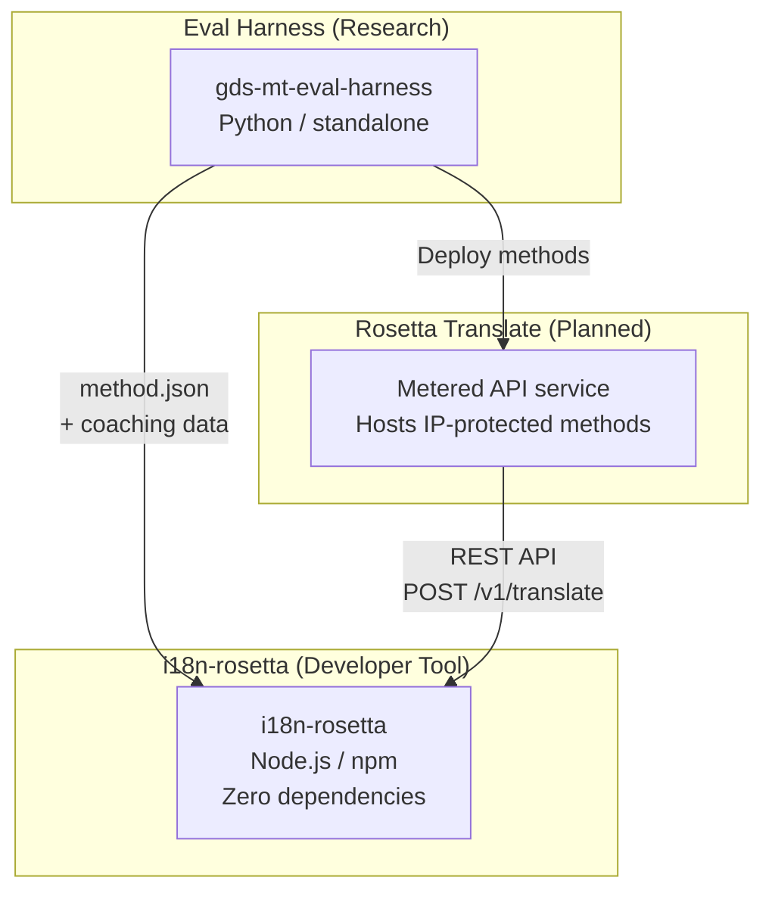
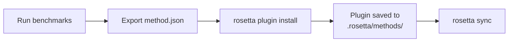
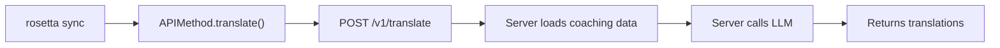

# Architecture

L'écosystème de traduction Rosetta se compose de trois outils indépendants qui fonctionnent ensemble par le biais de contrats bien définis. Aucun d'entre eux ne dépend des autres au moment de la compilation. Ils communiquent via un **format de plugin de méthode** partagé et un **contrat d'API REST**.

## Les trois composants



### i18n-rosetta (ce projet)

L'outil de développement open-source. Il traduit les fichiers de localisation à l'aide de méthodes enfichables. Aucune dépendance, configuration facultative, fonctionne clé en main.

**Méthodes intégrées :**
- `llm` → OpenRouter / tout LLM (plus de 200 modèles)
- `llm-coached` → LLM + encadrement par grammaire/dictionnaire
- `openai` → API OpenAI directe (GPT-4o, GPT-4o-mini)
- `anthropic` → API Anthropic directe (Claude Sonnet, Haiku, Opus)
- `gemini` → API Google Gemini directe (Flash, Pro — niveau gratuit disponible)
- `google-translate` → Google Cloud Translation API v2
- `deepl` → API DeepL avec prise en charge des glossaires
- `microsoft-translator` → Azure Cognitive Services Translator
- `libretranslate` → LibreTranslate auto-hébergé (AGPL, gratuit)
- `api` → Canal léger vers tout point de terminaison REST distant

### Eval Harness (projet compagnon)

Un outil de recherche pour développer, tester et évaluer les performances des méthodes de traduction. Lorsqu'une méthode atteint une qualité acceptable, le banc d'essai (harness) exporte un **plugin de méthode** — un manifeste `method.json` et des fichiers de données d'encadrement facultatifs.

Le banc d'essai ne s'exécute jamais à l'intérieur de rosetta. Il s'agit d'un outil distinct qui produit des sorties statiques (fichiers JSON). Rosetta se contente de lire ces fichiers.

[→ Eval Harness sur GitHub](https://github.com/gamedaysuits/gds-mt-eval-harness)

### Rosetta Translate (prévu)

Un service d'API facturé à l'usage qui héberge des méthodes de traduction propriétaires côté serveur — les invites (prompts), les données d'encadrement et les pipelines linguistiques ne quittent jamais le serveur.

## Leurs interconnexions

### Eval Harness → i18n-rosetta (exportation unidirectionnelle)



**Contrat** : [Spécification du plugin](/docs/reference/plugin-spec)

### Rosetta Translate → i18n-rosetta (API à l'exécution)



Le `APIMethod` de Rosetta est un **canal passif**. Il envoie des clés et reçoit des traductions en retour. Il ne contient aucune logique de traduction et aucun contenu propriétaire.

## Ce que chaque composant sait des autres

| Outil | Connaît rosetta ? | Connaît Rosetta Translate ? | Connaît le banc d'essai (harness) ? |
|------|---------------------|-------------------------------|---------------------|
| **i18n-rosetta** | *(est rosetta)* | Oui — la méthode `api` l'appelle | Non — lit uniquement les exportations de plugins |
| **Rosetta Translate** | Oui — traite ses requêtes | *(est Rosetta Translate)* | Non — reçoit les méthodes déployées |
| **Eval Harness** | Oui — exporte le format de plugin | Non — méthodes déployées séparément | *(est le banc d'essai)* |

## Scénarios d'utilisation

### Scénario 1 : Gratuit, sans configuration (la plupart des utilisateurs)

```bash
export OPENROUTER_API_KEY=sk-...
npx i18n-rosetta sync
```

Utilise la méthode `llm` intégrée. Aucun plugin, aucun Rosetta Translate, aucun banc d'essai.

### Scénario 2 : Base de référence Google Translate

```bash
export GOOGLE_TRANSLATE_API_KEY=AIza...
npx i18n-rosetta sync
```

Utilise la méthode `google-translate` intégrée. Aucun plugin nécessaire.

### Scénario 3 : Plugin ouvert avec encadrement inclus

```bash
rosetta plugin install ./french-formal-v1/
rosetta sync
```

Le plugin possède `type: "llm-coached"` → rosetta utilise la propre clé OpenRouter de l'utilisateur. Les données d'encadrement sont locales (aucun appel serveur).

### Scénario 4 : Encadrement sur mesure (aucun plugin, aucun banc d'essai)

```json title="i18n-rosetta.config.json"
{
  "pairs": {
    "en:fr": { "method": "llm-coached" }
  }
}
```

L'utilisateur maintient ses propres règles de grammaire et son dictionnaire dans `.rosetta/coaching/fr.json`.

## Principes de conception

1. **Aucune dépendance circulaire.** Les ponts sont unidirectionnels.
2. **Rosetta est le noyau léger.** Aucune dépendance, configuration facultative. Les plugins et l'API sont additifs.
3. **La protection de la propriété intellectuelle est architecturale.** Les techniques propriétaires restent côté serveur. Le paquet npm ne livre aucun élément propriétaire.
4. **Le format de plugin constitue le contrat.** Tout transite par `method.json`.
5. **Chaque outil a une seule fonction.** Le banc d'essai (Harness) → développe les méthodes. Rosetta Translate → héberge les méthodes. Rosetta → traduit les fichiers.

---

## Voir aussi

- [Méthodes de traduction](/docs/guides/translation-methods) — comment fonctionne chaque méthode intégrée
- [Spécification du plugin](/docs/reference/plugin-spec) — le format du manifeste method.json
- [Eval Harness](/docs/eval/harness) — l'outil de recherche compagnon
- [Servir une méthode via API](/docs/guides/serving-a-method) — héberger des pipelines de traduction personnalisés
- [Prendre en charge une langue à faibles ressources](/docs/guides/low-resource-languages) — le cas d'utilisation qui a motivé cette architecture