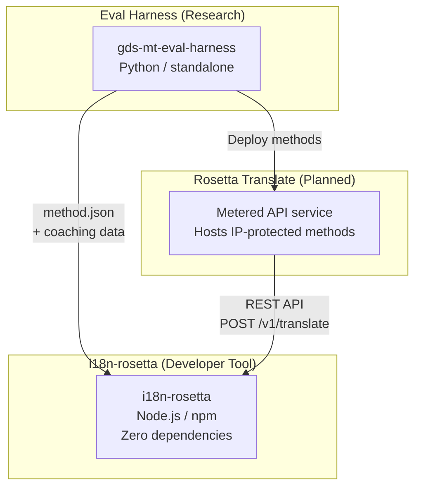
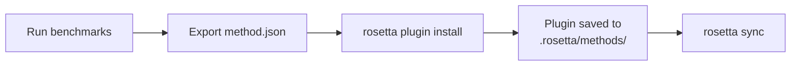
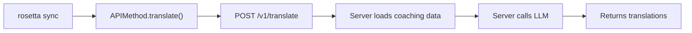

# Architecture

L'écosystème de traduction Rosetta est composé de trois outils indépendants qui fonctionnent ensemble grâce à des contrats bien définis. Aucun d'entre eux ne dépend des autres lors de la compilation. Ils communiquent via un **format de plugin de méthode** partagé et un **contrat d'API REST**.

## Les trois composants



### i18n-rosetta (ce projet)

L'outil de développement open-source. Il traduit les fichiers de localisation en utilisant des méthodes enfichables. Zéro dépendance, configuration facultative, fonctionne prêt à l'emploi.

**Méthodes intégrées :**
- `llm` → OpenRouter / n'importe quel LLM
- `llm-coached` → LLM + coaching grammatical et dictionnaire
- `google-translate` → Google Cloud Translation API
- `api` → Passerelle légère (thin pipe) vers n'importe quelle API distante

### Eval Harness (projet compagnon)

Un outil de recherche pour développer, tester et évaluer les méthodes de traduction. Lorsqu'une méthode atteint une qualité acceptable, le harness exporte un **plugin de méthode** — un manifeste `method.json` et des fichiers de données de coaching facultatifs.

Le harness ne s'exécute jamais à l'intérieur de rosetta. Il s'agit d'un outil séparé qui produit des sorties statiques (fichiers JSON). Rosetta se contente de lire ces fichiers.

[→ Eval Harness sur GitHub](https://github.com/gamedaysuits/gds-mt-eval-harness)

### Rosetta Translate (prévu)

Un service d'API facturé à l'usage qui héberge des méthodes de traduction propriétaires côté serveur — les prompts, les données de coaching et les pipelines linguistiques ne quittent jamais le serveur.

## Comment ils se connectent

### Eval Harness → i18n-rosetta (exportation unidirectionnelle)



**Contrat** : [Spécification du plugin](/docs/reference/plugin-spec)

### Rosetta Translate → i18n-rosetta (API à l'exécution)



Le `APIMethod` de Rosetta est un **canal passif** (dumb pipe). Il envoie des clés et reçoit des traductions en retour. Il ne contient aucune logique de traduction et aucun contenu propriétaire.

## Ce que chaque composant sait des autres

| Outil | Connaît rosetta ? | Connaît Rosetta Translate ? | Connaît le harness ? |
|------|---------------------|-------------------------------|---------------------|
| **i18n-rosetta** | *(est rosetta)* | Oui — la méthode `api` l'appelle | Non — lit simplement les exportations de plugins |
| **Rosetta Translate** | Oui — sert ses requêtes | *(est Rosetta Translate)* | Non — reçoit les méthodes déployées |
| **Eval Harness** | Oui — exporte le format de plugin | Non — méthodes déployées séparément | *(est le harness)* |

## Scénarios d'utilisation

### Scénario 1 : Gratuit, sans configuration (la plupart des utilisateur·rice·s)

```bash
export OPENROUTER_API_KEY=sk-...
npx i18n-rosetta sync
```

Utilise la méthode `llm` intégrée. Aucun plugin, aucun Rosetta Translate, aucun harness.

### Scénario 2 : Base de référence Google Translate

```bash
export GOOGLE_TRANSLATE_API_KEY=AIza...
npx i18n-rosetta sync
```

Utilise la méthode `google-translate` intégrée. Aucun plugin nécessaire.

### Scénario 3 : Plugin ouvert avec coaching intégré

```bash
rosetta plugin install ./french-formal-v1/
rosetta sync
```

Le plugin possède `type: "llm-coached"` → rosetta utilise la propre clé OpenRouter de l'utilisateur·rice. Les données de coaching sont locales (aucun appel serveur).

### Scénario 4 : Coaching DIY (aucun plugin, aucun harness)

```json title="i18n-rosetta.config.json"
{
  "pairs": {
    "en:fr": { "method": "llm-coached" }
  }
}
```

L'utilisateur·rice maintient ses propres règles de grammaire et son dictionnaire dans `.rosetta/coaching/fr.json`.

## Principes de conception

1. **Aucune dépendance circulaire.** Les ponts sont unidirectionnels.
2. **Rosetta est le cœur léger.** Zéro dépendance, configuration facultative. Les plugins et l'API sont additifs.
3. **La protection de la propriété intellectuelle est architecturale.** Les techniques propriétaires restent côté serveur. Le paquet npm ne livre rien de propriétaire.
4. **Le format de plugin est le contrat.** Tout transite par `method.json`.
5. **Chaque outil a une seule fonction.** Harness → développer des méthodes. Rosetta Translate → héberger des méthodes. Rosetta → traduire des fichiers.