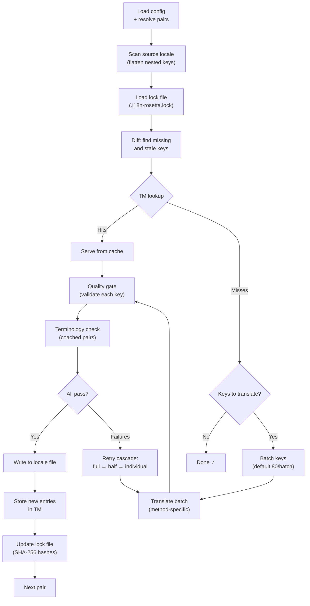

# Fonctionnement de la synchronisation

La commande `sync` est l'opération centrale de rosetta. Voici ce qui se produit lorsque vous exécutez `npx i18n-rosetta sync`.

## Aperçu du pipeline



## Étape par étape

### 1. Résolution de la configuration

Rosetta charge `i18n-rosetta.config.json` (ou détecte automatiquement les paramètres). Il résout :
- La locale source et les locales cibles
- Le graphe des paires (quelles combinaisons source→cible traiter)
- Les paramètres de méthode, de modèle et de qualité par paire

Avant d'analyser les fichiers, rosetta affiche un en-tête de démarrage :

```
i18n-rosetta v3.3.1

[INFO] Detected format: json (auto)
[INFO] Detected framework: Hugo
```

- **Bannière de version** : Affiche la version installée pour le débogage et les rapports d'anomalies.
- **Détection du format** : Indique le format de fichier et s'il a été détecté automatiquement `(auto)` ou configuré explicitement `(config)`. Prend en charge `json`, `toml` et `yaml`.
- **Détection du framework** : Lorsque `contentDir` est défini, identifie le framework (`Hugo`) pour confirmer que la synchronisation du contenu est active.

### 2. Analyse de la source

Le fichier de la locale source est chargé et mis à plat dans un mappage clé→valeur :

```json
// Input (nested)
{ "hero": { "title": "Welcome", "subtitle": "Build" } }

// Flattened
{ "hero.title": "Welcome", "hero.subtitle": "Build" }
```

### 3. Détection des modifications

Rosetta lit `.i18n-rosetta.lock`, qui stocke les hachages SHA-256 des valeurs sources précédemment traduites. Pour chaque clé, il vérifie :

| Condition | Action |
|-----------|--------|
| Clé manquante dans la cible | **Traduire** |
| Le hachage source a changé depuis la dernière synchronisation | **Retraduire** (obsolète) |
| La valeur cible commence par `[EN]` | **Retraduire** (marqueur de repli hérité) |
| Hachage source inchangé, la clé existe | **Ignorer** |

C'est pourquoi rosetta ne traduit que ce qui a changé — il ne retraduit pas l'intégralité de votre fichier à chaque synchronisation.

### 4. Traitement par lots

Les clés sont regroupées en lots (par défaut : 80 clés/lot pour les LLM, 128 pour Google Translate). Le traitement par lots réduit les allers-retours avec l'API tout en conservant des prompts gérables.

Pendant la traduction, rosetta affiche une barre de progression en ligne qui se met à jour après l'achèvement de chaque lot :

```
[INFO] fr.json — 2,847 missing
     ████████████████░░░░░░░░░░░░░░░░ 1,440/2,847 keys
```

La barre s'affiche en utilisant le retour chariot `\r` pour des mises à jour sur place — sans défilement. Elle est masquée dans les modes `--quiet` et `--json`.

### 4b. Mémoire de traduction

Avant le traitement par lots, rosetta vérifie le cache de la mémoire de traduction (`.rosetta/tm.json`). Les clés dont le texte source + la locale + la méthode correspondent à une traduction précédente sont servies instantanément depuis le cache — aucun appel d'API n'est nécessaire.

```
  [TM] 142 key(s) served from cache
  Translating 3 key(s) to French (llm)... [OK]
```

La mémoire de traduction (TM) est le principal mécanisme de réduction des coûts. Relancer la synchronisation après la modification d'une seule clé ne traduit que cette clé, et non le fichier entier. Consultez [Mémoire de traduction](/docs/concepts/translation-memory) pour plus de détails.

Pour contourner le cache lors d'une exécution unique : `i18n-rosetta sync --no-tm`

### 5. Traduction

Chaque lot est envoyé à la méthode de traduction configurée :

- **`llm`** : Prompt structuré vers OpenRouter avec des instructions sur le registre et des directives de genre
- **`llm-coached`** : Identique, mais avec l'injection de règles de grammaire, d'un dictionnaire et de notes de style
- **`google-translate`** : Requête par lots vers l'API Google Cloud Translation v2
- **`api`** : Requête HTTP POST vers un point de terminaison distant

Le message système (registre, directives de genre, règles) est identique d'un lot à l'autre pour une locale donnée, ce qui permet la **mise en cache des prompts** (prompt caching) — les fournisseurs comme Anthropic et Google mettent en cache les messages systèmes répétés, réduisant ainsi les coûts en jetons.

### 6. Porte de qualité

Chaque traduction est validée avant d'être écrite sur le disque. Cinq vérifications sont effectuées :

| Vérification | Ce qu'elle détecte | Exemple |
|-------|----------------|---------|
| **Vide/blanc** | Le modèle n'a rien renvoyé | `""` |
| **Écho de la source** | Le modèle a renvoyé l'entrée en anglais | `"Welcome"` pour le japonais |
| **Boucle d'hallucination** | Trigrammes répétés | `"Qo' Qo' Qo' Qo'"` |
| **Inflation de la longueur** | La sortie est plus de 4 fois plus longue que la source | Source de 10 caractères → sortie de 50 caractères |
| **Conformité de l'écriture** | Écriture incorrecte pour la locale | Texte latin pour une locale arabe |

Les échecs sont consignés avec un préfixe `[GATE]`. Aucun repli silencieux n'est effectué.

Consultez [Porte de qualité](/docs/concepts/quality-gate) pour plus de détails.

### 6b. Vérification de la terminologie

Pour les paires encadrées (coached) disposant d'un dictionnaire, rosetta vérifie si le LLM a effectivement utilisé la terminologie requise après la traduction. Les violations sont consignées sous forme d'avertissements `[TERM]` :

```
[TERM] en→fr: 2 term violation(s)
  • "dashboard" → expected "tableau de bord" but got "panneau"
```

Il s'agit d'avertissements et non d'erreurs bloquantes — la traduction est tout de même écrite.

### 7. Cascade de nouvelles tentatives

En cas d'échec de l'analyse JSON ou d'erreurs au niveau du lot, rosetta effectue de nouvelles tentatives avec des lots de plus en plus petits :

```
Full batch (80 keys) → Failed
  └→ Half batch (40 keys) → 1 failure
      └→ Individual keys (1 each) → Isolates the problem key
```

Le budget de nouvelles tentatives est plafonné par `maxRetries` (par défaut : 3) afin d'éviter des dépenses incontrôlées en jetons.

### 8. Écriture et verrouillage

Les traductions validées sont écrites dans le fichier de la locale cible, en préservant la structure d'imbrication d'origine. Le fichier de verrouillage est mis à jour avec les nouveaux hachages SHA-256.

### 9. Vérification

Une fois toutes les paires traitées, rosetta relit les fichiers de locales écrits sur le disque et exécute une passe de vérification (sauf si `--no-verify` est défini). Cela permet de détecter l'écart entre une synchronisation signalée comme réussie et des clés qui seraient en réalité incorrectes :

- **Parité des clés** — toutes les clés sources sont présentes dans chaque cible
- **Marqueurs de repli `[EN]`** — marqueurs hérités d'exécutions antérieures
- **Traductions vides** — valeurs blanches passées inaperçues
- **Conformité de l'écriture** — locales non latines avec des traductions uniquement en ASCII
- **Préservation des espaces réservés** — les espaces réservés ICU correspondent à la source
- **Problèmes d'encodage** — marqueurs BOM, caractères invisibles

Ceci est également disponible sous forme de commande autonome `i18n-rosetta verify` pour les portes d'intégration continue (CI).

## Traduction de contenu (Phase 2)

Pour les projets Docusaurus et Hugo, `sync` exécute une seconde phase après la traduction des clés JSON. Cette phase traduit les fichiers Markdown et MDX (documentation, articles de blog, tutoriels) en utilisant les mêmes méthodes et la même porte de qualité.

### Fonctionnement

1. Rosetta découvre tous les fichiers de contenu source (`.md`, `.mdx`) en parcourant le répertoire de contenu/documentation
2. Pour chaque paire fichier × locale, il vérifie un fichier de verrouillage de contenu distinct (`.i18n-rosetta-content.lock`) pour détecter les modifications de hachage SHA-256
3. Les fichiers modifiés ou manquants sont rassemblés dans un groupe d'éléments de travail plat (pool)
4. Le groupe est traité avec une **concurrence parallèle** (par défaut : 12 appels d'API simultanés)

```
Phase 2: content (79 translations to process, 341 skipped, concurrency: 12)

    [1/79] (1%)  docs/concepts/security.md → ja [RE-TRANSLATE] (~3328s left)
    [2/79] (3%)  docs/concepts/security.md → th [RE-TRANSLATE] (~1821s left)
    ...
    [79/79] (100%) blog/v3-2-quality.md → de [OK]

  [OK] Created 79 content file(s), 341 unchanged
```

### Parallélisme

La Phase 1 (clés JSON) et la Phase 2 (contenu) s'exécutent désormais en parallèle :

- **Phase 1** : Toutes les traductions de locales se déclenchent simultanément (par défaut : 50 locales simultanées). Au sein de chaque locale, les lots d'API s'exécutent également en parallèle (4 lots concurrents). Une synchronisation de 12 locales avec 120 clés se termine en environ 1 minute au lieu d'environ 15 minutes.
- **Phase 2** : Toutes les combinaisons fichier × locale sont traduites sous forme de groupe plat (par défaut : 12 appels d'API simultanés). Différents fichiers et différentes locales sont traduits simultanément.

Contrôlez le parallélisme avec `--json-concurrency`, `--content-concurrency` ou `--concurrency` (définit les deux) :

```bash
# Faster JSON sync (more parallel locale translations)
npx i18n-rosetta sync --json-concurrency 30

# Faster content sync (more parallel API calls)
npx i18n-rosetta sync --content-concurrency 20

# Slower (gentler on rate limits)
npx i18n-rosetta sync --concurrency 4
```

### Protection du contenu

Pendant la traduction, rosetta protège le contenu non traduisible :

- **Blocs de code** (délimités et en retrait) sont remplacés par des espaces réservés
- **Champs Frontmatter** qui ne figurent pas dans la liste `translatableFields` sont préservés tels quels
- **Liens**, chemins d'images et balises HTML sont protégés
- **Shortcodes** et variables d'interpolation (par exemple, `{count}`, `{{.Params.title}}`) sont protégés

Après la traduction, tous les espaces réservés sont restaurés et validés. S'il en manque ou s'ils sont corrompus, la traduction est rejetée et une nouvelle tentative est effectuée.

## Succès partiel

L'échec d'un lot ne bloque pas le reste. Si 9 lots sur 10 réussissent, ces 9 lots sont écrits. Le lot ayant échoué est consigné, et vous pouvez réexécuter `sync` pour réessayer.

## Exécution à blanc

Prévisualisez ce qui changerait sans écrire aucun fichier :

```bash
npx i18n-rosetta sync --dry-run
```

## Forcer la retraduction

Forcez la retraduction de clés spécifiques même si elles sont inchangées :

```bash
npx i18n-rosetta sync --force-keys "hero.title,nav.about"
```

## Estimation des coûts

Avant de traduire, rosetta génère un **rapport de coût de pré-synchronisation** indiquant les coûts estimés par paire. Cela s'exécute automatiquement lors de chaque `sync` — vous le voyez avant que le moindre appel d'API ne soit effectué.

```
╔══════════════════════════════════════════════════════════╗
║  Cost Estimate                                          ║
╠════════════╦═══════╦════════════╦════════════════════════╣
║ Pair       ║ Keys  ║ Est. Cost  ║ Method                 ║
╠════════════╬═══════╬════════════╬════════════════════════╣
║ en → fr    ║   142 ║ $0.07      ║ google-translate       ║
║ en → ja    ║    38 ║   —        ║ llm (model-dependent)  ║
║ en → crk   ║    38 ║   —        ║ llm-coached            ║
╚════════════╩═══════╩════════════╩════════════════════════╝
```

### Ce qui est estimé

Chaque méthode de traduction fournit sa propre estimation de coût :

| Méthode | Base de coût | Précision |
|--------|-----------|-----------|
| `google-translate` | Tarif publié par Google (20 $/million de caractères) | Précise |
| `llm` | Varie selon le modèle OpenRouter | Dépend du modèle — consultez la [tarification d'OpenRouter](https://openrouter.ai/models) |
| `llm-coached` | Identique à `llm` plus les jetons de contexte d'encadrement | Dépend du modèle |
| `api` | Déterminé par le serveur | Inconnue — impossible d'estimer sans interroger le point de terminaison |

Lorsqu'une méthode ne peut pas déterminer le coût (méthodes LLM, API distantes), rosetta signale `—` plutôt que de deviner. Utilisez `--dry` pour voir les estimations de coûts sans effectuer la traduction.

---

## Voir aussi

- [Référence de la CLI — sync](/docs/reference/cli#sync) — indicateurs et options de commande
- [Mémoire de traduction](/docs/concepts/translation-memory) — mise en cache et réduction des coûts
- [Porte de qualité](/docs/concepts/quality-gate) — comment les traductions sont validées
- [Méthodes de traduction](/docs/guides/translation-methods) — fonctionnement de chaque méthode
- [Travailler avec des traducteurs professionnels](/docs/guides/professional-translators) — flux de travail XLIFF
- [Configuration](/docs/getting-started/configuration) — référence de configuration
- [Guide CI/CD](/docs/guides/ci-cd) — automatisation des synchronisations dans votre pipeline