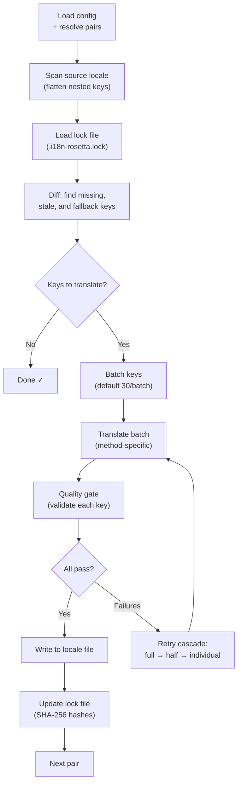

# Fonctionnement de la synchronisation

La commande `sync` est l'opération principale de rosetta. Voici ce qui se passe lorsque vous exécutez `npx i18n-rosetta sync`.

## Aperçu du pipeline



## Étape par étape

### 1. Résolution de la configuration

Rosetta charge `i18n-rosetta.config.json` (ou détecte automatiquement les paramètres). Il résout :
- La locale source et les locales cibles
- Le graphe des paires (quelles combinaisons source→cible traiter)
- Les paramètres de méthode, de modèle et de qualité par paire

### 2. Analyse de la source

Le fichier de la locale source est chargé et aplati en un mapping clé→valeur :

```json
// Input (nested)
{ "hero": { "title": "Welcome", "subtitle": "Build" } }

// Flattened
{ "hero.title": "Welcome", "hero.subtitle": "Build" }
```

### 3. Détection des modifications

Rosetta lit `.i18n-rosetta.lock`, qui stocke les hachages SHA-256 des valeurs sources précédemment traduites. Pour chaque clé, il vérifie :

| Condition | Action |
|-----------|--------|
| Clé absente de la cible | **Traduire** |
| Le hachage source a changé depuis la dernière synchronisation | **Retraduire** (obsolète) |
| La valeur cible commence par `[EN]` | **Retraduire** (espace réservé de repli) |
| Hachage source inchangé, la clé existe | **Ignorer** |

C'est pourquoi rosetta ne traduit que ce qui a changé — il ne retraduit pas l'intégralité de votre fichier à chaque synchronisation.

### 4. Traitement par lots

Les clés sont regroupées en lots (par défaut : 30 clés/lot pour les LLM, 128 pour Google Translate). Le traitement par lots réduit les allers-retours avec l'API tout en gardant des prompts gérables.

### 5. Traduction

Chaque lot est envoyé à la méthode de traduction configurée :

- **`llm`** : Prompt structuré vers OpenRouter avec des instructions de registre
- **`llm-coached`** : Identique, mais avec injection de règles de grammaire, d'un dictionnaire et de notes de style
- **`google-translate`** : Requête par lots vers Google Cloud Translation API v2
- **`api`** : HTTP POST vers un point de terminaison distant

Le message système (registre, règles) est identique pour tous les lots d'une locale donnée, ce qui permet la **mise en cache des prompts** — les fournisseurs comme Anthropic et Google mettent en cache les messages systèmes répétés, réduisant ainsi les coûts en tokens.

### 6. Contrôle de qualité

Chaque traduction est validée avant d'être écrite sur le disque. Cinq vérifications sont effectuées :

| Vérification | Ce qu'elle détecte | Exemple |
|-------|----------------|---------|
| **Vide/blanc** | Le modèle n'a rien renvoyé | `""` |
| **Écho de la source** | Le modèle a renvoyé l'entrée en anglais | `"Welcome"` pour le japonais |
| **Boucle d'hallucination** | Trigrammes répétés | `"Qo' Qo' Qo' Qo'"` |
| **Inflation de longueur** | La sortie est plus de 4 fois plus longue que la source | Source de 10 caractères → sortie de 50 caractères |
| **Conformité de l'écriture** | Mauvais système d'écriture pour la locale | Texte latin pour une locale arabe |

Les échecs sont journalisés avec un préfixe `[GATE]`. Aucun repli silencieux.

Consultez [Contrôle de qualité](/docs/concepts/quality-gate) pour plus de détails.

### 7. Cascade de nouvelles tentatives

En cas d'échec de l'analyse JSON ou d'erreurs au niveau du lot, rosetta effectue de nouvelles tentatives avec des lots de plus en plus petits :

```
Full batch (30 keys) → Failed
Half batch (15 keys) → Failed
Individual keys (1 each) → Isolates the problem key
```

Le budget de nouvelles tentatives est plafonné par `maxRetries` (par défaut : 3) pour éviter des dépenses incontrôlées en tokens.

### 8. Écriture et verrouillage

Les traductions validées sont écrites dans le fichier de la locale cible, en préservant la structure d'imbrication d'origine. Le fichier de verrouillage est mis à jour avec les nouveaux hachages SHA-256.

## Succès partiel

L'échec d'un lot ne bloque pas le reste. Si 9 lots sur 10 réussissent, ces 9 lots sont écrits. Le lot ayant échoué est journalisé, et vous pouvez réexécuter `sync` pour réessayer.

## Exécution à blanc

Prévisualisez ce qui changerait sans écrire de fichiers :

```bash
npx i18n-rosetta sync --dry
```

## Forcer la retraduction

Forcez la retraduction de clés spécifiques même si elles sont inchangées :

```bash
npx i18n-rosetta sync --force-keys "hero.title,nav.about"
```

## Estimation des coûts

Avant de traduire, rosetta génère un **rapport de coûts pré-synchronisation** indiquant les coûts estimés par paire. Cela s'exécute automatiquement lors de chaque `sync` — vous le voyez avant que le moindre appel API ne soit effectué.

```
╔══════════════════════════════════════════════════════════╗
║  Cost Estimate                                          ║
╠════════════╦═══════╦════════════╦════════════════════════╣
║ Pair       ║ Keys  ║ Est. Cost  ║ Method                 ║
╠════════════╬═══════╬════════════╬════════════════════════╣
║ en → fr    ║   142 ║ $0.07      ║ google-translate       ║
║ en → ja    ║    38 ║   —        ║ llm (model-dependent)  ║
║ en → crk   ║    38 ║   —        ║ llm-coached            ║
╚════════════╩═══════╩════════════╩════════════════════════╝
```

### Ce qui est estimé

Chaque méthode de traduction fournit sa propre estimation de coût :

| Méthode | Base de coût | Précision |
|--------|-----------|-----------|
| `google-translate` | Tarif publié par Google (20 $/million de caractères) | Précise |
| `llm` | Varie selon le modèle OpenRouter | Dépend du modèle — consultez la [tarification d'OpenRouter](https://openrouter.ai/models) |
| `llm-coached` | Identique à `llm` plus les tokens de contexte de coaching | Dépend du modèle |
| `api` | Déterminée par le serveur | Inconnue — impossible d'estimer sans interroger le point de terminaison |

Lorsqu'une méthode ne peut pas déterminer le coût (méthodes LLM, API distantes), rosetta indique `—` plutôt que de deviner. Utilisez `--dry` pour voir les estimations de coûts sans effectuer de traduction réelle.