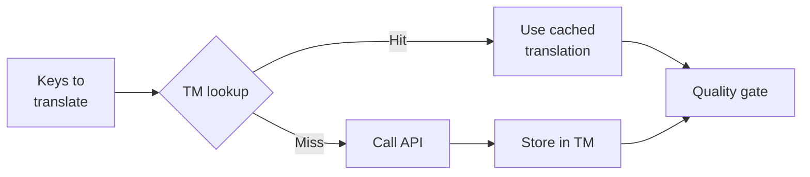

# Translation Memory

La Translation Memory (TM) est la couche de mise en cache intégrée de rosetta. Elle stocke chaque traduction indexée par le texte source + la locale + la méthode, de sorte que la réexécution de `sync` n'appelle l'API que pour les clés qui ont véritablement changé.

## Raison d'être de la TM

Sans la TM, chaque `sync` retraduit chaque clé modifiée — même si vous avez déjà traduit exactement le même texte anglais pour la même locale lors d'une exécution précédente. Scénarios courants où cela entraîne un gaspillage financier :

| Scénario | Sans TM | Avec TM |
|----------|-----------|---------|
| Réexécution de la synchronisation après la modification d'une clé (500 clés × 10 locales) | 5 000 appels d'API | 10 appels d'API |
| Restauration d'une clé à une valeur anglaise précédente | Appel d'API complet | Cache hit instantané |
| La même phrase apparaît dans 3 fichiers de locale | 3 × appels d'API | 1 appel d'API + 2 cache hits |
| Dry-run → synchronisation réelle | Appels d'API complets pour les deux | La première exécution met en cache, la seconde réutilise |

La TM est **activée par défaut** et ne nécessite aucune configuration. Les traductions sont mises en cache automatiquement lors de chaque `sync` et sont servies lors des exécutions ultérieures.

## Comment cela fonctionne

### Clé de cache

Chaque entrée de la TM est indexée par un hash SHA-256 de trois valeurs :

```
SHA-256( sourceValue + '\x00' + locale + '\x00' + method )
```

| Composant | Raison de sa présence dans la clé |
|-----------|-------------------|
| `sourceValue` | Texte anglais différent → traduction différente |
| `locale` | "Hello" se traduit différemment en français et en japonais |
| `method` | Sortie de Google Translate ≠ sortie de GPT-4o |

Le séparateur d'octet nul (`\x00`) empêche les collisions entre `"ab" + "c"` et `"a" + "bc"`.

### Pendant la synchronisation



1. Avant d'appeler l'API de traduction, rosetta répartit les clés en **TM hits** et **TM misses**
2. Les hits sont servis instantanément depuis le cache — aucun appel d'API, aucune latence, aucun coût
3. Les misses passent par le pipeline de traduction normal
4. Les nouvelles traductions provenant de l'API sont stockées dans la TM pour les exécutions futures
5. Toutes les traductions (mises en cache + nouvelles) passent par la quality gate

### Stockage

La TM est stockée sous `.rosetta/tm.json` à la racine de votre projet. Le fichier utilise un format JSON compact (sans pretty-printing) pour conserver une taille gérable. Chaque entrée stocke :

| Champ | Description |
|-------|-------------|
| `t` | Le texte traduit |
| `ts` | L'horodatage ISO-8601 du moment où elle a été mise en cache |
| `l` | Le code de la locale cible (pour les statistiques/le filtrage) |
| `m` | Le nom de la méthode de traduction (pour les statistiques/le filtrage) |

Pour 50 langues × 500 clés = 25 000 entrées, le fichier devrait peser environ 2 à 3 Mo.

## Gestion du cache

### Afficher les statistiques

```bash
i18n-rosetta tm stats
```

Affiche le nombre d'entrées, la taille du fichier et une répartition par locale :

```
  Translation Memory — .rosetta/tm.json

  Entries:      2,847
  File size:    1.2 MB
  Created:      2026-05-20
  Last entry:   2026-05-24

  By locale:
    fr       482 entries  (llm: 380, llm-coached: 102)
    de       471 entries  (llm: 471)
    ja       465 entries  (llm: 465)
```

### Vider le cache

```bash
# Clear everything (with confirmation prompt)
i18n-rosetta tm clear

# Clear without prompt (CI environments)
i18n-rosetta tm clear --yes

# Clear only one locale
i18n-rosetta tm clear --locale fr
```

### Ignorer la TM pour une exécution

```bash
# Force fresh API calls for all keys (useful when switching providers)
i18n-rosetta sync --no-tm
```

Cela ne supprime pas le cache — cela l'ignore simplement pour cette exécution et ne stocke pas les nouveaux résultats.

## Quand la TM n'est pas utile

La TM ne produira pas de cache hit lorsque :

- **Le texte source a changé** — le hash change, il s'agit donc d'un miss
- **La méthode a changé** — passer de `llm` à `google-translate` implique des clés de cache différentes
- **Première exécution** — cold start, aucune entrée pour le moment
- **L'indicateur `--no-tm`** — contourne explicitement le cache

## Devez-vous commiter `.rosetta/tm.json` ?

**Généralement non.** La TM est une optimisation locale pour les développeurs. Elle est renseignée automatiquement lors de la synchronisation et n'est utile que lors de la réexécution de la synchronisation sur la même machine. Cependant, vous pourriez envisager de la commiter si :

- Votre équipe partage un seul CI runner qui synchronise les traductions
- Vous souhaitez des builds reproductibles sans appels d'API
- Vous archivez les traductions à des fins de conformité

Ajoutez `.rosetta/tm.json` à `.gitignore` pour un usage typique.

---

## Voir aussi

- [Comment fonctionne la synchronisation](/docs/concepts/how-sync-works) — la place de la TM dans le pipeline
- [Référence de la CLI — tm](/docs/reference/cli#tm) — référence des commandes
- [Référence de la CLI — sync --no-tm](/docs/reference/cli#sync) — contourner la TM