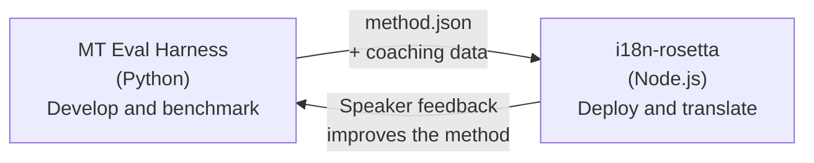

# La passerelle Eval Harness

i18n-rosetta et le MT Eval Harness sont deux outils distincts qui forment un seul écosystème. Le harness est l'endroit où les méthodes de traduction sont **éprouvées**. Rosetta est l'endroit où les méthodes éprouvées sont **déployées**. Ils se connectent via un format de plugin partagé.



## Le flux : Recherche → Production

### 1. Construire une méthode dans le harness

Toute classe Python qui implémente `async translate(entries, config) → [{id, predicted}]` peut s'intégrer au harness. Le harness ne se soucie pas de ce qui se passe à l'intérieur — LLM avec prompt, modèle entraîné sur mesure, règles déterministes, ou autre.

### 2. Évaluer les performances

Le harness évalue votre méthode par rapport à un corpus standardisé avec des métriques reproductibles : chrF++, acceptation FST (pour les langues morphologiquement riches), précision morphologique et évaluation sémantique.

### 3. Exporter en tant que plugin

Lorsque votre méthode atteint une qualité acceptable, empaquetez-la sous forme de plugin rosetta — un manifeste `method.json` avec des données de coaching facultatives.

:::info L'interface en ligne de commande (CLI) d'exportation est prévue
Actuellement, vous créez le manifeste method.json manuellement. La commande `mt-eval export` automatisera cela. Consultez l'[Interface de méthode](https://mtevalarena.org/docs/specifications/methods) pour le format complet du plugin.
:::

### 4. Installer dans rosetta

```bash
i18n-rosetta plugin install ./my-method-plugin/
```

### 5. Traduire du contenu réel

```bash
i18n-rosetta sync
```

Votre méthode évaluée produit désormais de véritables traductions en production.

## Le flux : Production → Recherche

Les traductions déployées sont révisées par des locuteurs bilingues. Leurs retours permettent d'identifier les erreurs systématiques (modèles de temps verbaux incorrects, vocabulaire manquant, formulations peu naturelles). Le chercheur met à jour la méthode dans le harness, réévalue les performances, réexporte et redéploie. Le système apprend de son utilisation.

## Le format du plugin

Le manifeste `method.json` constitue le contrat entre les deux outils :

```json
{
  "name": "crk-coached-v3",
  "type": "llm-coached",
  "version": "3.0.0",
  "description": "Coached LLM translation for Plains Cree",
  "locales": ["crk"],
  "config": {
    "model": "google/gemini-3.5-flash",
    "temperature": 0.3
  },
  "benchmarks": {
    "crk": {
      "composite_score": 0.67,
      "fst_acceptance": 0.82,
      "corpus_size": 150
    }
  }
}
```

Consultez la [Spécification du plugin](/docs/reference/plugin-spec) pour le format complet.

## Ce qui est développé vs ce qui est prévu

| Composant | Statut |
|-----------|--------|
| Protocole TranslationProcess | ✅ Développé |
| Exécuteur de benchmark du harness | ✅ Développé |
| Format de plugin method.json | ✅ Développé |
| `rosetta plugin install/remove/list` | ✅ Développé |
| Chargement des données de coaching | ✅ Développé |
| CLI `mt-eval export` | 🔲 Prévu |
| Interface de révision communautaire | 🔲 Prévu |
| Évaluation cryptographique des ensembles de test | 🔲 Prévu |

## Pour aller plus loin

- [Méthodes de traduction](/docs/guides/translation-methods) — toutes les méthodes disponibles et leur fonctionnement
- [Spécification du plugin](/docs/reference/plugin-spec) — le format method.json
- [Servir une méthode via API](/docs/guides/serving-a-method) — héberger une méthode côté serveur
- [Souveraineté des données](https://mtevalarena.org/docs/sovereignty/data-sovereignty) — OCAP, CARE et protection cryptographique
- [Pour les chercheurs en traduction automatique (MT)](https://mtevalarena.org/docs/leaderboard/rules) — la documentation du eval harness