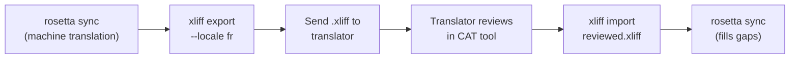

# Travailler avec des traducteurs professionnels

Rosetta génère des traductions automatiques, mais certains projets nécessitent une révision humaine — contenu réglementaire, textes sensibles pour la marque ou interfaces utilisateur à fort enjeu. Le flux de travail XLIFF vous permet d'exporter des traductions pour une révision professionnelle et de les réimporter de manière transparente.

## Qu'est-ce que XLIFF ?

XLIFF (XML Localization Interchange File Format) est le format d'échange standard de l'industrie pour les outils de traduction. Chaque outil professionnel CAT (Computer-Assisted Translation) le prend en charge :

- **memoQ** — importer un fichier XLIFF, réviser en contexte, exporter le fichier révisé
- **SDL Trados Studio** — prise en charge native de XLIFF
- **Phrase (Memsource)** — téléverser des tâches XLIFF pour les équipes de traducteurs
- **Smartling** — pipeline d'ingestion XLIFF
- **OmegaT** — outil CAT gratuit/open-source avec prise en charge de XLIFF

Rosetta génère des fichiers XLIFF 1.2 (la version universellement prise en charge) plutôt que 2.0+ pour une compatibilité maximale avec les outils.

## Le flux de travail



### Étape 1 : Générer des traductions automatiques

Exécutez d'abord `sync` pour obtenir une traduction automatique de base :

```bash
i18n-rosetta sync
```

### Étape 2 : Exporter au format XLIFF

Exportez la paire source + cible au format XLIFF :

```bash
i18n-rosetta xliff export --locale fr
```

Cela écrit le fichier `.rosetta/xliff/fr.xliff` contenant :
- Chaque clé source avec sa valeur en anglais
- La traduction automatique actuelle (le cas échéant) en tant que `<target>`
- Les clés sans traduction marquées comme `state="new"`

```xml
<trans-unit id="hero.title" xml:space="preserve">
  <source>Welcome to our platform</source>
  <target state="translated">Bienvenue sur notre plateforme</target>
</trans-unit>
```

### Étape 3 : Envoyer au traducteur

Envoyez le fichier `.xliff` à votre traducteur ou téléversez-le sur votre plateforme CAT. Le traducteur voit la source et la cible côte à côte, et peut :

- Modifier les traductions automatiques
- Remplir les traductions manquantes
- Signaler les problèmes de qualité
- Appliquer sa propre mémoire de traduction et ses bases terminologiques

### Étape 4 : Importer le fichier révisé

Lorsque le traducteur renvoie le fichier `.xliff` révisé, importez-le :

```bash
# Preview what will change
i18n-rosetta xliff import .rosetta/xliff/fr.xliff --dry

# Apply changes
i18n-rosetta xliff import .rosetta/xliff/fr.xliff
```

Sortie :
```
  ✓ Imported 142 translations for fr
    Updated:    23 (changed from existing)
    Added:      0 (new keys)
    Unchanged:  119
    Written to: locales/fr.json
```

### Étape 5 : Combler les lacunes

Si de nouvelles clés ont été ajoutées après l'exportation du fichier XLIFF, exécutez `sync` pour les traduire :

```bash
i18n-rosetta sync
```

Rosetta traduit uniquement les clés qui sont encore manquantes — les traductions révisées issues de l'importation XLIFF sont préservées.

## Conseils

### Exporter vers des chemins personnalisés

```bash
# Export to a specific directory
i18n-rosetta xliff export --locale ja --out ./for-review/

# Export with a specific filename
i18n-rosetta xliff export --locale de --out ./review/german.xliff
```

### Locales multiples

Exportez chaque locale séparément :

```bash
for locale in fr de ja ko; do
  i18n-rosetta xliff export --locale $locale
done
```

### Contrôle de version

Ajoutez `.rosetta/xliff/` à `.gitignore` — les fichiers XLIFF sont des artefacts transitoires, et non des sources du projet :

```gitignore
.rosetta/xliff/
```

### Quand utiliser XLIFF plutôt que simplement `sync`

| Scénario | Recommandation |
|----------|---------------|
| Application interne, qualité de 90 % et plus acceptable | Simplement `sync` — la traduction automatique est suffisante |
| Textes marketing destinés aux utilisateurs | Exporter au format XLIFF pour une révision humaine |
| Contenu juridique/réglementaire | Exporter au format XLIFF — révision humaine requise |
| Plus de 50 locales, délai serré | `sync` d'abord, exportation XLIFF pour les 5 locales principales uniquement |
| Le traducteur utilise déjà un outil CAT | XLIFF est le format de transfert naturel |

---

## Voir aussi

- [Référence CLI — xliff](/docs/reference/cli#xliff) — référence des commandes
- [Mémoire de traduction](/docs/concepts/translation-memory) — mise en cache des traductions révisées
- [Méthodes de traduction](/docs/guides/translation-methods) — options de traduction automatique