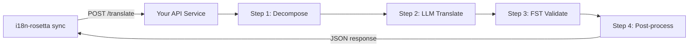

# Exposer une méthode personnalisée en tant qu'API

La **méthode `api`** d'i18n-rosetta vous permet de diriger n'importe quelle paire de traduction vers un point de terminaison HTTP externe. C'est ainsi que vous intégrez des pipelines qui sont trop complexes pour une simple invite LLM — analyseurs morphologiques, transducteurs à états finis (FST), chaînes LLM à plusieurs étapes, ou toute méthode de recherche personnalisée que vous avez conçue.

## Pourquoi un service API ?

Certains pipelines de traduction ne peuvent pas s'exécuter au sein d'un simple cycle invite-réponse :

| Étape du pipeline | Exemple |
|---|---|
| **Décomposition morphologique** | Séparer les mots polysynthétiques en morphèmes avant la traduction |
| **Validation FST** | Rejeter les résultats qui enfreignent les règles phonologiques ou morphologiques |
| **Chaînes LLM à plusieurs étapes** | Cycles de génération → vérification → correction avec différents modèles |
| **Recherche dans un dictionnaire** | Croiser les données avec un dictionnaire bilingue révisé au milieu du pipeline |
| **Intervention humaine** | Mettre en file d'attente les traductions incertaines pour une révision par un expert |

La méthode `api` traite votre pipeline comme une boîte noire — i18n-rosetta envoie les chaînes sources, votre service renvoie les traductions. Ce qui se passe à l'intérieur dépend entièrement de vous.

## Architecture



## Configuration de votre service

Votre service API doit implémenter un point de terminaison unique qui accepte et renvoie du JSON :

### Format de la requête

rosetta envoie ce corps JSON exact (voir [api.js](https://github.com/gamedaysuits/i18n-rosetta/blob/main/lib/methods/api.js)) :

```json
POST /translate
Content-Type: application/json
Authorization: Bearer <ROSETTA_API_KEY>

{
  "source_locale": "en",
  "target_locale": "crk",
  "method": "crk-coached-v1",
  "keys": {
    "greeting": "Hello, welcome to our app",
    "farewell": "Goodbye and thanks"
  }
}
```

| Champ | Type | Description |
|-------|------|-------------|
| `source_locale` | string | Code de langue source BCP 47 |
| `target_locale` | string | Code de langue cible BCP 47 |
| `method` | string | Nom du plugin ou `"default"` |
| `keys` | object | Mappage de la clé → chaîne source à traduire |
```

### Response Format

Your service must return a `translations` object. An optional `meta` object can include cost and diagnostic info:

```json
{
  "translations": {
    "greeting": "tânisi, pê-kîwêw ôta",
    "farewell": "ekosi mâka, kinanâskomitin"
  },
  "meta": {
    "model": "my-custom-pipeline/v1",
    "cost_usd": 0.0042,
    "method": "decompose-translate-validate"
  }
}
```

| Field | Type | Required | Description |
|-------|------|----------|-------------|
| `translations` | object | ✅ | Map of key → translated string |
| `meta` | object | — | Optional metadata |
| `meta.cost_usd` | number | — | If present, displayed in rosetta's output |
| `errors` | object | — | For partial success (HTTP 207): map of key → `{ message }` |

### Minimal Express Server

```javascript
import express from 'express';

const app = express();
app.use(express.json());

/**
 * Contrat de l'API rosetta :
 *
 * Requête :  { source_locale, target_locale, method, keys: { "key": "source" } }
 * Réponse : { translations: { "key": "translated" }, meta: { ... } }
 */
app.post('/translate', async (req, res) => {
  const { source_locale, target_locale, method, keys } = req.body;

  const translations = {};

  for (const [key, source] of Object.entries(keys)) {
    // --- Votre pipeline s'insère ici ---
    // Étape 1 : Décomposition morphologique
    const morphemes = await decompose(source, source_locale);

    // Étape 2 : Traduction LLM avec contexte
    const draft = await llmTranslate(morphemes, target_locale);

    // Étape 3 : Validation FST
    const validated = await fstValidate(draft, target_locale);

    // Étape 4 : Post-traitement (normalisation orthographique, etc.)
    translations[key] = await postProcess(validated);
  }

  res.json({
    translations,
    meta: {
      model: 'my-custom-pipeline/v1',
      method: 'decompose-translate-validate',
    },
  });
});

app.listen(3001, () => {
  console.log('L\'API de traduction est en cours d\'exécution sur http://localhost:3001');
});
```

## Configuring i18n-rosetta

Point a translation pair at your running service in `i18n-rosetta.config.json`:

```json
{
  "inputLocale": "en",
  "pairs": {
    "en:crk": {
      "method": "api",
      "endpoint": "http://localhost:3001/translate",
      "register": "Cri des plaines formel. Utiliser l'orthographe SRO."
    }
  }
}
```

Then run sync as usual:

```bash
npx i18n-rosetta sync
```

i18n-rosetta will POST your source strings to the endpoint and write the returned translations to `crk.json`.

## Case Study: Plains Cree Pipeline

:::info Under Development
The Plains Cree pipeline described below is **under active development** and is not yet running in production. Details here reflect the current design direction and may change as the project evolves.
:::

The **gds-mt-eval-harness** project demonstrates this pattern. Its Plains Cree pipeline uses:

1. **Morphological decomposition** — Break polysynthetic Cree words into translatable morpheme chains
2. **LLM translation** — Context-enriched GPT-4o translation with coaching data (SRO orthography rules, register instructions)
3. **FST validation** — Finite-state transducer checks that outputs conform to Cree phonological rules
4. **Confidence scoring** — Each translation gets a confidence score based on FST pass rate and dictionary coverage

The entire pipeline runs as a single HTTP endpoint that i18n-rosetta calls via the `api` method.

### Running Evaluations

After translating, you can evaluate output quality using the harness directly:

```bash
# Cloner l'environnement d'évaluation
git clone https://github.com/gamedaysuits/gds-mt-eval-harness.git
cd gds-mt-eval-harness
pip install -e .

# Exécuter l'évaluation sur les résultats de votre méthode
python eval/baseline_experiment.py --dataset data/edtekla-dev-v1.json --submit
```

This produces structured evaluation records with chrF++, BLEU, and exact match scores that can be used as regression baselines.

## Authentication

If your API requires authentication, set the `apiKey` field or use an environment variable:

```json
{
  "pairs": {
    "en:crk": {
      "method": "api",
      "endpoint": "https://my-mt-service.example.com/translate",
      "apiKey": "${CRK_API_KEY}"
    }
  }
}
```

## Data Sovereignty & OCAP Principles

The `api` method is particularly important for **Indigenous language communities**. By self-hosting the translation pipeline, a community keeps full control over:

- **Proprietary coaching data** — register instructions, orthography rules, and domain glossaries never leave community infrastructure.
- **Linguistic resources** — curated dictionaries, FST grammars, and elder-verified translations remain under community ownership.
- **Access policies** — the community decides who can call the endpoint and under what terms.

This aligns with [OCAP® principles](/docs/guides/low-resource-languages#ocap-principles) (Ownership, Control, Access, Possession), ensuring that sensitive language data is governed by the community rather than a third-party platform.

:::tip
Combine the `api` method with a private deployment (e.g., a community-hosted VM or on-prem server) for the strongest data-sovereignty posture. See [Support a Low-Resource Language](/docs/guides/low-resource-languages) for a full walkthrough.
:::

## Cost Estimation

The `api` method returns `null` for cost estimation by default — your service controls pricing. If you want to provide cost transparency, have your API return a `cost` field in the metadata:

```json
{
  "translations": { "...": "..." },
  "metadata": {
    "cost": {
      "estimatedCost": 0.0042,
      "currency": "USD",
      "source": "my-service-pricing"
    }
  }
}
```

## Bonnes pratiques

1. **Renvoyez des chaînes vides en cas d'échec** — Ne renvoyez pas la chaîne source en tant que "traduction". Renvoyez `""` et laissez le mécanisme de préfixe de secours d'i18n-rosetta s'en charger.
2. **Incluez des scores de confiance** — Si votre pipeline peut estimer la qualité, renvoyez-la dans les métadonnées. Cela facilite l'audit de qualité.
3. **Implémentez des vérifications d'état (health checks)** — Ajoutez un point de terminaison `GET /health` afin qu'i18n-rosetta puisse vérifier la connectivité avant de lancer une synchronisation massive.
4. **Gérez les limites de débit avec élégance** — Si votre pipeline a des limites de débit, renvoyez les codes d'état `429`. Le système de traitement par lots d'i18n-rosetta réduira alors la cadence.
5. **Journalisez tout** — Les pipelines à plusieurs étapes peuvent échouer silencieusement. Journalisez les entrées/sorties de chaque étape pour le débogage.

## Licence

Le modèle de méthode `api` est entièrement ouvert — il n'y a aucune restriction de licence pour envelopper votre propre pipeline de traduction sous forme de service HTTP. Le `gds-mt-eval-harness` est disponible sous licence MIT pour les implémentations de référence.

## Voir aussi

- [Méthodes de traduction](/docs/guides/translation-methods) — aperçu de toutes les méthodes intégrées (`openai`, `google`, `api`, etc.)
- [Spécification des plugins](/docs/reference/plugin-spec) — schéma complet pour `i18n-rosetta.config.json` incluant les champs de la méthode `api`
- [Prendre en charge une langue à faibles ressources](/docs/guides/low-resource-languages) — guide de bout en bout pour les langues sous-dotées en ressources, incluant les principes OCAP
- [Architecture](/docs/concepts/architecture) — fonctionnement de la boucle de synchronisation, du traitement par lots et de la répartition des méthodes d'i18n-rosetta
- [Évaluation de la traduction automatique (MT)](/docs/eval/) — méthodologie d'évaluation, métriques et processus de soumission au classement
- [Classement des méthodes](/leaderboard) — classements de qualité en direct pour les différentes méthodes et paires de langues