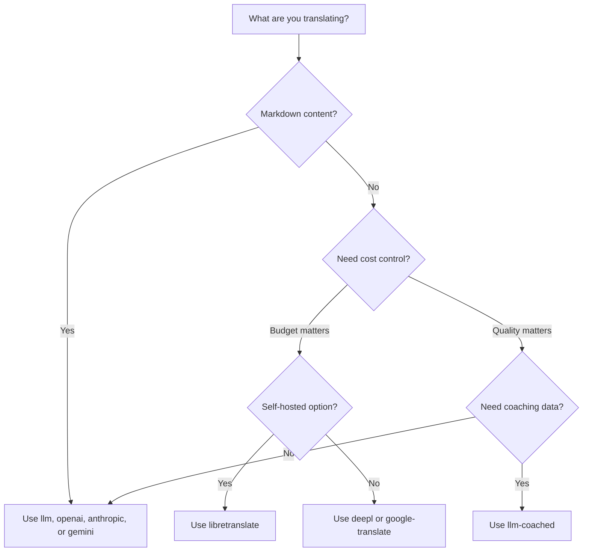

# Méthodes de traduction

Rosetta prend en charge dix méthodes de traduction. Chaque paire de langues peut utiliser une méthode différente — vous n'êtes pas contraint d'adopter une approche unique pour l'ensemble de votre projet.

## Comparaison des méthodes

### Fournisseurs de LLM

Axés sur la qualité, compatibles avec Markdown, compatibles avec l'encadrement (coaching). Idéaux pour les projets riches en contenu.

| Méthode | Clé | Ce qu'elle fait |
|--------|-----|-------------|
| `llm` (par défaut) | `OPENROUTER_API_KEY` | LLM via OpenRouter — plus de 200 modèles, routage automatique |
| `llm-coached` | `OPENROUTER_API_KEY` | LLM + règles de grammaire, dictionnaires, notes de style |
| `openai` | `OPENAI_API_KEY` | API OpenAI directe (gpt-4o, gpt-4o-mini) |
| `anthropic` | `ANTHROPIC_API_KEY` | API Anthropic directe (Claude Sonnet, Haiku, Opus) |
| `gemini` | `GEMINI_API_KEY` | API Google Gemini directe (Flash, Pro) — niveau gratuit |

### Traduction automatique (MT) traditionnelle

Axée sur la vitesse et les coûts. Idéale pour les paires clé-valeur à fort volume.

| Méthode | Clé | Ce qu'elle fait |
|--------|-----|-------------|
| `google-translate` | `GOOGLE_TRANSLATE_API_KEY` | API Google Cloud Translation v2 (plus de 130 langues) |
| `deepl` | `DEEPL_API_KEY` | API DeepL avec prise en charge des glossaires (plus de 30 langues) |
| `microsoft-translator` | `MICROSOFT_TRANSLATOR_API_KEY` | Azure Cognitive Services Translator (plus de 100 langues) |
| `libretranslate` | *(auto-hébergé)* | LibreTranslate auto-hébergé (AGPL, gratuit) |

### Infrastructure

| Méthode | Clé | Ce qu'elle fait |
|--------|-----|-------------|
| `api` | *(par fournisseur)* | Client HTTP léger pour tout point de terminaison de traduction REST |

## Arbre de décision



---

## `llm` — Traduction par LLM (Par défaut)

Traduit via n'importe quel LLM sur [OpenRouter](https://openrouter.ai). Il s'agit de la méthode par défaut et de la plus polyvalente.

**Fonctionnement :**
1. Regroupe les clés par lots (30 par lot par défaut) avec des instructions de registre et de contexte
2. Envoie à OpenRouter sous forme d'invite (prompt) structurée
3. Analyse la réponse JSON
4. Valide chaque traduction via la [passerelle de qualité](/docs/concepts/quality-gate)
5. Écrit les traductions validées, réessaie ou rejette les échecs

**Quand l'utiliser :** Pour la plupart des projets. Particulièrement pour les sites riches en contenu avec du Markdown, où les blocs de code et les codes courts (shortcodes) doivent être protégés.

**Configuration :**

```json
{
  "defaultMethod": "llm",
  "model": "google/gemini-3.5-flash"
}
```

## `llm-coached` — Traduction par LLM encadrée (Coached)

Identique à `llm`, mais avec des règles de grammaire, des dictionnaires de termes et des notes de style injectés dans chaque invite.

**Fonctionnement :**
1. Charge les données d'encadrement à partir de `.rosetta/coaching/<locale>.json` ou du répertoire `coaching/` d'un plugin
2. Injecte les règles de grammaire, les termes du dictionnaire et les notes de style dans l'invite système
3. Les termes du dictionnaire correspondant aux clés sources sont inclus en tant que terminologie requise
4. La traduction se déroule comme avec `llm`, les données d'encadrement apportant une précision supplémentaire

**Quand l'utiliser :** Pour les langues à faibles ressources, la terminologie spécifique à un domaine (juridique, médical), les registres formels, ou tout cas où la sortie générique du LLM n'est pas suffisamment précise.

**Format des données d'encadrement :**

```json title=".rosetta/coaching/fr.json"
{
  "grammar_rules": [
    "French adjectives agree in gender and number with the noun they modify",
    "Use 'vous' for formal contexts, 'tu' for informal"
  ],
  "dictionary": {
    "dashboard": "tableau de bord",
    "deployment": "déploiement",
    "settings": "paramètres"
  },
  "style_notes": "Prefer active voice. Avoid anglicisms where a native French term exists."
}
```

Voir aussi : [Guide des langues à faibles ressources](/docs/guides/low-resource-languages)

---

## `openai` — API OpenAI directe

Traduit directement via l'API OpenAI Chat Completions. Aucun intermédiaire OpenRouter — votre clé, votre compte, votre tableau de bord d'utilisation.

**Modèles :** `gpt-4o` (par défaut), `gpt-4o-mini`

**Fonctionnalités :**
- ✅ Prise en charge de Markdown (traduction de contenu)
- ✅ Prise en charge de l'encadrement (règles de grammaire, remplacements de dictionnaire, notes de style)
- ✅ Mode JSON pour une sortie structurée clé-valeur
- ✅ Retrait exponentiel (exponential backoff) avec réessais

**Configuration :**

```json
{
  "pairs": {
    "en:fr": { "method": "openai", "model": "gpt-4o-mini" }
  }
}
```

```bash
export OPENAI_API_KEY=sk-proj-...
```

Obtenez votre clé sur [platform.openai.com/api-keys](https://platform.openai.com/api-keys).

## `anthropic` — API Anthropic directe

Traduit directement via l'API Anthropic Messages. Utilise le paramètre `system` pour les données d'encadrement, permettant la mise en cache des invites (prompt caching) d'Anthropic.

**Modèles :** `claude-sonnet-4-6` (par défaut), `claude-haiku-4-5`, `claude-opus-4-7`

**Fonctionnalités :**
- ✅ Prise en charge de Markdown (traduction de contenu)
- ✅ Prise en charge de l'encadrement (règles de grammaire, remplacements de dictionnaire, notes de style)
- ✅ Mise en cache des invites système (amortit le coût de l'encadrement sur l'ensemble des lots)
- ✅ Retrait exponentiel avec réessais

**Configuration :**

```json
{
  "pairs": {
    "en:ja": { "method": "anthropic", "model": "claude-haiku-4-5" }
  }
}
```

```bash
export ANTHROPIC_API_KEY=sk-ant-...
```

Obtenez votre clé sur [console.anthropic.com](https://console.anthropic.com/settings/keys).

## `gemini` — API Google Gemini directe

Traduit directement via l'API Google Gemini `generateContent`. **Niveau gratuit disponible** — le meilleur point de départ sans frais.

**Modèles :** `gemini-2.5-flash` (par défaut), `gemini-2.5-pro`

**Fonctionnalités :**
- ✅ Prise en charge de Markdown (traduction de contenu)
- ✅ Prise en charge de l'encadrement (règles de grammaire, remplacements de dictionnaire, notes de style)
- ✅ Mode de réponse JSON via `responseMimeType`
- ✅ Niveau gratuit (quota quotidien généreux)
- ✅ Retrait exponentiel avec réessais

**Configuration :**

```json
{
  "pairs": {
    "en:ko": { "method": "gemini", "model": "gemini-2.5-pro" }
  }
}
```

```bash
export GEMINI_API_KEY=AI...
```

Obtenez votre clé sur [aistudio.google.com/apikey](https://aistudio.google.com/apikey).

### Validation des modèles

Les fournisseurs de LLM directs (`openai`, `anthropic`, `gemini`) valident votre chaîne de modèle lors de la première utilisation. Cela permet de détecter trois catégories d'erreurs :

**Format de méthode incorrect** — Utilisation d'un chemin de modèle de type OpenRouter avec un fournisseur direct :

```
[WARN] OpenAI: model "google/gemini-3.5-flash" looks like an OpenRouter path.
       Direct providers use bare model names (e.g., "gpt-4o").
       To use OpenRouter models, set method to 'llm' instead.
```

**Mauvais fournisseur** — Utilisation d'un modèle provenant d'un tout autre fournisseur :

```
[WARN] Gemini: model "claude-sonnet-4-6" is an Anthropic model.
       This provider (gemini) cannot serve Anthropic models.
       Use --method anthropic or set "method": "anthropic" in config.
```

**Modèle obsolète ou mal orthographié** — Lors du premier appel à l'API, rosetta récupère la liste des modèles actifs du fournisseur et vérifie votre modèle par rapport à celle-ci :

```
[WARN] Gemini: model "gemini-1.5-flash" not found in available models.
       Similar models: gemini-2.0-flash, gemini-2.5-flash, gemini-2.5-pro
       The API call will proceed — the provider will give the final verdict.
```

:::note Il s'agit d'avertissements, non d'erreurs
La validation du modèle consigne des avertissements mais ne bloque pas l'appel à l'API. L'API du fournisseur rend le verdict final — un futur nom de modèle pourrait correspondre à un modèle différent, et nous ne souhaitons pas bloquer sur la base d'heuristiques.
:::

---

## `google-translate` — API Google Cloud Translation

Intégration directe avec l'API Google Cloud Translation v2. Utilise l'API REST — aucun SDK, aucun compte de service. Uniquement la clé API.

**Quand l'utiliser :** Pour les paires de chaînes clé-valeur à fort volume où la vitesse et le coût importent plus que la nuance. Prend en charge plus de 130 langues de manière native.

**Limites :**
- ⚠️ **Aucune prise en charge de Markdown.** Corrompra les blocs de code, les codes courts et les variables d'interpolation.
- Aucun contrôle du registre ou du ton
- Aucun encadrement ni application de la terminologie

```bash
npx i18n-rosetta sync --method google-translate
```

:::tip Détection automatique
Si seule `GOOGLE_TRANSLATE_API_KEY` est configurée (aucune clé OpenRouter), rosetta bascule automatiquement vers Google Translate. Aucune modification de configuration n'est nécessaire.
:::

## `deepl` — API DeepL

Intégration directe avec l'API de traduction DeepL. Prend en charge les glossaires pour une terminologie cohérente.

**Quand l'utiliser :** Pour les langues européennes où DeepL excelle (allemand, français, espagnol, néerlandais, polonais, etc.). La prise en charge des glossaires garantit une terminologie cohérente sans données d'encadrement.

**Fonctionnalités :**
- ✅ Détection automatique du point de terminaison gratuit/pro (suffixe `:fx` sur les clés gratuites)
- ✅ Création et gestion de glossaires
- ✅ Contrôle du niveau de formalité
- ⚠️ **Aucune prise en charge de Markdown** — paires clé-valeur uniquement

**Configuration :**

```json
{
  "pairs": {
    "en:de": { "method": "deepl" }
  }
}
```

```bash
export DEEPL_API_KEY=your-key-here
```

Obtenez votre clé sur [deepl.com/pro-api](https://www.deepl.com/pro-api).

## `microsoft-translator` — Azure Cognitive Services

Intégration directe avec l'API Microsoft Translator Text v3.

**Quand l'utiliser :** Dans les environnements d'entreprise disposant d'une infrastructure Azure existante. Prend en charge plus de 100 langues, y compris de nombreuses langues non couvertes par Google Translate.

**Fonctionnalités :**
- ✅ Jusqu'à 100 segments par requête (débit élevé)
- ✅ Paramètre de région facultatif pour l'optimisation de la latence
- ⚠️ **Aucune prise en charge de Markdown** — paires clé-valeur uniquement
- ⚠️ **Aucune traduction de contenu** — paires clé-valeur uniquement

**Configuration :**

```json
{
  "pairs": {
    "en:ar": { "method": "microsoft-translator" }
  }
}
```

```bash
export MICROSOFT_TRANSLATOR_API_KEY=your-key
export MICROSOFT_TRANSLATOR_REGION=global  # optional
```

Obtenez votre clé depuis le [Portail Azure](https://portal.azure.com) → Cognitive Services → Translator.

## `libretranslate` — Traduction auto-hébergée

Traduction open source auto-hébergée utilisant LibreTranslate. S'exécute localement ou sur votre propre infrastructure — aucun coût d'API, souveraineté totale des données.

**Quand l'utiliser :** Pour les projets nécessitant une traduction hors ligne, la conformité à la confidentialité des données (RGPD) ou un fonctionnement sans frais. Particulièrement utile pour les pipelines CI qui ne doivent pas dépendre d'API externes.

**Fonctionnalités :**
- ✅ Auto-hébergé — aucun appel d'API externe
- ✅ Gratuit et open source (AGPL-3.0)
- ✅ Déploiement Docker disponible
- ⚠️ **Aucune prise en charge de Markdown** — paires clé-valeur uniquement
- ⚠️ **Aucune traduction de contenu** — paires clé-valeur uniquement
- ⚠️ La qualité varie selon la paire de langues

**Configuration :**

```bash
# Run LibreTranslate locally with Docker
docker run -d -p 5000:5000 libretranslate/libretranslate

# Configure (optional — defaults to localhost:5000)
export LIBRETRANSLATE_API_URL=http://localhost:5000/translate
```

```json
{
  "pairs": {
    "en:es": { "method": "libretranslate" }
  }
}
```

---

## `api` — API de traduction distante

Un client HTTP léger pour les points de terminaison de traduction hébergés par la communauté ou protégés par la propriété intellectuelle (IP). Rosetta envoie les clés et reçoit les traductions en retour — il ne contient aucune logique de traduction.

**Quand l'utiliser :** Lorsque les méthodes de traduction sont hébergées côté serveur (par exemple, données d'encadrement propriétaires, modèles affinés, pipelines FST qui ne peuvent pas être distribués).

```json
{
  "pairs": {
    "en:crk": {
      "method": "api",
      "endpoint": "https://api.example.com/v1/translate",
      "apiKey": "your-key"
    }
  }
}
```

:::note Traduction communautaire compatible OCAP
La méthode `api` constitue la passerelle vers une **traduction hébergée par la communauté et compatible OCAP**. Les communautés autochtones et de langues minoritaires peuvent héberger leurs propres points de terminaison de traduction — en gardant le contrôle communautaire sur les données d'encadrement, les modèles affinés et la propriété intellectuelle linguistique — tandis que Rosetta s'y connecte en tant que client léger.

Consultez [Soutenir une langue à faibles ressources](/docs/guides/low-resource-languages) pour la procédure complète d'hébergement communautaire, et [Servir une méthode via API](/docs/guides/serving-a-method) pour les exigences relatives aux points de terminaison.
:::

---

## Configuration par paire

La véritable puissance réside dans la combinaison des méthodes par paire de langues :

```json title="i18n-rosetta.config.json"
{
  "version": 3,
  "pairs": {
    "en:fr": { "method": "deepl" },
    "en:ja": { "method": "openai", "model": "gpt-4o" },
    "en:ko": { "method": "gemini" },
    "en:ar": { "method": "microsoft-translator" },
    "en:crk": { "methodPlugin": "crk-coached-v1" }
  }
}
```

Cela permet de traduire le français via DeepL (prise en charge des glossaires), le japonais via OpenAI (qualité), le coréen via Gemini (niveau gratuit), l'arabe via Microsoft Translator (couverture) et le cri des plaines via un plugin encadré (spécialisé).

## Plugins

Les plugins sont des recettes de traduction pré-emballées pour des paires de langues spécifiques. Ce sont des manifestes JSON — et non du code — qui indiquent à rosetta quelle méthode utiliser, avec quels paramètres, et quelle qualité a été évaluée.

:::tip Du harnais d'évaluation à la production en une seule commande
Les plugins développés et éprouvés dans le [harnais d'évaluation](/docs/eval/harness) peuvent être installés directement — la méthode que vous y validez se déploie ici avec une seule commande `plugin install`. Consultez [Évaluation MT](/docs/eval/) pour le flux de travail d'évaluation complet.
:::

```bash
i18n-rosetta plugin install ./french-formal-v1/
i18n-rosetta plugin list
i18n-rosetta plugin remove french-formal-v1
```

Consultez la [Spécification des plugins](/docs/reference/plugin-spec) pour le format complet du manifeste.

---

## Changement de fournisseur

Vous passez d'une méthode à l'autre ? Le format du modèle et la variable d'environnement changent — voici la correspondance :

### OpenRouter → Fournisseur direct

```diff title="i18n-rosetta.config.json"
 {
   "pairs": {
     "en:fr": {
-      "method": "llm",
-      "model": "openai/gpt-4o"
+      "method": "openai",
+      "model": "gpt-4o"
     }
   }
 }
```

```diff title="Environment variables"
- export OPENROUTER_API_KEY=sk-or-v1-...
+ export OPENAI_API_KEY=sk-proj-...
```

**Différences clés :**
- OpenRouter utilise le format `provider/model` (par exemple, `openai/gpt-4o`). Les fournisseurs directs utilisent des noms de modèles simples (par exemple, `gpt-4o`).
- Chaque fournisseur direct possède sa propre variable d'environnement (`OPENAI_API_KEY`, `ANTHROPIC_API_KEY`, `GEMINI_API_KEY`).
- Si vous utilisez le mauvais format de modèle, rosetta vous avertira — voir [Validation des modèles](#model-validation).

### Fournisseur direct → OpenRouter

```diff title="i18n-rosetta.config.json"
 {
   "pairs": {
     "en:ja": {
-      "method": "anthropic",
-      "model": "claude-sonnet-4-6"
+      "method": "llm",
+      "model": "anthropic/claude-sonnet-4-6"
     }
   }
 }
```

:::tip Quand utiliser OpenRouter par rapport à un fournisseur direct
**Utilisez OpenRouter** lorsque vous souhaitez passer d'un modèle à l'autre sans modifier les variables d'environnement, ou lorsque vous souhaitez accéder à plus de 200 modèles à partir d'une seule clé. **Utilisez des fournisseurs directs** lorsque vous souhaitez une facturation plus simple, une latence plus faible (sans intermédiaire) ou un accès à des fonctionnalités spécifiques au fournisseur, telles que la mise en cache des invites d'Anthropic.
:::

---

## Comparaison des coûts

Coût approximatif pour 1 000 clés traduites (en supposant environ 10 jetons par clé, 30 clés par lot) :

| Méthode | Coût / 1K Clés | Vitesse | Qualité | Idéale pour |
|--------|----------------|-------|---------|----------|
| `gemini` (Flash) | **Gratuit** (dans la limite du niveau) | Rapide | Bonne | Démarrage, projets personnels |
| `google-translate` | ~0,02 $ | Très rapide | Adéquate | Fort volume, langues européennes |
| `deepl` | ~0,02 $ | Rapide | Bonne | Langues européennes, terminologie |
| `microsoft-translator` | ~0,01 $ | Rapide | Adéquate | Environnements Azure, large couverture linguistique |
| `libretranslate` | **Gratuit** (auto-hébergé) | Variable | Passable | Environnements isolés (air-gapped), RGPD, pipelines CI |
| `gemini` (Pro) | ~0,07 $ | Moyenne | Très bonne | Sensible à la qualité, quota gratuit |
| `openai` (GPT-4o-mini) | ~0,01 $ | Rapide | Bonne | LLM économique |
| `openai` (GPT-4o) | ~0,10 $ | Moyenne | Très bonne | Sensible à la qualité |
| `anthropic` (Haiku) | ~0,01 $ | Rapide | Bonne | LLM économique |
| `anthropic` (Sonnet) | ~0,10 $ | Moyenne | Très bonne | Sensible à la qualité |
| `anthropic` (Opus) | ~0,50 $ | Lente | Excellente | Qualité maximale |
| `llm` (OpenRouter) | Varie selon le modèle | Variable | Variable | Comparaison de modèles, expérimentation |

:::note Il s'agit d'estimations
Les coûts réels dépendent de la longueur de votre texte source, de la taille des lots et des modifications de tarification des fournisseurs. Consultez la page de tarification actuelle de chaque fournisseur pour connaître les tarifs exacts.
:::

---

## Voir aussi

- [Langues prises en charge](/docs/reference/supported-languages)
- [Données d'encadrement](/docs/concepts/coaching-data)
- [Soutenir une langue à faibles ressources](/docs/guides/low-resource-languages)
- [Spécification des plugins](/docs/reference/plugin-spec)
- [Servir une méthode via API](/docs/guides/serving-a-method)
- [Passerelle de qualité](/docs/concepts/quality-gate)
- [Architecture](/docs/concepts/architecture)
- [Dépannage](/docs/guides/troubleshooting) — erreurs de modèle, problèmes d'API