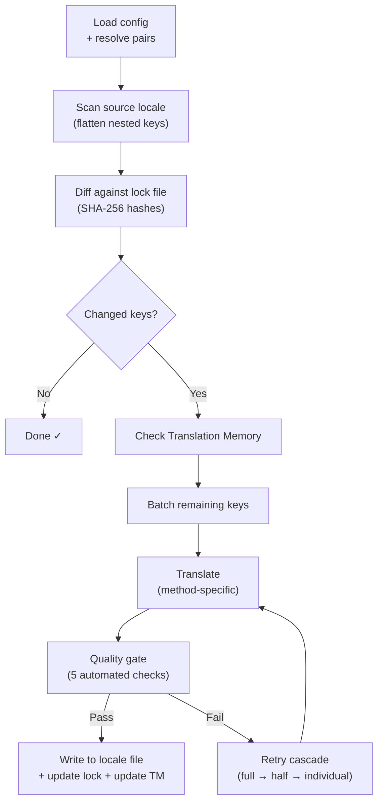

# Comment fonctionne i18n-rosetta

i18n-rosetta traduit les fichiers de paramètres régionaux de votre application à l'aide d'une seule commande. Voici son fonctionnement interne.

## Le pipeline

Lorsque vous exécutez `npx i18n-rosetta sync`, rosetta déploie un pipeline en six étapes :



**Décisions de conception clés :**

- **Détection des modifications via des hachages SHA-256.** Rosetta suit chaque valeur source avec un hachage dans `.i18n-rosetta.lock`. Lorsque vous mettez à jour une chaîne en anglais, seule cette clé est retraduite. C'est pourquoi `sync` est rapide lors des exécutions répétées — il effectue un travail minimal.

- **Mise en cache de la mémoire de traduction.** Avant d'effectuer le moindre appel API, rosetta vérifie `.rosetta/tm.json` pour trouver des traductions mises en cache (indexées par texte source + paramètre régional + méthode). Lors d'une resynchronisation typique après la modification d'une clé, 142 clés proviennent du cache et 1 clé sollicite l'API.

- **Porte de qualité avant l'écriture.** Chaque traduction passe par cinq vérifications automatisées (vide, écho de la source, boucle d'hallucination, inflation de la longueur, conformité du script) avant d'être intégrée à vos fichiers. Les échecs sont consignés et ne sont jamais acceptés silencieusement.

- **Cascade de nouvelles tentatives en cas d'échec.** Si un lot échoue (erreur d'analyse JSON, délai d'attente de l'API dépassé), rosetta réessaie avec des lots progressivement plus petits : complet → moitié → individuel. Cela permet d'isoler la clé problématique sans bloquer le reste.

## Méthodes de traduction

Rosetta prend en charge quatre méthodes de traduction, chacune adaptée à des scénarios différents :

| Méthode | Fonctionnement | Idéal pour |
|--------|-------------|----------|
| **`llm`** | Invite structurée vers n'importe quel modèle OpenRouter | Langues bien dotées en ressources |
| **`llm-coached`** | Même invite + règles de grammaire, dictionnaire et notes de style | Langues pour lesquelles les LLM commettent des erreurs prévisibles |
| **`google-translate`** | Requête par lots vers Google Cloud Translation API | Langues à fortes ressources bénéficiant d'une bonne prise en charge par GT |
| **`api`** | HTTP POST vers votre propre point de terminaison | Pipelines personnalisés, modèles contrôlés par la communauté |

Les méthodes sont configurées par paire de langues. Vous pouvez utiliser `google-translate` pour le français, mais `llm-coached` pour le cri des plaines — chaque paire bénéficie de la méthode qui lui convient le mieux.

## Données d'encadrement

Pour les paires `llm-coached`, les données d'encadrement fournissent au LLM des connaissances linguistiques explicites : règles de grammaire, terminologie imposée et préférences de style. Celles-ci sont injectées dans chaque invite sous forme de contexte structuré.

```json title="coaching/crk.json"
{
  "grammar_rules": ["Animate nouns take different plural forms than inanimate nouns"],
  "dictionary": {"welcome": "ᑕᓂᓯ", "settings": "ᐃᑕᐢᑌᐘᐃᓇ"},
  "style_notes": "Use Standard Roman Orthography (SRO) unless explicitly configured otherwise."
}
```

Les données d'encadrement constituent le mécanisme principal pour améliorer la qualité de la traduction sans procéder au réglage fin d'un modèle. Modifiez les règles → réexécutez la synchronisation → observez si cela est utile. L'itération est instantanée.

## Plugins

Les plugins sont des recettes de traduction pré-emballées pour des paires de langues spécifiques. Il s'agit de manifestes JSON — et non de code — qui indiquent à rosetta quelle méthode utiliser, avec quels paramètres, et quelle qualité a été évaluée.

```bash
i18n-rosetta plugin install ./crk-coached-v3/
i18n-rosetta sync   # uses the installed plugin for en→crk
```

Les plugins comblent le fossé entre la recherche et la production : une méthode qui obtient de bons résultats dans la [MT Eval Arena](https://mtevalarena.org) peut être conditionnée sous forme de plugin et déployée ici.

## Vue d'ensemble

i18n-rosetta représente la moitié d'un écosystème en deux parties :

- **[MT Eval Arena](https://mtevalarena.org)** — où les méthodes de traduction sont **développées et éprouvées** grâce à des évaluations reproductibles
- **i18n-rosetta** — où les méthodes éprouvées sont **déployées** pour traduire du contenu réel

Le [Eval Harness Bridge](/docs/guides/bridge) relie les deux. Une méthode qui fait ses preuves dans l'Arena est déployée ici. Les retours des locuteurs en production permettent d'améliorer la version suivante.

---

## Pour aller plus loin

- [Comment fonctionne la synchronisation](/docs/concepts/how-sync-works) — présentation détaillée étape par étape du pipeline
- [Porte de qualité](/docs/concepts/quality-gate) — les cinq vérifications automatisées
- [Mémoire de traduction](/docs/concepts/translation-memory) — mise en cache et réduction des coûts
- [Méthodes de traduction](/docs/guides/translation-methods) — comparaison détaillée des méthodes
- [Architecture](/docs/concepts/architecture) — aperçu de la conception du système