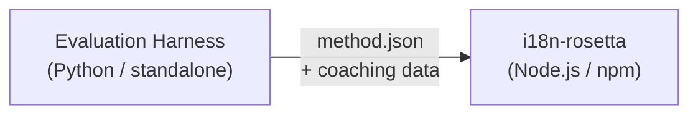

# Spécification du plugin de méthode

> **Version** : 1.1  
> **Public cible** : Développeurs de plugins  
> **Schéma canonique** : [`schemas/rosetta-plugin.schema.json`](https://github.com/gamedaysuits/i18n-rosetta/blob/main/schemas/rosetta-plugin.schema.json)

## Vue d'ensemble

i18n-rosetta utilise un **système de méthodes modulaires**. Chaque paire de langues peut utiliser une méthode de traduction différente (LLM, coachée, convertisseur de script, etc.). Les méthodes sont enregistrées dans `lib/translate.js` et résolues par paire via `lib/pairs.js`.

Le rôle du harnais d'évaluation (eval harness) est de **développer, tester et exporter** les méthodes de traduction. Le rôle d'i18n-rosetta est de les **consommer et de les exécuter**. Le harnais ne s'exécute jamais à l'intérieur de rosetta.

### Flux de données



---

## Format du plugin de méthode

Un plugin de méthode est un fichier JSON unique (`method.json`) accompagné d'éventuels fichiers de données de coaching.

### `method.json` — Requis

```json
{
  "name": "french-formal-v1",
  "type": "llm-coached",
  "version": "1.0.0",
  "description": "Formally-tuned French with terminology enforcement and grammar coaching",
  "author": "Plugin Author",

  "config": {
    "model": "google/gemini-3.5-flash",
    "register": "formal",
    "batchSize": 30,
    "temperature": 0.2
  },

  "locales": ["fr"],

  "benchmarks": {
    "fr": {
      "date": "2026-05-11T00:00:00Z",
      "corpus_size": 500,
      "exact_match_rate": 0.42,
      "corpus_chrf": 72.3,
      "corpus_bleu": 45.1,
      "model": "google/gemini-3.5-flash",
      "harness_version": "1.0.0"
    }
  },

  "provenance": {
    "resources": [],
    "commercialReady": false,
    "flags": ["license-unclear"]
  },

  "coaching": {
    "dir": "coaching"
  }
}
```

### Référence des champs

| Champ | Type | Requis | Description |
|-------|------|----------|-------------|
| `name` | string | ✅ | Identifiant unique de la méthode (kebab-case) |
| `type` | string | ✅ | Type de méthode Rosetta : `llm`, `llm-coached`, `api`, `google-translate`, `deepl`, `microsoft-translator`, `libretranslate`, `openai`, `anthropic`, `gemini` |
| `version` | string | ✅ | Version Semver (par ex. `1.0.0`) |
| `locales` | string[] | ✅ | Codes de paramètres régionaux (locales) ciblés par cette méthode (minimum 1) |
| `description` | string | — | Description lisible par l'homme |
| `author` | string | — | Personne ayant développé/testé cette méthode |
| `config.model` | string | — | Identifiant du modèle OpenRouter |
| `config.register` | string | — | Registre/ton de la langue cible |
| `config.batchSize` | number | — | Clés par lot d'API (1–200, par défaut : 30) |
| `config.temperature` | number | — | Température du LLM (0.0–2.0, par défaut : 0.3) |
| `benchmarks` | object | — | Résultats de référence (benchmark) par paramètre régional |
| `provenance` | object | — | Licences et dépendances de ressources |
| `coaching.dir` | string | — | Chemin relatif vers le répertoire de données de coaching |

### Objet Benchmark (par paramètre régional)

| Champ | Type | Requis | Description |
|-------|------|----------|-------------|
| `date` | string | ✅ | Horodatage ISO 8601 de l'exécution du benchmark |
| `corpus_size` | number | ✅ | Nombre d'entrées évaluées |
| `exact_match_rate` | number | ✅ | 0.0–1.0, proportion de correspondances exactes |
| `corpus_chrf` | number | — | Score chrF++ (0–100) |
| `corpus_bleu` | number | — | Score BLEU (0–100) |
| `model` | string | ✅ | Modèle utilisé lors de l'évaluation |
| `harness_version` | string | ✅ | Version du harnais d'évaluation utilisée |

:::info Quelles métriques sont affichées ?
La commande `rosetta status` affiche le **chrF++** et le **taux de correspondance exacte** à partir du bloc de benchmark. `corpus_bleu` est accepté dans le manifeste mais n'est actuellement ni affiché ni utilisé par aucune commande rosetta. Le [Classement des méthodes](/leaderboard) suit le chrF++, la correspondance exacte et le taux d'acceptation FST.
:::

---

### Objet Provenance

Le bloc de provenance communique le statut de licence des ressources incluses dans le plugin.

| Champ | Type | Par défaut | Description |
|-------|------|---------|-------------|
| `resources` | object[] | `[]` | Liste des ressources incluses avec `name`, `license` et `type` |
| `commercialReady` | boolean | `false` | Indique si le plugin est autorisé pour une distribution commerciale |
| `flags` | string[] | `["license-unclear"]` | Indicateurs d'état lisibles par machine |

**État par défaut** — les plugins exportés sont livrés avec `commercialReady: false` et `flags: ["license-unclear"]`.

**État autorisé** — lorsque les licences ont été vérifiées : définissez `commercialReady: true` et effacez les indicateurs.

---

## Format des données de coaching

Si `type` est `llm-coached`, le plugin doit inclure des fichiers de données de coaching dans le sous-répertoire `coaching/`.

### `coaching/<locale>.json`

```json
{
  "grammar_rules": [
    "French adjectives agree in gender and number with the noun they modify",
    "Use 'vous' for formal contexts, 'tu' for informal"
  ],
  "dictionary": {
    "dashboard": "tableau de bord",
    "deployment": "déploiement",
    "settings": "paramètres"
  },
  "style_notes": "Prefer active voice. Avoid anglicisms where a native French term exists."
}
```

| Champ | Type | Requis | Description |
|-------|------|----------|-------------|
| `grammar_rules` | string[] | — | Règles injectées dans chaque invite (prompt) LLM pour ce paramètre régional |
| `dictionary` | object | — | Mappage terme → traduction. Les termes correspondants sont injectés en tant que terminologie requise. |
| `style_notes` | string | — | Instructions de style de forme libre ajoutées à la fin de l'invite |

---

## Structure des répertoires

```
french-formal-v1/
  method.json                 # Method manifest with benchmarks
  coaching/
    fr.json                   # Coaching data for French
```

Pour les méthodes multi-locales :

```
european-formal-v2/
  method.json                 # locales: ["fr", "de", "es", "it"]
  coaching/
    fr.json
    de.json
    es.json
    it.json
```

---

## Comment Rosetta consomme les plugins

### Installation

```bash
i18n-rosetta plugin install ./french-formal-v1/
```

Enregistre dans `.rosetta/methods/french-formal-v1/`.

### Configuration

```json title="i18n-rosetta.config.json"
{
  "pairs": {
    "en:fr": {
      "methodPlugin": "french-formal-v1"
    }
  }
}
```

:::info Sémantique de fusion
Le plugin définit *quelle* méthode utiliser (`type`). La configuration de la paire ajuste *comment* l'exécuter (`model`, `register`, `batchSize`). Si la paire définit `model`, cela remplace la valeur par défaut du plugin.
:::

### Exécution

1. Rosetta lit `method.json` à partir de `.rosetta/methods/french-formal-v1/`
2. Le champ `type` du plugin définit la méthode de traduction (par ex., `llm-coached`)
3. Charge les données de coaching à partir du répertoire `coaching/` du plugin
4. Utilise le bloc `config` pour combler les lacunes concernant le modèle/registre/température
5. Le bloc `benchmarks` est affiché dans la sortie de `rosetta status`
6. Le bloc `provenance` est vérifié par `rosetta provenance` pour les indicateurs de licence

---

## Validation du schéma

Les manifestes de plugins sont validés au moment de l'installation par rapport à [`schemas/rosetta-plugin.schema.json`](https://github.com/gamedaysuits/i18n-rosetta/blob/main/schemas/rosetta-plugin.schema.json).

Référencez le schéma dans votre `method.json` pour l'autocomplétion de l'IDE :

```json
{
  "$schema": "./node_modules/i18n-rosetta/schemas/rosetta-plugin.schema.json",
  "name": "my-method-v1"
}
```

---

## Ce qu'il NE FAUT PAS inclure

- ❌ Aucun code Python ni dépendances du harnais
- ❌ Aucune donnée de corpus brute ni journaux d'exécution
- ❌ Aucune clé d'API ni identifiants
- ❌ Aucune configuration du harnais
- ❌ Aucun modèle d'invite (prompt) interne (ceux-ci résident dans les implémentations de méthodes de rosetta)

Le plugin est **uniquement composé de données** : configuration, contenu de coaching et résultats de benchmark.

---

## Voir aussi

- [Méthodes de traduction](/docs/guides/translation-methods) — comment fonctionne chaque méthode intégrée
- [Configuration](/docs/getting-started/configuration) — configuration par paire et par langue
- [Servir une méthode via API](/docs/guides/serving-a-method) — héberger des méthodes en tant que services HTTP
- [Livre de recettes : Pipeline contrôlé par FST](/docs/tutorials/fst-gated-pipeline) — construction et empaquetage d'un pipeline
- [Évaluation de la traduction automatique (MT)](/docs/eval/) — évaluation des méthodes pour soumission au classement
- [Prendre en charge une langue à faibles ressources](/docs/guides/low-resource-languages) — le cas d'utilisation des plugins communautaires