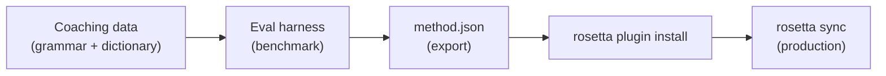

# Tutoriel : Créer un plugin de traduction

Concevez une méthode de traduction personnalisée de A à Z, évaluez ses performances et déployez-la en tant que plugin rosetta. Ceci constitue le flux de travail complet permettant d'ajouter une nouvelle paire de langues qu'aucune API prête à l'emploi ne prend en charge.

**Ce que vous allez concevoir :** Un plugin de traduction encadrée pour le français formel, intégrant une terminologie stricte, des règles grammaticales et des scores d'évaluation.

**Durée :** 30 à 45 minutes

**Prérequis :**
- i18n-rosetta installé (`npm install --save-dev i18n-rosetta`)
- Une clé API OpenRouter (`OPENROUTER_API_KEY`)
- Python 3.10+ (pour l'environnement d'évaluation)

---

## Étape 1 : Identifier le problème

Vous traduisez un tableau de bord SaaS en français. La méthode `llm` par défaut produit des traductions correctes mais incohérentes :

- Parfois, "dashboard" est traduit par "tableau de bord", d'autres fois par "panneau de contrôle"
- Le ton alterne entre les formes `tu` et `vous`
- Les termes techniques sont anglicisés de manière incohérente

Vous avez besoin d'une **application stricte de la terminologie** et d'un **contrôle du registre** que le prompt LLM générique ne fournit pas.

## Étape 2 : Créer les données d'encadrement

Créez un fichier de directives qui encode vos exigences linguistiques :

```bash
mkdir -p .rosetta/coaching
```

```json title=".rosetta/coaching/fr.json"
{
  "grammar_rules": [
    "Always use the 'vous' form for formal register",
    "French adjectives agree in gender and number with their noun",
    "Use the present tense for UI instructions, not the imperative",
    "Preserve sentence-final punctuation style from the source"
  ],
  "dictionary": {
    "dashboard": "tableau de bord",
    "deployment": "déploiement",
    "settings": "paramètres",
    "environment variable": "variable d'environnement",
    "webhook": "webhook",
    "API key": "clé API",
    "sign in": "se connecter",
    "sign out": "se déconnecter",
    "repository": "dépôt",
    "pull request": "demande de tirage"
  },
  "style_notes": "Formal technical French. Prefer native French terms over anglicisms where established equivalents exist. Keep UI labels concise — 3 words maximum where possible."
}
```

**Fonction de chaque champ :**
- **`grammar_rules`** — Injecté dans le prompt système du LLM en tant que contraintes explicites
- **`dictionary`** — Comparé aux clés sources ; lorsqu'un terme du dictionnaire apparaît, il est injecté en tant que "terminologie requise" dans le prompt
- **`style_notes`** — Ajouté au prompt système en tant que directive de style générale

## Étape 3 : Configurer la paire de langues

Indiquez à rosetta d'utiliser `llm-coached` pour le français :

```json title="i18n-rosetta.config.json"
{
  "version": 3,
  "inputLocale": "en",
  "localesDir": "./locales",
  "pairs": {
    "en:fr": {
      "method": "llm-coached",
      "model": "google/gemini-3.5-flash"
    }
  },
  "languages": {
    "fr": {
      "register": "Formal technical French (vous-form)",
      "name": "French"
    }
  }
}
```

## Étape 4 : Effectuer un test

```bash
npx i18n-rosetta sync --dry
```

Examinez la sortie de l'exécution à blanc. Vérifiez que :
- ✅ Les termes du dictionnaire sont utilisés de manière cohérente ("tableau de bord", et non "panneau de contrôle")
- ✅ La forme `vous` est utilisée de bout en bout
- ✅ Les termes techniques correspondent à votre dictionnaire

Ensuite, lancez la synchronisation réelle :

```bash
npx i18n-rosetta sync
```

## Étape 5 : Évaluer avec l'environnement d'évaluation (Facultatif)

Si vous souhaitez obtenir des scores de qualité — et c'est le cas, car les plugins sont fournis avec des données d'évaluation —, utilisez l'environnement d'évaluation associé.

### Installer l'environnement d'évaluation

```bash
git clone https://github.com/gamedaysuits/gds-mt-eval-harness.git
cd gds-mt-eval-harness
pip install -r requirements.txt
```

### Créer un corpus de référence

Créez un fichier contenant les chaînes sources et des traductions validées :

```json title="corpus/french-formal.json"
[
  {
    "source": "Dashboard",
    "reference": "Tableau de bord"
  },
  {
    "source": "Sign in to your account",
    "reference": "Connectez-vous à votre compte"
  },
  {
    "source": "Your deployment is ready",
    "reference": "Votre déploiement est prêt"
  },
  {
    "source": "Environment variables",
    "reference": "Variables d'environnement"
  }
]
```

### Exécuter l'évaluation

```bash
python harness.py eval \
  --corpus corpus/french-formal.json \
  --source en \
  --target fr \
  --method llm-coached \
  --model google/gemini-3.5-flash
```

L'environnement génère les résultats suivants :
- **chrF++** — Score F au niveau des caractères (0–100). Un score supérieur à 70 est excellent.
- **BLEU** — Chevauchement de n-grammes (0–100). Un score supérieur à 40 est solide pour une traduction encadrée.
- **Taux de correspondance exacte** — Proportion de traductions correspondant exactement à la référence.

### Exporter le plugin

Une fois que vous êtes satisfait des scores :

```bash
python harness.py export \
  --name french-formal-v1 \
  --output ./french-formal-v1/
```

Cela crée :

```
french-formal-v1/
├── method.json          # Manifest with config + benchmarks
└── coaching/
    └── fr.json          # Your coaching data
```

## Étape 6 : Installer le plugin dans Rosetta

```bash
npx i18n-rosetta plugin install ./french-formal-v1/
```

Cela copie le plugin dans `.rosetta/methods/french-formal-v1/`.

Mettez à jour votre configuration pour l'utiliser :

```json title="i18n-rosetta.config.json"
{
  "pairs": {
    "en:fr": {
      "methodPlugin": "french-formal-v1"
    }
  }
}
```

## Étape 7 : Vérifier

```bash
# Check plugin is installed and shows benchmark scores
npx i18n-rosetta status

# Run a sync with the plugin
npx i18n-rosetta sync

# Audit licensing status
npx i18n-rosetta provenance
```

La sortie `status` affichera :

```
en → fr
  Method:    french-formal-v1 (llm-coached)
  Model:     google/gemini-3.5-flash
  Quality:   high
  chrF++:    74.2
  BLEU:      46.8
  Exact:     42%
```

## Ce que vous avez accompli



Vous disposez désormais de :
1. **Données d'encadrement** — Règles grammaticales et terminologie garantissant la cohérence
2. **Scores d'évaluation** — Qualité quantifiée intégrée au plugin
3. **Un plugin portable** — `method.json` + données d'encadrement, installable sur n'importe quelle machine
4. **Déploiement en production** — Intégré à votre pipeline de synchronisation

## Étapes suivantes

- **[Spécification du plugin](/docs/reference/plugin-spec)** — Référence complète du format du manifeste
- **[Méthodes de traduction](/docs/guides/translation-methods)** — Comparaison des quatre méthodes
- **[Langues à faibles ressources](https://mtevalarena.org/docs/community/low-resource-languages)** — Appliquer ce modèle aux langues non couvertes par les API
- **[Traduire en 30 langues](/docs/tutorials/translate-30-languages)** — Faire évoluer votre projet pour un public mondial