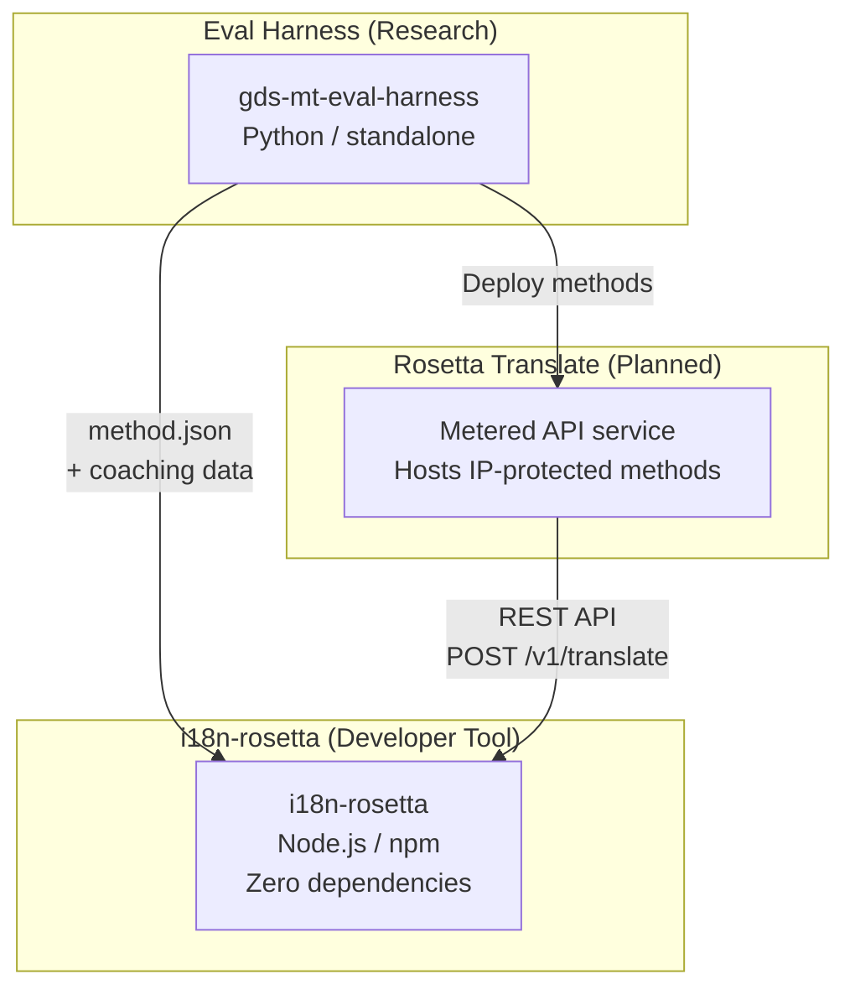
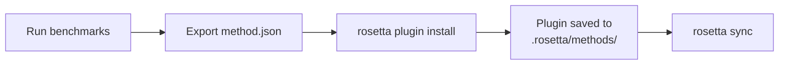
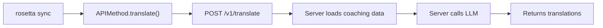

# アーキテクチャ

Rosetta翻訳エコシステムは、明確に定義されたコントラクトを通じて連携する3つの独立したツールで構成されています。ビルド時に互いに依存するものはありません。これらは、共有の**メソッドプラグイン形式**と**REST APIコントラクト**を通じて通信します。

## 3つの構成要素



### i18n-rosetta (本プロジェクト)

オープンソースの開発者向けツールです。プラガブルなメソッドを使用してロケールファイルを翻訳します。依存関係ゼロ、設定は任意で、すぐに使用できます。

**組み込みメソッド:**
- `llm` → OpenRouter / 任意のLLM (200以上のモデル)
- `llm-coached` → LLM + 文法/辞書コーチング
- `openai` → 直接のOpenAI API (GPT-4o、GPT-4o-mini)
- `anthropic` → 直接のAnthropic API (Claude Sonnet、Haiku、Opus)
- `gemini` → 直接のGoogle Gemini API (Flash、Pro — 無料枠あり)
- `google-translate` → Google Cloud Translation API v2
- `deepl` → 用語集をサポートするDeepL API
- `microsoft-translator` → Azure Cognitive Services Translator
- `libretranslate` → セルフホストのLibreTranslate (AGPL、無料)
- `api` → 任意のリモートRESTエンドポイントへの軽量パイプ

### Eval Harness (関連プロジェクト)

翻訳メソッドの開発、テスト、ベンチマークを行うための研究ツールです。メソッドが許容できる品質に達すると、harnessは**メソッドプラグイン** (`method.json`マニフェストとオプションのコーチングデータファイル) をエクスポートします。

harnessがrosetta内で実行されることはありません。静的な出力 (JSONファイル) を生成する独立したツールです。rosettaはそれらのファイルを読み込むだけです。

[→ GitHubのEval Harness](https://github.com/gamedaysuits/gds-mt-eval-harness)

### Rosetta Translate (計画中)

独自の翻訳メソッドをサーバー側でホストする従量課金制のAPIサービスです。プロンプト、コーチングデータ、言語パイプラインがサーバーから外部に出ることはありません。

## 連携の仕組み

### Eval Harness → i18n-rosetta (一方向のエクスポート)



**コントラクト**: [プラグイン仕様](/docs/reference/plugin-spec)

### Rosetta Translate → i18n-rosetta (実行時のAPI)



Rosettaの`APIMethod`は**ダムパイプ (dumb pipe)**です。キーを送信し、翻訳を受け取ります。翻訳ロジックや独自のコンテンツは一切含まれていません。

## 各構成要素の相互認識

| ツール | rosettaを認識しているか？ | Rosetta Translateを認識しているか？ | harnessを認識しているか？ |
|------|---------------------|-------------------------------|---------------------|
| **i18n-rosetta** | *(rosetta自身)* | はい — `api`メソッドが呼び出します | いいえ — プラグインのエクスポートを読み込むだけです |
| **Rosetta Translate** | はい — リクエストを処理します | *(Rosetta Translate自身)* | いいえ — デプロイされたメソッドを受け取ります |
| **Eval Harness** | はい — プラグイン形式をエクスポートします | いいえ — メソッドは個別にデプロイされます | *(harness自身)* |

## ユーザーシナリオ

### シナリオ1: 無料、設定不要 (ほとんどのユーザー)

```bash
export OPENROUTER_API_KEY=sk-...
npx i18n-rosetta sync
```

組み込みの`llm`メソッドを使用します。プラグイン、Rosetta Translate、harnessは使用しません。

### シナリオ2: Google Translateのベースライン

```bash
export GOOGLE_TRANSLATE_API_KEY=AIza...
npx i18n-rosetta sync
```

組み込みの`google-translate`メソッドを使用します。プラグインは不要です。

### シナリオ3: コーチングがバンドルされたオープンプラグイン

```bash
rosetta plugin install ./french-formal-v1/
rosetta sync
```

プラグインには`type: "llm-coached"`が含まれています → rosettaはユーザー自身のOpenRouterキーを使用します。コーチングデータはローカルにあります (サーバー呼び出しなし)。

### シナリオ4: DIYコーチング (プラグインなし、harnessなし)

```json title="i18n-rosetta.config.json"
{
  "pairs": {
    "en:fr": { "method": "llm-coached" }
  }
}
```

ユーザーは`.rosetta/coaching/fr.json`で独自の文法ルールと辞書を管理します。

## 設計原則

1. **循環依存なし。** ブリッジは一方向です。
2. **Rosettaは軽量なコア。** 依存関係ゼロ、設定は任意です。プラグインとAPIは追加要素です。
3. **IP保護はアーキテクチャレベル。** 独自の技術はサーバー側に留まります。npmパッケージには独自のものは一切含まれません。
4. **プラグイン形式がコントラクト。** すべては`method.json`を通じて流れます。
5. **各ツールの役割は1つ。** Harness → メソッドの開発。Rosetta Translate → メソッドのホスト。Rosetta → ファイルの翻訳。

---

## 関連項目

- [翻訳メソッド](/docs/guides/translation-methods) — 各組み込みメソッドの仕組み
- [プラグイン仕様](/docs/reference/plugin-spec) — method.jsonマニフェストの形式
- [Eval Harness](https://mtevalarena.org/docs/specifications/harness) — 関連する研究ツール
- [API経由でのメソッドの提供](/docs/guides/serving-a-method) — カスタム翻訳パイプラインのホスティング
- [低リソース言語のサポート](https://mtevalarena.org/docs/community/low-resource-languages) — このアーキテクチャを推進したユースケース