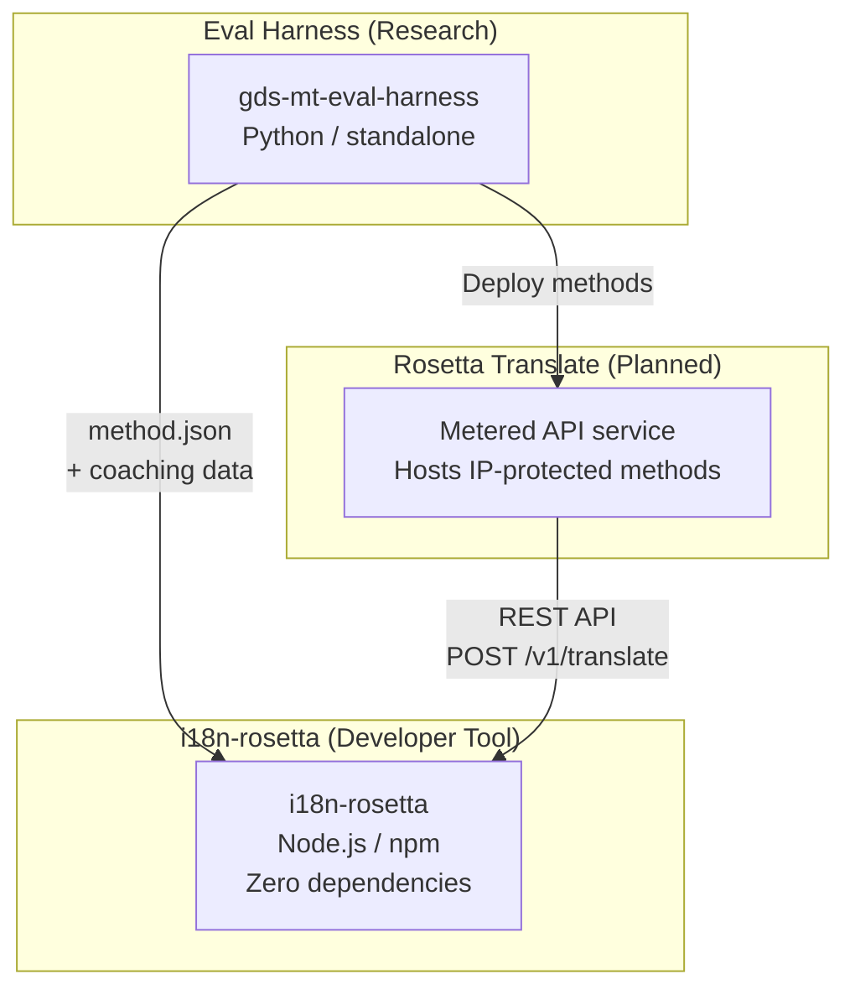
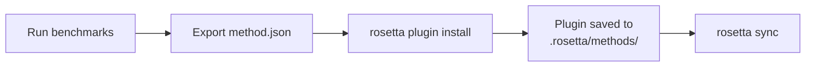
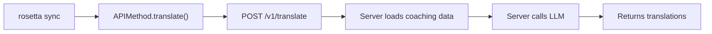
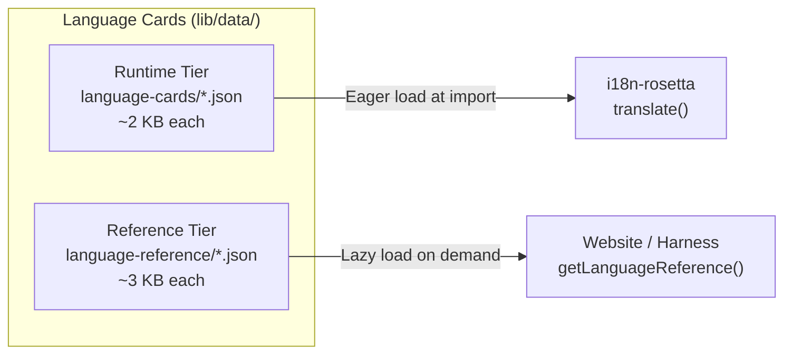

# アーキテクチャ

Rosetta翻訳エコシステムは、明確に定義されたコントラクトを通じて連携する3つの独立したツールで構成されています。ビルド時に互いに依存するものはありません。これらは、共有の**メソッドプラグイン形式**と**REST APIコントラクト**を通じて通信します。

## 3つのコンポーネント



### i18n-rosetta (本プロジェクト)

オープンソースの開発者向けツールです。プラグイン可能なメソッドを使用してロケールファイルを翻訳します。依存関係ゼロ、設定は任意で、すぐに使用できます。

**組み込みメソッド:**
- `llm` → OpenRouter / 任意のLLM (200以上のモデル)
- `llm-coached` → LLM + 文法/辞書コーチング
- `openai` → 直接のOpenAI API (GPT-4o、GPT-4o-mini)
- `anthropic` → 直接のAnthropic API (Claude Sonnet、Haiku、Opus)
- `gemini` → 直接のGoogle Gemini API (Flash、Pro — 無料枠あり)
- `google-translate` → Google Cloud Translation API v2
- `deepl` → 用語集をサポートするDeepL API
- `microsoft-translator` → Azure Cognitive Services Translator
- `libretranslate` → セルフホスト型LibreTranslate (AGPL、無料)
- `api` → 任意のリモートRESTエンドポイントへのシンパイプ

### Eval Harness (関連プロジェクト)

翻訳メソッドの開発、テスト、ベンチマークを行うための研究ツールです。メソッドが許容できる品質に達すると、Harnessは**メソッドプラグイン**（`method.json`マニフェストとオプションのコーチングデータファイル）をエクスポートします。

Harnessがrosetta内で実行されることはありません。これは静的な出力（JSONファイル）を生成する独立したツールです。rosettaはそれらのファイルを読み込むだけです。

[→ GitHubのEval Harness](https://github.com/gamedaysuits/gds-mt-eval-harness)

### Rosetta Translate (計画中)

独自の翻訳メソッドをサーバーサイドでホストする従量課金制のAPIサービスです。プロンプト、コーチングデータ、言語パイプラインがサーバーの外部に出ることはありません。

## 連携の仕組み

### Eval Harness → i18n-rosetta (一方向のエクスポート)



**コントラクト**: [プラグイン仕様](/docs/reference/plugin-spec)

### Rosetta Translate → i18n-rosetta (実行時のAPI)



Rosettaの`APIMethod`は**ダムパイプ (dumb pipe)**です。キーを送信し、翻訳を受け取ります。翻訳ロジックや独自のコンテンツは一切含まれていません。

## 各コンポーネントの相互認識

| ツール | rosettaを認識しているか？ | Rosetta Translateを認識しているか？ | Harnessを認識しているか？ |
|------|---------------------|-------------------------------|---------------------|
| **i18n-rosetta** | *(rosetta自身)* | はい — `api`メソッドが呼び出します | いいえ — プラグインのエクスポートを読み込むだけです |
| **Rosetta Translate** | はい — リクエストを処理します | *(Rosetta Translate自身)* | いいえ — デプロイされたメソッドを受け取ります |
| **Eval Harness** | はい — プラグイン形式をエクスポートします | いいえ — メソッドは個別にデプロイされます | *(Harness自身)* |

## ユーザーシナリオ

### シナリオ1: 無料、設定不要 (ほとんどのユーザー)

```bash
export OPENROUTER_API_KEY=sk-...
npx i18n-rosetta sync
```

組み込みの`llm`メソッドを使用します。プラグイン、Rosetta Translate、Harnessは使用しません。

### シナリオ2: Google Translateのベースライン

```bash
export GOOGLE_TRANSLATE_API_KEY=AIza...
npx i18n-rosetta sync
```

組み込みの`google-translate`メソッドを使用します。プラグインは不要です。

### シナリオ3: コーチングがバンドルされたオープンプラグイン

```bash
rosetta plugin install ./french-formal-v1/
rosetta sync
```

プラグインには`type: "llm-coached"`が含まれます → rosettaはユーザー自身のOpenRouterキーを使用します。コーチングデータはローカルにあります（サーバー呼び出しなし）。

### シナリオ4: DIYコーチング (プラグインなし、Harnessなし)

```json title="i18n-rosetta.config.json"
{
  "pairs": {
    "en:fr": { "method": "llm-coached" }
  }
}
```

ユーザーは`.rosetta/coaching/fr.json`で独自の文法ルールと辞書を管理します。

## Language Cards

rosettaの各言語は、**Language Card**を通じて設定されます。これは、レジスター（使用域）のプリセット、丁寧さのルール、メソッドのサポートフラグ、タイポグラフィの規則を含むJSONファイルです。Language Cardは、レジスター制御の翻訳を駆動する言語ごとの設定です。



大規模なパフォーマンス（700以上の言語を対象）を実現するため、カードは2つの階層に分かれています。

- **ランタイム層** (`language-cards/`): 事前読み込み（Eager load）されます。翻訳エンジンが必要とするフィールド（レジスター、丁寧さ、メソッドのサポート、タイポグラフィのルール）が含まれます。
- **リファレンス層** (`language-reference/`): 遅延読み込み（Lazy load）されます。開発者向けドキュメント（言語的な課題、語族、NLPリソース）が含まれます。

両方の階層は、`scripts/generate-language-card.mjs`を使用して信頼できる情報源（IANA、CLDR、Glottolog）から生成され、その後、言語的な正確性を確保するために人間によってキュレーションされます。

## 設計原則

1. **循環依存の排除。** ブリッジは一方向です。
2. **Rosettaは軽量なコア。** 依存関係ゼロ、設定は任意です。プラグインとAPIは追加要素です。
3. **IP保護はアーキテクチャに組み込まれています。** 独自の技術はサーバーサイドに留まります。npmパッケージには独自のものは一切含まれません。
4. **プラグイン形式がコントラクトです。** すべては`method.json`を通じて流れます。
5. **各ツールの役割は1つです。** Harness → メソッドの開発。Rosetta Translate → メソッドのホスト。Rosetta → ファイルの翻訳。

---

## 関連項目

- [翻訳メソッド](/docs/guides/translation-methods) — 各組み込みメソッドの仕組み
- [プラグイン仕様](/docs/reference/plugin-spec) — method.jsonマニフェストの形式
- [Eval Harness](https://mtevalarena.org/docs/specifications/harness) — 関連する研究ツール
- [API経由でのメソッドの提供](/docs/guides/serving-a-method) — カスタム翻訳パイプラインのホスティング
- [低資源言語のサポート](https://mtevalarena.org/docs/community/low-resource-languages) — このアーキテクチャを推進したユースケース