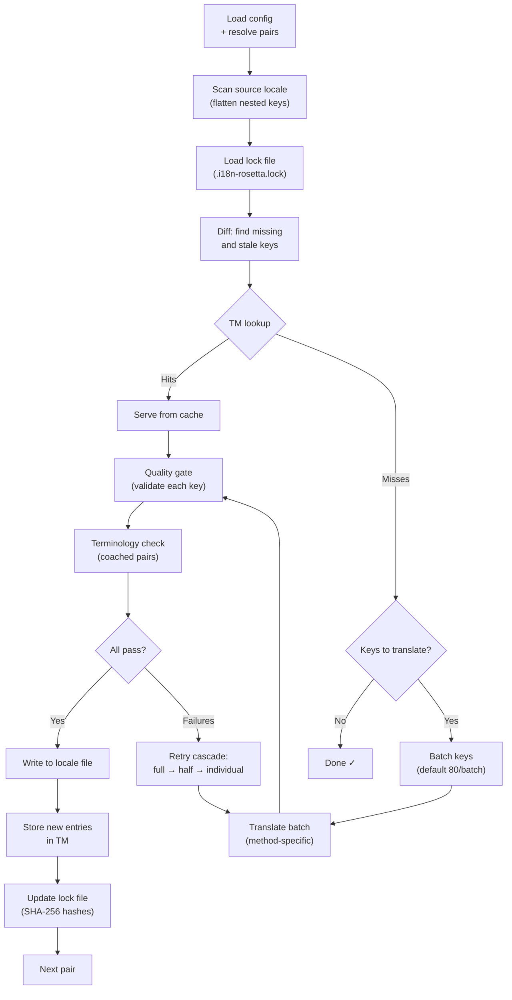

# Syncの仕組み

`sync` コマンドはrosettaのコアとなる操作です。`npx i18n-rosetta sync` を実行した際の処理の流れは以下の通りです。

## パイプラインの概要



## ステップごとの解説

### 1. 設定の解決

Rosettaは `i18n-rosetta.config.json` を読み込みます（または設定を自動検出します）。以下の項目を解決します：
- ソースロケールとターゲットロケール
- ペアグラフ（どのソース→ターゲットの組み合わせを処理するか）
- ペアごとのメソッド、モデル、品質設定

ファイルをスキャンする前に、rosettaはスタートアップヘッダーを出力します：

```
i18n-rosetta v3.3.1

[INFO] Detected format: json (auto)
[INFO] Detected framework: Hugo
```

- **バージョンバナー**: デバッグや問題報告のために、インストールされているバージョンを表示します。
- **フォーマット検出**: ファイルフォーマットと、それが自動検出されたか（`(auto)`）、明示的に設定されたか（`(config)`）を報告します。`json`、`toml`、`yaml` をサポートしています。
- **フレームワーク検出**: `contentDir` が設定されている場合、フレームワーク（`Hugo`）を識別し、コンテンツの同期がアクティブであることを確認します。

### 2. ソースのスキャン

ソースロケールファイルが読み込まれ、キー→値のマップにフラット化されます：

```json
// Input (nested)
{ "hero": { "title": "Welcome", "subtitle": "Build" } }

// Flattened
{ "hero.title": "Welcome", "hero.subtitle": "Build" }
```

### 3. 変更の検出

Rosettaは、以前に翻訳されたソース値のSHA-256ハッシュを保存している `.i18n-rosetta.lock` を読み込みます。各キーについて以下を確認します：

| 条件 | アクション |
|-----------|--------|
| ターゲットにキーが存在しない | **翻訳する** |
| 前回の同期からソースのハッシュが変更された | **再翻訳する** (stale) |
| ターゲットの値が `[EN]` で始まる | **再翻訳する** (レガシーフォールバックマーカー) |
| ソースのハッシュが変更されておらず、キーが存在する | **スキップする** |

これが、rosettaが変更された部分のみを翻訳する理由です。同期のたびにファイル全体を再翻訳することはありません。

### 4. バッチ処理

キーはバッチにグループ化されます（デフォルト：LLMの場合は80キー/バッチ、Google Translateの場合は128キー/バッチ）。バッチ処理により、プロンプトを管理可能なサイズに保ちつつ、APIのラウンドトリップを削減します。

翻訳中、rosettaは各バッチの完了後に更新されるインラインのプログレスバーを表示します：

```
[INFO] fr.json — 2,847 missing
     ████████████████░░░░░░░░░░░░░░░░ 1,440/2,847 keys
```

プログレスバーは、インプレース更新のために `\r` キャリッジリターンを使用してレンダリングされ、スクロールは発生しません。`--quiet` および `--json` モードでは非表示になります。

### 4b. 翻訳メモリ

バッチ処理の前に、rosettaは翻訳メモリのキャッシュ（`.rosetta/tm.json`）を確認します。ソーステキスト＋ロケール＋メソッドが以前の翻訳と一致するキーは、キャッシュから即座に提供され、API呼び出しは不要です。

```
  [TM] 142 key(s) served from cache
  Translating 3 key(s) to French (llm)... [OK]
```

TM（翻訳メモリ）は、コスト削減の主要なメカニズムです。1つのキーを変更した後に同期を再実行した場合、ファイル全体ではなく、その1つのキーのみが翻訳されます。詳細は [Translation Memory](/docs/concepts/translation-memory) を参照してください。

1回の実行でキャッシュをバイパスするには： `i18n-rosetta sync --no-tm`

### 5. 翻訳

各バッチは、設定された翻訳メソッドに送信されます：

- **`llm`**: レジスター（文体）や性別のガイダンス指示を含む、OpenRouterへの構造化プロンプト
- **`llm-coached`**: 上記と同様ですが、文法ルール、辞書、スタイルノートが注入されます
- **`google-translate`**: Google Cloud Translation API v2のバッチリクエスト
- **`api`**: リモートエンドポイントへのHTTP POST

システムメッセージ（レジスター、性別ガイダンス、ルール）は、特定のロケールのすべてのバッチで同一であるため、**プロンプトキャッシング**が可能になります。AnthropicやGoogleなどのプロバイダーは、繰り返されるシステムメッセージをキャッシュし、トークンコストを削減します。

### 6. 品質ゲート

すべての翻訳は、ディスクに書き込まれる前に検証されます。以下の5つのチェックが実行されます：

| チェック | 検出内容 | 例 |
|-------|----------------|---------|
| **Empty/blank** | モデルが何も返さなかった | `""` |
| **Source echo** | モデルが英語の入力をそのまま返した | 日本語に対する `"Welcome"` |
| **Hallucination loop** | 繰り返されるトライグラム（3文字/3単語の連続） | `"Qo' Qo' Qo' Qo'"` |
| **Length inflation** | 出力がソースの4倍以上の長さになっている | 10文字のソース → 50文字の出力 |
| **Script compliance** | ロケールに対して誤った文字体系（スクリプト） | アラビア語ロケールに対するラテン文字のテキスト |

失敗は `[GATE]` プレフィックスとともにログに記録されます。暗黙のフォールバックはありません。

詳細は [Quality Gate](/docs/concepts/quality-gate) を参照してください。

### 6b. 用語の検証

辞書を使用するcoachedペアの場合、rosettaは翻訳後にLLMが実際に指定された用語を使用したかどうかを確認します。違反は `[TERM]` 警告としてログに記録されます：

```
[TERM] en→fr: 2 term violation(s)
  • "dashboard" → expected "tableau de bord" but got "panneau"
```

これらは警告であり、ブロックするエラーではありません。翻訳はそのまま書き込まれます。

### 7. リトライカスケード

JSONのパース失敗やバッチレベルのエラーが発生した場合、rosettaはバッチサイズを段階的に小さくしてリトライします：

```
Full batch (80 keys) → Failed
  └→ Half batch (40 keys) → 1 failure
      └→ Individual keys (1 each) → Isolates the problem key
```

トークンの過剰な消費を防ぐため、リトライの回数は `maxRetries` （デフォルト：3）に制限されています。

### 8. 書き込みとロック

検証を通過した翻訳は、元のネスト構造を保持したままターゲットロケールファイルに書き込まれます。ロックファイルは新しいSHA-256ハッシュで更新されます。

### 9. 検証

すべてのペアが処理された後、rosettaはディスクから書き込まれたロケールファイルを再読み込みし、検証パスを実行します（`--no-verify` が設定されている場合を除く）。これにより、同期が成功したと報告されたにもかかわらず、実際にはキーが間違っているというギャップを検出します：

- **キーのパリティ** — すべてのソースキーが各ターゲットに存在すること
- **`[EN]` フォールバックマーカー** — 以前の実行時のレガシーマーカー
- **空の翻訳** — すり抜けた空白の値
- **文字体系の準拠** — ASCIIのみの翻訳が含まれる非ラテンロケール
- **プレースホルダーの保持** — ICUプレースホルダーがソースと一致すること
- **エンコーディングの問題** — BOMマーカー、不可視文字

これは、CIゲート用のスタンドアロンの `i18n-rosetta verify` コマンドとしても利用可能です。

## コンテンツの翻訳 (フェーズ2)

DocusaurusおよびHugoプロジェクトの場合、`sync` はJSONキーの翻訳後に第2フェーズを実行します。このフェーズでは、同じメソッドと品質ゲートを使用して、MarkdownおよびMDXファイル（ドキュメント、ブログ記事、チュートリアル）を翻訳します。

### 仕組み

1. Rosettaは、content/docsディレクトリを走査して、すべてのソースコンテンツファイル（`.md`、`.mdx`）を検出します。
2. 各ファイル×ロケールのペアについて、個別のコンテンツロックファイル（`.i18n-rosetta-content.lock`）でSHA-256ハッシュの変更を確認します。
3. 変更されたファイルや欠落しているファイルは、フラットな作業アイテムプールに収集されます。
4. プールは**並列処理**で処理されます（デフォルト：同時に12個のAPI呼び出し）。

```
Phase 2: content (79 translations to process, 341 skipped, concurrency: 12)

    [1/79] (1%)  docs/concepts/security.md → ja [RE-TRANSLATE] (~3328s left)
    [2/79] (3%)  docs/concepts/security.md → th [RE-TRANSLATE] (~1821s left)
    ...
    [79/79] (100%) blog/v3-2-quality.md → de [OK]

  [OK] Created 79 content file(s), 341 unchanged
```

### 並列処理

フェーズ1（JSONキー）とフェーズ2（コンテンツ）の両方が並列で実行されるようになりました：

- **フェーズ1**: すべてのロケールの翻訳が同時に実行されます（デフォルト：同時に50ロケール）。各ロケール内でも、APIバッチが並列で実行されます（同時に4バッチ）。120キーを持つ12ロケールの同期は、約15分ではなく約1分で完了します。
- **フェーズ2**: すべてのファイル×ロケールの組み合わせが、フラットなプールとして翻訳されます（デフォルト：同時に12個のAPI呼び出し）。異なるファイルと異なるロケールが同時に翻訳されます。

並列処理は `--json-concurrency`、`--content-concurrency`、または `--concurrency` （両方を設定）で制御します：

```bash
# Faster JSON sync (more parallel locale translations)
npx i18n-rosetta sync --json-concurrency 30

# Faster content sync (more parallel API calls)
npx i18n-rosetta sync --content-concurrency 20

# Slower (gentler on rate limits)
npx i18n-rosetta sync --concurrency 4
```

### コンテンツの保護

翻訳中、rosettaは翻訳対象外のコンテンツを保護します：

- **コードブロック**（フェンスおよびインデント）はプレースホルダーに置き換えられます
- `translatableFields` リストに含まれない**フロントマター**のフィールドはそのまま保持されます
- **リンク**、画像パス、HTMLタグは保護されます
- **ショートコード**と補間変数（例：`{count}`、`{{.Params.title}}`）は保護されます

翻訳後、すべてのプレースホルダーが復元され、検証されます。欠落や破損がある場合、翻訳は拒否され、リトライされます。

## 部分的な成功

1つのバッチが失敗しても、残りのバッチはブロックされません。10個中9個のバッチが成功した場合、その9個は書き込まれます。失敗したバッチはログに記録され、`sync` を再実行することでリトライできます。

## ドライラン

ファイルを書き込まずに、何が変更されるかをプレビューします：

```bash
npx i18n-rosetta sync --dry-run
```

## 強制再翻訳

変更されていない場合でも、特定のキーを強制的に再翻訳します：

```bash
npx i18n-rosetta sync --force-keys "hero.title,nav.about"
```

## コスト見積もり

翻訳前に、rosettaはペアごとの推定コストを示す**同期前コストレポート**を生成します。これはすべての `sync` 実行時に自動的に実行され、API呼び出しが行われる前に確認できます。

```
╔══════════════════════════════════════════════════════════╗
║  Cost Estimate                                          ║
╠════════════╦═══════╦════════════╦════════════════════════╣
║ Pair       ║ Keys  ║ Est. Cost  ║ Method                 ║
╠════════════╬═══════╬════════════╬════════════════════════╣
║ en → fr    ║   142 ║ $0.07      ║ google-translate       ║
║ en → ja    ║    38 ║   —        ║ llm (model-dependent)  ║
║ en → crk   ║    38 ║   —        ║ llm-coached            ║
╚════════════╩═══════╩════════════╩════════════════════════╝
```

### 見積もりの対象

各翻訳メソッドは、独自のコスト見積もりを提供します：

| メソッド | コストの基準 | 精度 |
|--------|-----------|-----------|
| `google-translate` | Googleの公開レート（$20/100万文字） | 正確 |
| `llm` | OpenRouterのモデルによって異なる | モデル依存 — [OpenRouter pricing](https://openrouter.ai/models) を確認 |
| `llm-coached` | `llm` と同じ ＋ コーチングコンテキストのトークン | モデル依存 |
| `api` | サーバー側で決定 | 不明 — エンドポイントにクエリを送信しないと見積もり不可 |

メソッドがコストを決定できない場合（LLMメソッド、リモートAPI）、rosettaは推測せずに `—` と報告します。実際に翻訳せずにコスト見積もりを確認するには、`--dry` を使用してください。

---

## 関連項目

- [CLI Reference — sync](/docs/reference/cli#sync) — コマンドのフラグとオプション
- [Translation Memory](/docs/concepts/translation-memory) — キャッシュとコスト削減
- [Quality Gate](/docs/concepts/quality-gate) — 翻訳の検証方法
- [Translation Methods](/docs/guides/translation-methods) — 各メソッドの仕組み
- [Working with Professional Translators](/docs/guides/professional-translators) — XLIFFワークフロー
- [Configuration](/docs/getting-started/configuration) — 設定リファレンス
- [CI/CD Guide](/docs/guides/ci-cd) — パイプラインでの同期の自動化