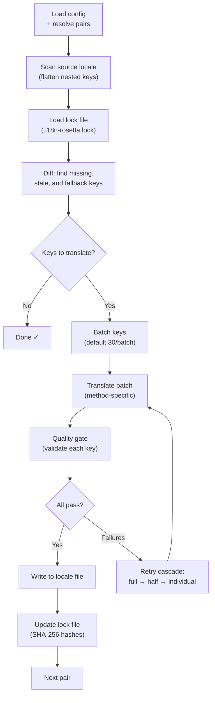

# Syncの仕組み

`sync`コマンドはrosettaのコアとなる操作です。`npx i18n-rosetta sync`を実行すると、以下の処理が行われます。

## パイプラインの概要



## 処理の手順

### 1. 設定の解決

rosettaは`i18n-rosetta.config.json`を読み込みます（または設定を自動検出します）。以下の内容を解決します：
- ソースロケールとターゲットロケール
- ペアグラフ（どのソース→ターゲットの組み合わせを処理するか）
- ペアごとのメソッド、モデル、および品質設定

### 2. ソースのスキャン

ソースロケールファイルが読み込まれ、キー→値のマップにフラット化されます：

```json
// Input (nested)
{ "hero": { "title": "Welcome", "subtitle": "Build" } }

// Flattened
{ "hero.title": "Welcome", "hero.subtitle": "Build" }
```

### 3. 変更の検出

rosettaは、以前に翻訳されたソース値のSHA-256ハッシュを保存している`.i18n-rosetta.lock`を読み込みます。各キーについて、以下を確認します：

| 条件 | アクション |
|-----------|--------|
| ターゲットにキーが存在しない | **翻訳** |
| 前回の同期からソースのハッシュが変更された | **再翻訳** (古い) |
| ターゲット値が`[EN]`で始まる | **再翻訳** (フォールバックプレースホルダー) |
| ソースのハッシュが変更されておらず、キーが存在する | **スキップ** |

これが、rosettaが変更された部分のみを翻訳する理由です。同期のたびにファイル全体を再翻訳するわけではありません。

### 4. バッチ処理

キーはバッチにグループ化されます（デフォルト：LLMの場合は30キー/バッチ、Google Translateの場合は128キー/バッチ）。バッチ処理により、プロンプトを管理しやすいサイズに保ちながら、APIのラウンドトリップを削減します。

### 5. 翻訳

各バッチは、設定された翻訳メソッドに送信されます：

- **`llm`**: 敬語（レジスター）や性別に関するガイダンス指示を含む、OpenRouterへの構造化プロンプト
- **`llm-coached`**: 上記と同様ですが、文法ルール、辞書、スタイルノートが注入されます
- **`google-translate`**: Google Cloud Translation API v2のバッチリクエスト
- **`api`**: リモートエンドポイントへのHTTP POST

システムメッセージ（敬語、性別ガイダンス、ルール）は、特定のロケールのすべてのバッチで同一であるため、**プロンプトキャッシング**が可能になります。AnthropicやGoogleなどのプロバイダーは、繰り返されるシステムメッセージをキャッシュし、トークンコストを削減します。

### 6. 品質ゲート

すべての翻訳は、ディスクに書き込まれる前に検証されます。5つのチェックが実行されます：

| チェック | 検出内容 | 例 |
|-------|----------------|---------|
| **空/空白** | モデルが何も返さなかった | `""` |
| **ソースのエコー** | モデルが入力された英語をそのまま返した | 日本語の場合の`"Welcome"` |
| **ハルシネーションループ** | 繰り返されるトライグラム | `"Qo' Qo' Qo' Qo'"` |
| **長さの膨張** | 出力がソースの4倍以上の長さになっている | 10文字のソース → 50文字の出力 |
| **文字体系の準拠** | ロケールに対して誤った文字体系（スクリプト） | アラビア語ロケールに対するラテン文字のテキスト |

失敗した場合は、`[GATE]`プレフィックスを付けてログに記録されます。サイレントフォールバックは行われません。

詳細は[Quality Gate](/docs/concepts/quality-gate)をご覧ください。

### 7. リトライカスケード

JSONの解析エラーやバッチレベルのエラーが発生した場合、rosettaはバッチサイズを段階的に小さくしてリトライします：

```
Full batch (30 keys) → Failed
Half batch (15 keys) → Failed
Individual keys (1 each) → Isolates the problem key
```

トークンの過剰消費を防ぐため、リトライの上限は`maxRetries`（デフォルト：3）に制限されています。

### 8. 書き込みとロック

検証に合格した翻訳は、元のネスト構造を保持したままターゲットロケールファイルに書き込まれます。ロックファイルは新しいSHA-256ハッシュで更新されます。

## 部分的な成功

1つのバッチが失敗しても、他のバッチの処理はブロックされません。10個中9個のバッチが成功した場合、その9個が書き込まれます。失敗したバッチはログに記録され、`sync`を再実行することでリトライできます。

## ドライラン

ファイルを書き込まずに、何が変更されるかをプレビューします：

```bash
npx i18n-rosetta sync --dry
```

## 強制再翻訳

変更がない場合でも、特定のキーを強制的に再翻訳します：

```bash
npx i18n-rosetta sync --force-keys "hero.title,nav.about"
```

## コスト見積もり

翻訳を行う前に、rosettaはペアごとの見積もりコストを示す**同期前コストレポート**を生成します。これはすべての`sync`の実行時に自動的に行われ、API呼び出しが行われる前に確認できます。

```
╔══════════════════════════════════════════════════════════╗
║  Cost Estimate                                          ║
╠════════════╦═══════╦════════════╦════════════════════════╣
║ Pair       ║ Keys  ║ Est. Cost  ║ Method                 ║
╠════════════╬═══════╬════════════╬════════════════════════╣
║ en → fr    ║   142 ║ $0.07      ║ google-translate       ║
║ en → ja    ║    38 ║   —        ║ llm (model-dependent)  ║
║ en → crk   ║    38 ║   —        ║ llm-coached            ║
╚════════════╩═══════╩════════════╩════════════════════════╝
```

### 見積もりの対象

各翻訳メソッドは、独自のコスト見積もりを提供します：

| メソッド | コスト基準 | 精度 |
|--------|-----------|-----------|
| `google-translate` | Googleの公開料金（$20/100万文字） | 正確 |
| `llm` | OpenRouterのモデルにより異なる | モデルに依存 — [OpenRouter pricing](https://openrouter.ai/models)を確認 |
| `llm-coached` | `llm`と同様、さらにコーチングコンテキストのトークンが追加 | モデルに依存 |
| `api` | サーバー側で決定 | 不明 — エンドポイントにクエリを送信しないと見積もり不可 |

メソッドがコストを決定できない場合（LLMメソッド、リモートAPIなど）、rosettaは推測する代わりに`—`を報告します。実際に翻訳せずにコスト見積もりを確認するには、`--dry`を使用してください。

---

## 関連項目

- [CLIリファレンス — sync](/docs/reference/cli#sync) — コマンドのフラグとオプション
- [Quality Gate](/docs/concepts/quality-gate) — 翻訳の検証方法
- [翻訳メソッド](/docs/guides/translation-methods) — 各メソッドの仕組み
- [設定](/docs/getting-started/configuration) — 設定リファレンス
- [CI/CDガイド](/docs/guides/ci-cd) — パイプラインでの同期の自動化