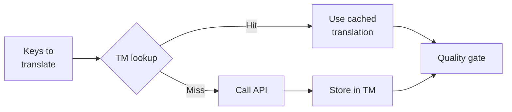

# Translation Memory

Translation Memory (TM) は、rosettaに組み込まれたキャッシュレイヤーです。ソーステキスト + ロケール + メソッドをキーとしてすべての翻訳を保存するため、`sync` を再実行した際、本当に変更されたキーに対してのみAPIを呼び出します。

## TMが存在する理由

TMがない場合、以前の実行で同じロケールに対してまったく同じ英語テキストをすでに翻訳していたとしても、`sync` のたびに変更されたすべてのキーが再翻訳されてしまいます。これによりコストが無駄になる一般的なシナリオは以下の通りです。

| シナリオ | TMなし | TMあり |
|----------|-----------|---------|
| 1つのキーを変更してsyncを再実行 (500キー × 10ロケール) | 5,000回のAPI呼び出し | 10回のAPI呼び出し |
| キーを以前の英語の値に戻す | 完全なAPI呼び出し | 即座にキャッシュヒット |
| 同じフレーズが3つのロケールファイルに出現する | 3回のAPI呼び出し | 1回のAPI呼び出し + 2回のキャッシュヒット |
| ドライラン → 実際のsync | 両方で完全なAPI呼び出し | 初回実行でキャッシュし、2回目で再利用 |

TMは**デフォルトで有効**になっており、設定は必要ありません。翻訳は `sync` のたびに自動的にキャッシュされ、その後の実行で提供されます。

## 仕組み

### キャッシュキー

各TMエントリは、以下の3つの値のSHA-256ハッシュをキーとしています。

```
SHA-256( sourceValue + '\x00' + locale + '\x00' + method )
```

| コンポーネント | キーに含まれる理由 |
|-----------|-------------------|
| `sourceValue` | 異なる英語テキスト → 異なる翻訳 |
| `locale` | "Hello"の翻訳はフランス語と日本語で異なる |
| `method` | Google Translateの出力 ≠ GPT-4oの出力 |

ヌルバイトのセパレータ (`\x00`) により、`"ab" + "c"` と `"a" + "bc"` の間の衝突を防ぎます。

### Sync中の動作



1. 翻訳APIを呼び出す前に、rosettaはキーを**TMヒット**と**TMミス**に分割します。
2. ヒットしたものはキャッシュから即座に提供されます（API呼び出しなし、レイテンシなし、コストなし）。
3. ミスしたものは通常の翻訳パイプラインを通過します。
4. APIからの新しい翻訳は、今後の実行のためにTMに保存されます。
5. すべての翻訳（キャッシュ済み + 新規）は品質ゲートを通過します。

### ストレージ

TMはプロジェクトルートの `.rosetta/tm.json` に保存されます。ファイルサイズを管理しやすくするため、コンパクトなJSON（プリティプリントなし）が使用されます。各エントリには以下が保存されます。

| フィールド | 説明 |
|-------|-------------|
| `t` | 翻訳されたテキスト |
| `ts` | キャッシュされた日時のISO-8601タイムスタンプ |
| `l` | ターゲットのロケールコード（統計/フィルタリング用） |
| `m` | 翻訳メソッド名（統計/フィルタリング用） |

50言語 × 500キー = 25,000エントリの場合、ファイルサイズは約2〜3 MBになります。

## キャッシュの管理

### 統計の表示

```bash
i18n-rosetta tm stats
```

エントリ数、ファイルサイズ、およびロケールごとの内訳を表示します。

```
  Translation Memory — .rosetta/tm.json

  Entries:      2,847
  File size:    1.2 MB
  Created:      2026-05-20
  Last entry:   2026-05-24

  By locale:
    fr       482 entries  (llm: 380, llm-coached: 102)
    de       471 entries  (llm: 471)
    ja       465 entries  (llm: 465)
```

### キャッシュのクリア

```bash
# Clear everything (with confirmation prompt)
i18n-rosetta tm clear

# Clear without prompt (CI environments)
i18n-rosetta tm clear --yes

# Clear only one locale
i18n-rosetta tm clear --locale fr
```

### 1回の実行でTMをスキップ

```bash
# Force fresh API calls for all keys (useful when switching providers)
i18n-rosetta sync --no-tm
```

これはキャッシュを削除するわけではありません。今回の実行でキャッシュを無視し、新しい結果を保存しないだけです。

## TMが機能しないケース

以下の場合、TMはキャッシュヒットを生成しません。

- **ソーステキストが変更された** — ハッシュが変わるため、ミスになります。
- **メソッドが変更された** — `llm` から `google-translate` に切り替えると、異なるキャッシュキーになります。
- **初回実行** — コールドスタートであり、まだエントリがありません。
- **`--no-tm` フラグ** — 明示的にキャッシュをバイパスします。

## `.rosetta/tm.json` をコミットするべきか？

**基本的にはコミットしません。** TMはローカル開発者向けの最適化です。sync中に自動的にデータが入力され、同じマシンでsyncを再実行する場合にのみ役立ちます。ただし、以下のような場合はコミットを検討してもよいでしょう。

- チームで翻訳をsyncする単一のCIランナーを共有している場合
- API呼び出しなしで再現可能なビルドを行いたい場合
- コンプライアンスのために翻訳をアーカイブしている場合

通常の使用では、`.rosetta/tm.json` を `.gitignore` に追加してください。

---

## 関連項目

- [Syncの仕組み](/docs/concepts/how-sync-works) — パイプラインにおけるTMの位置づけ
- [CLIリファレンス — tm](/docs/reference/cli#tm) — コマンドリファレンス
- [CLIリファレンス — sync --no-tm](/docs/reference/cli#sync) — TMのバイパス