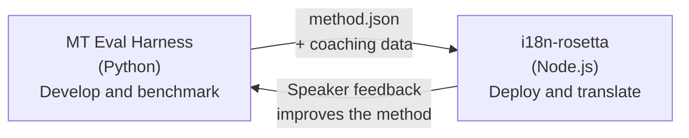

# Eval Harnessブリッジ

i18n-rosettaとMT Eval Harnessは、1つのエコシステムを形成する2つの独立したツールです。Harnessは翻訳メソッドが**証明**される場所です。Rosettaは証明されたメソッドが**デプロイ**される場所です。これらは共有のプラグインフォーマットを通じて接続されます。



## フロー: 研究 → 本番環境

### 1. Harnessでメソッドを構築する

`async translate(entries, config) → [{id, predicted}]`を実装する任意のPythonクラスは、Harnessに組み込むことができます。Harnessは内部で何が起こっているかを気にしません。プロンプトベースのLLM、カスタムトレーニングされたモデル、決定論的ルールなど、何でも構いません。

### 2. ベンチマークを実行する

Harnessは、再現可能な指標（chrF++、FST acceptance（形態論的に豊かな言語向け）、形態素精度、意味論的スコアリング）を使用して、標準化されたコーパスに対してメソッドを採点します。

### 3. プラグインとしてエクスポートする

メソッドが許容できる品質に達したら、rosettaプラグインとしてパッケージ化します。これは、オプションのコーチングデータを伴う`method.json`マニフェストです。

:::info エクスポートCLIは計画中です
現在、method.jsonマニフェストは手動で作成します。`mt-eval export`コマンドにより、これが自動化される予定です。プラグインフォーマットの完全な詳細については、[Method Interface](https://mtevalarena.org/docs/specifications/methods)を参照してください。
:::

### 4. rosettaにインストールする

```bash
i18n-rosetta plugin install ./my-method-plugin/
```

### 5. 実際のコンテンツを翻訳する

```bash
i18n-rosetta sync
```

これで、ベンチマーク済みのメソッドが本番環境で実際の翻訳を生成するようになります。

## フロー: 本番環境 → 研究

デプロイされた翻訳は、バイリンガルの話者によってレビューされます。彼らのフィードバックにより、システム上のエラー（誤った時制パターン、語彙の欠落、不自然な言い回しなど）が特定されます。研究者はHarness内のメソッドを更新し、再度ベンチマークを実行し、再エクスポートして、再デプロイします。システムは実際の使用から学習します。

## プラグインフォーマット

`method.json`マニフェストは、2つのツール間の契約です。

```json
{
  "name": "crk-coached-v3",
  "type": "llm-coached",
  "version": "3.0.0",
  "description": "Coached LLM translation for Plains Cree",
  "locales": ["crk"],
  "config": {
    "model": "google/gemini-3.5-flash",
    "temperature": 0.3
  },
  "benchmarks": {
    "crk": {
      "composite_score": 0.67,
      "fst_acceptance": 0.82,
      "corpus_size": 150
    }
  }
}
```

フォーマットの完全な詳細については、[Plugin Specification](/docs/reference/plugin-spec)を参照してください。

## 構築済み vs 計画中

| コンポーネント | ステータス |
|-----------|--------|
| TranslationProcessプロトコル | ✅ 構築済み |
| Harnessベンチマークランナー | ✅ 構築済み |
| method.jsonプラグインフォーマット | ✅ 構築済み |
| `rosetta plugin install/remove/list` | ✅ 構築済み |
| コーチングデータの読み込み | ✅ 構築済み |
| `mt-eval export` CLI | 🔲 計画中 |
| コミュニティレビューインターフェース | 🔲 計画中 |
| 暗号化テストセット評価 | 🔲 計画中 |

## 詳細情報

- [Translation Methods](/docs/guides/translation-methods) — 利用可能なすべてのメソッドとその仕組み
- [Plugin Specification](/docs/reference/plugin-spec) — method.jsonフォーマット
- [Serving a Method via API](/docs/guides/serving-a-method) — サーバーサイドでのメソッドのホスティング
- [Data Sovereignty](https://mtevalarena.org/docs/sovereignty/data-sovereignty) — OCAP、CARE、および暗号化保護
- [For MT Researchers](https://mtevalarena.org/docs/leaderboard/rules) — Eval Harnessのドキュメント