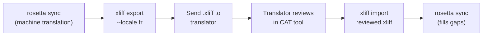

# プロの翻訳者との連携

Rosettaは機械翻訳を生成しますが、規制に関するコンテンツ、ブランドに敏感なコピー、重要度の高いUIなど、一部のプロジェクトでは人間によるレビューが必要です。XLIFFワークフローを使用すると、プロによるレビュー用に翻訳をエクスポートし、シームレスにインポートし直すことができます。

## XLIFFとは

XLIFF (XML Localization Interchange File Format) は、翻訳ツールにおける業界標準の交換フォーマットです。すべてのプロ向けCAT (Computer-Assisted Translation) ツールがこれをサポートしています。

- **memoQ** — XLIFFのインポート、コンテキスト内でのレビュー、レビュー済みファイルのエクスポート
- **SDL Trados Studio** — ネイティブでのXLIFFサポート
- **Phrase (Memsource)** — 翻訳チーム向けのXLIFFジョブのアップロード
- **Smartling** — XLIFF取り込みパイプライン
- **OmegaT** — XLIFFをサポートする無料/オープンソースのCATツール

Rosettaは、ツールとの互換性を最大限に高めるため、2.0以降ではなく、広くサポートされているバージョンであるXLIFF 1.2を生成します。

## ワークフロー



### ステップ1: 機械翻訳の生成

まず `sync` を実行して、ベースラインとなる機械翻訳を取得します。

```bash
i18n-rosetta sync
```

### ステップ2: XLIFFのエクスポート

ソースとターゲットのペアをXLIFFとしてエクスポートします。

```bash
i18n-rosetta xliff export --locale fr
```

これにより、以下を含む `.rosetta/xliff/fr.xliff` が書き出されます。
- 英語の値を持つすべてのソースキー
- `<target>` としての現在の機械翻訳 (存在する場合)
- `state="new"` としてマークされた未翻訳のキー

```xml
<trans-unit id="hero.title" xml:space="preserve">
  <source>Welcome to our platform</source>
  <target state="translated">Bienvenue sur notre plateforme</target>
</trans-unit>
```

### ステップ3: 翻訳者への送信

`.xliff` ファイルを翻訳者に送信するか、CATプラットフォームにアップロードします。翻訳者はソースとターゲットを並べて確認し、以下の作業を行うことができます。

- 機械翻訳の編集
- 不足している翻訳の入力
- 品質問題のフラグ付け
- 独自の翻訳メモリや用語集の適用

### ステップ4: レビュー済みファイルのインポート

翻訳者からレビュー済みの `.xliff` が返ってきたら、それをインポートします。

```bash
# Preview what will change
i18n-rosetta xliff import .rosetta/xliff/fr.xliff --dry

# Apply changes
i18n-rosetta xliff import .rosetta/xliff/fr.xliff
```

出力:
```
  ✓ Imported 142 translations for fr
    Updated:    23 (changed from existing)
    Added:      0 (new keys)
    Unchanged:  119
    Written to: locales/fr.json
```

### ステップ5: 不足分の補完

XLIFFをエクスポートした後に新しいキーが追加された場合は、`sync` を実行してそれらを翻訳します。

```bash
i18n-rosetta sync
```

Rosettaは、まだ不足しているキーのみを翻訳します。XLIFFのインポートによるレビュー済みの翻訳は保持されます。

## ヒント

### カスタムパスのエクスポート

```bash
# Export to a specific directory
i18n-rosetta xliff export --locale ja --out ./for-review/

# Export with a specific filename
i18n-rosetta xliff export --locale de --out ./review/german.xliff
```

### 複数のロケール

各ロケールを個別にエクスポートします。

```bash
for locale in fr de ja ko; do
  i18n-rosetta xliff export --locale $locale
done
```

### バージョン管理

`.rosetta/xliff/` を `.gitignore` に追加します。XLIFFファイルは一時的な成果物であり、プロジェクトのソースではありません。

```gitignore
.rosetta/xliff/
```

### XLIFFを使用する場合と `sync` のみを使用する場合の使い分け

| シナリオ | 推奨事項 |
|----------|---------------|
| 社内アプリ、90%以上の品質で許容可能 | `sync` のみ — 機械翻訳で十分 |
| ユーザー向けのマーケティングコピー | 人間によるレビュー用にXLIFFをエクスポート |
| 法務/規制に関するコンテンツ | XLIFFをエクスポート — 人間によるレビューが必須 |
| 50以上のロケール、厳しい期限 | まず `sync` を実行し、上位5つのロケールのみXLIFFをエクスポート |
| 翻訳者がすでにCATツールを使用している | XLIFFが自然な受け渡しフォーマット |

---

## 関連項目

- [CLIリファレンス — xliff](/docs/reference/cli#xliff) — コマンドリファレンス
- [翻訳メモリ](/docs/concepts/translation-memory) — レビュー済み翻訳のキャッシュ
- [翻訳メソッド](/docs/guides/translation-methods) — 機械翻訳のオプション