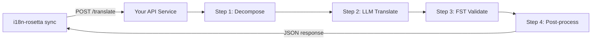

# カスタムメソッドをAPIとして提供する

i18n-rosettaの**`api` method**を使用すると、任意の翻訳ペアを外部のHTTPエンドポイントに向けることができます。これにより、形態素解析器、有限状態トランスデューサ（FST）、マルチステップのLLMチェーン、または独自に構築したカスタム研究メソッドなど、単一のLLMプロンプトには複雑すぎるパイプラインを統合できます。

## なぜAPIサービスなのか？

一部の翻訳パイプラインは、単純なプロンプトと応答のサイクル内では実行できません。

| パイプラインのステップ | 例 |
|---|---|
| **形態素分解** | 翻訳前に抱合語の単語を形態素に分割する |
| **FST検証** | 音韻規則や形態素規則に違反する出力を拒否する |
| **マルチステップLLMチェーン** | 異なるモデルを使用して生成 → 検証 → 修正のサイクルを行う |
| **辞書検索** | パイプラインの途中で、厳選された対訳辞書を相互参照する |
| **Human-in-the-loop** | 不確実な翻訳を専門家のレビュー用にキューに入れる |

`api`メソッドは、パイプラインをブラックボックスとして扱います。i18n-rosettaがソース文字列を送信し、サービスが翻訳を返します。内部で何が行われるかは完全にあなた次第です。

## アーキテクチャ



## サービスのセットアップ

APIサービスは、JSONを受け取り、JSONを返す単一のエンドポイントを実装する必要があります。

### リクエスト形式

rosettaは、まさにこのJSONボディを送信します（[api.js](https://github.com/gamedaysuits/i18n-rosetta/blob/main/lib/methods/api.js)を参照してください）。

```json
POST /translate
Content-Type: application/json
Authorization: Bearer <ROSETTA_API_KEY>

{
  "source_locale": "en",
  "target_locale": "crk",
  "method": "crk-coached-v1",
  "keys": {
    "greeting": "Hello, welcome to our app",
    "farewell": "Goodbye and thanks"
  }
}
```

| フィールド | 型 | 説明 |
|-------|------|-------------|
| `source_locale` | string | BCP 47のソース言語コード |
| `target_locale` | string | BCP 47のターゲット言語コード |
| `method` | string | プラグイン名または`"default"` |
| `keys` | object | キー → 翻訳するソース文字列のマップ |
```

### Response Format

Your service must return a `translations` object. An optional `meta` object can include cost and diagnostic info:

```json
{
  "translations": {
    "greeting": "tânisi, pê-kîwêw ôta",
    "farewell": "ekosi mâka, kinanâskomitin"
  },
  "meta": {
    "model": "my-custom-pipeline/v1",
    "cost_usd": 0.0042,
    "method": "decompose-translate-validate"
  }
}
```

| Field | Type | Required | Description |
|-------|------|----------|-------------|
| `translations` | object | ✅ | Map of key → translated string |
| `meta` | object | — | Optional metadata |
| `meta.cost_usd` | number | — | If present, displayed in rosetta's output |
| `errors` | object | — | For partial success (HTTP 207): map of key → `{ message }` |

### Minimal Express Server

```javascript
import express from 'express';

const app = express();
app.use(express.json());

/**
 * rosetta API contract:
 *
 * Request:  { source_locale, target_locale, method, keys: { "key": "source" } }
 * Response: { translations: { "key": "translated" }, meta: { ... } }
 */
app.post('/translate', async (req, res) => {
  const { source_locale, target_locale, method, keys } = req.body;

  const translations = {};

  for (const [key, source] of Object.entries(keys)) {
    // --- Your pipeline goes here ---
    // Step 1: Morphological decomposition
    const morphemes = await decompose(source, source_locale);

    // Step 2: LLM translation with context
    const draft = await llmTranslate(morphemes, target_locale);

    // Step 3: FST validation
    const validated = await fstValidate(draft, target_locale);

    // Step 4: Post-processing (orthography normalization, etc.)
    translations[key] = await postProcess(validated);
  }

  res.json({
    translations,
    meta: {
      model: 'my-custom-pipeline/v1',
      method: 'decompose-translate-validate',
    },
  });
});

app.listen(3001, () => {
  console.log('Translation API running on http://localhost:3001');
});
```

## Configuring i18n-rosetta

Point a translation pair at your running service in `i18n-rosetta.config.json`:

```json
{
  "inputLocale": "en",
  "pairs": {
    "en:crk": {
      "method": "api",
      "endpoint": "http://localhost:3001/translate",
      "register": "Formal Plains Cree. Use SRO orthography."
    }
  }
}
```

Then run sync as usual:

```bash
npx i18n-rosetta sync
```

i18n-rosetta will POST your source strings to the endpoint and write the returned translations to `crk.json`.

## Case Study: Plains Cree Pipeline

:::info Under Development
The Plains Cree pipeline described below is **under active development** and is not yet running in production. Details here reflect the current design direction and may change as the project evolves.
:::

The **gds-mt-eval-harness** project demonstrates this pattern. Its Plains Cree pipeline uses:

1. **Morphological decomposition** — Break polysynthetic Cree words into translatable morpheme chains
2. **LLM translation** — Context-enriched GPT-4o translation with coaching data (SRO orthography rules, register instructions)
3. **FST validation** — Finite-state transducer checks that outputs conform to Cree phonological rules
4. **Confidence scoring** — Each translation gets a confidence score based on FST pass rate and dictionary coverage

The entire pipeline runs as a single HTTP endpoint that i18n-rosetta calls via the `api` method.

### Running Evaluations

After translating, you can evaluate output quality using the harness directly:

```bash
# Clone the harness
git clone https://github.com/gamedaysuits/gds-mt-eval-harness.git
cd gds-mt-eval-harness
pip install -e .

# Run the evaluation against your method's output
python eval/baseline_experiment.py --dataset data/edtekla-dev-v1.json --submit
```

This produces structured evaluation records with chrF++, BLEU, and exact match scores that can be used as regression baselines.

## Authentication

If your API requires authentication, set the `apiKey` field or use an environment variable:

```json
{
  "pairs": {
    "en:crk": {
      "method": "api",
      "endpoint": "https://my-mt-service.example.com/translate",
      "apiKey": "${CRK_API_KEY}"
    }
  }
}
```

## Data Sovereignty & OCAP Principles

The `api` method is particularly important for **Indigenous language communities**. By self-hosting the translation pipeline, a community keeps full control over:

- **Proprietary coaching data** — register instructions, orthography rules, and domain glossaries never leave community infrastructure.
- **Linguistic resources** — curated dictionaries, FST grammars, and elder-verified translations remain under community ownership.
- **Access policies** — the community decides who can call the endpoint and under what terms.

This aligns with [OCAP® principles](https://mtevalarena.org/docs/community/low-resource-languages#ocap-principles) (Ownership, Control, Access, Possession), ensuring that sensitive language data is governed by the community rather than a third-party platform.

:::tip
Combine the `api` method with a private deployment (e.g., a community-hosted VM or on-prem server) for the strongest data-sovereignty posture. See [Support a Low-Resource Language](https://mtevalarena.org/docs/community/low-resource-languages) for a full walkthrough.
:::

## Cost Estimation

The `api` method returns `null` for cost estimation by default — your service controls pricing. If you want to provide cost transparency, have your API return a `cost` field in the metadata:

```json
{
  "translations": { "...": "..." },
  "metadata": {
    "cost": {
      "estimatedCost": 0.0042,
      "currency": "USD",
      "source": "my-service-pricing"
    }
  }
}
```

## ベストプラクティス

1. **失敗時は空の文字列を返す** — ソース文字列を「翻訳」として返さないでください。`""`を返し、i18n-rosettaのフォールバックプレフィックスメカニズムに処理を任せます。
2. **信頼度スコアを含める** — パイプラインが品質を推定できる場合は、メタデータとして返します。これは品質監査に役立ちます。
3. **ヘルスチェックを実装する** — i18n-rosettaが大規模な同期を開始する前に接続を確認できるように、`GET /health`エンドポイントを追加します。
4. **適切にレート制限を行う** — パイプラインにスループットの制限がある場合は、`429`ステータスコードを返します。i18n-rosettaのバッチシステムはバックオフ（待機）を行います。
5. **すべてをログに記録する** — マルチステップのパイプラインは、エラーを出さずに失敗する可能性があります。デバッグのために、各ステップの入出力をログに記録してください。

## ライセンス

`api`メソッドのパターンは完全にオープンです。独自の翻訳パイプラインをHTTPサービスとしてラップすることにライセンス上の制限はありません。リファレンス実装として、`gds-mt-eval-harness`がMITライセンスで利用可能です。

## 関連項目

- [翻訳メソッド](/docs/guides/translation-methods) — すべての組み込みメソッド（`openai`、`google`、`api`など）の概要
- [プラグイン仕様](/docs/reference/plugin-spec) — `api`メソッドのフィールドを含む、`i18n-rosetta.config.json`の完全なスキーマ
- [低資源言語のサポート](https://mtevalarena.org/docs/community/low-resource-languages) — OCAP原則を含む、リソースが不足している言語のためのエンドツーエンドガイド
- [アーキテクチャ](/docs/concepts/architecture) — i18n-rosettaの同期ループ、バッチ処理、メソッドディスパッチの仕組み
- [MT評価](https://mtevalarena.org/docs/leaderboard/rules) — 評価手法、指標、およびリーダーボードへの提出プロセス
- [メソッドリーダーボード](/leaderboard) — メソッドおよび言語ペアごとのリアルタイムの品質ランキング