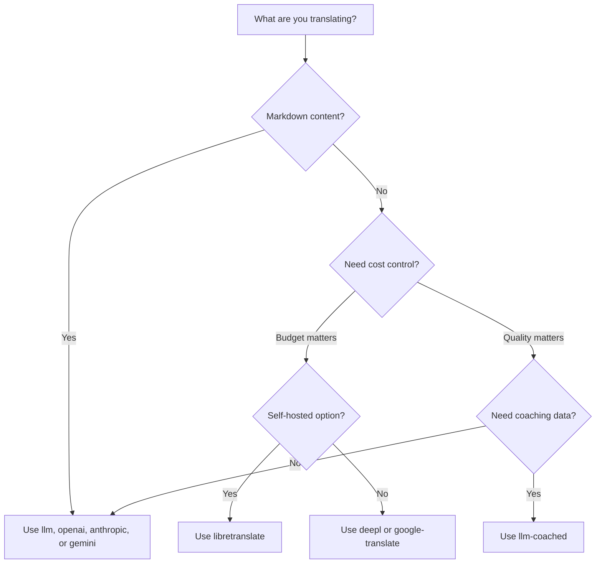

# 翻訳メソッド

Rosettaは10種類の翻訳メソッドをサポートしています。言語ペアごとに異なるメソッドを使用できるため、プロジェクト全体で1つのアプローチに縛られることはありません。

## メソッドの比較

### LLMプロバイダー

品質重視、Markdown対応、コーチング互換。コンテンツが多いプロジェクトに最適です。

| メソッド | キー | 概要 |
|--------|-----|-------------|
| `llm` (デフォルト) | `OPENROUTER_API_KEY` | OpenRouter経由のLLM — 200以上のモデル、自動ルーティング |
| `llm-coached` | `OPENROUTER_API_KEY` | LLM + 文法ルール、辞書、スタイルノート |
| `openai` | `OPENAI_API_KEY` | 直接のOpenAI API (gpt-4o、gpt-4o-mini) |
| `anthropic` | `ANTHROPIC_API_KEY` | 直接のAnthropic API (Claude Sonnet、Haiku、Opus) |
| `gemini` | `GEMINI_API_KEY` | 直接のGoogle Gemini API (Flash、Pro) — 無料枠あり |

### 従来の機械翻訳 (MT)

スピードとコスト重視。大量のキーバリューペアに最適です。

| メソッド | キー | 概要 |
|--------|-----|-------------|
| `google-translate` | `GOOGLE_TRANSLATE_API_KEY` | Google Cloud Translation API v2 (130以上の言語) |
| `deepl` | `DEEPL_API_KEY` | 用語集対応のDeepL API (30以上の言語) |
| `microsoft-translator` | `MICROSOFT_TRANSLATOR_API_KEY` | Azure Cognitive Services Translator (100以上の言語) |
| `libretranslate` | *(セルフホスト)* | セルフホスト型LibreTranslate (AGPL、無料) |

### インフラストラクチャ

| メソッド | キー | 概要 |
|--------|-----|-------------|
| `api` | *(プロバイダーごと)* | 任意のREST翻訳エンドポイント用のシンHTTPクライアント |

## デシジョンツリー



---

## `llm` — LLM翻訳 (デフォルト)

[OpenRouter](https://openrouter.ai)上の任意のLLMを介して翻訳します。これはデフォルトのメソッドであり、最も汎用性があります。

**仕組み:**
1. レジスター(文体)とコンテキストの指示とともにキーをバッチ処理します (デフォルトは30キー/バッチ)
2. 構造化されたプロンプトとしてOpenRouterに送信します
3. JSONレスポンスを解析します
4. [品質ゲート](/docs/concepts/quality-gate)を通じて各翻訳を検証します
5. 合格した翻訳を書き込み、失敗したものは再試行または拒否します

**使用例:** ほとんどのプロジェクト。特にMarkdownを使用するコンテンツが多いサイトで、コードブロックやショートコードを保護する必要がある場合に適しています。

**設定:**

```json
{
  "defaultMethod": "llm",
  "model": "google/gemini-3.5-flash"
}
```

## `llm-coached` — コーチング付きLLM翻訳

`llm`と同じですが、文法ルール、用語辞書、スタイルノートがすべてのプロンプトに注入されます。

**仕組み:**
1. `.rosetta/coaching/<locale>.json`またはプラグインの`coaching/`ディレクトリからコーチングデータを読み込みます
2. 文法ルール、辞書の用語、スタイルノートをシステムプロンプトに注入します
3. ソースキーに一致する辞書の用語は、必須の専門用語として含められます
4. 翻訳は`llm`と同様に進められますが、コーチングデータによって精度が向上します

**使用例:** リソースの少ない言語、ドメイン固有の専門用語 (法律、医療)、フォーマルなレジスター、または一般的なLLMの出力では精度が不十分な場合。

**コーチングデータのフォーマット:**

```json title=".rosetta/coaching/fr.json"
{
  "grammar_rules": [
    "French adjectives agree in gender and number with the noun they modify",
    "Use 'vous' for formal contexts, 'tu' for informal"
  ],
  "dictionary": {
    "dashboard": "tableau de bord",
    "deployment": "déploiement",
    "settings": "paramètres"
  },
  "style_notes": "Prefer active voice. Avoid anglicisms where a native French term exists."
}
```

関連情報: [リソースの少ない言語向けガイド](https://mtevalarena.org/docs/community/low-resource-languages)

---

## `openai` — 直接のOpenAI API

OpenAI Chat Completions APIを介して直接翻訳します。OpenRouterのような仲介者はなく、ご自身のキー、アカウント、使用状況ダッシュボードを使用します。

**モデル:** `gpt-4o` (デフォルト)、`gpt-4o-mini`

**機能:**
- ✅ Markdown対応 (コンテンツ翻訳)
- ✅ コーチングサポート (文法ルール、辞書の上書き、スタイルノート)
- ✅ 構造化されたキーバリュー出力用のJSONモード
- ✅ エクスポネンシャルバックオフによる再試行

**設定:**

```json
{
  "pairs": {
    "en:fr": { "method": "openai", "model": "gpt-4o-mini" }
  }
}
```

```bash
export OPENAI_API_KEY=sk-proj-...
```

APIキーは[platform.openai.com/api-keys](https://platform.openai.com/api-keys)で取得できます。

## `anthropic` — 直接のAnthropic API

Anthropic Messages APIを介して直接翻訳します。コーチングデータに`system`パラメーターを使用し、Anthropicのプロンプトキャッシングを有効にします。

**モデル:** `claude-sonnet-4-6` (デフォルト)、`claude-haiku-4-5`、`claude-opus-4-7`

**機能:**
- ✅ Markdown対応 (コンテンツ翻訳)
- ✅ コーチングサポート (文法ルール、辞書の上書き、スタイルノート)
- ✅ システムプロンプトキャッシング (バッチ間でコーチングコストを償却)
- ✅ エクスポネンシャルバックオフによる再試行

**設定:**

```json
{
  "pairs": {
    "en:ja": { "method": "anthropic", "model": "claude-haiku-4-5" }
  }
}
```

```bash
export ANTHROPIC_API_KEY=sk-ant-...
```

APIキーは[console.anthropic.com](https://console.anthropic.com/settings/keys)で取得できます。

## `gemini` — 直接のGoogle Gemini API

Google Gemini `generateContent` APIを介して直接翻訳します。**無料枠あり** — コストゼロで始めるのに最適です。

**モデル:** `gemini-2.5-flash` (デフォルト)、`gemini-2.5-pro`

**機能:**
- ✅ Markdown対応 (コンテンツ翻訳)
- ✅ コーチングサポート (文法ルール、辞書の上書き、スタイルノート)
- ✅ `responseMimeType`によるJSONレスポンスモード
- ✅ 無料枠 (十分な1日のクォータ)
- ✅ エクスポネンシャルバックオフによる再試行

**設定:**

```json
{
  "pairs": {
    "en:ko": { "method": "gemini", "model": "gemini-2.5-pro" }
  }
}
```

```bash
export GEMINI_API_KEY=AI...
```

APIキーは[aistudio.google.com/apikey](https://aistudio.google.com/apikey)で取得できます。

### モデルの検証

直接のLLMプロバイダー (`openai`、`anthropic`、`gemini`) は、初回使用時にモデル文字列を検証します。これにより、以下の3つのカテゴリーのミスを検出します。

**誤ったメソッドフォーマット** — 直接のプロバイダーでOpenRouterスタイルのモデルパスを使用している場合:

```
[WARN] OpenAI: model "google/gemini-3.5-flash" looks like an OpenRouter path.
       Direct providers use bare model names (e.g., "gpt-4o").
       To use OpenRouter models, set method to 'llm' instead.
```

**誤ったプロバイダー** — まったく別のプロバイダーのモデルを使用している場合:

```
[WARN] Gemini: model "claude-sonnet-4-6" is an Anthropic model.
       This provider (gemini) cannot serve Anthropic models.
       Use --method anthropic or set "method": "anthropic" in config.
```

**非推奨またはスペルミスのモデル** — 初回のAPI呼び出し時に、rosettaはプロバイダーの最新のモデルリストを取得し、指定されたモデルと照合します:

```
[WARN] Gemini: model "gemini-1.5-flash" not found in available models.
       Similar models: gemini-2.0-flash, gemini-2.5-flash, gemini-2.5-pro
       The API call will proceed — the provider will give the final verdict.
```

:::note これらは警告であり、エラーではありません
モデルの検証は警告をログに記録しますが、API呼び出しをブロックしません。最終的な判断はプロバイダーのAPIに委ねられます。将来のモデル名が異なるパターンに一致する可能性があり、ヒューリスティックに基づいて制限をかけたくないためです。
:::

---

## `google-translate` — Google Cloud Translation API

Google Cloud Translation API v2との直接統合。REST APIを使用します — SDKやサービスアカウントは不要で、APIキーのみを使用します。

**使用例:** ニュアンスよりもスピードとコストが重視される、大量のキーバリュー文字列ペア。標準で130以上の言語をサポートしています。

**制限事項:**
- ⚠️ **Markdown非対応。** コードブロック、ショートコード、補間変数が破損する可能性があります。
- レジスター(文体)/トーンの制御不可
- コーチングや専門用語の強制不可

```bash
npx i18n-rosetta sync --method google-translate
```

:::tip 自動検出
`GOOGLE_TRANSLATE_API_KEY`のみが設定されている場合 (OpenRouterキーがない場合)、rosettaは自動的にGoogle翻訳に切り替わります。設定の変更は必要ありません。
:::

## `deepl` — DeepL API

DeepL翻訳APIとの直接統合。一貫した専門用語を使用するための用語集をサポートしています。

**使用例:** DeepLが優れているヨーロッパ言語 (ドイツ語、フランス語、スペイン語、オランダ語、ポーランド語など)。用語集のサポートにより、コーチングデータなしで一貫した専門用語を強制できます。

**機能:**
- ✅ 無料/Proエンドポイントの自動検出 (無料キーの`:fx`サフィックス)
- ✅ 用語集の作成と管理
- ✅ フォーマル度の制御
- ⚠️ **Markdown非対応** — キーバリューペアのみ

**設定:**

```json
{
  "pairs": {
    "en:de": { "method": "deepl" }
  }
}
```

```bash
export DEEPL_API_KEY=your-key-here
```

APIキーは[deepl.com/pro-api](https://www.deepl.com/pro-api)で取得できます。

## `microsoft-translator` — Azure Cognitive Services

Microsoft Translator Text API v3との直接統合。

**使用例:** 既存のAzureインフラストラクチャを持つエンタープライズ環境。Google翻訳がカバーしていない多くの言語を含む、100以上の言語をサポートしています。

**機能:**
- ✅ リクエストあたり最大100セグメント (高スループット)
- ✅ レイテンシ最適化のためのオプションのリージョンパラメーター
- ⚠️ **Markdown非対応** — キーバリューペアのみ
- ⚠️ **コンテンツ翻訳非対応** — キーバリューペアのみ

**設定:**

```json
{
  "pairs": {
    "en:ar": { "method": "microsoft-translator" }
  }
}
```

```bash
export MICROSOFT_TRANSLATOR_API_KEY=your-key
export MICROSOFT_TRANSLATOR_REGION=global  # optional
```

APIキーは[Azureポータル](https://portal.azure.com) → Cognitive Services → Translatorから取得できます。

## `libretranslate` — セルフホスト型翻訳

LibreTranslateを使用したセルフホスト型のオープンソース翻訳。ローカルまたは独自のインフラストラクチャで実行され、APIコストはゼロで、完全なデータ主権を確保できます。

**使用例:** オフライン翻訳、データプライバシーコンプライアンス (GDPR)、またはゼロコストでの運用が必要なプロジェクト。外部APIに依存すべきではないCIパイプラインに特に役立ちます。

**機能:**
- ✅ セルフホスト — 外部API呼び出しなし
- ✅ 無料かつオープンソース (AGPL-3.0)
- ✅ Dockerデプロイメントが利用可能
- ⚠️ **Markdown非対応** — キーバリューペアのみ
- ⚠️ **コンテンツ翻訳非対応** — キーバリューペアのみ
- ⚠️ 言語ペアによって品質が異なる

**セットアップ:**

```bash
# Run LibreTranslate locally with Docker
docker run -d -p 5000:5000 libretranslate/libretranslate

# Configure (optional — defaults to localhost:5000)
export LIBRETRANSLATE_API_URL=http://localhost:5000/translate
```

```json
{
  "pairs": {
    "en:es": { "method": "libretranslate" }
  }
}
```

---

## `api` — リモート翻訳API

コミュニティがホストする、またはIP保護された翻訳エンドポイント用のシンHTTPクライアント。Rosettaはキーを送信し、翻訳を受け取ります。翻訳ロジックは一切含まれていません。

**使用例:** 翻訳メソッドがサーバー側でホストされている場合 (例: 独自のコーチングデータ、ファインチューニングされたモデル、配布できないFSTパイプラインなど)。

```json
{
  "pairs": {
    "en:crk": {
      "method": "api",
      "endpoint": "https://api.example.com/v1/translate",
      "apiKey": "your-key"
    }
  }
}
```

:::note OCAP互換のコミュニティ翻訳
`api`メソッドは、**OCAP互換のコミュニティホスト型翻訳**への架け橋となります。先住民や少数言語のコミュニティは、独自の翻訳エンドポイントをホストし、コーチングデータ、ファインチューニングされたモデル、言語的IPをコミュニティの管理下に置きながら、Rosettaをシンクライアントとして接続させることができます。

コミュニティホスティングの完全なチュートリアルについては[リソースの少ない言語のサポート](https://mtevalarena.org/docs/community/low-resource-languages)を、エンドポイントの要件については[API経由でのメソッドの提供](/docs/guides/serving-a-method)を参照してください。
:::

---

## ペアごとの設定

真の強みは、言語ペアごとにメソッドを組み合わせられることです:

```json title="i18n-rosetta.config.json"
{
  "version": 3,
  "pairs": {
    "en:fr": { "method": "deepl" },
    "en:ja": { "method": "openai", "model": "gpt-4o" },
    "en:ko": { "method": "gemini" },
    "en:ar": { "method": "microsoft-translator" },
    "en:crk": { "methodPlugin": "crk-coached-v1" }
  }
}
```

これにより、フランス語はDeepL (用語集サポート)、日本語はOpenAI (品質)、韓国語はGemini (無料枠)、アラビア語はMicrosoft Translator (カバレッジ)、平原クリー語はコーチング付きプラグイン (特化型) を介して翻訳されます。

## プラグイン

プラグインは、特定の言語ペア向けに事前にパッケージ化された翻訳レシピです。これらはコードではなくJSONマニフェストであり、どのメソッドをどのような設定で使用するか、またベンチマークされた品質はどの程度かをrosettaに指示します。

:::tip 評価ハーネスから本番環境へ1つのコマンドで移行
[評価ハーネス](https://mtevalarena.org/docs/specifications/harness)で開発および検証されたプラグインは、直接インストールできます。そこで検証したメソッドは、1つの`plugin install`コマンドでここにデプロイされます。評価ワークフローの全体像については、[MT評価](https://mtevalarena.org/docs/leaderboard/rules)を参照してください。
:::

```bash
i18n-rosetta plugin install ./french-formal-v1/
i18n-rosetta plugin list
i18n-rosetta plugin remove french-formal-v1
```

マニフェストの完全なフォーマットについては、[プラグイン仕様](/docs/reference/plugin-spec)を参照してください。

---

## プロバイダーの切り替え

メソッド間を移行しますか？ モデルのフォーマットと環境変数が変更されます。対応表は以下の通りです:

### OpenRouter → 直接のプロバイダー

```diff title="i18n-rosetta.config.json"
 {
   "pairs": {
     "en:fr": {
-      "method": "llm",
-      "model": "openai/gpt-4o"
+      "method": "openai",
+      "model": "gpt-4o"
     }
   }
 }
```

```diff title="Environment variables"
- export OPENROUTER_API_KEY=sk-or-v1-...
+ export OPENAI_API_KEY=sk-proj-...
```

**主な違い:**
- OpenRouterは`provider/model`フォーマット (例: `openai/gpt-4o`) を使用します。直接のプロバイダーは単一のモデル名 (例: `gpt-4o`) を使用します。
- 各直接プロバイダーには独自の環境変数 (`OPENAI_API_KEY`、`ANTHROPIC_API_KEY`、`GEMINI_API_KEY`) があります。
- 誤ったモデルフォーマットを使用した場合、rosettaは警告を出します。[モデルの検証](#model-validation)を参照してください。

### 直接のプロバイダー → OpenRouter

```diff title="i18n-rosetta.config.json"
 {
   "pairs": {
     "en:ja": {
-      "method": "anthropic",
-      "model": "claude-sonnet-4-6"
+      "method": "llm",
+      "model": "anthropic/claude-sonnet-4-6"
     }
   }
 }
```

:::tip OpenRouterと直接プロバイダーの使い分け
環境変数を変更せずにモデルを切り替えたい場合、または1つのキーで200以上のモデルにアクセスしたい場合は、**OpenRouterを使用**します。請求をシンプルにしたい場合、レイテンシを低くしたい場合 (仲介者なし)、またはAnthropicのプロンプトキャッシングのようなプロバイダー固有の機能にアクセスしたい場合は、**直接のプロバイダーを使用**します。
:::

---

## コスト比較

翻訳された1,000キーあたりの概算コスト (1キーあたり約10トークン、1バッチあたり30キーを想定):

| メソッド | 1,000キーあたりのコスト | スピード | 品質 | 最適な用途 |
|--------|----------------|-------|---------|----------|
| `gemini` (Flash) | **無料** (枠内) | 高速 | 良好 | 導入時、個人プロジェクト |
| `google-translate` | 約$0.02 | 最速 | 適切 | 大量処理、ヨーロッパ言語 |
| `deepl` | 約$0.02 | 高速 | 良好 | ヨーロッパ言語、専門用語 |
| `microsoft-translator` | 約$0.01 | 高速 | 適切 | Azure環境、幅広い言語カバレッジ |
| `libretranslate` | **無料** (セルフホスト) | 変動 | 普通 | エアギャップ環境、GDPR、CIパイプライン |
| `gemini` (Pro) | 約$0.07 | 中速 | 非常に良好 | 品質重視、無料クォータ |
| `openai` (GPT-4o-mini) | 約$0.01 | 高速 | 良好 | 予算重視のLLM |
| `openai` (GPT-4o) | 約$0.10 | 中速 | 非常に良好 | 品質重視 |
| `anthropic` (Haiku) | 約$0.01 | 高速 | 良好 | 予算重視のLLM |
| `anthropic` (Sonnet) | 約$0.10 | 中速 | 非常に良好 | 品質重視 |
| `anthropic` (Opus) | 約$0.50 | 低速 | 優秀 | 最高品質 |
| `llm` (OpenRouter) | モデルにより変動 | 変動 | 変動 | モデルの比較、実験 |

:::note これらは概算です
実際のコストは、ソーステキストの長さ、バッチサイズ、およびプロバイダーの価格改定によって異なります。正確な料金については、各プロバイダーの最新の価格ページを確認してください。
:::

---

## 関連情報

- [サポートされている言語](/docs/reference/supported-languages)
- [コーチングデータ](/docs/concepts/coaching-data)
- [リソースの少ない言語のサポート](https://mtevalarena.org/docs/community/low-resource-languages)
- [プラグイン仕様](/docs/reference/plugin-spec)
- [API経由でのメソッドの提供](/docs/guides/serving-a-method)
- [品質ゲート](/docs/concepts/quality-gate)
- [アーキテクチャ](/docs/concepts/architecture)
- [トラブルシューティング](/docs/guides/troubleshooting) — モデルエラー、APIの問題