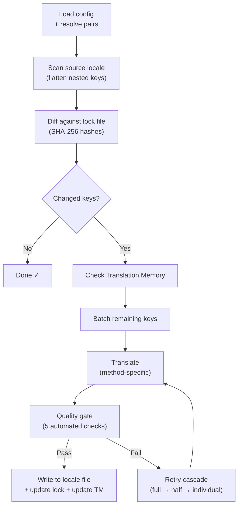

# i18n-rosettaの仕組み

i18n-rosettaは、1つのコマンドでアプリのロケールファイルを翻訳します。その裏側で何が起きているのかをご紹介します。

## パイプライン

`npx i18n-rosetta sync`を実行すると、rosettaは6段階のパイプラインを実行します。



**主な設計上の決定事項：**

- **SHA-256ハッシュによる変更検知。** Rosettaは、すべてのソース値を`.i18n-rosetta.lock`内のハッシュで追跡します。英語の文字列を更新すると、そのキーのみが再翻訳されます。これが、繰り返し実行時に`sync`が高速である理由です。最小限の作業しか行いません。

- **Translation Memory（翻訳メモリ）のキャッシュ。** API呼び出しを行う前に、rosettaは`.rosetta/tm.json`でキャッシュされた翻訳（ソーステキスト＋ロケール＋メソッドをキーとする）を確認します。1つのキーを変更した後の一般的な再同期では、142個のキーがキャッシュから取得され、1個のキーがAPIにアクセスします。

- **書き込み前の品質ゲート。** すべての翻訳は、ファイルに書き込まれる前に5つの自動チェック（空、ソースの反復、ハルシネーションループ、長さの膨張、文字種の準拠）を通過します。失敗した場合はログに記録され、暗黙のうちに受け入れられることはありません。

- **失敗時のリトライカスケード。** バッチが失敗した場合（JSON解析エラー、APIタイムアウトなど）、rosettaはバッチサイズを段階的に小さくして（全体 → 半分 → 個別）再試行します。これにより、残りの処理をブロックすることなく、問題のあるキーを特定します。

## 翻訳メソッド

Rosettaは4つの翻訳メソッドをサポートしており、それぞれ異なるシナリオに適しています。

| メソッド | 仕組み | 最適な用途 |
|--------|-------------|----------|
| **`llm`** | 任意のOpenRouterモデルへの構造化プロンプト | リソースが豊富な言語 |
| **`llm-coached`** | 同じプロンプト ＋ 文法規則、辞書、スタイルノート | LLMが予測可能なエラーを起こしやすい言語 |
| **`google-translate`** | Google Cloud Translation APIのバッチリクエスト | GT（Google翻訳）のサポートが充実している高リソース言語 |
| **`api`** | 独自のエンドポイントへのHTTP POST | カスタムパイプライン、コミュニティ管理のモデル |

メソッドは言語ペアごとに設定されます。フランス語には`google-translate`を使用し、平原クリー語には`llm-coached`を使用するといったように、各ペアに最適なメソッドを適用できます。

## コーチングデータ

`llm-coached`のペアにおいて、コーチングデータはLLMに明示的な言語知識（文法規則、強制的な用語、スタイルの好み）を提供します。これは構造化されたコンテキストとして、すべてのプロンプトに注入されます。

```json title="coaching/crk.json"
{
  "grammar_rules": ["Animate nouns take different plural forms than inanimate nouns"],
  "dictionary": {"welcome": "ᑕᓂᓯ", "settings": "ᐃᑕᐢᑌᐘᐃᓇ"},
  "style_notes": "Use Standard Roman Orthography (SRO) unless explicitly configured otherwise."
}
```

コーチングデータは、モデルのファインチューニングを行わずに翻訳品質を向上させるための主要なメカニズムです。ルールを変更する → 同期を再実行する → 効果があるか確認する、というように、即座にイテレーションを回すことができます。

## プラグイン

プラグインは、特定の言語ペア向けに事前にパッケージ化された翻訳レシピです。これらはコードではなくJSONマニフェストであり、どのメソッドをどのような設定で使用するか、そしてベンチマークされた品質がどの程度かをrosettaに伝えます。

```bash
i18n-rosetta plugin install ./crk-coached-v3/
i18n-rosetta sync   # uses the installed plugin for en→crk
```

プラグインは研究と本番環境のギャップを埋めるものです。[MT Eval Arena](https://mtevalarena.org)で高スコアを獲得したメソッドをプラグインとしてパッケージ化し、ここにデプロイすることができます。

## 全体像

i18n-rosettaは、2つの部分からなるエコシステムの半分を担っています。

- **[MT Eval Arena](https://mtevalarena.org)** — 再現可能なベンチマークによって翻訳メソッドが**開発および証明**される場所
- **i18n-rosetta** — 証明されたメソッドが実際のコンテンツを翻訳するために**デプロイ**される場所

[Eval Harness Bridge](/docs/guides/bridge)は、この2つを接続します。Arenaで証明されたメソッドがここにデプロイされます。本番環境からの話者のフィードバックが、次のバージョンの改善に役立てられます。

---

## さらに詳しく

- [同期の仕組み](/docs/concepts/how-sync-works) — パイプラインの詳細なステップバイステップの解説
- [品質ゲート](/docs/concepts/quality-gate) — 5つの自動チェック
- [Translation Memory](/docs/concepts/translation-memory) — キャッシュとコスト削減
- [翻訳メソッド](/docs/guides/translation-methods) — メソッドの詳細な比較
- [アーキテクチャ](/docs/concepts/architecture) — システム設計の概要