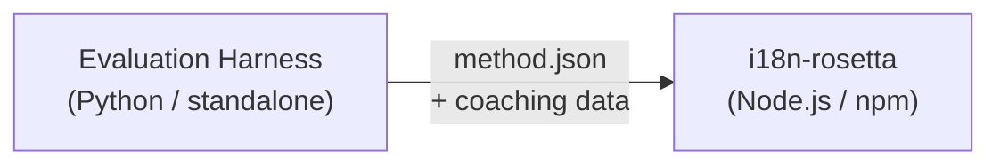

# メソッドプラグイン仕様

> **バージョン**: 1.1  
> **対象読者**: プラグイン開発者  
> **正規スキーマ**: [`schemas/rosetta-plugin.schema.json`](https://github.com/gamedaysuits/i18n-rosetta/blob/main/schemas/rosetta-plugin.schema.json)

## 概要

i18n-rosettaは**プラガブルなメソッドシステム**を使用しています。各言語ペアは異なる翻訳メソッド（LLM、coached、script-converterなど）を使用できます。メソッドは`lib/translate.js`に登録され、`lib/pairs.js`を通じてペアごとに解決されます。

評価ハーネス（eval harness）の役割は、翻訳メソッドを**開発、テスト、エクスポート**することです。i18n-rosettaの役割は、それらを**消費して実行**することです。ハーネスがrosetta内で実行されることはありません。

### データフロー



---

## メソッドプラグインのフォーマット

メソッドプラグインは、単一のJSONファイル（`method.json`）と、オプションのコーチングデータファイルで構成されます。

### `method.json` — 必須

```json
{
  "name": "french-formal-v1",
  "type": "llm-coached",
  "version": "1.0.0",
  "description": "Formally-tuned French with terminology enforcement and grammar coaching",
  "author": "Plugin Author",

  "config": {
    "model": "google/gemini-3.5-flash",
    "register": "formal",
    "batchSize": 30,
    "temperature": 0.2
  },

  "locales": ["fr"],

  "benchmarks": {
    "fr": {
      "date": "2026-05-11T00:00:00Z",
      "corpus_size": 500,
      "exact_match_rate": 0.42,
      "corpus_chrf": 72.3,
      "corpus_bleu": 45.1,
      "model": "google/gemini-3.5-flash",
      "harness_version": "1.0.0"
    }
  },

  "provenance": {
    "resources": [],
    "commercialReady": false,
    "flags": ["license-unclear"]
  },

  "coaching": {
    "dir": "coaching"
  }
}
```

### フィールドリファレンス

| フィールド | 型 | 必須 | 説明 |
|-------|------|----------|-------------|
| `name` | string | ✅ | 一意のメソッド識別子（ケバブケース） |
| `type` | string | ✅ | Rosettaメソッドタイプ: `llm`, `llm-coached`, `api`, `google-translate`, `deepl`, `microsoft-translator`, `libretranslate`, `openai`, `anthropic`, `gemini` |
| `version` | string | ✅ | セマンティックバージョニングによるバージョン（例: `1.0.0`） |
| `locales` | string[] | ✅ | このメソッドが対象とするロケールコード（最小1） |
| `description` | string | — | 人間が読める説明 |
| `author` | string | — | このメソッドの開発者/テスト担当者 |
| `config.model` | string | — | OpenRouterモデル識別子 |
| `config.register` | string | — | ターゲット言語のレジスター/トーン |
| `config.batchSize` | number | — | APIバッチあたりのキー数（1〜200、デフォルト: 30） |
| `config.temperature` | number | — | LLMのtemperature（0.0〜2.0、デフォルト: 0.3） |
| `benchmarks` | object | — | ロケールごとのベンチマーク結果 |
| `provenance` | object | — | ライセンスとリソースの依存関係 |
| `coaching.dir` | string | — | コーチングデータディレクトリへの相対パス |

### ベンチマークオブジェクト（ロケールごと）

| フィールド | 型 | 必須 | 説明 |
|-------|------|----------|-------------|
| `date` | string | ✅ | ベンチマーク実行のISO 8601タイムスタンプ |
| `corpus_size` | number | ✅ | 評価されたエントリ数 |
| `exact_match_rate` | number | ✅ | 0.0〜1.0、完全一致（exact match）の割合 |
| `corpus_chrf` | number | — | chrF++スコア（0〜100） |
| `corpus_bleu` | number | — | BLEUスコア（0〜100） |
| `model` | string | ✅ | 評価中に使用されたモデル |
| `harness_version` | string | ✅ | 使用された評価ハーネスのバージョン |

:::info どの指標が表示されるか？
`rosetta status`コマンドは、ベンチマークブロックの**chrF++**と**完全一致率（exact match rate）**を表示します。`corpus_bleu`はマニフェストで受け入れられますが、現在rosettaのどのコマンドでも表示または使用されていません。[メソッドリーダーボード](/leaderboard)では、chrF++、完全一致、およびFSTの承認率を追跡します。
:::

---

### Provenance（来歴）オブジェクト

provenanceブロックは、プラグインに同梱されているリソースのライセンス状況を伝えます。

| フィールド | 型 | デフォルト | 説明 |
|-------|------|---------|-------------|
| `resources` | object[] | `[]` | `name`、`license`、および`type`を含む同梱リソースのリスト |
| `commercialReady` | boolean | `false` | プラグインが商用配布の許可を得ているかどうか |
| `flags` | string[] | `["license-unclear"]` | 機械可読なステータスフラグ |

**デフォルト状態** — エクスポートされたプラグインは、`commercialReady: false`および`flags: ["license-unclear"]`の状態で出荷されます。

**クリア状態** — ライセンスが確認された場合: `commercialReady: true`を設定し、フラグをクリアします。

---

## コーチングデータのフォーマット

`type`が`llm-coached`の場合、プラグインは`coaching/`サブディレクトリにコーチングデータファイルを含める必要があります。

### `coaching/<locale>.json`

```json
{
  "grammar_rules": [
    "French adjectives agree in gender and number with the noun they modify",
    "Use 'vous' for formal contexts, 'tu' for informal"
  ],
  "dictionary": {
    "dashboard": "tableau de bord",
    "deployment": "déploiement",
    "settings": "paramètres"
  },
  "style_notes": "Prefer active voice. Avoid anglicisms where a native French term exists."
}
```

| フィールド | 型 | 必須 | 説明 |
|-------|------|----------|-------------|
| `grammar_rules` | string[] | — | このロケールのすべてのLLMプロンプトに注入されるルール |
| `dictionary` | object | — | 用語 → 翻訳のマップ。一致した用語は必須の専門用語として注入されます。 |
| `style_notes` | string | — | プロンプトに追加される自由形式のスタイル指示 |

---

## ディレクトリ構造

```
french-formal-v1/
  method.json                 # Method manifest with benchmarks
  coaching/
    fr.json                   # Coaching data for French
```

マルチロケールメソッドの場合:

```
european-formal-v2/
  method.json                 # locales: ["fr", "de", "es", "it"]
  coaching/
    fr.json
    de.json
    es.json
    it.json
```

---

## Rosettaがプラグインを消費する方法

### インストール

```bash
i18n-rosetta plugin install ./french-formal-v1/
```

`.rosetta/methods/french-formal-v1/`に保存されます。

### 設定

```json title="i18n-rosetta.config.json"
{
  "pairs": {
    "en:fr": {
      "methodPlugin": "french-formal-v1"
    }
  }
}
```

:::info マージのセマンティクス
プラグインは*どの*メソッドを使用するか（`type`）を定義します。ペア設定はそれを*どのように*実行するか（`model`、`register`、`batchSize`）を調整します。ペアで`model`が設定されている場合、プラグインのデフォルトを上書きします。
:::

### ランタイム

1. Rosettaは`.rosetta/methods/french-formal-v1/`から`method.json`を読み込みます。
2. プラグインの`type`フィールドが翻訳メソッドを設定します（例: `llm-coached`）。
3. プラグインの`coaching/`ディレクトリからコーチングデータを読み込みます。
4. `config`ブロックを使用して、モデル/レジスター/temperatureの不足分を補完します。
5. `benchmarks`ブロックは`rosetta status`の出力に表示されます。
6. `provenance`ブロックは、ライセンスフラグについて`rosetta provenance`によってチェックされます。

---

## スキーマ検証

プラグインマニフェストは、インストール時に[`schemas/rosetta-plugin.schema.json`](https://github.com/gamedaysuits/i18n-rosetta/blob/main/schemas/rosetta-plugin.schema.json)に対して検証されます。

IDEのオートコンプリートを有効にするには、`method.json`でスキーマを参照してください:

```json
{
  "$schema": "./node_modules/i18n-rosetta/schemas/rosetta-plugin.schema.json",
  "name": "my-method-v1"
}
```

---

## 含めるべきではないもの

- ❌ Pythonコードやハーネスの依存関係
- ❌ 生のコーパスデータや実行ログ
- ❌ APIキーや認証情報
- ❌ ハーネスの設定
- ❌ 内部のプロンプトテンプレート（これらはrosettaのメソッド実装内に存在します）

プラグインは**データのみ**で構成されます: 設定、コーチングコンテンツ、およびベンチマーク結果です。

---

## 関連項目

- [翻訳メソッド](/docs/guides/translation-methods) — 各組み込みメソッドの仕組み
- [設定](/docs/getting-started/configuration) — ペアごとおよび言語ごとの設定
- [API経由でのメソッド提供](/docs/guides/serving-a-method) — HTTPサービスとしてのメソッドのホスティング
- [クックブック: FSTゲートパイプライン](https://mtevalarena.org/docs/tutorials/fst-gated-pipeline) — パイプラインの構築とパッケージ化
- [MT評価](https://mtevalarena.org/docs/leaderboard/rules) — リーダーボード提出のためのメソッドのベンチマーク
- [低リソース言語のサポート](https://mtevalarena.org/docs/community/low-resource-languages) — コミュニティプラグインのユースケース