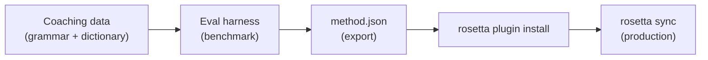

# チュートリアル: 翻訳プラグインの構築

カスタム翻訳メソッドをゼロから構築し、ベンチマークを実行して、rosettaプラグインとしてデプロイします。これは、既存のAPIがサポートしていない新しい言語ペアを追加するための完全なワークフローです。

**構築するもの:** 用語、文法ルール、ベンチマークスコアを適用した、フォーマルなフランス語向けのコーチング翻訳プラグイン。

**所要時間:** 30〜45分

**前提条件:**
- i18n-rosettaのインストール (`npm install --save-dev i18n-rosetta`)
- OpenRouter APIキー (`OPENROUTER_API_KEY`)
- Python 3.10以降 (eval harness用)

---

## ステップ 1: 問題の特定

SaaSのダッシュボードをフランス語に翻訳するとします。デフォルトの`llm`メソッドでは、正確ではあるものの、一貫性のない翻訳が生成されます。

- 「dashboard」が「tableau de bord」になることもあれば、「panneau de contrôle」になることもある
- トーンが`tu`と`vous`の形式で交互に入れ替わる
- 専門用語が一貫性なく英語化される

一般的なLLMプロンプトでは提供されない、**用語の適用**と**文体の制御**が必要です。

## ステップ 2: コーチングデータの作成

言語要件をエンコードするコーチングファイルを作成します。

```bash
mkdir -p .rosetta/coaching
```

```json title=".rosetta/coaching/fr.json"
{
  "grammar_rules": [
    "Always use the 'vous' form for formal register",
    "French adjectives agree in gender and number with their noun",
    "Use the present tense for UI instructions, not the imperative",
    "Preserve sentence-final punctuation style from the source"
  ],
  "dictionary": {
    "dashboard": "tableau de bord",
    "deployment": "déploiement",
    "settings": "paramètres",
    "environment variable": "variable d'environnement",
    "webhook": "webhook",
    "API key": "clé API",
    "sign in": "se connecter",
    "sign out": "se déconnecter",
    "repository": "dépôt",
    "pull request": "demande de tirage"
  },
  "style_notes": "Formal technical French. Prefer native French terms over anglicisms where established equivalents exist. Keep UI labels concise — 3 words maximum where possible."
}
```

**各フィールドの役割:**
- **`grammar_rules`** — 明示的な制約としてLLMのシステムプロンプトに挿入されます
- **`dictionary`** — ソースキーと照合されます。辞書の用語が出現した場合、「必須用語」としてプロンプトに挿入されます
- **`style_notes`** — 一般的なスタイルガイドとしてシステムプロンプトに追加されます

## ステップ 3: ペアの設定

フランス語に`llm-coached`を使用するようにrosettaに指示します。

```json title="i18n-rosetta.config.json"
{
  "version": 3,
  "inputLocale": "en",
  "localesDir": "./locales",
  "pairs": {
    "en:fr": {
      "method": "llm-coached",
      "model": "google/gemini-3.5-flash"
    }
  },
  "languages": {
    "fr": {
      "register": "Formal technical French (vous-form)",
      "name": "French"
    }
  }
}
```

## ステップ 4: テストの実行

```bash
npx i18n-rosetta sync --dry
```

ドライランの出力を確認します。以下をチェックしてください。
- ✅ 辞書の用語が一貫して使用されているか（「panneau de contrôle」ではなく「tableau de bord」）
- ✅ `vous`の形式が全体を通して使用されているか
- ✅ 専門用語が辞書と一致しているか

その後、実際の同期を実行します。

```bash
npx i18n-rosetta sync
```

## ステップ 5: Eval Harnessを使用したベンチマーク (オプション)

品質スコアが必要な場合（プラグインにはベンチマークデータが付属するため、必要になるでしょう）、付属のeval harnessを使用します。

### Harnessのインストール

```bash
git clone https://github.com/gamedaysuits/gds-mt-eval-harness.git
cd gds-mt-eval-harness
pip install -r requirements.txt
```

### リファレンスコーパスの作成

ソース文字列と、正しいことが確認されている翻訳を含むファイルを作成します。

```json title="corpus/french-formal.json"
[
  {
    "source": "Dashboard",
    "reference": "Tableau de bord"
  },
  {
    "source": "Sign in to your account",
    "reference": "Connectez-vous à votre compte"
  },
  {
    "source": "Your deployment is ready",
    "reference": "Votre déploiement est prêt"
  },
  {
    "source": "Environment variables",
    "reference": "Variables d'environnement"
  }
]
```

### ベンチマークの実行

```bash
python harness.py eval \
  --corpus corpus/french-formal.json \
  --source en \
  --target fr \
  --method llm-coached \
  --model google/gemini-3.5-flash
```

harnessは以下を出力します。
- **chrF++** — 文字レベルのF値 (0〜100)。70以上であれば強力です。
- **BLEU** — N-gramの重複 (0〜100)。コーチング翻訳では40以上であれば十分です。
- **完全一致率 (Exact match rate)** — リファレンスと完全に一致した翻訳の割合。

### プラグインのエクスポート

スコアに満足したら、以下を実行します。

```bash
python harness.py export \
  --name french-formal-v1 \
  --output ./french-formal-v1/
```

これにより以下が作成されます。

```
french-formal-v1/
├── method.json          # Manifest with config + benchmarks
└── coaching/
    └── fr.json          # Your coaching data
```

## ステップ 6: Rosettaへのプラグインのインストール

```bash
npx i18n-rosetta plugin install ./french-formal-v1/
```

これにより、プラグインが`.rosetta/methods/french-formal-v1/`にコピーされます。

これを使用するように設定を更新します。

```json title="i18n-rosetta.config.json"
{
  "pairs": {
    "en:fr": {
      "methodPlugin": "french-formal-v1"
    }
  }
}
```

## ステップ 7: 確認

```bash
# Check plugin is installed and shows benchmark scores
npx i18n-rosetta status

# Run a sync with the plugin
npx i18n-rosetta sync

# Audit licensing status
npx i18n-rosetta provenance
```

`status`の出力には以下のように表示されます。

```
en → fr
  Method:    french-formal-v1 (llm-coached)
  Model:     google/gemini-3.5-flash
  Quality:   high
  chrF++:    74.2
  BLEU:      46.8
  Exact:     42%
```

## 構築した内容



これで以下のものが揃いました。
1. **コーチングデータ** — 一貫性を適用する文法ルールと用語
2. **ベンチマークスコア** — プラグインに付属する定量化された品質
3. **ポータブルなプラグイン** — `method.json`とコーチングデータ。どのマシンにもインストール可能
4. **本番環境へのデプロイ** — 同期パイプラインへの統合

## 次のステップ

- **[プラグインの仕様](/docs/reference/plugin-spec)** — マニフェスト形式の完全なリファレンス
- **[翻訳メソッド](/docs/guides/translation-methods)** — 4つのメソッドすべての比較
- **[低リソース言語](/docs/guides/low-resource-languages)** — APIがサポートしていない言語にこのパターンを適用する
- **[30言語の翻訳](/docs/tutorials/translate-30-languages)** — プロジェクトをグローバルな対象者向けにスケールさせる