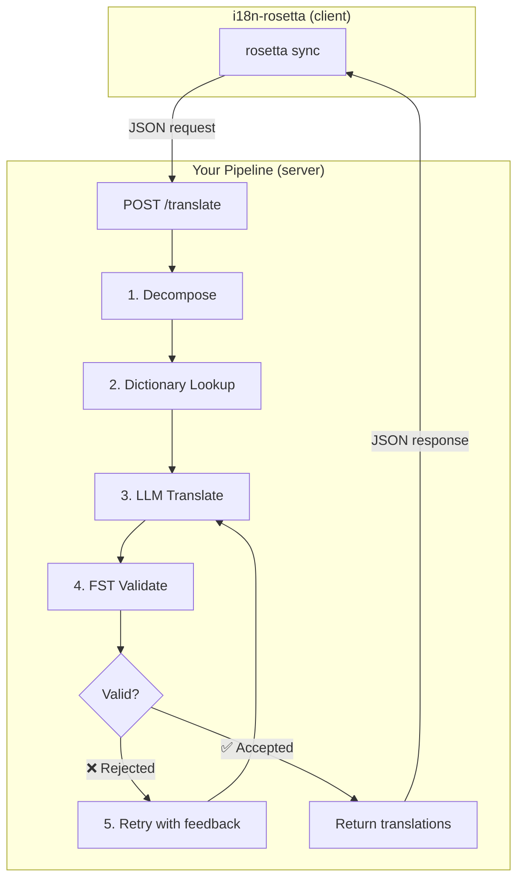
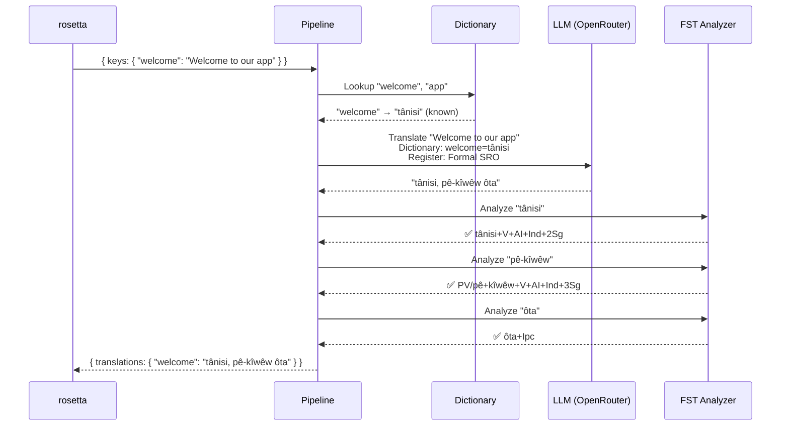
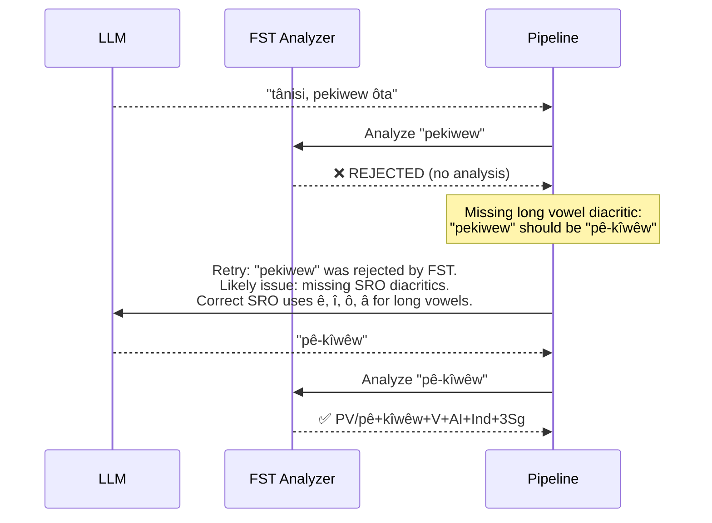
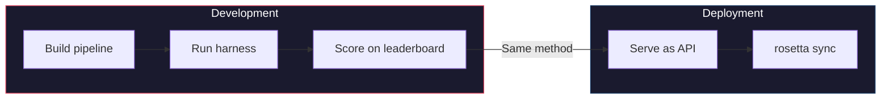

# クックブック: FSTゲート翻訳パイプライン

ソーステキストを分解し、LLMで翻訳し、有限状態トランスデューサ (FST) で出力を検証し、全体を rosetta が `api` メソッド経由で呼び出すHTTPエンドポイントとして提供する、マルチステージ翻訳パイプラインを構築します。

**構築するもの:** 形態論的に無効な翻訳がロケールファイルに到達する*前に*捕捉する、Plains Cree 向けの翻訳API。

:::info 前提条件
- 実行可能なFSTバイナリ (例: [ALTLabのPlains Creeアナライザ](https://github.com/UAlbertaALTLab/lang-crk))
- Node.js 20以上 または Python 3.10以上
- LLMステップ用のOpenRouter APIキー
:::

---

## アーキテクチャ

パイプラインはスタンドアロンのHTTPサービスとして実行されます。rosetta は内部で何が起きているかを認識したり気にしたりすることはありません。キーを送信し、翻訳を受け取るだけです。



### このアーキテクチャの理由

各ステージには特定の役割があります:

| ステージ | 役割 | 重要な理由 |
|-------|-------------|---------------|
| **Decompose** (分解) | 複合的なUI文字列を翻訳可能なセグメントに分割する | 抱合語は1つの単語に文全体をエンコードするため、LLMにはより小さな単位が必要 |
| **Dictionary Lookup** (辞書検索) | 既知の翻訳について対訳辞書を確認する | LLMの推測に頼るのではなく、既知の用語に対して正しい用語の使用を強制する |
| **LLM Translate** (LLM翻訳) | レジスターと文法のコンテキストとともにセグメントをLLMに送信する | 新しいフレーズを処理し、流暢な出力を生成する |
| **FST Validate** (FST検証) | 形態素解析器に出力を通す | 無効な語形を捕捉する。FSTが単語を拒否した場合、その言語において無効であることを意味する |
| **Retry** (再試行) | FSTのエラーフィードバックとともに拒否された単語を再送信する | 単語が*なぜ*間違っていたのかに関する具体的な情報をLLMに提供する |

---

## データフロー

単一のキー (`"welcome": "Welcome to our app"`) がパイプラインを流れる際に起こる処理は以下の通りです:



### FSTが拒否した場合



---

## 実装

### ステップ1: サーバーのスケルトン

サーバーは rosetta の [APIメソッド契約](/docs/guides/serving-a-method) を実装します。これは単一の `POST /translate` エンドポイントです。

```javascript title="server.js"
import express from 'express';
import { translateBatch } from './pipeline.js';

const app = express();
app.use(express.json());

/**
 * rosetta API contract:
 *
 * Request:  { source_locale, target_locale, method, keys: { "key": "source" } }
 * Response: { translations: { "key": "translated" }, meta: { ... } }
 */
app.post('/translate', async (req, res) => {
  const { source_locale, target_locale, method, keys } = req.body;

  // Validate request
  if (!keys || typeof keys !== 'object') {
    return res.status(400).json({ error: { message: 'Missing keys object' } });
  }

  try {
    const startTime = Date.now();
    const { translations, stats } = await translateBatch(keys, {
      sourceLang: source_locale,
      targetLang: target_locale,
    });

    res.json({
      translations,
      meta: {
        model: 'custom-pipeline/fst-gated-v1',
        method: 'decompose-lookup-translate-validate',
        elapsed_ms: Date.now() - startTime,
        fst_acceptance_rate: stats.fstAccepted / stats.total,
        retries: stats.retries,
      },
    });
  } catch (err) {
    console.error('[ERR] Pipeline failed:', err.message);
    res.status(500).json({ error: { message: err.message } });
  }
});

// Health check for rosetta connectivity verification
app.get('/health', (req, res) => res.json({ status: 'ok' }));

app.listen(3001, () => {
  console.log('FST-gated pipeline running on http://localhost:3001');
});
```

### ステップ2: パイプライン

各ステージは関数です。パイプラインはそれらを連結します。

```javascript title="pipeline.js"
import { lookupDictionary } from './dictionary.js';
import { callLLM } from './llm.js';
import { analyzeWithFST } from './fst.js';

const MAX_RETRIES = 3;

/**
 * Translate a batch of keys through the full pipeline.
 *
 * @param {object} keys - Map of key → source string
 * @param {object} options - { sourceLang, targetLang }
 * @returns {{ translations: object, stats: object }}
 */
export async function translateBatch(keys, options) {
  const translations = {};
  const stats = { total: 0, fstAccepted: 0, retries: 0, dictionaryHits: 0 };

  for (const [key, sourceText] of Object.entries(keys)) {
    stats.total++;
    translations[key] = await translateSingle(sourceText, options, stats);
  }

  return { translations, stats };
}

/**
 * Translate a single string through all pipeline stages.
 */
async function translateSingle(sourceText, options, stats) {

  // ── Stage 1: Decompose ──────────────────────────────────
  // Split compound strings into segments the LLM can handle.
  // For UI strings this is often a no-op, but for longer content
  // it prevents the LLM from losing context in long prompts.
  const segments = decompose(sourceText);

  // ── Stage 2: Dictionary Lookup ──────────────────────────
  // Check each segment against the bilingual dictionary.
  // Known terms are forced — the LLM won't override them.
  const knownTerms = {};
  for (const segment of segments) {
    const entry = lookupDictionary(segment.toLowerCase());
    if (entry) {
      knownTerms[segment] = entry;
      stats.dictionaryHits++;
    }
  }

  // ── Stage 3: LLM Translate ──────────────────────────────
  let translation = await callLLM(sourceText, {
    ...options,
    knownTerms,
    register: 'nêhiyawêwin (Plains Cree). Use SRO orthography. '
            + 'Professional register for educational contexts.',
  });

  // ── Stage 4: FST Validate ──────────────────────────────
  // Split the translation into words and check each one.
  let { accepted, rejected } = await validateWords(translation);

  // ── Stage 5: Retry Loop ─────────────────────────────────
  // If any words were rejected, retry with FST feedback.
  let attempt = 0;
  while (rejected.length > 0 && attempt < MAX_RETRIES) {
    attempt++;
    stats.retries++;

    const feedback = rejected
      .map(w => `"${w}" was rejected by the morphological analyzer`)
      .join('; ');

    translation = await callLLM(sourceText, {
      ...options,
      knownTerms,
      register: 'nêhiyawêwin (Plains Cree). Use SRO orthography.',
      feedback: `Previous attempt had invalid words. ${feedback}. `
              + 'Use correct SRO diacritics (ê, î, ô, â for long vowels). '
              + 'Ensure verb forms match expected conjugation patterns.',
    });

    ({ accepted, rejected } = await validateWords(translation));
  }

  if (rejected.length === 0) stats.fstAccepted++;

  return translation;
}

/**
 * Decompose source text into translatable segments.
 *
 * For simple key-value UI strings, this usually returns the
 * original string as a single segment. For longer content,
 * it splits on sentence boundaries.
 */
function decompose(text) {
  // Simple sentence-boundary split. Replace with your own
  // morphological decomposition for more complex needs.
  return text
    .split(/(?<=[.!?])\s+/)
    .filter(s => s.trim().length > 0);
}

/**
 * Validate each word in a translation against the FST.
 *
 * @returns {{ accepted: string[], rejected: string[] }}
 */
async function validateWords(translation) {
  // Split on whitespace and punctuation, keeping only words
  const words = translation
    .split(/[\s,;:.!?'"()[\]{}]+/)
    .filter(w => w.length > 0);

  const accepted = [];
  const rejected = [];

  for (const word of words) {
    const analyses = await analyzeWithFST(word);
    if (analyses.length > 0) {
      accepted.push(word);
    } else {
      rejected.push(word);
    }
  }

  return { accepted, rejected };
}
```

### ステップ3: FSTラッパー

FSTバイナリを非同期関数としてラップします。この例では、ALTLabのHFSTベースの Plains Cree アナライザを使用しています。

```javascript title="fst.js"
import { execFile } from 'node:child_process';
import { promisify } from 'node:util';

const execFileAsync = promisify(execFile);

// Path to your FST analyzer binary
const FST_PATH = process.env.FST_ANALYZER_PATH || './bin/crk-analyzer';

/**
 * Run a word through the FST morphological analyzer.
 *
 * Returns an array of analyses. Empty array = rejected.
 *
 * Example:
 *   analyzeWithFST("tânisi")
 *   → ["tânisi+V+AI+Ind+2Sg", "tânisi+V+AI+Cnj+2Sg"]
 *
 *   analyzeWithFST("pekiwew")
 *   → []  // rejected — missing diacritics
 *
 * @param {string} word - A single word in SRO orthography
 * @returns {string[]} Array of FST analyses (empty = rejected)
 */
export async function analyzeWithFST(word) {
  try {
    // HFST lookup: pipe the word to stdin, read analyses from stdout
    const { stdout } = await execFileAsync(
      FST_PATH,
      ['--quiet'],
      { input: word + '\n', timeout: 5000 }
    );

    // Parse HFST output: each line is "input\tanalysis\tweight"
    // Lines with "+?" indicate unrecognized forms
    return stdout
      .split('\n')
      .filter(line => line.includes('\t') && !line.includes('+?'))
      .map(line => line.split('\t')[1]);

  } catch (err) {
    // If the FST binary isn't available, log and reject
    console.error(`[WARN] FST analysis failed for "${word}": ${err.message}`);
    return [];
  }
}
```

### ステップ4: 辞書とLLMモジュール

```javascript title="dictionary.js"
/**
 * Simple bilingual dictionary backed by a JSON file.
 *
 * In production, you'd load from the coaching data directory
 * or query itwêwina (https://itwewina.altlab.app/) via API.
 */
const DICTIONARY = {
  'hello': 'tânisi',
  'welcome': 'tânisi',
  'thank you': 'kinanâskomitin',
  'home': 'kīwēwin',
  'search': 'nānātawāpahtam',
  'settings': 'isi-nākatohkēwin',
  'help': 'nīsōhkamākēwin',
  'back': 'kīwē',
};

/**
 * @param {string} term - Lowercase English term
 * @returns {string|null} Cree translation or null
 */
export function lookupDictionary(term) {
  return DICTIONARY[term] || null;
}
```

```javascript title="llm.js"
/**
 * Call an LLM via OpenRouter for translation.
 */
const OPENROUTER_API = 'https://openrouter.ai/api/v1/chat/completions';

export async function callLLM(sourceText, options) {
  const { knownTerms = {}, register, feedback } = options;

  // Build the system prompt with register and known terms
  let systemPrompt = `You are translating English to Plains Cree.\n\n`;
  systemPrompt += `Register: ${register}\n\n`;

  if (Object.keys(knownTerms).length > 0) {
    systemPrompt += `Required terminology (use these exact translations):\n`;
    for (const [en, crk] of Object.entries(knownTerms)) {
      systemPrompt += `  "${en}" → "${crk}"\n`;
    }
    systemPrompt += '\n';
  }

  if (feedback) {
    systemPrompt += `IMPORTANT correction from previous attempt:\n${feedback}\n\n`;
  }

  systemPrompt += `Rules:\n`;
  systemPrompt += `- Use Standard Roman Orthography (SRO)\n`;
  systemPrompt += `- Use macron/circumflex for long vowels: ê, î, ô, â\n`;
  systemPrompt += `- Return ONLY the Cree translation, nothing else\n`;

  const response = await fetch(OPENROUTER_API, {
    method: 'POST',
    headers: {
      'Authorization': `Bearer ${process.env.OPENROUTER_API_KEY}`,
      'Content-Type': 'application/json',
    },
    body: JSON.stringify({
      model: 'google/gemini-2.5-pro',
      messages: [
        { role: 'system', content: systemPrompt },
        { role: 'user', content: sourceText },
      ],
      temperature: 0.2,
    }),
  });

  const json = await response.json();
  return json.choices[0].message.content.trim();
}
```

---

## rosetta への接続

### ペアの設定

言語ペアを実行中のサービスに向けます:

```json title="i18n-rosetta.config.json"
{
  "version": 3,
  "inputLocale": "en",
  "pairs": {
    "en:crk": {
      "method": "api",
      "endpoint": "http://localhost:3001/translate"
    }
  },
  "languages": {
    "crk": {
      "name": "Plains Cree",
      "register": "SRO syllabics with grammatical precision."
    }
  }
}
```

### APIキーの設定

```bash
export ROSETTA_API_KEY="your-service-auth-token"
export OPENROUTER_API_KEY="sk-or-v1-..."  # for the LLM step inside the pipeline
```

### 実行

```bash
# Start the pipeline
node server.js

# In another terminal, run rosetta
npx i18n-rosetta sync
```

rosetta は英語のキーをパイプラインにPOSTします。パイプラインは分解、検索、翻訳、検証、再試行を行い、Cree の翻訳を返します。rosetta はそれらを `crk.json` に書き込みます。

---

## パイプラインの評価

同じパイプラインを [評価ハーネス](/docs/eval/harness) で評価できます。ハーネスは同じJSON入力/JSON出力パターンを使用します:

```bash
# Clone the harness
git clone https://github.com/gamedaysuits/gds-mt-eval-harness.git
cd gds-mt-eval-harness

# Run against the EDTeKLA dataset
python eval/baseline_experiment.py \
  --dataset data/edtekla-dev-v1.json \
  --model google/gemini-2.5-pro \
  --fst-analyzer ./bin/crk-analyzer \
  --condition fst-gated-v1 \
  --submit
```

`--fst-analyzer` フラグは、すべての出力に対してFST検証を実行するようハーネスに指示します。これはパイプラインが行う検証と同じものです。これにより、パイプラインのスコアをベースラインと比較できます。



**証明してから使用してください。** ハーネスでベンチマークするメソッドは、rosetta が本番環境で呼び出すメソッドと同じです。

---

## プラグインとしてのパッケージ化

パイプラインがリーダーボードのスコアを獲得したら、他のユーザーが使用できるように rosetta プラグインとしてパッケージ化します:

```json title="crk-fst-gated-v1/method.json"
{
  "name": "crk-fst-gated-v1",
  "type": "api",
  "version": "1.0.0",
  "description": "FST-gated Plains Cree translation with morphological validation",
  "author": "Your Name",

  "config": {
    "endpoint": "https://your-server.example.com/translate"
  },

  "locales": ["crk"],

  "benchmarks": {
    "crk": {
      "date": "2026-06-01T00:00:00Z",
      "corpus_size": 124,
      "exact_match_rate": 0.12,
      "corpus_chrf": 48.7,
      "model": "google/gemini-2.5-pro",
      "harness_version": "2.0"
    }
  },

  "provenance": {
    "resources": [
      { "name": "ALTLab CRK Analyzer", "license": "LGPL-3.0", "type": "fst" },
      { "name": "Wolvengrey Dictionary", "license": "CC-BY-NC-SA-4.0", "type": "dictionary" }
    ],
    "commercialReady": false,
    "flags": ["nc-resource"]
  }
}
```

インストール:

```bash
i18n-rosetta plugin install ./crk-fst-gated-v1/
```

これで、サーバーにアクセスできる人なら誰でもプラグインを使用できるようになります:

```json title="i18n-rosetta.config.json"
{
  "pairs": {
    "en:crk": { "methodPlugin": "crk-fst-gated-v1" }
  }
}
```

---

## このパターンの拡張

このクックブックでは、1つのパイプラインアーキテクチャを示しています。これを任意の言語やメソッドに適合させることができます:

| バリエーション | 変更点 |
|-----------|-------------|
| **異なるFST** | バイナリパスを入れ替える。[GiellaLT GitHub](https://github.com/giellalt) または [Apertium GitHub](https://github.com/apertium) から、100以上の言語のコンパイル済みFST (`.hfstol` や `lttoolbox` バイナリなど) をダウンロードできる。 |
| **FSTが利用できない場合** | FST実行ステージを削除し、Hugging Face の [UniMorph flat paradigm files](https://huggingface.co/datasets/unimorph/universal_morphologies) を使用して、活用形の静的データベース検索検証を実行する。 |
| **複数のLLM** | モデルを連結する。初期ドラフト用の高速モデル、修正用の推論モデルなど。 |
| **ヒューマンインザループ** | 不確実な翻訳を保持し、専門家のレビューを受けてから返すキューのステージを追加する。 |
| **ファインチューニング済みモデル** | OpenRouterの呼び出しをローカルモデル (Ollama、vLLMなど) に置き換える。 |
| **異なる言語** | 辞書、FST、レジスターを変更する。アーキテクチャは同一のまま。 |

パイプラインは1つのパターンです。各ステージは交換可能です。あなたの言語で機能するものを構築し、[リーダーボード](/leaderboard) で証明し、デプロイしてください。

---

## 関連項目

- **[API経由でのメソッドの提供](/docs/guides/serving-a-method)** — API契約の仕様
- **[プラグイン仕様](/docs/reference/plugin-spec)** — method.json マニフェストのフォーマット
- **[低リソース言語のサポート](/docs/guides/low-resource-languages)** — より広いコンテキストとOCAP原則
- **[機械翻訳の評価](/docs/eval/)** — 良いメソッドと悪いメソッド、失格になるもの
- **[評価ハーネス](/docs/eval/harness)** — パイプラインのベンチマーク方法
- **[メソッドリーダーボード](/leaderboard)** — スコアの提出
- **[ALTLab](https://altlab.artsrn.ualberta.ca/)** — Alberta Language Technology Lab (Plains Cree FST)
- **[翻訳メソッド](/docs/guides/translation-methods)** — 各組み込みメソッドの仕組み