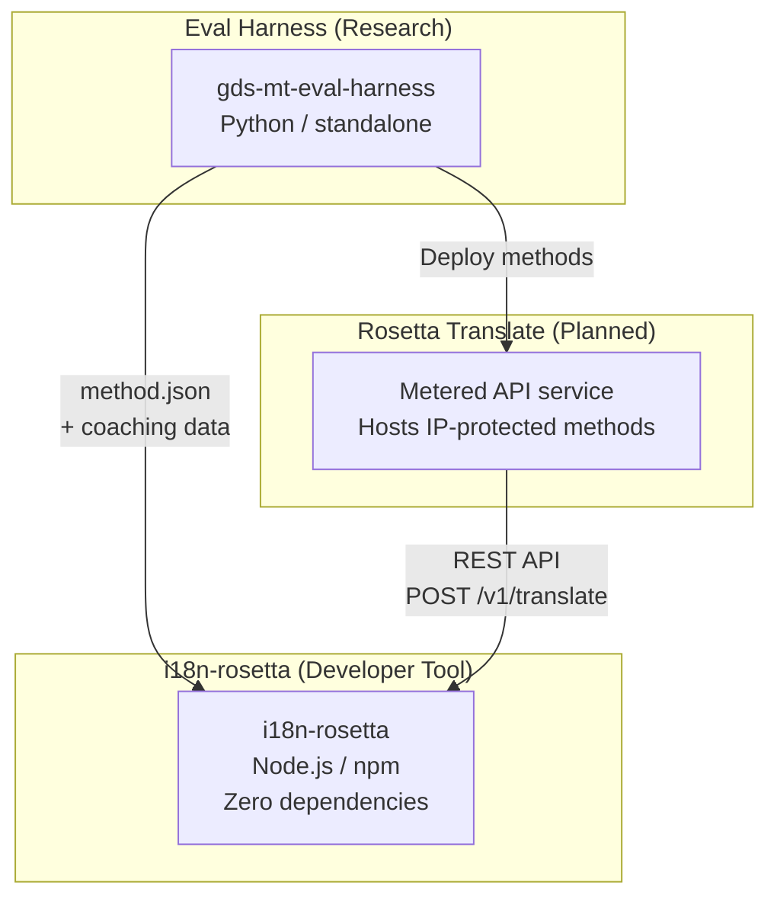
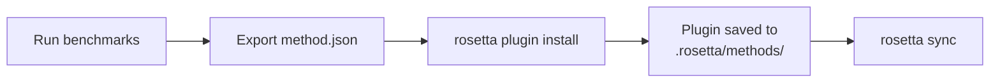
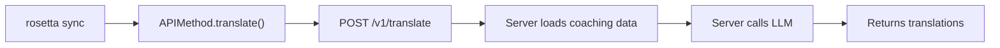

# 아키텍처

Rosetta 번역 생태계는 잘 정의된 계약을 통해 함께 작동하는 세 가지 독립적인 도구로 구성됩니다. 이들 중 어느 것도 빌드 시점에 서로 의존하지 않습니다. 이들은 공유된 **메서드 플러그인 형식**과 **REST API 계약**을 통해 통신합니다.

## 세 가지 구성 요소



### i18n-rosetta (본 프로젝트)

오픈 소스 개발자 도구입니다. 플러그인 가능한 메서드를 사용하여 로케일 파일을 번역합니다. 종속성이 없고, 구성(config)은 선택 사항이며, 즉시 사용할 수 있습니다.

**내장 메서드:**
- `llm` → OpenRouter / 모든 LLM
- `llm-coached` → LLM + 문법/사전 코칭
- `google-translate` → Google Cloud Translation API
- `api` → 모든 원격 API로 연결되는 씬 파이프(Thin pipe)

### Eval Harness (동반 프로젝트)

번역 메서드를 개발, 테스트 및 벤치마킹하기 위한 연구 도구입니다. 메서드가 허용 가능한 품질에 도달하면, harness는 `method.json` 매니페스트와 선택적인 코칭 데이터 파일로 구성된 **메서드 플러그인**을 내보냅니다.

harness는 결코 rosetta 내부에서 실행되지 않습니다. 정적 출력(JSON 파일)을 생성하는 별도의 도구입니다. Rosetta는 단지 해당 파일들을 읽기만 합니다.

[→ GitHub의 Eval Harness](https://github.com/gamedaysuits/gds-mt-eval-harness)

### Rosetta Translate (예정)

독점적인 번역 메서드를 서버 측에서 호스팅하는 종량제 API 서비스입니다. 프롬프트, 코칭 데이터 및 언어 파이프라인은 결코 서버 외부로 유출되지 않습니다.

## 연결 방식

### Eval Harness → i18n-rosetta (단방향 내보내기)



**계약**: [플러그인 사양](/docs/reference/plugin-spec)

### Rosetta Translate → i18n-rosetta (런타임 API)



Rosetta의 `APIMethod`는 **단순 파이프(dumb pipe)**입니다. 키를 내보내고 번역을 다시 받습니다. 여기에는 번역 로직이나 독점적인 콘텐츠가 전혀 포함되어 있지 않습니다.

## 각 구성 요소가 서로에 대해 아는 것

| 도구 | rosetta에 대해 아는가? | Rosetta Translate에 대해 아는가? | harness에 대해 아는가? |
|------|---------------------|-------------------------------|---------------------|
| **i18n-rosetta** | *(rosetta 자체입니다)* | 예 — `api` 메서드가 이를 호출합니다 | 아니요 — 플러그인 내보내기만 읽습니다 |
| **Rosetta Translate** | 예 — 요청을 처리합니다 | *(Rosetta Translate 자체입니다)* | 아니요 — 배포된 메서드를 수신합니다 |
| **Eval Harness** | 예 — 플러그인 형식을 내보냅니다 | 아니요 — 메서드는 별도로 배포됩니다 | *(harness 자체입니다)* |

## 사용자 시나리오

### 시나리오 1: 무료, 무구성 (대부분의 사용자)

```bash
export OPENROUTER_API_KEY=sk-...
npx i18n-rosetta sync
```

내장된 `llm` 메서드를 사용합니다. 플러그인, Rosetta Translate, harness가 없습니다.

### 시나리오 2: Google Translate 베이스라인

```bash
export GOOGLE_TRANSLATE_API_KEY=AIza...
npx i18n-rosetta sync
```

내장된 `google-translate` 메서드를 사용합니다. 플러그인이 필요하지 않습니다.

### 시나리오 3: 코칭이 번들로 제공되는 오픈 플러그인

```bash
rosetta plugin install ./french-formal-v1/
rosetta sync
```

플러그인에 `type: "llm-coached"`이 있습니다 → rosetta는 사용자 자신의 OpenRouter 키를 사용합니다. 코칭 데이터는 로컬에 있습니다(서버 호출 없음).

### 시나리오 4: DIY 코칭 (플러그인 없음, harness 없음)

```json title="i18n-rosetta.config.json"
{
  "pairs": {
    "en:fr": { "method": "llm-coached" }
  }
}
```

사용자가 `.rosetta/coaching/fr.json`에서 자체 문법 규칙과 사전을 유지 관리합니다.

## 설계 원칙

1. **순환 종속성이 없습니다.** 연결 브리지는 단방향입니다.
2. **Rosetta는 경량 코어입니다.** 종속성이 없고, 구성은 선택 사항입니다. 플러그인과 API는 부가적입니다.
3. **IP 보호는 아키텍처적입니다.** 독점적인 기술은 서버 측에 유지됩니다. npm 패키지에는 독점적인 내용이 포함되지 않습니다.
4. **플러그인 형식이 계약입니다.** 모든 것은 `method.json`을 통해 흐릅니다.
5. **각 도구는 하나의 역할만 수행합니다.** Harness → 메서드 개발. Rosetta Translate → 메서드 호스팅. Rosetta → 파일 번역.