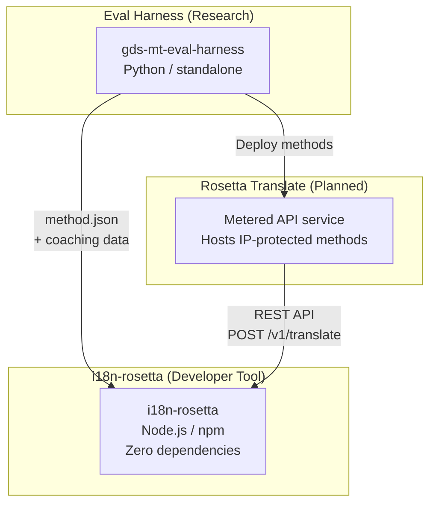
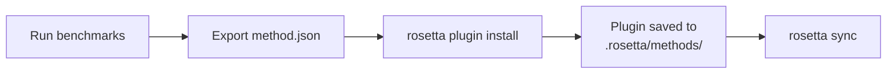
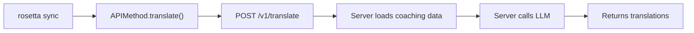

# 아키텍처

Rosetta 번역 생태계는 명확하게 정의된 계약을 통해 함께 작동하는 세 가지 독립적인 도구로 구성되어 있어요. 빌드 시점에는 어떤 도구도 서로에게 의존하지 않아요. 이들은 공유되는 **method plugin format**과 **REST API contract**를 통해 통신해요.

## 세 가지 구성 요소



### i18n-rosetta (현재 프로젝트)

오픈 소스 개발자 도구예요. 플러그인 방식의 메서드를 사용하여 로케일 파일을 번역해요. 의존성이 없고, 설정은 선택 사항이며, 즉시 사용할 수 있어요.

**내장 메서드:**
- `llm` → OpenRouter / 모든 LLM (200개 이상의 모델)
- `llm-coached` → LLM + 문법/사전 코칭
- `openai` → 직접 연결되는 OpenAI API (GPT-4o, GPT-4o-mini)
- `anthropic` → 직접 연결되는 Anthropic API (Claude Sonnet, Haiku, Opus)
- `gemini` → 직접 연결되는 Google Gemini API (Flash, Pro — 무료 티어 사용 가능)
- `google-translate` → Google Cloud Translation API v2
- `deepl` → 용어집(glossary)을 지원하는 DeepL API
- `microsoft-translator` → Azure Cognitive Services Translator
- `libretranslate` → 자체 호스팅 LibreTranslate (AGPL, 무료)
- `api` → 모든 원격 REST 엔드포인트로 연결되는 씬 파이프(Thin pipe)

### Eval Harness (동반 프로젝트)

번역 메서드를 개발, 테스트 및 벤치마킹하기 위한 연구 도구예요. 메서드가 허용 가능한 품질에 도달하면, harness는 **method plugin**을 내보내요. 이는 `method.json` 매니페스트와 선택적인 코칭 데이터 파일로 구성돼요.

harness는 절대 rosetta 내부에서 실행되지 않아요. 정적 출력(JSON 파일)을 생성하는 별도의 도구예요. Rosetta는 단지 그 파일들을 읽기만 해요.

[→ GitHub의 Eval Harness](https://github.com/gamedaysuits/gds-mt-eval-harness)

### Rosetta Translate (예정)

독점적인 번역 메서드를 서버 측에서 호스팅하는 종량제 API 서비스예요. 프롬프트, 코칭 데이터 및 언어 파이프라인은 절대 서버 외부로 유출되지 않아요.

## 연결 방식

### Eval Harness → i18n-rosetta (단방향 내보내기)



**계약**: [플러그인 사양](/docs/reference/plugin-spec)

### Rosetta Translate → i18n-rosetta (런타임 API)



Rosetta의 `APIMethod`은 **단순한 파이프(dumb pipe)**예요. 키를 내보내고 번역을 다시 받아와요. 번역 로직이나 독점적인 콘텐츠는 전혀 포함되어 있지 않아요.

## 각 구성 요소가 서로에 대해 아는 것

| 도구 | rosetta를 아나요? | Rosetta Translate를 아나요? | harness를 아나요? |
|------|---------------------|-------------------------------|---------------------|
| **i18n-rosetta** | *(rosetta 자체)* | 네 — `api` 메서드가 이를 호출해요 | 아니요 — 플러그인 내보내기만 읽어요 |
| **Rosetta Translate** | 네 — 요청을 처리해요 | *(Rosetta Translate 자체)* | 아니요 — 배포된 메서드를 받아요 |
| **Eval Harness** | 네 — 플러그인 형식을 내보내요 | 아니요 — 메서드는 별도로 배포돼요 | *(harness 자체)* |

## 사용자 시나리오

### 시나리오 1: 무료, 무설정 (대부분의 사용자)

```bash
export OPENROUTER_API_KEY=sk-...
npx i18n-rosetta sync
```

내장된 `llm` 메서드를 사용해요. 플러그인, Rosetta Translate, harness가 필요 없어요.

### 시나리오 2: Google Translate 베이스라인

```bash
export GOOGLE_TRANSLATE_API_KEY=AIza...
npx i18n-rosetta sync
```

내장된 `google-translate` 메서드를 사용해요. 플러그인이 필요 없어요.

### 시나리오 3: 코칭이 번들로 제공되는 오픈 플러그인

```bash
rosetta plugin install ./french-formal-v1/
rosetta sync
```

플러그인에 `type: "llm-coached"`가 있어요 → rosetta는 사용자의 자체 OpenRouter 키를 사용해요. 코칭 데이터는 로컬에 있어요(서버 호출 없음).

### 시나리오 4: DIY 코칭 (플러그인 없음, harness 없음)

```json title="i18n-rosetta.config.json"
{
  "pairs": {
    "en:fr": { "method": "llm-coached" }
  }
}
```

사용자가 `.rosetta/coaching/fr.json`에서 자체 문법 규칙과 사전을 유지 관리해요.

## 설계 원칙

1. **순환 의존성 없음.** 연결은 단방향이에요.
2. **Rosetta는 가벼운 코어예요.** 의존성이 없고, 설정은 선택 사항이에요. 플러그인과 API는 추가적인 요소예요.
3. **IP 보호는 아키텍처 수준에서 이루어져요.** 독점적인 기술은 서버 측에 유지돼요. npm 패키지에는 독점적인 내용이 포함되지 않아요.
4. **플러그인 형식이 곧 계약이에요.** 모든 것은 `method.json`를 통해 흐르게 돼요.
5. **각 도구는 하나의 역할만 수행해요.** Harness → 메서드 개발. Rosetta Translate → 메서드 호스팅. Rosetta → 파일 번역.

---

## 참고 항목

- [번역 메서드](/docs/guides/translation-methods) — 각 내장 메서드의 작동 방식
- [플러그인 사양](/docs/reference/plugin-spec) — method.json 매니페스트 형식
- [Eval Harness](https://mtevalarena.org/docs/specifications/harness) — 동반 연구 도구
- [API를 통한 메서드 제공](/docs/guides/serving-a-method) — 사용자 지정 번역 파이프라인 호스팅
- [리소스가 적은 언어 지원](https://mtevalarena.org/docs/community/low-resource-languages) — 이 아키텍처를 이끌어낸 사용 사례