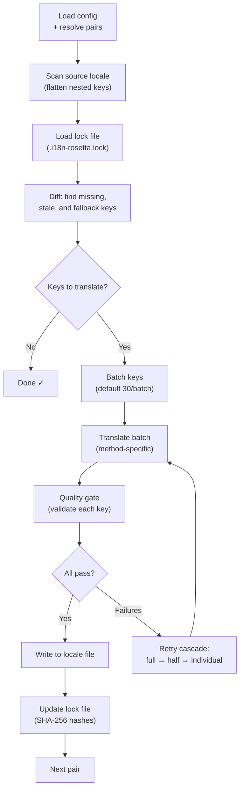

# Sync 작동 방식

`sync` 명령은 rosetta의 핵심 작업입니다. `npx i18n-rosetta sync`을(를) 실행하면 다음과 같은 과정이 진행됩니다.

## 파이프라인 개요



## 단계별 과정

### 1. Config 해석

rosetta는 `i18n-rosetta.config.json`을(를) 로드합니다(또는 설정을 자동 감지합니다). 다음 항목을 해석합니다:
- 소스 로케일 및 타겟 로케일
- 페어 그래프(pair graph) (처리할 source→target 조합)
- 페어별 method, model 및 quality 설정

### 2. 소스 스캔

소스 로케일 파일을 로드하여 key→value 맵으로 평탄화(flatten)합니다:

```json
// Input (nested)
{ "hero": { "title": "Welcome", "subtitle": "Build" } }

// Flattened
{ "hero.title": "Welcome", "hero.subtitle": "Build" }
```

### 3. 변경 사항 감지

rosetta는 이전에 번역된 소스 값의 SHA-256 해시를 저장하는 `.i18n-rosetta.lock`을(를) 읽습니다. 각 키에 대해 다음을 확인합니다:

| 조건 | 작업 |
|-----------|--------|
| 타겟에 키가 없음 | **번역** |
| 마지막 Sync 이후 소스 해시가 변경됨 | **재번역** (stale) |
| 타겟 값이 `[EN]`(으)로 시작함 | **재번역** (fallback placeholder) |
| 소스 해시가 변경되지 않았고 키가 존재함 | **건너뛰기** |

이것이 rosetta가 변경된 부분만 번역하는 이유입니다. 매 Sync마다 전체 파일을 다시 번역하지 않습니다.

### 4. 일괄 처리 (Batching)

키는 배치(batch)로 그룹화됩니다(기본값: LLM의 경우 배치당 30개 키, Google Translate의 경우 128개). 일괄 처리를 통해 프롬프트를 관리 가능한 상태로 유지하면서 API 왕복 횟수를 줄입니다.

### 5. 번역

각 배치는 구성된 번역 method로 전송됩니다:

- **`llm`**: Register 지침이 포함된 OpenRouter용 구조화된 프롬프트
- **`llm-coached`**: 위와 동일하지만, 문법 규칙, 사전(dictionary) 및 스타일 노트가 주입됨
- **`google-translate`**: Google Cloud Translation API v2 일괄 요청
- **`api`**: 원격 엔드포인트로의 HTTP POST

특정 로케일에 대한 시스템 메시지(register, 규칙)는 모든 배치에서 동일하므로 **프롬프트 캐싱(prompt caching)**이 가능합니다. Anthropic 및 Google과 같은 제공업체는 반복되는 시스템 메시지를 캐시하여 토큰 비용을 줄입니다.

### 6. 품질 게이트 (Quality Gate)

모든 번역은 디스크에 기록되기 전에 검증됩니다. 5가지 검사가 실행됩니다:

| 검사 | 감지 내용 | 예시 |
|-------|----------------|---------|
| **비어 있음 (Empty/blank)** | 모델이 아무것도 반환하지 않음 | `""` |
| **소스 에코 (Source echo)** | 모델이 영어 입력을 그대로 반환함 | 일본어의 경우 `"Welcome"` |
| **환각 루프 (Hallucination loop)** | 반복되는 트라이그램(trigram) | `"Qo' Qo' Qo' Qo'"` |
| **길이 팽창 (Length inflation)** | 출력 결과가 소스보다 4배 이상 김 | 10자 소스 → 50자 출력 |
| **문자 준수 (Script compliance)** | 해당 로케일에 잘못된 문자 사용 | 아랍어 로케일에 라틴 텍스트 사용 |

실패한 항목은 `[GATE]` 접두사와 함께 기록됩니다. 조용히 대체(silent fallback)되는 경우는 없습니다.

자세한 내용은 [품질 게이트](/docs/concepts/quality-gate)를 참조하십시오.

### 7. 재시도 캐스케이드 (Retry Cascade)

JSON 파싱 실패 또는 배치 수준의 오류가 발생하면, rosetta는 점진적으로 더 작은 배치로 재시도합니다:

```
Full batch (30 keys) → Failed
Half batch (15 keys) → Failed
Individual keys (1 each) → Isolates the problem key
```

과도한 토큰 소비를 방지하기 위해 재시도 예산은 `maxRetries`(기본값: 3)으로 제한됩니다.

### 8. 쓰기 및 잠금 (Write & Lock)

검증을 통과한 번역은 원래의 중첩 구조를 유지하면서 타겟 로케일 파일에 기록됩니다. 잠금 파일(lock file)은 새로운 SHA-256 해시로 업데이트됩니다.

## 부분 성공 (Partial Success)

하나의 배치가 실패하더라도 나머지 작업이 차단되지 않습니다. 10개의 배치 중 9개가 성공하면 해당 9개가 기록됩니다. 실패한 배치는 로그에 기록되며, `sync`을(를) 다시 실행하여 재시도할 수 있습니다.

## 예행 연습 (Dry Run)

파일을 기록하지 않고 변경될 내용을 미리 확인합니다:

```bash
npx i18n-rosetta sync --dry
```

## 강제 재번역 (Force Re-translate)

변경되지 않은 경우에도 특정 키를 강제로 재번역합니다:

```bash
npx i18n-rosetta sync --force-keys "hero.title,nav.about"
```

## 비용 추정 (Cost Estimation)

번역하기 전에 rosetta는 페어별 예상 비용을 보여주는 **사전 Sync 비용 보고서(pre-sync cost report)**를 생성합니다. 이 작업은 모든 `sync` 실행 시 자동으로 진행되며, API 호출이 이루어지기 전에 확인할 수 있습니다.

```
╔══════════════════════════════════════════════════════════╗
║  Cost Estimate                                          ║
╠════════════╦═══════╦════════════╦════════════════════════╣
║ Pair       ║ Keys  ║ Est. Cost  ║ Method                 ║
╠════════════╬═══════╬════════════╬════════════════════════╣
║ en → fr    ║   142 ║ $0.07      ║ google-translate       ║
║ en → ja    ║    38 ║   —        ║ llm (model-dependent)  ║
║ en → crk   ║    38 ║   —        ║ llm-coached            ║
╚════════════╩═══════╩════════════╩════════════════════════╝
```

### 추정 대상

각 번역 method는 자체적인 비용 추정치를 제공합니다:

| Method | 비용 기준 (Cost Basis) | 정확도 (Precision) |
|--------|-----------|-----------|
| `google-translate` | Google의 공시 요금(100만 자당 $20) | 정확함 |
| `llm` | OpenRouter 모델에 따라 다름 | 모델에 따라 다름 — [OpenRouter 요금제](https://openrouter.ai/models) 확인 |
| `llm-coached` | `llm`와 동일하며 코칭 컨텍스트 토큰이 추가됨 | 모델에 따라 다름 |
| `api` | 서버에서 결정됨 | 알 수 없음 — 엔드포인트를 쿼리하지 않고는 추정할 수 없음 |

method가 비용을 결정할 수 없는 경우(LLM method, 원격 API), rosetta는 추측하는 대신 `—`을(를) 보고합니다. 실제로 번역하지 않고 비용 추정치를 확인하려면 `--dry`을(를) 사용하십시오.