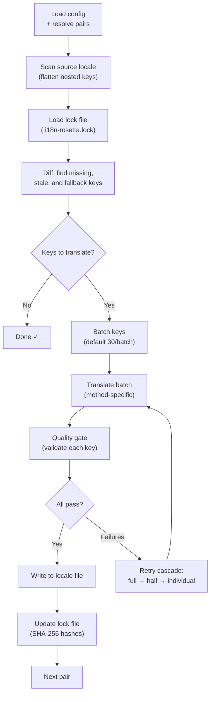

# Sync 작동 방식

`sync` 명령어는 rosetta의 핵심 작업이에요. `npx i18n-rosetta sync`을(를) 실행하면 다음과 같은 과정이 진행돼요.

## 파이프라인 개요



## 단계별 안내

### 1. 설정 확인

rosetta는 `i18n-rosetta.config.json`을(를) 로드해요(또는 설정을 자동 감지해요). 다음 항목들을 확인해요:
- Source locale 및 target locale
- 페어 그래프(처리할 source→target 조합)
- 페어별 method, model 및 품질 설정

### 2. Source 스캔

Source locale 파일을 로드하고 key→value 맵으로 평탄화(flatten)해요:

```json
// Input (nested)
{ "hero": { "title": "Welcome", "subtitle": "Build" } }

// Flattened
{ "hero.title": "Welcome", "hero.subtitle": "Build" }
```

### 3. 변경 사항 감지

rosetta는 이전에 번역된 source 값의 SHA-256 해시를 저장하는 `.i18n-rosetta.lock`을(를) 읽어요. 각 key에 대해 다음을 확인해요:

| 조건 | 작업 |
|-----------|--------|
| Target에 key가 없음 | **번역** |
| 마지막 Sync 이후 source 해시가 변경됨 | **재번역** (오래됨) |
| Target 값이 `[EN]`(으)로 시작함 | **재번역** (대체 자리 표시자) |
| Source 해시가 변경되지 않았고 key가 존재함 | **건너뛰기** |

이것이 rosetta가 변경된 내용만 번역하는 이유예요. Sync를 할 때마다 전체 파일을 다시 번역하지 않아요.

### 4. 일괄 처리(Batching)

Key들을 배치(batch)로 그룹화해요(기본값: LLM의 경우 배치당 30개의 key, Google Translate의 경우 128개). 일괄 처리를 하면 프롬프트를 관리하기 쉬운 상태로 유지하면서 API 왕복 횟수를 줄일 수 있어요.

### 5. 번역

각 배치는 설정된 번역 method로 전송돼요:

- **`llm`**: 어조(register) 및 성별 가이드라인 지침이 포함된 구조화된 프롬프트를 OpenRouter로 전송해요.
- **`llm-coached`**: 위와 동일하지만 문법 규칙, 사전 및 스타일 노트가 추가로 주입돼요.
- **`google-translate`**: Google Cloud Translation API v2 일괄(batch) 요청이에요.
- **`api`**: 원격 엔드포인트로의 HTTP POST 요청이에요.

특정 locale에 대한 시스템 메시지(어조, 성별 가이드라인, 규칙)는 모든 배치에서 동일하므로 **프롬프트 캐싱(prompt caching)**이 가능해요. Anthropic이나 Google 같은 제공업체는 반복되는 시스템 메시지를 캐시하여 토큰 비용을 줄여줘요.

### 6. 품질 게이트(Quality Gate)

모든 번역은 디스크에 기록되기 전에 검증을 거쳐요. 5가지 검사가 실행돼요:

| 검사 항목 | 감지 내용 | 예시 |
|-------|----------------|---------|
| **비어 있음/공백(Empty/blank)** | 모델이 아무것도 반환하지 않음 | `""` |
| **Source 에코(Source echo)** | 모델이 입력된 영어를 그대로 반환함 | 일본어의 경우 `"Welcome"` |
| **환각 루프(Hallucination loop)** | 반복되는 트라이그램(trigram) | `"Qo' Qo' Qo' Qo'"` |
| **길이 팽창(Length inflation)** | 출력 결과가 source보다 4배 이상 긺 | 10자 source → 50자 출력 |
| **문자 규정 준수(Script compliance)** | locale에 맞지 않는 잘못된 문자 | 아랍어 locale에 라틴 텍스트 사용 |

실패한 항목은 `[GATE]` 접두사와 함께 로그에 기록돼요. 조용히 대체(fallback)되는 일은 없어요.

자세한 내용은 [품질 게이트(Quality Gate)](/docs/concepts/quality-gate)를 참고하세요.

### 7. 재시도 캐스케이드(Retry Cascade)

JSON 파싱 실패나 배치 수준의 오류가 발생하면, rosetta는 점진적으로 더 작은 배치로 재시도해요:

```
Full batch (30 keys) → Failed
Half batch (15 keys) → Failed
Individual keys (1 each) → Isolates the problem key
```

과도한 토큰 소비를 방지하기 위해 재시도 횟수는 `maxRetries`(기본값: 3)로 제한돼요.

### 8. 쓰기 및 잠금(Write & Lock)

검증을 통과한 번역은 원래의 중첩(nesting) 구조를 유지한 채 target locale 파일에 기록돼요. 잠금(lock) 파일은 새로운 SHA-256 해시로 업데이트돼요.

## 부분 성공

하나의 배치가 실패하더라도 나머지 배치의 처리를 막지 않아요. 10개의 배치 중 9개가 성공하면 해당 9개는 기록돼요. 실패한 배치는 로그에 남으며, `sync`을(를) 다시 실행하여 재시도할 수 있어요.

## Dry Run

파일을 기록하지 않고 변경될 내용을 미리 확인해 보세요:

```bash
npx i18n-rosetta sync --dry
```

## 강제 재번역

변경되지 않았더라도 특정 key를 강제로 다시 번역해요:

```bash
npx i18n-rosetta sync --force-keys "hero.title,nav.about"
```

## 비용 산정

번역하기 전에 rosetta는 페어별 예상 비용을 보여주는 **사전 Sync 비용 보고서(pre-sync cost report)**를 생성해요. 이 과정은 모든 `sync` 실행 시 자동으로 진행되며, API 호출이 이루어지기 전에 확인할 수 있어요.

```
╔══════════════════════════════════════════════════════════╗
║  Cost Estimate                                          ║
╠════════════╦═══════╦════════════╦════════════════════════╣
║ Pair       ║ Keys  ║ Est. Cost  ║ Method                 ║
╠════════════╬═══════╬════════════╬════════════════════════╣
║ en → fr    ║   142 ║ $0.07      ║ google-translate       ║
║ en → ja    ║    38 ║   —        ║ llm (model-dependent)  ║
║ en → crk   ║    38 ║   —        ║ llm-coached            ║
╚════════════╩═══════╩════════════╩════════════════════════╝
```

### 산정 대상

각 번역 method는 자체적인 비용 산정 방식을 제공해요:

| Method | 비용 기준 | 정확도 |
|--------|-----------|-----------|
| `google-translate` | Google의 공식 요금(100만 자당 $20) | 정확함 |
| `llm` | OpenRouter 모델에 따라 다름 | 모델에 따라 다름 — [OpenRouter 가격 정책](https://openrouter.ai/models) 확인 |
| `llm-coached` | `llm`와 동일하며 코칭 컨텍스트 토큰 추가됨 | 모델에 따라 다름 |
| `api` | 서버에서 결정됨 | 알 수 없음 — 엔드포인트를 쿼리하지 않고는 산정할 수 없음 |

method가 비용을 결정할 수 없는 경우(LLM method, 원격 API), rosetta는 추측하는 대신 `—`을(를) 보고해요. 실제로 번역하지 않고 예상 비용을 확인하려면 `--dry`을(를) 사용하세요.

---

## 참고 항목

- [CLI 레퍼런스 — sync](/docs/reference/cli#sync) — 명령어 플래그 및 옵션
- [품질 게이트(Quality Gate)](/docs/concepts/quality-gate) — 번역 검증 방식
- [번역 Method](/docs/guides/translation-methods) — 각 method의 작동 방식
- [설정(Configuration)](/docs/getting-started/configuration) — 설정 레퍼런스
- [CI/CD 가이드](/docs/guides/ci-cd) — 파이프라인에서 Sync 자동화하기