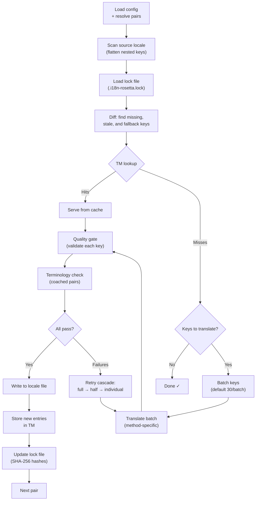

# Sync 작동 방식

`sync` 명령어는 rosetta의 핵심 작업이에요. `npx i18n-rosetta sync`을(를) 실행하면 다음과 같은 과정이 진행돼요.

## 파이프라인 개요



## 단계별 안내

### 1. 설정 확인

Rosetta는 `i18n-rosetta.config.json`을(를) 불러와요(또는 설정을 자동 감지해요). 그리고 다음 항목들을 확인해요:
- 소스 로케일 및 타겟 로케일
- 페어 그래프(어떤 소스→타겟 조합을 처리할지)
- 페어별 번역 방식(method), 모델, 품질 설정

### 2. 소스 스캐닝

소스 로케일 파일을 불러온 후, key→value 맵 형태로 평탄화(flatten)해요:

```json
// Input (nested)
{ "hero": { "title": "Welcome", "subtitle": "Build" } }

// Flattened
{ "hero.title": "Welcome", "hero.subtitle": "Build" }
```

### 3. 변경 사항 감지

Rosetta는 이전에 번역된 소스 값의 SHA-256 해시를 저장하는 `.i18n-rosetta.lock`을(를) 읽어와요. 각 키에 대해 다음을 확인해요:

| 조건 | 작업 |
|-----------|--------|
| 타겟에 키가 없음 | **번역** |
| 마지막 동기화 이후 소스 해시가 변경됨 | **재번역** (오래됨) |
| 타겟 값이 `[EN]`(으)로 시작함 | **재번역** (대체 자리 표시자) |
| 소스 해시가 변경되지 않았고 키가 존재함 | **건너뛰기** |

이것이 rosetta가 변경된 내용만 번역하는 이유예요. 동기화할 때마다 전체 파일을 다시 번역하지 않아요.

### 4. 일괄 처리(Batching)

키들은 배치(batch) 단위로 그룹화돼요(기본값: LLM의 경우 배치당 30개 키, Google Translate의 경우 128개). 일괄 처리를 통해 프롬프트를 관리하기 쉬운 상태로 유지하면서 API 왕복 횟수를 줄일 수 있어요.

### 4b. 번역 메모리(Translation Memory)

일괄 처리 전에 rosetta는 번역 메모리 캐시(`.rosetta/tm.json`)를 확인해요. 소스 텍스트 + 로케일 + 번역 방식이 이전 번역과 일치하는 키는 캐시에서 즉시 제공되므로 API 호출이 필요하지 않아요.

```
  [TM] 142 key(s) served from cache
  Translating 3 key(s) to French (llm)... [OK]
```

번역 메모리(TM)는 비용을 절감하는 주요 메커니즘이에요. 단일 키 변경 후 동기화를 다시 실행하면 전체 파일이 아닌 해당 키 하나만 번역돼요. 자세한 내용은 [번역 메모리](/docs/concepts/translation-memory)를 참고하세요.

단일 실행에서 캐시를 우회하려면 다음을 사용하세요: `i18n-rosetta sync --no-tm`

### 5. 번역

각 배치는 설정된 번역 방식(method)으로 전송돼요:

- **`llm`**: 어조(register) 및 성별 지침이 포함된 구조화된 프롬프트를 OpenRouter로 전송해요.
- **`llm-coached`**: 위와 동일하지만 문법 규칙, 사전, 스타일 노트가 추가로 주입돼요.
- **`google-translate`**: Google Cloud Translation API v2 일괄 요청을 보내요.
- **`api`**: 원격 엔드포인트로 HTTP POST 요청을 보내요.

시스템 메시지(어조, 성별 지침, 규칙)는 특정 로케일의 모든 배치에서 동일하게 유지되어 **프롬프트 캐싱**을 가능하게 해요. Anthropic이나 Google 같은 제공업체는 반복되는 시스템 메시지를 캐시하여 토큰 비용을 줄여줘요.

### 6. 품질 게이트(Quality Gate)

모든 번역은 디스크에 기록되기 전에 검증을 거쳐요. 5가지 검사가 실행돼요:

| 검사 항목 | 감지 내용 | 예시 |
|-------|----------------|---------|
| **비어 있음/공백 (Empty/blank)** | 모델이 아무것도 반환하지 않음 | `""` |
| **소스 에코 (Source echo)** | 모델이 입력된 영어를 그대로 반환함 | 일본어의 경우 `"Welcome"` |
| **환각 루프 (Hallucination loop)** | 반복되는 트라이그램(trigram) | `"Qo' Qo' Qo' Qo'"` |
| **길이 팽창 (Length inflation)** | 결과물이 소스보다 4배 이상 긺 | 10자 소스 → 50자 결과물 |
| **문자 체계 준수 (Script compliance)** | 로케일에 맞지 않는 문자 체계 | 아랍어 로케일에 라틴 텍스트 사용 |

실패한 항목은 `[GATE]` 접두사와 함께 로그에 기록돼요. 조용히 대체(fallback)되는 경우는 없어요.

자세한 내용은 [품질 게이트](/docs/concepts/quality-gate)를 참고하세요.

### 6b. 용어 검증(Terminology Verification)

사전이 포함된 coached 페어의 경우, rosetta는 번역 후 LLM이 필수 용어를 실제로 사용했는지 확인해요. 위반 사항은 `[TERM]` 경고로 로그에 기록돼요:

```
[TERM] en→fr: 2 term violation(s)
  • "dashboard" → expected "tableau de bord" but got "panneau"
```

이것은 경고일 뿐 차단 오류가 아니므로 번역은 정상적으로 기록돼요.

### 7. 재시도 캐스케이드(Retry Cascade)

JSON 파싱 실패나 배치 수준의 오류가 발생하면, rosetta는 점진적으로 더 작은 배치로 재시도해요:

```
Full batch (30 keys) → Failed
Half batch (15 keys) → Failed
Individual keys (1 each) → Isolates the problem key
```

과도한 토큰 소비를 방지하기 위해 재시도 횟수는 `maxRetries`(기본값: 3)으로 제한돼요.

### 8. 쓰기 및 잠금(Write & Lock)

통과된 번역은 원래의 중첩 구조를 유지한 채 타겟 로케일 파일에 기록돼요. 잠금(lock) 파일은 새로운 SHA-256 해시로 업데이트돼요.

## 콘텐츠 번역 (2단계)

Docusaurus 및 Hugo 프로젝트의 경우, JSON 키 번역 후 `sync`이(가) 두 번째 단계를 실행해요. 이 단계에서는 동일한 방식과 품질 게이트를 사용하여 Markdown 및 MDX 파일(문서, 블로그 게시물, 튜토리얼)을 번역해요.

### 작동 방식

1. Rosetta는 content/docs 디렉터리를 탐색하여 모든 소스 콘텐츠 파일(`.md`, `.mdx`)을 찾아요.
2. 각 파일 × 로케일 페어에 대해 별도의 콘텐츠 잠금 파일(`.i18n-rosetta-content.lock`)에서 SHA-256 해시 변경 사항을 확인해요.
3. 변경되거나 누락된 파일은 평면적인(flat) 작업 항목 풀(pool)에 수집돼요.
4. 이 풀은 **병렬 동시성(parallel concurrency)**으로 처리돼요(기본값: 12개의 동시 API 호출).

```
Phase 2: content (79 translations to process, 341 skipped, concurrency: 12)

    [1/79] (1%)  docs/concepts/security.md → ja [RE-TRANSLATE] (~3328s left)
    [2/79] (3%)  docs/concepts/security.md → th [RE-TRANSLATE] (~1821s left)
    ...
    [79/79] (100%) blog/v3-2-quality.md → de [OK]

  [OK] Created 79 content file(s), 341 unchanged
```

### 플랫 풀 병렬 처리(Flat-pool parallelism)

1단계(로케일별로 순차 처리되는 JSON 키)와 달리, 2단계는 모든 파일×로케일 조합을 평면적인 목록으로 처리해요. 즉, 서로 다른 파일과 서로 다른 로케일이 동시에 번역돼요:

- `docs/configuration.md → fr`과(와) `docs/cli.md → ja`이(가) 동시에 실행돼요.
- 420개의 번역 말뭉치는 동시성 12에서 약 11분 만에 완료돼요.
- 10개 완료될 때마다 매니페스트를 점진적으로 기록하여, 프로세스가 강제 종료되더라도 진행 상황이 손실되는 것을 방지해요.

병렬 처리는 `--concurrency` 또는 `concurrency` 설정 필드로 제어할 수 있어요:

```bash
# Faster (more parallel calls, higher API load)
npx i18n-rosetta sync --concurrency 20

# Slower (gentler on rate limits)
npx i18n-rosetta sync --concurrency 4
```

### 콘텐츠 보호

번역하는 동안 rosetta는 번역할 수 없는 콘텐츠를 보호해요:

- **코드 블록**(펜스 및 들여쓰기 포함)은 자리 표시자로 대체돼요.
- `translatableFields` 목록에 없는 **프런트매터(Frontmatter)** 필드는 그대로 유지돼요.
- **링크**, 이미지 경로, HTML 태그는 보호돼요.
- **숏코드(Shortcodes)** 및 보간 변수(예: `{count}`, `{{.Params.title}}`)는 보호돼요.

번역 후 모든 자리 표시자가 복원되고 검증돼요. 누락되거나 손상된 항목이 있으면 번역이 거부되고 재시도돼요.

## 부분 성공

하나의 배치가 실패하더라도 나머지 작업은 차단되지 않아요. 10개의 배치 중 9개가 성공하면 해당 9개는 기록돼요. 실패한 배치는 로그에 기록되며, `sync`을(를) 다시 실행하여 재시도할 수 있어요.

## 모의 실행(Dry Run)

파일을 기록하지 않고 변경될 내용을 미리 확인해 보세요:

```bash
npx i18n-rosetta sync --dry-run
```

## 강제 재번역

변경되지 않은 경우에도 특정 키를 강제로 재번역해요:

```bash
npx i18n-rosetta sync --force-keys "hero.title,nav.about"
```

## 비용 추정

번역하기 전에 rosetta는 페어별 예상 비용을 보여주는 **동기화 전 비용 보고서**를 생성해요. 이 보고서는 모든 `sync` 실행 시 자동으로 생성되며, API 호출이 이루어지기 전에 확인할 수 있어요.

```
╔══════════════════════════════════════════════════════════╗
║  Cost Estimate                                          ║
╠════════════╦═══════╦════════════╦════════════════════════╣
║ Pair       ║ Keys  ║ Est. Cost  ║ Method                 ║
╠════════════╬═══════╬════════════╬════════════════════════╣
║ en → fr    ║   142 ║ $0.07      ║ google-translate       ║
║ en → ja    ║    38 ║   —        ║ llm (model-dependent)  ║
║ en → crk   ║    38 ║   —        ║ llm-coached            ║
╚════════════╩═══════╩════════════╩════════════════════════╝
```

### 추정 대상

각 번역 방식은 자체적인 비용 추정치를 제공해요:

| 방식 (Method) | 비용 기준 | 정확도 |
|--------|-----------|-----------|
| `google-translate` | Google의 공개 요금(백만 자당 $20) | 정확함 |
| `llm` | OpenRouter 모델에 따라 다름 | 모델에 따라 다름 — [OpenRouter 가격](https://openrouter.ai/models) 확인 |
| `llm-coached` | `llm`과(와) 동일하며 코칭 컨텍스트 토큰 추가 | 모델에 따라 다름 |
| `api` | 서버에서 결정됨 | 알 수 없음 — 엔드포인트를 쿼리하지 않고는 추정 불가 |

방식(LLM 방식, 원격 API)에서 비용을 결정할 수 없는 경우, rosetta는 추측하는 대신 `—`을(를) 보고해요. 실제로 번역하지 않고 비용 추정치를 확인하려면 `--dry`을(를) 사용하세요.

---

## 참고 항목

- [CLI 참조 — sync](/docs/reference/cli#sync) — 명령어 플래그 및 옵션
- [번역 메모리](/docs/concepts/translation-memory) — 캐싱 및 비용 절감
- [품질 게이트](/docs/concepts/quality-gate) — 번역 검증 방식
- [번역 방식](/docs/guides/translation-methods) — 각 방식의 작동 원리
- [전문 번역가와 협업하기](/docs/guides/professional-translators) — XLIFF 워크플로우
- [설정](/docs/getting-started/configuration) — 설정 참조
- [CI/CD 가이드](/docs/guides/ci-cd) — 파이프라인에서 동기화 자동화하기