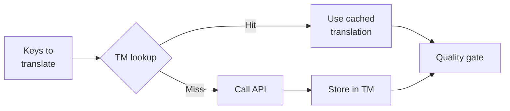

# Translation Memory

Translation Memory(TM)는 rosetta의 내장 캐싱 레이어예요. 원문 + 로케일 + 메서드를 키(key)로 사용하여 모든 번역을 저장하므로, `sync`을(를) 다시 실행할 때 실제로 변경된 키에 대해서만 API를 호출해요.

## TM이 존재하는 이유

TM이 없다면, 이전 실행에서 동일한 로케일에 대해 정확히 같은 영어 텍스트를 이미 번역했더라도 모든 `sync`이(가) 수정된 모든 키를 다시 번역하게 돼요. 이로 인해 비용이 낭비되는 일반적인 시나리오는 다음과 같아요.

| 시나리오 | TM 없음 | TM 있음 |
|----------|-----------|---------|
| 1개의 키 변경 후 동기화 다시 실행 (500개 키 × 10개 로케일) | 5,000번의 API 호출 | 10번의 API 호출 |
| 키를 이전 영어 값으로 되돌림 | 전체 API 호출 | 즉각적인 캐시 적중(Cache hit) |
| 동일한 문구가 3개의 로케일 파일에 나타남 | 3번의 API 호출 | 1번의 API 호출 + 2번의 캐시 적중 |
| Dry-run → 실제 동기화 | 두 경우 모두 전체 API 호출 | 첫 번째 실행 시 캐시, 두 번째 실행 시 재사용 |

TM은 **기본적으로 활성화되어 있으며** 별도의 구성이 필요하지 않아요. 번역은 모든 `sync` 중에 자동으로 캐시되며 이후 실행 시 제공돼요.

## 작동 방식

### 캐시 키 (Cache Key)

각 TM 항목은 세 가지 값의 SHA-256 해시를 키로 사용해요.

```
SHA-256( sourceValue + '\x00' + locale + '\x00' + method )
```

| 구성 요소 | 키에 포함되는 이유 |
|-----------|-------------------|
| `sourceValue` | 다른 영어 텍스트 → 다른 번역 |
| `locale` | "Hello"는 프랑스어와 일본어로 다르게 번역됨 |
| `method` | Google Translate 출력 결과 ≠ GPT-4o 출력 결과 |

널 바이트 구분자(`\x00`)는 `"ab" + "c"`와(과) `"a" + "bc"` 사이의 충돌을 방지해요.

### 동기화 중



1. 번역 API를 호출하기 전에, rosetta는 키를 **TM 적중(hits)**과 **TM 실패(misses)**로 분할해요.
2. 적중된 항목은 캐시에서 즉시 제공돼요 — API 호출, 지연 시간, 비용이 발생하지 않아요.
3. 실패한 항목은 일반적인 번역 파이프라인을 거쳐요.
4. API에서 가져온 새로운 번역은 향후 실행을 위해 TM에 저장돼요.
5. 모든 번역(캐시된 번역 + 새로운 번역)은 품질 게이트(quality gate)를 통과해요.

### 저장소 (Storage)

TM은 프로젝트 루트의 `.rosetta/tm.json`에 저장돼요. 이 파일은 크기를 관리하기 쉽게 유지하기 위해 컴팩트한 JSON(pretty-printing 없음)을 사용해요. 각 항목에는 다음이 저장돼요.

| 필드 | 설명 |
|-------|-------------|
| `t` | 번역된 텍스트 |
| `ts` | 캐시된 시간의 ISO-8601 타임스탬프 |
| `l` | 대상 로케일 코드 (통계/필터링용) |
| `m` | 번역 메서드 이름 (통계/필터링용) |

50개 언어 × 500개 키 = 25,000개 항목일 때, 파일 크기는 약 2~3MB가 돼요.

## 캐시 관리

### 통계 보기

```bash
i18n-rosetta tm stats
```

항목 수, 파일 크기 및 로케일별 세부 정보를 보여줘요.

```
  Translation Memory — .rosetta/tm.json

  Entries:      2,847
  File size:    1.2 MB
  Created:      2026-05-20
  Last entry:   2026-05-24

  By locale:
    fr       482 entries  (llm: 380, llm-coached: 102)
    de       471 entries  (llm: 471)
    ja       465 entries  (llm: 465)
```

### 캐시 지우기

```bash
# Clear everything (with confirmation prompt)
i18n-rosetta tm clear

# Clear without prompt (CI environments)
i18n-rosetta tm clear --yes

# Clear only one locale
i18n-rosetta tm clear --locale fr
```

### 한 번의 실행에서 TM 건너뛰기

```bash
# Force fresh API calls for all keys (useful when switching providers)
i18n-rosetta sync --no-tm
```

이 작업은 캐시를 삭제하지 않아요 — 이번 실행에서만 캐시를 무시하고 새로운 결과를 저장하지 않아요.

## TM이 도움이 되지 않는 경우

다음과 같은 경우에는 TM에서 캐시 적중이 발생하지 않아요.

- **원문 텍스트가 변경된 경우** — 해시가 변경되므로 캐시 실패(miss)가 돼요.
- **메서드가 변경된 경우** — `llm`에서 `google-translate`(으)로 전환하면 캐시 키가 달라져요.
- **첫 번째 실행인 경우** — 콜드 스타트(cold start)이므로 아직 항목이 없어요.
- **`--no-tm` 플래그를 사용한 경우** — 명시적으로 캐시를 우회해요.

## `.rosetta/tm.json` 파일을 커밋해야 할까요?

**일반적으로는 아니에요.** TM은 로컬 개발자를 위한 최적화 도구예요. 동기화 중에 자동으로 채워지며 동일한 머신에서 동기화를 다시 실행할 때만 도움이 돼요. 하지만 다음과 같은 경우에는 커밋을 고려할 수 있어요.

- 팀에서 번역을 동기화하는 단일 CI runner를 공유하는 경우
- API 호출 없이 재현 가능한 빌드를 원하는 경우
- 규정 준수를 위해 번역을 보관하는 경우

일반적인 사용을 위해서는 `.gitignore`에 `.rosetta/tm.json`을(를) 추가하세요.

---

## 참고 항목

- [동기화 작동 방식](/docs/concepts/how-sync-works) — 파이프라인에서 TM이 적용되는 위치
- [CLI 참조 — tm](/docs/reference/cli#tm) — 명령어 참조
- [CLI 참조 — sync --no-tm](/docs/reference/cli#sync) — TM 우회하기