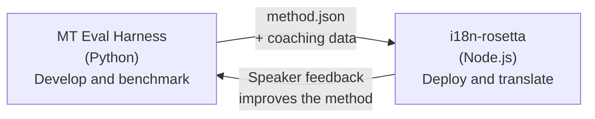

# Eval Harness 브리지

i18n-rosetta와 MT Eval Harness는 하나의 생태계를 이루는 두 개의 독립적인 도구예요. Harness는 번역 메서드가 **검증되는** 곳이고, Rosetta는 검증된 메서드가 **배포되는** 곳이에요. 이 두 도구는 공통 플러그인 형식을 통해 연결돼요.



## 흐름: 연구 → 프로덕션

### 1. Harness에서 메서드 빌드하기

`async translate(entries, config) → [{id, predicted}]`를 구현하는 모든 Python 클래스는 Harness에 연결할 수 있어요. Harness는 프롬프트 기반 LLM, 맞춤 학습된 모델, 결정론적 규칙 등 그 내부에서 어떤 일이 일어나는지 신경 쓰지 않아요.

### 2. 벤치마크 수행하기

Harness는 재현 가능한 지표(chrF++, FST acceptance(형태론적으로 복잡한 언어의 경우), 형태론적 정확도, 의미론적 점수)를 사용하여 표준화된 말뭉치를 기준으로 메서드의 점수를 매겨요.

### 3. 플러그인으로 내보내기

메서드가 허용 가능한 품질에 도달하면 rosetta 플러그인으로 패키징하세요. 이는 선택적인 코칭 데이터가 포함된 `method.json` 매니페스트예요.

:::info Export CLI는 계획 단계에 있어요
현재는 method.json 매니페스트를 수동으로 생성해야 해요. `mt-eval export` 명령어가 이를 자동화할 예정이에요. 전체 플러그인 형식은 [Method Interface](https://mtevalarena.org/docs/specifications/methods)를 참조하세요.
:::

### 4. rosetta에 설치하기

```bash
i18n-rosetta plugin install ./my-method-plugin/
```

### 5. 실제 콘텐츠 번역하기

```bash
i18n-rosetta sync
```

이제 벤치마크된 메서드가 프로덕션 환경에서 실제 번역을 생성해요.

## 흐름: 프로덕션 → 연구

배포된 번역은 이중 언어 구사자가 검토해요. 이들의 피드백을 통해 체계적인 오류(잘못된 시제 패턴, 누락된 어휘, 부자연스러운 표현)를 식별할 수 있어요. 연구자는 Harness에서 메서드를 업데이트하고, 다시 벤치마크를 수행하며, 다시 내보내고 재배포해요. 시스템은 사용 과정을 통해 학습해요.

## 플러그인 형식

`method.json` 매니페스트는 두 도구 간의 계약이에요.

```json
{
  "name": "crk-coached-v3",
  "type": "llm-coached",
  "version": "3.0.0",
  "description": "Coached LLM translation for Plains Cree",
  "locales": ["crk"],
  "config": {
    "model": "google/gemini-3.5-flash",
    "temperature": 0.3
  },
  "benchmarks": {
    "crk": {
      "composite_score": 0.67,
      "fst_acceptance": 0.82,
      "corpus_size": 150
    }
  }
}
```

전체 형식은 [Plugin Specification](/docs/reference/plugin-spec)을 참조하세요.

## 구축된 기능 vs 계획된 기능

| 구성 요소 | 상태 |
|-----------|--------|
| TranslationProcess 프로토콜 | ✅ 구축 완료 |
| Harness 벤치마크 러너 | ✅ 구축 완료 |
| method.json 플러그인 형식 | ✅ 구축 완료 |
| `rosetta plugin install/remove/list` | ✅ 구축 완료 |
| 코칭 데이터 로딩 | ✅ 구축 완료 |
| `mt-eval export` CLI | 🔲 계획됨 |
| 커뮤니티 리뷰 인터페이스 | 🔲 계획됨 |
| 암호화된 테스트 세트 평가 | 🔲 계획됨 |

## 더 읽어보기

- [Translation Methods](/docs/guides/translation-methods) — 사용 가능한 모든 메서드와 작동 방식
- [Plugin Specification](/docs/reference/plugin-spec) — method.json 형식
- [Serving a Method via API](/docs/guides/serving-a-method) — 서버 측에서 메서드 호스팅하기
- [Data Sovereignty](https://mtevalarena.org/docs/sovereignty/data-sovereignty) — OCAP, CARE 및 암호화 보호
- [For MT Researchers](https://mtevalarena.org/docs/leaderboard/rules) — Eval Harness 문서