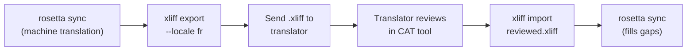

# 전문 번역가와 함께 작업하기

Rosetta는 기계 번역을 생성하지만, 규제 관련 콘텐츠, 브랜드에 민감한 문구, 또는 중요한 UI와 같이 사람의 검토가 필요한 프로젝트도 있어요. XLIFF 워크플로우를 사용하면 전문적인 검토를 위해 번역을 내보내고 다시 매끄럽게 가져올 수 있어요.

## XLIFF란 무엇인가요?

XLIFF(XML Localization Interchange File Format)는 번역 도구를 위한 업계 표준 교환 포맷이에요. 모든 전문 CAT(Computer-Assisted Translation) 도구에서 이를 지원해요.

- **memoQ** — XLIFF 가져오기, 문맥 내 검토, 검토된 파일 내보내기
- **SDL Trados Studio** — 기본 XLIFF 지원
- **Phrase (Memsource)** — 번역가 팀을 위한 XLIFF 작업 업로드
- **Smartling** — XLIFF 수집 파이프라인
- **OmegaT** — XLIFF를 지원하는 무료/오픈 소스 CAT 도구

Rosetta는 도구 호환성을 극대화하기 위해 2.0 이상 버전 대신 보편적으로 지원되는 버전인 XLIFF 1.2를 생성해요.

## 워크플로우



### 1단계: 기계 번역 생성하기

먼저 `sync`을(를) 실행하여 기본 기계 번역을 가져와요.

```bash
i18n-rosetta sync
```

### 2단계: XLIFF 내보내기

소스와 타겟 쌍을 XLIFF로 내보내요.

```bash
i18n-rosetta xliff export --locale fr
```

그러면 다음 내용이 포함된 `.rosetta/xliff/fr.xliff`이(가) 작성돼요.
- 영어 값이 포함된 모든 소스 키
- 현재 기계 번역(있는 경우)을 `<target>`(으)로 표시
- 번역이 없는 키는 `state="new"`(으)로 표시

```xml
<trans-unit id="hero.title" xml:space="preserve">
  <source>Welcome to our platform</source>
  <target state="translated">Bienvenue sur notre plateforme</target>
</trans-unit>
```

### 3단계: 번역가에게 보내기

`.xliff` 파일을 번역가에게 보내거나 CAT 플랫폼에 업로드해요. 번역가는 소스와 타겟을 나란히 보면서 다음 작업을 수행할 수 있어요.

- 기계 번역 편집
- 누락된 번역 채우기
- 품질 문제 표시
- 자체 번역 메모리(Translation Memory) 및 용어집(Termbase) 적용

### 4단계: 검토된 파일 가져오기

번역가가 검토된 `.xliff`을(를) 반환하면, 이를 가져와요.

```bash
# Preview what will change
i18n-rosetta xliff import .rosetta/xliff/fr.xliff --dry

# Apply changes
i18n-rosetta xliff import .rosetta/xliff/fr.xliff
```

출력:
```
  ✓ Imported 142 translations for fr
    Updated:    23 (changed from existing)
    Added:      0 (new keys)
    Unchanged:  119
    Written to: locales/fr.json
```

### 5단계: 빈칸 채우기

XLIFF를 내보낸 후 새 키가 추가된 경우, `sync`을(를) 실행하여 번역해요.

```bash
i18n-rosetta sync
```

Rosetta는 여전히 누락된 키만 번역하며, XLIFF 가져오기에서 검토된 번역은 그대로 유지돼요.

## 팁

### 사용자 지정 경로로 내보내기

```bash
# Export to a specific directory
i18n-rosetta xliff export --locale ja --out ./for-review/

# Export with a specific filename
i18n-rosetta xliff export --locale de --out ./review/german.xliff
```

### 다중 로케일

각 로케일을 개별적으로 내보내요.

```bash
for locale in fr de ja ko; do
  i18n-rosetta xliff export --locale $locale
done
```

### 버전 관리

`.gitignore`에 `.rosetta/xliff/`을(를) 추가해요. XLIFF 파일은 프로젝트 소스가 아니라 일시적인 결과물이에요.

```gitignore
.rosetta/xliff/
```

### XLIFF와 단순 `sync` 사용 시기 비교

| 시나리오 | 권장 사항 |
|----------|---------------|
| 내부 앱, 90% 이상의 품질이면 허용됨 | 단순 `sync` — 기계 번역으로 충분해요 |
| 사용자 대상 마케팅 문구 | 사람의 검토를 위해 XLIFF 내보내기 |
| 법률/규제 관련 콘텐츠 | XLIFF 내보내기 — 사람의 검토가 필수적이에요 |
| 50개 이상의 로케일, 촉박한 마감일 | 먼저 `sync`을(를) 실행하고, 상위 5개 로케일만 XLIFF로 내보내기 |
| 번역가가 이미 CAT 도구를 사용 중임 | XLIFF가 자연스러운 전달 포맷이에요 |

---

## 참고 항목

- [CLI Reference — xliff](/docs/reference/cli#xliff) — 명령어 참조
- [Translation Memory](/docs/concepts/translation-memory) — 검토된 번역 캐싱
- [Translation Methods](/docs/guides/translation-methods) — 기계 번역 옵션