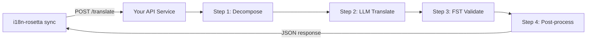

# 커스텀 메서드를 API로 제공하기

i18n-rosetta의 **`api` method**를 사용하면 번역 쌍을 외부 HTTP 엔드포인트에 연결할 수 있어요. 이를 통해 형태소 분석기, 유한 상태 변환기(FST), 다단계 LLM 체인 또는 직접 구축한 커스텀 연구 메서드와 같이 단일 LLM 프롬프트로 처리하기에는 너무 복잡한 파이프라인을 통합할 수 있어요.

## 왜 API 서비스인가요?

일부 번역 파이프라인은 단순한 프롬프트-응답 사이클 내에서 실행할 수 없어요:

| 파이프라인 단계 | 예시 |
|---|---|
| **Morphological decomposition** | 번역 전에 포합어(polysynthetic words)를 형태소로 분할해요 |
| **FST validation** | 음운론적 또는 형태론적 규칙을 위반하는 출력을 거부해요 |
| **Multi-step LLM chains** | 여러 모델을 사용하여 생성 → 검증 → 수정 사이클을 수행해요 |
| **Dictionary lookup** | 파이프라인 중간에 큐레이션된 이중 언어 사전을 교차 참조해요 |
| **Human-in-the-loop** | 불확실한 번역을 전문가 검토를 위해 대기열에 추가해요 |

`api` 메서드는 파이프라인을 블랙박스로 취급해요. i18n-rosetta가 소스 문자열을 보내면, 서비스가 번역을 반환하죠. 그 내부에서 어떤 일이 일어나는지는 전적으로 여러분에게 달려 있어요.

## 아키텍처



## 서비스 설정하기

API 서비스는 JSON을 수락하고 반환하는 단일 엔드포인트를 구현해야 해요:

### 요청 형식

rosetta는 정확히 다음과 같은 JSON 본문을 전송해요([api.js](https://github.com/gamedaysuits/i18n-rosetta/blob/main/lib/methods/api.js) 참고):

```json
POST /translate
Content-Type: application/json
Authorization: Bearer <ROSETTA_API_KEY>

{
  "source_locale": "en",
  "target_locale": "crk",
  "method": "crk-coached-v1",
  "keys": {
    "greeting": "Hello, welcome to our app",
    "farewell": "Goodbye and thanks"
  }
}
```

| 필드 | 타입 | 설명 |
|-------|------|-------------|
| `source_locale` | string | BCP 47 소스 언어 코드 |
| `target_locale` | string | BCP 47 타겟 언어 코드 |
| `method` | string | 플러그인 이름 또는 `"default"` |
| `keys` | object | 키 → 번역할 소스 문자열의 맵 |
```

### Response Format

Your service must return a `translations` object. An optional `meta` object can include cost and diagnostic info:

```json
{
  "translations": {
    "greeting": "tânisi, pê-kîwêw ôta",
    "farewell": "ekosi mâka, kinanâskomitin"
  },
  "meta": {
    "model": "my-custom-pipeline/v1",
    "cost_usd": 0.0042,
    "method": "decompose-translate-validate"
  }
}
```

| Field | Type | Required | Description |
|-------|------|----------|-------------|
| `translations` | object | ✅ | Map of key → translated string |
| `meta` | object | — | Optional metadata |
| `meta.cost_usd` | number | — | If present, displayed in rosetta's output |
| `errors` | object | — | For partial success (HTTP 207): map of key → `{ message }` |

### Minimal Express Server

```javascript
import express from 'express';

const app = express();
app.use(express.json());

/**
 * rosetta API 계약:
 *
 * 요청:  { source_locale, target_locale, method, keys: { "key": "source" } }
 * 응답: { translations: { "key": "translated" }, meta: { ... } }
 */
app.post('/translate', async (req, res) => {
  const { source_locale, target_locale, method, keys } = req.body;

  const translations = {};

  for (const [key, source] of Object.entries(keys)) {
    // --- 여기에 파이프라인을 작성하세요 ---
    // 1단계: 형태소 분해
    const morphemes = await decompose(source, source_locale);

    // 2단계: 컨텍스트를 포함한 LLM 번역
    const draft = await llmTranslate(morphemes, target_locale);

    // 3단계: FST 검증
    const validated = await fstValidate(draft, target_locale);

    // 4단계: 후처리 (정서법 정규화 등)
    translations[key] = await postProcess(validated);
  }

  res.json({
    translations,
    meta: {
      model: 'my-custom-pipeline/v1',
      method: 'decompose-translate-validate',
    },
  });
});

app.listen(3001, () => {
  console.log('Translation API running on http://localhost:3001');
});
```

## Configuring i18n-rosetta

Point a translation pair at your running service in `i18n-rosetta.config.json`:

```json
{
  "inputLocale": "en",
  "pairs": {
    "en:crk": {
      "method": "api",
      "endpoint": "http://localhost:3001/translate",
      "register": "Formal Plains Cree. Use SRO orthography."
    }
  }
}
```

Then run sync as usual:

```bash
npx i18n-rosetta sync
```

i18n-rosetta will POST your source strings to the endpoint and write the returned translations to `crk.json`.

## Case Study: Plains Cree Pipeline

:::info Under Development
The Plains Cree pipeline described below is **under active development** and is not yet running in production. Details here reflect the current design direction and may change as the project evolves.
:::

The **gds-mt-eval-harness** project demonstrates this pattern. Its Plains Cree pipeline uses:

1. **Morphological decomposition** — Break polysynthetic Cree words into translatable morpheme chains
2. **LLM translation** — Context-enriched GPT-4o translation with coaching data (SRO orthography rules, register instructions)
3. **FST validation** — Finite-state transducer checks that outputs conform to Cree phonological rules
4. **Confidence scoring** — Each translation gets a confidence score based on FST pass rate and dictionary coverage

The entire pipeline runs as a single HTTP endpoint that i18n-rosetta calls via the `api` method.

### Running Evaluations

After translating, you can evaluate output quality using the harness directly:

```bash
# 하네스 클론하기
git clone https://github.com/gamedaysuits/gds-mt-eval-harness.git
cd gds-mt-eval-harness
pip install -e .

# 메서드 출력에 대한 평가 실행하기
python eval/baseline_experiment.py --dataset data/edtekla-dev-v1.json --submit
```

This produces structured evaluation records with chrF++, BLEU, and exact match scores that can be used as regression baselines.

## Authentication

If your API requires authentication, set the `apiKey` field or use an environment variable:

```json
{
  "pairs": {
    "en:crk": {
      "method": "api",
      "endpoint": "https://my-mt-service.example.com/translate",
      "apiKey": "${CRK_API_KEY}"
    }
  }
}
```

## Data Sovereignty & OCAP Principles

The `api` method is particularly important for **Indigenous language communities**. By self-hosting the translation pipeline, a community keeps full control over:

- **Proprietary coaching data** — register instructions, orthography rules, and domain glossaries never leave community infrastructure.
- **Linguistic resources** — curated dictionaries, FST grammars, and elder-verified translations remain under community ownership.
- **Access policies** — the community decides who can call the endpoint and under what terms.

This aligns with [OCAP® principles](/docs/guides/low-resource-languages#ocap-principles) (Ownership, Control, Access, Possession), ensuring that sensitive language data is governed by the community rather than a third-party platform.

:::tip
Combine the `api` method with a private deployment (e.g., a community-hosted VM or on-prem server) for the strongest data-sovereignty posture. See [Support a Low-Resource Language](/docs/guides/low-resource-languages) for a full walkthrough.
:::

## Cost Estimation

The `api` method returns `null` for cost estimation by default — your service controls pricing. If you want to provide cost transparency, have your API return a `cost` field in the metadata:

```json
{
  "translations": { "...": "..." },
  "metadata": {
    "cost": {
      "estimatedCost": 0.0042,
      "currency": "USD",
      "source": "my-service-pricing"
    }
  }
}
```

## 모범 사례

1. **실패 시 빈 문자열 반환하기** — 소스 문자열을 "번역"으로 반환하지 마세요. `""`을 반환하여 i18n-rosetta의 폴백 접두사(fallback prefix) 메커니즘이 처리하도록 하세요.
2. **신뢰도 점수 포함하기** — 파이프라인이 품질을 추정할 수 있다면 메타데이터에 이를 반환하세요. 이는 품질 감사에 도움이 돼요.
3. **상태 확인(health checks) 구현하기** — 대규모 동기화를 시작하기 전에 i18n-rosetta가 연결을 확인할 수 있도록 `GET /health` 엔드포인트를 추가하세요.
4. **유연하게 속도 제한(Rate limit) 처리하기** — 파이프라인에 처리량 제한이 있는 경우 `429` 상태 코드를 반환하세요. i18n-rosetta의 배치 시스템이 백오프(back off)할 거예요.
5. **모든 항목 로깅하기** — 다단계 파이프라인은 조용히 실패할 수 있어요. 디버깅을 위해 각 단계의 입력/출력을 기록하세요.

## 라이선스

`api` 메서드 패턴은 완전히 개방되어 있어요. 자체 번역 파이프라인을 HTTP 서비스로 래핑하는 데에는 어떠한 라이선스 제한도 없어요. `gds-mt-eval-harness`는 참조 구현을 위해 MIT 라이선스로 제공돼요.

## 함께 보기

- [번역 메서드](/docs/guides/translation-methods) — 모든 내장 메서드(`openai`, `google`, `api` 등)에 대한 개요
- [플러그인 사양](/docs/reference/plugin-spec) — `api` 메서드 필드를 포함한 `i18n-rosetta.config.json`의 전체 스키마
- [자원이 부족한 언어 지원하기](/docs/guides/low-resource-languages) — OCAP 원칙을 포함하여 자원이 부족한 언어를 위한 엔드투엔드 가이드
- [아키텍처](/docs/concepts/architecture) — i18n-rosetta의 동기화 루프, 일괄 처리(batching) 및 메서드 디스패치 작동 방식
- [MT 평가](/docs/eval/) — 평가 방법론, 지표 및 리더보드 제출 프로세스
- [메서드 리더보드](/leaderboard) — 메서드 및 언어 쌍 전반에 걸친 실시간 품질 순위