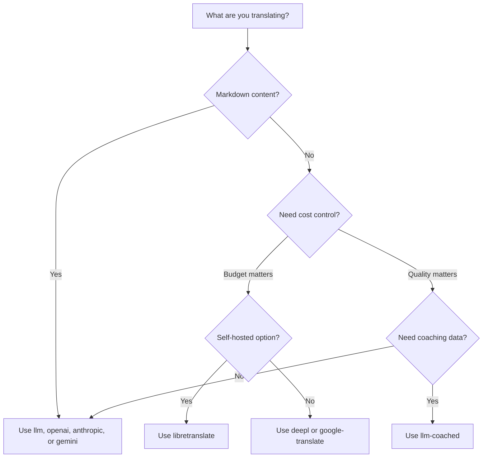

# 번역 방식

Rosetta는 10가지 번역 방식을 지원해요. 각 언어 쌍마다 다른 방식을 사용할 수 있으며, 전체 프로젝트에 단일 방식만 고집할 필요가 없어요.

## 방식 비교

### LLM 제공업체

품질 중심, Markdown 인식, 코칭 호환. 콘텐츠가 많은 프로젝트에 가장 적합해요.

| 방식 | 키 | 기능 |
|--------|-----|-------------|
| `llm` (기본값) | `OPENROUTER_API_KEY` | OpenRouter를 통한 LLM — 200개 이상의 모델, 자동 라우팅 |
| `llm-coached` | `OPENROUTER_API_KEY` | LLM + 문법 규칙, 사전, 스타일 노트 |
| `openai` | `OPENAI_API_KEY` | 직접 OpenAI API (gpt-4o, gpt-4o-mini) |
| `anthropic` | `ANTHROPIC_API_KEY` | 직접 Anthropic API (Claude Sonnet, Haiku, Opus) |
| `gemini` | `GEMINI_API_KEY` | 직접 Google Gemini API (Flash, Pro) — 무료 티어 |

### 전통적인 기계 번역(MT)

속도 및 비용 중심. 대량의 키-값(key-value) 쌍에 가장 적합해요.

| 방식 | 키 | 기능 |
|--------|-----|-------------|
| `google-translate` | `GOOGLE_TRANSLATE_API_KEY` | Google Cloud Translation API v2 (130개 이상 언어) |
| `deepl` | `DEEPL_API_KEY` | 용어집을 지원하는 DeepL API (30개 이상 언어) |
| `microsoft-translator` | `MICROSOFT_TRANSLATOR_API_KEY` | Azure Cognitive Services Translator (100개 이상 언어) |
| `libretranslate` | *(셀프 호스팅)* | 셀프 호스팅 LibreTranslate (AGPL, 무료) |

### 인프라

| 방식 | 키 | 기능 |
|--------|-----|-------------|
| `api` | *(제공업체별)* | 모든 REST 번역 엔드포인트를 위한 씬(Thin) HTTP 클라이언트 |

## 의사결정 트리



---

## `llm` — LLM 번역 (기본값)

[OpenRouter](https://openrouter.ai)의 모든 LLM을 통해 번역해요. 기본 방식이며 가장 다용도로 쓰여요.

**작동 방식:**
1. 어조(register) 및 컨텍스트 지침과 함께 키를 일괄 처리해요(기본값: 배치당 30개).
2. 구조화된 프롬프트로 OpenRouter에 전송해요.
3. JSON 응답을 파싱해요.
4. [품질 게이트(quality gate)](/docs/concepts/quality-gate)를 통해 각 번역을 검증해요.
5. 통과한 번역은 기록하고, 실패한 번역은 재시도하거나 거부해요.

**사용 시기:** 대부분의 프로젝트. 특히 코드 블록과 숏코드를 보호해야 하는 Markdown 기반의 콘텐츠가 많은 사이트에 적합해요.

**구성:**

```json
{
  "defaultMethod": "llm",
  "model": "google/gemini-3.5-flash"
}
```

## `llm-coached` — 코칭된 LLM 번역

`llm` 방식과 동일하지만, 모든 프롬프트에 문법 규칙, 용어 사전, 스타일 노트가 주입돼요.

**작동 방식:**
1. `.rosetta/coaching/<locale>.json` 또는 플러그인의 `coaching/` 디렉터리에서 코칭 데이터를 불러와요.
2. 시스템 프롬프트에 문법 규칙, 사전 용어, 스타일 노트를 주입해요.
3. 소스 키와 일치하는 사전 용어는 필수 용어로 포함돼요.
4. `llm` 방식과 동일하게 번역이 진행되며, 코칭 데이터가 정확도를 높여줘요.

**사용 시기:** 자원이 부족한 언어, 도메인 특화 용어(법률, 의료), 격식 있는 어조, 또는 일반적인 LLM 출력이 충분히 정확하지 않은 모든 경우에 사용해요.

**코칭 데이터 형식:**

```json title=".rosetta/coaching/fr.json"
{
  "grammar_rules": [
    "French adjectives agree in gender and number with the noun they modify",
    "Use 'vous' for formal contexts, 'tu' for informal"
  ],
  "dictionary": {
    "dashboard": "tableau de bord",
    "deployment": "déploiement",
    "settings": "paramètres"
  },
  "style_notes": "Prefer active voice. Avoid anglicisms where a native French term exists."
}
```

참고: [자원 부족 언어 가이드](https://mtevalarena.org/docs/community/low-resource-languages)

---

## `openai` — 직접 OpenAI API

OpenAI Chat Completions API를 통해 직접 번역해요. OpenRouter 같은 중간 단계 없이, 사용자의 키, 계정, 사용량 대시보드를 그대로 사용해요.

**모델:** `gpt-4o` (기본값), `gpt-4o-mini`

**기능:**
- ✅ Markdown 인식 (콘텐츠 번역)
- ✅ 코칭 지원 (문법 규칙, 사전 재정의, 스타일 노트)
- ✅ 구조화된 키-값 출력을 위한 JSON 모드
- ✅ 지수 백오프(Exponential backoff)를 통한 재시도

**구성:**

```json
{
  "pairs": {
    "en:fr": { "method": "openai", "model": "gpt-4o-mini" }
  }
}
```

```bash
export OPENAI_API_KEY=sk-proj-...
```

[platform.openai.com/api-keys](https://platform.openai.com/api-keys)에서 키를 발급받으세요.

## `anthropic` — 직접 Anthropic API

Anthropic Messages API를 통해 직접 번역해요. 코칭 데이터에 `system` 매개변수를 사용하여 Anthropic의 프롬프트 캐싱을 활성화해요.

**모델:** `claude-sonnet-4-6` (기본값), `claude-haiku-4-5`, `claude-opus-4-7`

**기능:**
- ✅ Markdown 인식 (콘텐츠 번역)
- ✅ 코칭 지원 (문법 규칙, 사전 재정의, 스타일 노트)
- ✅ 시스템 프롬프트 캐싱 (배치 간 코칭 비용 분담)
- ✅ 지수 백오프를 통한 재시도

**구성:**

```json
{
  "pairs": {
    "en:ja": { "method": "anthropic", "model": "claude-haiku-4-5" }
  }
}
```

```bash
export ANTHROPIC_API_KEY=sk-ant-...
```

[console.anthropic.com](https://console.anthropic.com/settings/keys)에서 키를 발급받으세요.

## `gemini` — 직접 Google Gemini API

Google Gemini `generateContent` API를 통해 직접 번역해요. **무료 티어 제공** — 비용 없이 시작하기에 가장 좋아요.

**모델:** `gemini-2.5-flash` (기본값), `gemini-2.5-pro`

**기능:**
- ✅ Markdown 인식 (콘텐츠 번역)
- ✅ 코칭 지원 (문법 규칙, 사전 재정의, 스타일 노트)
- ✅ `responseMimeType`을 통한 JSON 응답 모드
- ✅ 무료 티어 (넉넉한 일일 할당량)
- ✅ 지수 백오프를 통한 재시도

**구성:**

```json
{
  "pairs": {
    "en:ko": { "method": "gemini", "model": "gemini-2.5-pro" }
  }
}
```

```bash
export GEMINI_API_KEY=AI...
```

[aistudio.google.com/apikey](https://aistudio.google.com/apikey)에서 키를 발급받으세요.

### 모델 검증

직접 LLM 제공업체(`openai`, `anthropic`, `gemini`)는 처음 사용할 때 모델 문자열을 검증해요. 이를 통해 다음 세 가지 유형의 실수를 잡아낼 수 있어요.

**잘못된 방식 형식** — 직접 제공업체에 OpenRouter 스타일의 모델 경로를 사용하는 경우:

```
[WARN] OpenAI: model "google/gemini-3.5-flash" looks like an OpenRouter path.
       Direct providers use bare model names (e.g., "gpt-4o").
       To use OpenRouter models, set method to 'llm' instead.
```

**잘못된 제공업체** — 완전히 다른 제공업체의 모델을 사용하는 경우:

```
[WARN] Gemini: model "claude-sonnet-4-6" is an Anthropic model.
       This provider (gemini) cannot serve Anthropic models.
       Use --method anthropic or set "method": "anthropic" in config.
```

**더 이상 사용되지 않거나 철자가 틀린 모델** — 첫 번째 API 호출 시, rosetta는 제공업체의 실시간 모델 목록을 가져와 사용자의 모델과 대조하여 확인해요:

```
[WARN] Gemini: model "gemini-1.5-flash" not found in available models.
       Similar models: gemini-2.0-flash, gemini-2.5-flash, gemini-2.5-pro
       The API call will proceed — the provider will give the final verdict.
```

:::note 경고일 뿐, 오류는 아니에요
모델 검증은 경고를 기록하지만 API 호출을 차단하지는 않아요. 최종 판결은 제공업체 API가 내립니다. 향후 모델 이름이 다른 패턴과 일치할 수도 있으므로, 휴리스틱에 의존하여 차단하지 않도록 설계되었어요.
:::

---

## `google-translate` — Google Cloud Translation API

Google Cloud Translation API v2와 직접 연동돼요. SDK나 서비스 계정 없이 REST API를 사용하며, API 키만 있으면 돼요.

**사용 시기:** 뉘앙스보다 속도와 비용이 더 중요한 대량의 키-값 문자열 쌍에 적합해요. 기본적으로 130개 이상의 언어를 지원해요.

**제한 사항:**
- ⚠️ **Markdown을 인식하지 못해요.** 코드 블록, 숏코드, 보간 변수가 손상될 수 있어요.
- 어조/말투 제어 불가
- 코칭 또는 용어 강제 적용 불가

```bash
npx i18n-rosetta sync --method google-translate
```

:::tip 자동 감지
`GOOGLE_TRANSLATE_API_KEY`만 설정되어 있고 OpenRouter 키가 없는 경우, rosetta는 자동으로 Google Translate로 전환해요. 구성을 변경할 필요가 없어요.
:::

## `deepl` — DeepL API

DeepL 번역 API와 직접 연동돼요. 일관된 용어 사용을 위해 용어집을 지원해요.

**사용 시기:** DeepL이 강점을 보이는 유럽 언어(독일어, 프랑스어, 스페인어, 네덜란드어, 폴란드어 등)에 적합해요. 용어집 지원을 통해 코칭 데이터 없이도 일관된 용어를 강제할 수 있어요.

**기능:**
- ✅ 무료/프로 엔드포인트 자동 감지 (무료 키의 경우 `:fx` 접미사)
- ✅ 용어집 생성 및 관리
- ✅ 격식 수준 제어
- ⚠️ **Markdown 인식 불가** — 키-값 쌍만 지원

**구성:**

```json
{
  "pairs": {
    "en:de": { "method": "deepl" }
  }
}
```

```bash
export DEEPL_API_KEY=your-key-here
```

[deepl.com/pro-api](https://www.deepl.com/pro-api)에서 키를 발급받으세요.

## `microsoft-translator` — Azure Cognitive Services

Microsoft Translator Text API v3와 직접 연동돼요.

**사용 시기:** 기존 Azure 인프라를 갖춘 엔터프라이즈 환경에 적합해요. Google Translate가 지원하지 않는 여러 언어를 포함하여 100개 이상의 언어를 지원해요.

**기능:**
- ✅ 요청당 최대 100개 세그먼트 (높은 처리량)
- ✅ 지연 시간 최적화를 위한 선택적 리전(region) 매개변수
- ⚠️ **Markdown 인식 불가** — 키-값 쌍만 지원
- ⚠️ **콘텐츠 번역 불가** — 키-값 쌍만 지원

**구성:**

```json
{
  "pairs": {
    "en:ar": { "method": "microsoft-translator" }
  }
}
```

```bash
export MICROSOFT_TRANSLATOR_API_KEY=your-key
export MICROSOFT_TRANSLATOR_REGION=global  # optional
```

[Azure Portal](https://portal.azure.com) → Cognitive Services → Translator에서 키를 발급받으세요.

## `libretranslate` — 셀프 호스팅 번역

LibreTranslate를 사용한 셀프 호스팅 오픈 소스 번역이에요. 로컬 또는 자체 인프라에서 실행되므로 API 비용이 전혀 들지 않고 데이터 주권을 완벽하게 보장해요.

**사용 시기:** 오프라인 번역, 데이터 개인정보 보호 규정 준수(GDPR) 또는 비용 없는 운영이 필요한 프로젝트에 적합해요. 외부 API에 의존해서는 안 되는 CI 파이프라인에 특히 유용해요.

**기능:**
- ✅ 셀프 호스팅 — 외부 API 호출 없음
- ✅ 무료 및 오픈 소스 (AGPL-3.0)
- ✅ Docker 배포 가능
- ⚠️ **Markdown 인식 불가** — 키-값 쌍만 지원
- ⚠️ **콘텐츠 번역 불가** — 키-값 쌍만 지원
- ⚠️ 언어 쌍에 따라 품질이 다름

**설정:**

```bash
# Run LibreTranslate locally with Docker
docker run -d -p 5000:5000 libretranslate/libretranslate

# Configure (optional — defaults to localhost:5000)
export LIBRETRANSLATE_API_URL=http://localhost:5000/translate
```

```json
{
  "pairs": {
    "en:es": { "method": "libretranslate" }
  }
}
```

---

## `api` — 원격 번역 API

커뮤니티 호스팅 또는 IP로 보호되는 번역 엔드포인트를 위한 씬(Thin) HTTP 클라이언트예요. Rosetta는 키를 전송하고 번역을 돌려받기만 하며, 자체적인 번역 로직은 전혀 포함하지 않아요.

**사용 시기:** 번역 방식이 서버 측에 호스팅된 경우(예: 배포할 수 없는 독점 코칭 데이터, 미세 조정된 모델, FST 파이프라인)에 사용해요.

```json
{
  "pairs": {
    "en:crk": {
      "method": "api",
      "endpoint": "https://api.example.com/v1/translate",
      "apiKey": "your-key"
    }
  }
}
```

:::note OCAP 호환 커뮤니티 번역
`api` 방식은 **OCAP 호환 커뮤니티 호스팅 번역**으로 가는 가교 역할을 해요. 원주민 및 소수 민족 언어 커뮤니티는 자체 번역 엔드포인트를 호스팅하여 코칭 데이터, 미세 조정된 모델, 언어적 IP를 커뮤니티의 통제 하에 둘 수 있으며, Rosetta는 씬 클라이언트로 이에 연결돼요.

전체 커뮤니티 호스팅 과정은 [자원 부족 언어 지원하기](https://mtevalarena.org/docs/community/low-resource-languages)를, 엔드포인트 요구 사항은 [API를 통한 방식 제공](/docs/guides/serving-a-method)을 참고하세요.
:::

---

## 언어 쌍별 구성

진정한 장점은 언어 쌍별로 방식을 혼합할 수 있다는 거예요.

```json title="i18n-rosetta.config.json"
{
  "version": 3,
  "pairs": {
    "en:fr": { "method": "deepl" },
    "en:ja": { "method": "openai", "model": "gpt-4o" },
    "en:ko": { "method": "gemini" },
    "en:ar": { "method": "microsoft-translator" },
    "en:crk": { "methodPlugin": "crk-coached-v1" }
  }
}
```

이렇게 하면 프랑스어는 DeepL(용어집 지원), 일본어는 OpenAI(품질), 한국어는 Gemini(무료 티어), 아랍어는 Microsoft Translator(커버리지), 평원 크리어(Plains Cree)는 코칭된 플러그인(특화)을 통해 번역할 수 있어요.

## 플러그인

플러그인은 특정 언어 쌍을 위해 미리 패키징된 번역 레시피예요. 코드가 아닌 JSON 매니페스트 형식이며, rosetta에 어떤 방식을 어떤 설정으로 사용할지, 그리고 벤치마크된 품질은 어느 정도인지 알려줘요.

:::tip 평가 하네스에서 프로덕션까지 단일 명령어로
[평가 하네스(eval harness)](https://mtevalarena.org/docs/specifications/harness)에서 개발되고 검증된 플러그인은 직접 설치할 수 있어요. 그곳에서 검증한 방식을 단일 `plugin install` 명령어로 여기에 배포할 수 있답니다. 전체 평가 워크플로우는 [MT 평가](https://mtevalarena.org/docs/leaderboard/rules)를 참고하세요.
:::

```bash
i18n-rosetta plugin install ./french-formal-v1/
i18n-rosetta plugin list
i18n-rosetta plugin remove french-formal-v1
```

전체 매니페스트 형식은 [플러그인 사양](/docs/reference/plugin-spec)을 참고하세요.

---

## 제공업체 전환

방식을 변경하시나요? 모델 형식과 환경 변수가 달라져요. 다음 매핑을 참고하세요.

### OpenRouter → 직접 제공업체

```diff title="i18n-rosetta.config.json"
 {
   "pairs": {
     "en:fr": {
-      "method": "llm",
-      "model": "openai/gpt-4o"
+      "method": "openai",
+      "model": "gpt-4o"
     }
   }
 }
```

```diff title="Environment variables"
- export OPENROUTER_API_KEY=sk-or-v1-...
+ export OPENAI_API_KEY=sk-proj-...
```

**주요 차이점:**
- OpenRouter는 `provider/model` 형식을 사용해요(예: `openai/gpt-4o`). 직접 제공업체는 순수 모델 이름만 사용해요(예: `gpt-4o`).
- 각 직접 제공업체는 고유한 환경 변수(`OPENAI_API_KEY`, `ANTHROPIC_API_KEY`, `GEMINI_API_KEY`)를 가져요.
- 잘못된 모델 형식을 사용하면 rosetta가 경고를 표시해요. [모델 검증](#model-validation)을 참고하세요.

### 직접 제공업체 → OpenRouter

```diff title="i18n-rosetta.config.json"
 {
   "pairs": {
     "en:ja": {
-      "method": "anthropic",
-      "model": "claude-sonnet-4-6"
+      "method": "llm",
+      "model": "anthropic/claude-sonnet-4-6"
     }
   }
 }
```

:::tip OpenRouter와 직접 제공업체 사용 시기
환경 변수 변경 없이 모델을 전환하고 싶거나 단일 키로 200개 이상의 모델에 접근하고 싶다면 **OpenRouter를 사용하세요**. 더 간단한 결제, 더 낮은 지연 시간(중간 단계 없음), 또는 Anthropic의 프롬프트 캐싱과 같은 제공업체별 특화 기능이 필요하다면 **직접 제공업체를 사용하세요**.
:::

---

## 비용 비교

번역된 키 1,000개당 대략적인 비용(키당 약 10 토큰, 배치당 30개 키 가정):

| 방식 | 1K 키당 비용 | 속도 | 품질 | 최적의 용도 |
|--------|----------------|-------|---------|----------|
| `gemini` (Flash) | **무료** (티어 내) | 빠름 | 좋음 | 시작하기, 개인 프로젝트 |
| `google-translate` | ~$0.02 | 가장 빠름 | 적절함 | 대용량, 유럽 언어 |
| `deepl` | ~$0.02 | 빠름 | 좋음 | 유럽 언어, 용어 |
| `microsoft-translator` | ~$0.01 | 빠름 | 적절함 | Azure 환경, 폭넓은 언어 지원 |
| `libretranslate` | **무료** (셀프 호스팅) | 다양함 | 보통 | 에어갭, GDPR, CI 파이프라인 |
| `gemini` (Pro) | ~$0.07 | 중간 | 매우 좋음 | 품질 민감, 무료 할당량 |
| `openai` (GPT-4o-mini) | ~$0.01 | 빠름 | 좋음 | 예산 절감형 LLM |
| `openai` (GPT-4o) | ~$0.10 | 중간 | 매우 좋음 | 품질 민감 |
| `anthropic` (Haiku) | ~$0.01 | 빠름 | 좋음 | 예산 절감형 LLM |
| `anthropic` (Sonnet) | ~$0.10 | 중간 | 매우 좋음 | 품질 민감 |
| `anthropic` (Opus) | ~$0.50 | 느림 | 우수함 | 최고 품질 |
| `llm` (OpenRouter) | 모델별 상이 | 다양함 | 다양함 | 모델 비교, 실험 |

:::note 추정치입니다
실제 비용은 소스 텍스트 길이, 배치 크기, 제공업체의 가격 변동에 따라 달라져요. 정확한 요금은 각 제공업체의 최신 가격 페이지를 확인하세요.
:::

---

## 참고 항목

- [지원 언어](/docs/reference/supported-languages)
- [코칭 데이터](/docs/concepts/coaching-data)
- [자원 부족 언어 지원하기](https://mtevalarena.org/docs/community/low-resource-languages)
- [플러그인 사양](/docs/reference/plugin-spec)
- [API를 통한 방식 제공](/docs/guides/serving-a-method)
- [품질 게이트](/docs/concepts/quality-gate)
- [아키텍처](/docs/concepts/architecture)
- [문제 해결](/docs/guides/troubleshooting) — 모델 오류, API 문제